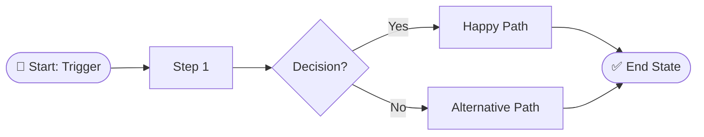
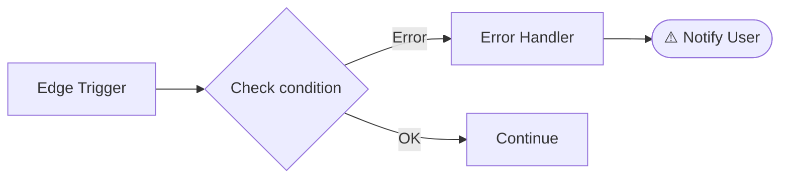

### File 1: `docs/specs/<FeatureName>/diagram.md`

Base on: `.claude/templates/diagram.template.md`

Apply SELF-EVALUATE before writing. Use Mermaid. If DYNAMIC DECOMPOSE detected multiple independent flows → create multiple diagram sections.

**(v3.14 — P1 multi-diagram LR rule)** Diagram layout rules — MANDATORY:
- **ALWAYS** use `flowchart LR` (left-to-right). **NEVER** `flowchart TD` for feature diagrams.
- **MAX 15 nodes per diagram section.** When a flow exceeds 15 nodes, split into focused sub-diagrams (e.g. "Entry flow", "Tab navigation flow", "Modal flow", "Delete flow").
- **NEVER** produce a single monolithic diagram with 40+ nodes — it is unrenderable in VS Code Mermaid preview.
- Minimum diagrams: one per major user flow identified by DYNAMIC DECOMPOSE. Aim for 4–7 diagrams, each ≤12 nodes.
- Reference: `docs/specs/AdminTaskProcessing/diagram.md` (6 separate LR diagrams, each ≤12 nodes).

````markdown
# Feature Flow Diagram: [FeatureName]

## Entry Flow


## Error / Edge Case Flow

````

### File 2: `docs/specs/<FeatureName>/steps.md`

Base on: `.claude/templates/steps.template.md`

Apply SELF-EVALUATE before writing.

> **Use FILE_STRUCTURE** (resolved in SESSION BOOTSTRAP Step 0.B) as the canonical file layout.
> Do NOT assume React file structure if CLAUDE.md describes a different framework.
> Replace `data/apiHooks.ts` with the equivalent from FILE_STRUCTURE if Vue/Angular detected
> (e.g. `composables/useFeature.ts` for Vue, `services/feature.service.ts` for Angular).

```markdown
# Implementation Steps: [FeatureName]

## Pre-conditions
- [ ] [Required dependency or environment state]

## Implementation Steps

### Step 1: data/types.ts
- **Action**: Define TypeScript interfaces for all entities from spec
- **Files affected**: `src/<feature-path>/data/types.ts`
- **Verify**: no `any` types, all spec fields covered

### Step 2: data/api.ts
- **Action**: API functions with `USE_MOCK = true`, mock arrays matching spec fields
- **Files affected**: `src/<feature-path>/data/api.ts`
- **Verify**: `PROJECT_CTX.http_client` used; every response returned via `mapXxx(...)` from transform.ts — NO blind cast of raw response to a type

### Step 2.5: data/transform.ts *(anti-corruption layer — HARD RULE 33)*
- **Action**: One pure `mapXxx(raw): Xxx` per response type; centralises raw→domain field mapping
- **Files affected**: `src/<feature-path>/data/transform.ts`
- **Verify**: api.ts calls these mappers; no `as Type` cast on raw responses anywhere

### Step 3: data/apiHooks.ts
- **Action**: `useQuery` (staleTime) + `useMutation` (invalidate in `onSettled`)
- **Files affected**: `src/<feature-path>/data/apiHooks.ts`
- **Verify**: `onSettled` not `onSuccess` for invalidations

### Step 4: [FeatureName].tsx
- **Action**: Main component using `src/generic/` components
- **Files affected**: `src/<feature-path>/<FeatureName>.tsx`
- **Verify**: loading / error / empty / success states all handled

### Step 4.5: Named section wrapper components *(only when spec explicitly names sub-sections)*
- **Trigger**: spec describes a named section distinct from individual cards — e.g. "Required assessments section", "Score statistics section", "Learning progress section", "Overview panel"
- **Action**: Create one wrapper component per named section (e.g. `RequiredAssessmentsSection.tsx`, `LearningProgressSection.tsx`) — even if thin — so the component tree mirrors the spec's named structure
- **Verify**: every section explicitly named in the spec has a corresponding wrapper component; cards/rows are children of their section, not children of the page directly

### Step 5: messages.ts
- **Action**: `defineMessages` for all user-visible strings
- **Verify**: no hardcoded strings in JSX

### Step 6: [FeatureName].scss
- **Action**: Component styles following existing scss patterns

### Step 6.5: utils/ — Format / display utility functions *(only when Business Rules specify a display/format rule)*
- **Trigger**: spec contains phrases like "display as X.0", "round to N decimal places", "max N significant characters", "format score", "display rule", "rounding rule"
- **Action**: Create `src/<feature-path>/utils/<utilName>.ts` with a pure function implementing the rule
- **Example**: `formatScore(value: number): string` for "max 3 significant chars, 1 decimal place"
- **Verify**: function has unit-testable logic, imported in every component that displays the formatted value
- **Note**: If spec lists a display rule in Business Rules or AC items → this step is REQUIRED, not optional
- **Precision pattern (L-04)**: "1 decimal place, drop trailing .0" → `const v = Math.round(x*10)/10; return v%1===0 ? v.toFixed(0) : v.toFixed(1);` — NOT `toPrecision(n)` (sig-figs, wrong for decimal-place display).

### Step 7: Route wiring
- **Action**: Register route / tab in parent component
- **Verify**: navigation works end-to-end

### Step 8: Tests — unit + E2E covering every ACT/BR *(HARD RULE 36 — generate up front)*
- **Action**: For EVERY ACT row and every Business-Rule/display row in checklist.md, create a test case now (stub if logic not yet built):
  - logic / business / display rules → a Jest `utils/<rule>.test.ts` (referencing the ACT/BR id in the test name) AND a `ux-states.json unit_tests[]` entry with `ac_id`
  - UI / interaction / visible-state ACs → a `ux-states.json` `ac_assertions[]` entry (`ac_id` + selector + expected) under the relevant state
- **Files affected**: `src/<feature-path>/utils/*.test.ts`, `docs/specs/<FeatureName>/ux-states.json`
- **Verify**: `npx tsx .claude/integrations/lint-feature.ts src/<feature-path> --checklist docs/specs/<FeatureName>/checklist.md --ux-states docs/specs/<FeatureName>/ux-states.json --gate` → HR36 AC coverage 100% of FE-testable rows (backend-only rows marked `<!-- enforced-by: BE -->`)

## Post-conditions
- [ ] Feature renders at correct route
- [ ] All ACP items verifiable in browser

## Rollback Plan
1. `git revert [commit-hash]`
2. Remove route registration from parent component
3. `git push origin develop`
```

### File 3: `docs/specs/<FeatureName>/checklist.md`

Base on: `.claude/templates/checklist.template.md`

Apply SELF-EVALUATE before writing. One row per Acceptance Criteria item from the spec.

**(v3.14 — P5 5-section completeness)** The checklist MUST contain all 5 sections. Missing any section is INCOMPLETE — regenerate before B6 gate. Reference: `docs/specs/AdminTaskProcessing/checklist.md`.

```markdown
# Checklist — [FeatureName]
> JIRA: [JIRA-ID] | Complexity: [SIMPLE|MEDIUM|COMPLEX] (score N) | Gate mode: [gates]
<!-- [B5-checklist] req_rows=N (spec_ac_count=N + br_count=N) ✅ -->

---

## Requirements (REQ)

| # | Requirement | Status |
|---|-------------|--------|
| REQ-01 | (AC1) [requirement text from spec — 1:1 with spec objectives] | ⬜ |

---

## UI Verification (one row per component)

| # | Component | Screen | Check | Status |
|---|-----------|--------|-------|--------|
| UI-01 | [component name] | [page name] | [what to verify against spec] | ⬜ |

---

## Actions / Acceptance Criteria (ACT)

| # | Test | Screen | Status |
|---|------|--------|--------|
| ACT-01 | [acceptance criterion from spec] | [page name] | ⬜ |

---

## UX States

| # | State | Screen | Status |
|---|-------|--------|--------|
| UX-01 | Loading skeleton shown while data fetches | [page name] | ⬜ |
| UX-02 | Error state shown when API call fails | [page name] | ⬜ |
| UX-03 | Empty state shown when no data | [page name] | ⬜ |
| UX-04 | Mutation in-progress state disables submit button | [page name] | ⬜ |

---

## Playwright Verify (B11)

| Check | Result | Notes |
|-------|--------|-------|
| PLAYWRIGHT-001: Main route resolves (no crash) | ⬜ | |
| PLAYWRIGHT-002: Secondary route resolves (no crash) | ⬜ | |
| PLAYWRIGHT-003: No unhandled JS errors on either page | ⬜ | |
| PLAYWRIGHT-004: Primary success state renders meaningful content | ⬜ | |
| PLAYWRIGHT-005: Key interactive element visible | ⬜ | |
| PLAYWRIGHT-006: Tab/section switching renders without crash | ⬜ | |

---

## Summary

- Total REQ rows: **N**
- Total UI rows: **N** — ✅ 0/N
- Total ACT rows: **N** — ✅ 0/N
- Total UX rows: **N** — ✅ 0/N
- Playwright rows: **6** — ✅ 0/6
<!-- LOCKED line shape — `Total <Section> rows: **N** — ✅ v/N` is parsed by lint-feature.ts (HR35).
     Initial verified count is 0 (✅ 0/N); B11 raises it. Do NOT use ⬜ here or convert to a table — the parser needs ✅ v/N. -->

- `⬜` = not yet verified | `✅` = verified | `⚠️` = backend-only/partial | `❌` = failing
```

### File 4: `docs/specs/<FeatureName>/ux-states.json` *(v3.6 — Change F, required if checklist has UI or ACT rows with tool ≠ Manual)*

Machine-readable mapping consumed by `playwright-runner.ts --interactions` at B11. **Single source of truth** for per-row verification. LOCKED schema:

```json
{
  "feature": "<FeatureName>",
  "unit_tests": [
    { "ac_id": "ACT-AC5a", "test_file": "src/<feature-folder>/utils/formatScore.test.ts", "grep": "7 displays as 7\\.0" }
  ],
  "states": [
    {
      "name": "<state-slug>",
      "route": "/path/to/route",
      "steps": [
        { "action": "mockRoute", "urlPattern": "**/api/resource/**", "responseStatus": 200, "responseBody": { "id": 1 }, "label": "mock GET resource" },
        { "action": "navigate", "url": "http://localhost:1999/app/route", "timeout": 30000, "label": "navigate to feature" },
        { "action": "wait", "timeout": 3000, "label": "wait for data to resolve" },
        { "action": "waitForSelector", "selector": ".feature-container", "timeout": 5000, "label": "wait for container" },
        { "action": "click", "selector": "button.btn-primary", "label": "click primary action" },
        { "action": "fill", "selector": "input[name='title']", "value": "Test value", "label": "fill title field (sets value + triggers onChange)" },
        { "action": "type", "selector": "input[placeholder='Search...']", "value": "keyword", "label": "type search (char-by-char for debounced inputs)" },
        { "action": "select", "selector": "select[name='status']", "value": "ACTIVE", "label": "select dropdown option by value" },
        { "action": "assertAttribute", "selector": "button.btn-primary", "attribute": "disabled", "expected": "true", "label": "assert button is disabled (THROWS on fail — fails this state)" },
        { "action": "assertCount", "selector": ".list-item", "expected": 3, "label": "assert 3 items visible after filter (THROWS on fail)" },
        { "action": "dismissDialog", "label": "register one-shot window.confirm dismiss — MUST come BEFORE the click that triggers it" },
        { "action": "click", "selector": "button.delete-btn", "label": "click delete (dialog will be auto-dismissed)" },
        { "action": "waitForURL", "pattern": "**/success**", "timeout": 10000, "label": "wait for redirect to success page" },
        { "action": "screenshot", "label": "capture state screenshot", "screenshotAfter": false }
      ],
      "baseline": "images/<spec-image>.png",
      "ui_rows": ["UI-001", "UI-002"],
      "ac_assertions": [
        { "ac_id": "ACT-001", "selector": ".feature-container", "expected": "visible" },
        { "ac_id": "ACT-002", "selector": ".error-banner", "expected": "hidden" },
        { "ac_id": "ACT-003", "selector": ".list-item", "expected": "count:3" },
        { "ac_id": "ACT-004", "selector": "h2.section-title", "expected": "text:Section Title" },
        { "ac_id": "ACT-005", "selector": "button.save-btn", "expected": "attr:disabled=true" },
        { "ac_id": "ACT-006", "selector": ".toast-message", "expected": "i18n:feature.save.success" }
      ]
    }
  ],
  "negative_states": [
    {
      "name": "<negative-slug>",
      "steps": [
        { "action": "mockRoute", "urlPattern": "**/api/resource/**", "responseStatus": 500, "responseBody": { "message": "Server error" }, "label": "inject 500 error" },
        { "action": "navigate", "url": "http://localhost:1999/app/route", "timeout": 30000, "label": "navigate (error state)" },
        { "action": "wait", "timeout": 12000, "label": "wait for react-query retries to exhaust (3 retries × ~3s each)" }
      ],
      "ac_assertions": [
        { "ac_id": "ACT-XXX", "selector": "[role='alert']", "expected": "i18n:errors.titleRequired" }
      ]
    }
  ]
}
```

**`steps[]` action type reference** (playwright-runner v3 — all 13 types):

| `action` | Required extra fields | Optional | Behaviour |
|----------|-----------------------|----------|-----------|
| `mockRoute` | `urlPattern`, `responseStatus`, `responseBody` | `responseHeaders` | Intercepts matching requests before navigate. Always place FIRST in a state. |
| `navigate` | `url` (full URL) | `timeout` | `page.goto()` — `timeout` defaults to 30 000 ms. Include PUBLIC_PATH in url. |
| `wait` | `timeout` (ms) | — | `page.waitForTimeout()` — use after navigate/click to let async state settle. |
| `waitForSelector` | `selector` | `timeout` | `page.waitForSelector()` — blocks until element appears in DOM. |
| `click` | `selector` | `timeout` | `page.click()` — for buttons, links, tabs, checkboxes. |
| `fill` | `selector`, `value` | `timeout` | `page.fill()` — clears field then sets value; triggers React `onChange`. Use for controlled inputs. |
| `type` | `selector`, `value` | `timeout` | `page.type()` — fires `keydown`/`keyup` per character. **Use instead of `fill` for debounced inputs** (e.g. search fields with `setTimeout` inside `onChange`). |
| `select` | `selector`, `value` | `timeout` | `page.selectOption()` — selects `<option>` by its `value` attribute string. |
| `assertAttribute` | `selector`, `attribute`, `expected` | `timeout` | Reads attribute; **throws on mismatch** → fails enclosing state. For boolean attrs (`disabled`, `checked`, `readonly`, `required`, `selected`): use `expected:"true"` (present) or `expected:"false"` (absent). For any other attr: strict string equality. |
| `assertCount` | `selector`, `expected` (number) | — | Counts matching elements; **throws** if count ≠ expected → fails enclosing state. |
| `dismissDialog` | — | — | Registers `page.once('dialog', d => d.dismiss())`. **Place BEFORE the click that opens `window.confirm`/`window.alert`**. Fires once and clears — add a new `dismissDialog` step for each subsequent dialog. |
| `waitForURL` | `pattern` (glob string) | `timeout` | `page.waitForURL(pattern)` — waits until browser URL matches glob. Use after clicks that trigger navigation. |
| `screenshot` | — | `screenshotAfter` | Saves a named screenshot mid-sequence. `screenshotAfter: true` on any step also captures after that step runs. |

All steps accept `label: string` (required) and `timeout?: number` (default 10 000 ms except `navigate` → 30 000 ms, `wait` → 2 000 ms).

**Assertion steps** (`assertAttribute`, `assertCount`) **throw on failure**, causing the enclosing state to be marked failed and triggering cascade-blocked detection for all subsequent states. Place them AFTER the setup steps that establish the condition you're asserting.

**`expected` enum for `ac_assertions[]`** (LOCKED): `visible` | `hidden` | `text:<exact>` | `i18n:<message-id>` | `count:<n>` | `attr:<name>=<value>`

**B5 selection guide — which action to use:**

| Scenario | Correct action |
|----------|---------------|
| Navigate to a page | `navigate` |
| Wait for async data to render | `wait` (coarse) or `waitForSelector` (precise) |
| Click a button / tab / link | `click` |
| Fill a text input (controlled, no debounce) | `fill` |
| Fill a search input with debounce (e.g. 300ms `setTimeout`) | `type` + `wait` (≥ debounce + render) |
| Select a `<select>` option | `select` |
| Assert a button is disabled in a locked state | `assertAttribute` (attribute: "disabled", expected: "true") |
| Assert filtered list shows N items | `assertCount` |
| Test a delete flow that uses `window.confirm` | `dismissDialog` → `click` (delete button) |
| Assert page navigated after save | `waitForURL` |
| Mock an API to return an error | `mockRoute` (responseStatus: 500) |

**B5 validation rule (universal, runs before closing B6 gate)**:

```text
ui_ids_checklist  := set of UI-XXX in checklist UI Verification table
ui_ids_states     := union of states[].ui_rows[]
ASSERT setEquals(ui_ids_checklist, ui_ids_states)

playwright_act_ids := ACT rows with tool=Playwright
ac_assertion_ids   := union of states[].ac_assertions[].ac_id ∪ negative_states[].ac_assertions[].ac_id
ASSERT setEquals(playwright_act_ids, ac_assertion_ids)

unit_test_ids   := ACT rows with tool=Unit Test
unit_tests_ids  := unit_tests[].ac_id
ASSERT setEquals(unit_test_ids, unit_tests_ids)

# W.1 — every UI_SCREENSHOT design image must have a state that diffs against it
ui_screenshots  := set of UI_SCREENSHOT files in image-annotations.md
baselined       := set of states[].baseline (basename)
ASSERT ui_screenshots ⊆ baselined   # each design image is mirrored by ≥1 state with baseline set
```

If ANY assertion fails → STOP B5, present mismatch to user, ask whether to add states / fix checklist. Universal rule — applies to feature regardless of row count. The W.1 assertion guarantees the mandatory B11 visual diff (`--visual-baseline-dir`) actually has a state→image mapping to run against — without it, design images go un-diffed (the AnalyzeData failure mode).

**Step F.5 — Form validation negative_states** *(v3.6 — Change M)*: for each AC with rule (`required`, `max`, `regex`, `min`), emit 1 entry in `negative_states[]` with `expected_error_selector` + `expected_text` (use `i18n:` prefix when message has ID).

