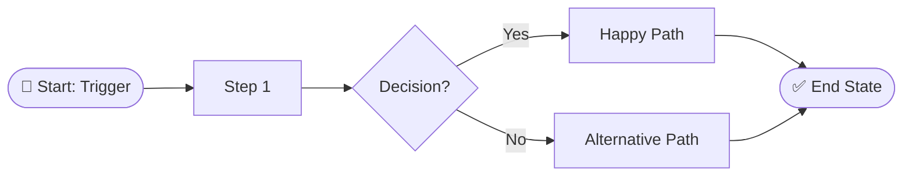
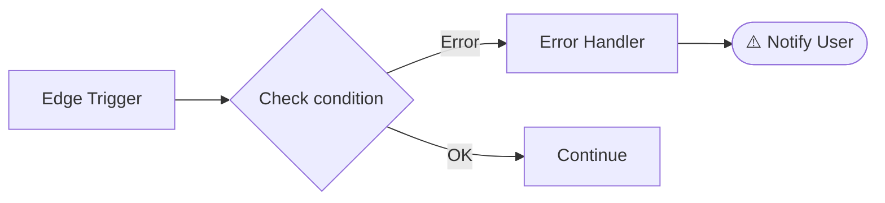

<!--
  feature-from-confluence — Claude Code Edition v3.17
  © 2026 claude-workflow-kit contributors. MIT Licence — see repository root.
-->

## EDITION CONFIG

> Architectural capability flags declared explicitly so the LLM does not silently assume capabilities it does not have.

```yaml
EDITION:          claude-code
PARALLEL_MODE:    true          # B5/B10/B11 may spawn subagents in parallel
SHELL_PERSISTENT: true          # Bash tool keeps cwd & env between calls
PYTHON_AVAILABLE: true          # may invoke .claude/integrations/browser-use-wrapper.py at B11 fallback
AUTOLINT_HOOK:    true          # PostToolUse hook lints on every Edit/Write (settings.local.json)
PROMPT_VERSION:   v3.17
```

When a step says "in parallel" or "spawn agents", honour it. When a step says "if PYTHON_AVAILABLE", honour it.

---

Confluence URL: **$ARGUMENTS**

---

## ARG VALIDATION

**Run this check first — before SESSION BOOTSTRAP and before any other step.**

### Step 1 — Check for empty input

If `$ARGUMENTS` is empty or blank:

```
❌ Missing input

Usage:
  /feature-from-confluence <confluence-page-url>
  /feature-from-confluence <path/to/spec.pdf>
  /feature-from-confluence <path/to/spec.docx>

Examples:
  /feature-from-confluence https://your-confluence.example.com/conf/spaces/YOUR-SPACE/pages/123/...
  /feature-from-confluence docs/specs/my-feature.pdf
  /feature-from-confluence C:/Users/me/Downloads/spec.docx

Please re-run with a Confluence URL, PDF, or Word file path.
```

**STOP immediately. Do not continue.**

### Step 1.5 — Extract flags *(v3.17 — Issue A: AUTONOMY flag handling)*

Before detecting the input type, **strip any workflow flags** from `$ARGUMENTS` so they are not mistaken for part of the spec path/URL:

- Match and remove any `--auto` or `--auto=<comma-list>` token (and any other `--<flag>` tokens) from `$ARGUMENTS`.
- Store the autonomy value as `AUTONOMY` (see `## AUTONOMY`); persist it later to `context-summary.md` as `autonomyGates`.
- The **remaining** string (flags removed, trimmed) is the spec input — use THAT for Step 2 type detection and for the B0 fetch/read. The raw URL/path passed to `fetch_confluence_page` or `Read` MUST NOT contain `--auto`.

If no flags are present, `AUTONOMY` is empty (default OFF) and `$ARGUMENTS` is used unchanged.

### Step 2 — Detect input type

Inspect `$ARGUMENTS` and set `INPUT_TYPE`:

| Condition | `INPUT_TYPE` |
|-----------|-------------|
| Starts with `http` | `confluence` |
| Ends with `.pdf` (case-insensitive) | `pdf` |
| Ends with `.docx` or `.doc` (case-insensitive) | `word` |
| Anything else | `unknown` |

If `INPUT_TYPE` is `unknown`:

```
❌ Unrecognised input: "$ARGUMENTS"

Supported inputs:
  • Confluence URL   — https://...
  • PDF file         — path/to/spec.pdf
  • Word file        — path/to/spec.docx

Please re-run with a supported input type.
```

**STOP immediately.**

Only continue to SESSION BOOTSTRAP when `INPUT_TYPE` is `confluence`, `pdf`, or `word`.

---

## BUILT-IN FALLBACK CONTEXT (React/TypeScript)

> These values are ONLY used when SESSION BOOTSTRAP cannot find the key in CLAUDE.md.
> If CLAUDE.md exists and contains the key, PROJECT_CTX takes priority over every value here.
> All later steps that reference "PROJECT CONTEXT" now read from PROJECT_CTX (resolved in SESSION BOOTSTRAP Step 0.B).

- **Stack**: React 18 + TypeScript, TanStack Query v5 (`@tanstack/react-query`), YourUILib (e.g. `@your-org/ui-lib`)
- **HTTP**: `yourHttpClient()` from your project's HTTP client module — never use `fetch` or `axios` directly unless that is your project's convention
- **Response**: `transformResponse(data)` required on every API response (mirrors your project's camel-casing or normalization helper)
- **Request bodies**: `transformRequest(payload)` from your project's HTTP client module — import alongside `transformResponse`; never write plain snake_case object literals
- **Forms**: `react-hook-form` + `zodResolver` (`@hookform/resolvers/zod`) + `zod` (import from `'zod'`). Save button pattern: `disabled={!isDirty || !isValid || isSubmitting}` — ALWAYS destructure `isValid` from `formState`; omitting it causes Save to enable on invalid input
- **i18n**: `defineMessages` + `useIntl().formatMessage()` in each feature's own `messages.ts`. **DO NOT edit `src/i18n/index.ts`**
- **Pagination**: reuse `src/generic/SharedList.tsx` + `useFilter` hook — do NOT create new pagination/toolbar components
- **Mutations**: `invalidateQueries` in `onSettled`, NEVER in `onSuccess`
- **Import alias**: `@src/...` — no deep cross-feature imports
- **Branch**: `develop` | **Commit format**: `[JIRA-ID][TYPE] description`
- **Feature file structure per convention** (React default — overridden by FILE_STRUCTURE in SESSION BOOTSTRAP):
  ```
  <feature-folder>/
    data/
      types.ts        ← interfaces, no `any`
      api.ts          ← USE_MOCK=true initially, yourHttpClient(), returns mapXxx(transformResponse(data)) — NO `as Type`
      transform.ts    ← explicit mapXxx(raw): Xxx per response type (anti-corruption layer)
      apiHooks.ts     ← useQuery (staleTime) + useMutation (onSettled)
    utils/            ← pure fns for business/display rules + co-located .test.ts (required if any BR row)
    <FeatureName>.tsx ← loading / error / empty / success states
    messages.ts       ← defineMessages, no hardcoded strings in JSX
    <FeatureName>.scss
  ```
- **Mock**: `USE_MOCK = true` as initial state. Run `/drop-mock <path>` when real API is ready.

### UI library selector pitfalls (v3.14)

These apply everywhere selectors are written: `ux-states.json`, `checklist.md` locators, standalone Playwright scripts.

| Component | Issue | Correct selector |
|-----------|-------|-----------------|
| Modal/Dialog | Does NOT forward `data-testid` to DOM | `.modal` or inner element e.g. `[name="fieldName"]` |
| Toast/Notification | No `data-testid` on rendered element | `text=<exact message string>` |
| Info banners | Use `role="alert"` — conflicts with broad alert selectors | Use `text=<specific text>` not `[role="alert"]` for toast detection |

**Rule**: when writing any Playwright selector for a modal, toast, or notification wrapper — always verify the testid is actually forwarded to the DOM before using `data-testid`. If not, fall back to the library's root CSS class or `text=...`.

**AC-selector-chart** (L-01): Before writing `.recharts-wrapper` as a chart selector, grep the target component for `'recharts'` or `ResponsiveContainer`. If absent, use the component's actual root CSS class — the spec saying "bar chart" does not imply Recharts is used.

**Back-button / tab-URL** (L-06): Drill-down back buttons must use `generatePath(ROUTE, params) + '?tab=<tabId>'`, never `navigate(-1)` (browser history depends on entry path). Tabbed parent pages must initialize tab state from the URL (`searchParams.get('tab') ?? defaultTab`), not from a hardcoded `useState('defaultTab')`.

> **(v3.16 portability)** This table uses generic selectors as examples. Replace `.modal` with your UI library's actual class (e.g. MUI `.MuiDialog-root`, Ant `.ant-modal`, Bootstrap `.modal`) — set `ui_library` in CLAUDE.md. See "## PORTABILITY".

---

## PORTABILITY — Repo-Specific Knobs *(v3.16)*

> Most of this workflow is repo-agnostic — it reads `PROJECT_CTX` from `CLAUDE.md`. A few HARD RULES have
> **project-specific default values**. The portable kit ships **generic-safe fallbacks** for them; project
> values live ONLY in that project's `CLAUDE.md` → `### Workflow Overrides`.
>
> ⚠️ **`CLAUDE.md` is per-repo (generated by `/init`) and does NOT travel with the kit.** A repo that copies
> `.claude/` does NOT inherit these values — it gets the **generic-safe fallback** below unless its own
> `CLAUDE.md` defines the key. **Never hardcode project-specific values as fallbacks in this command** —
> fallbacks must be safe for any repo.

| Rule | `CLAUDE.md` override key | Fallback when key ABSENT (portable, generic-safe) | Example project value (in its `CLAUDE.md`) |
|------|--------------------------|---------------------------------------------------|--------------------------------------|
| HR20 | `api_url_convention` | grep `/api/v[0-9]+/...` from `src/**/api.ts` | resource-scoped param `{resource_id}` |
| HR23 | `endpoint_base_override` | **rule INACTIVE** — use HR20 grep only, assume no domain-scoped base | `/api/v1/resources/{resource_id}/items/{item_id}/` |
| HR29 | `reference_feature` | dominant convention in `src/` (NO fixed folder) | `src/<your-ref-feature>/` |
| HR21 / HR22 | `spec_section_map` | semantic heading detection (Objective / Component / AC keywords) | e.g. 2.1 / 2.3.3 / 2.3.4 per your spec template |
| B1 fallback | `ui_library` | detect lib from deps; treat the selector table as an example | `@your-org/ui-lib` |

**Adopting in a NEW repo:**
1. Run `/init` to generate `CLAUDE.md` (gives the agnostic keys: `query_library`, `http_client`, `response_transform`, `import_alias`, `branch`, `commit_format`).
2. **Do nothing else and you get the generic-safe fallbacks** (column 3). To pin a value, add a `### Workflow Overrides` block to `CLAUDE.md` — **`/init` does NOT generate this block; add it manually** only if you need an override.
3. Configure `.claude/mcp-server/.env` (Confluence) + `.env.playwright` (`DEV_SERVER_URL`, `PUBLIC_PATH`).

Rules **not** repo-coupled (portable as-is): HR1–19, 24–28, 30–35, all B-step phases, gates, self-recover/decompose, integration scripts.

---

## CORE BEHAVIORS

These six behaviors are defined once here and referenced by name throughout the flow.

### ★1 SELF-RECOVER

When any operation fails, attempt recovery before escalating:

```
Attempt 1: Default strategy
Attempt 2: Alternative approach (different parse, re-fetch, different API call)
Attempt 3: Fallback / degraded mode (generate from context, use placeholder)
→ Only after all 3 fail: escalate to user with full error context
```

Log every attempt to `docs/specs/<FeatureName>/recovery.log`:
```
[ISO-timestamp] [Step: BX] [Attempt N/3] [strategy: ...] [result: fail/success] [reason: ...]
```

Applies at: B1 (parse/fetch fail), B2 (image download fail), B8.5 (conflict), B11 (test fail).

---

### ★2 DYNAMIC DECOMPOSE

Runs **once, immediately after B1 completes**. Analyze spec content and produce a step plan.

#### Step decisions

| Question | If YES | If NO |
|----------|--------|-------|
| Feature has UI / screens? | keep B2 | skip B2 |
| Spec fully answers scope questions? | shorten B4 | full B4 |
| DB schema / migrations mentioned? | add migration sub-step in B10 | — |
| Multiple independent user flows? | multiple Mermaid sections in B5 | single diagram |

#### Complexity Score (0–10)

Calculate `COMPLEXITY_SCORE` from spec content:

| Signal | Points |
| --- | --- |
| Each mutation type present (CREATE / UPDATE / DELETE / APPROVE / REJECT) | +1 each |
| Pagination (infinite scroll or page-based) | +2 |
| Filter panel with more than 3 filters | +2 |
| Modal or drawer interactions | +1 |
| Multiple independent user flows | +2 |
| File upload or export | +1 |
| Realtime updates or polling | +1 |
| Permission or role-based UI | +1 |
| DB schema change or migration mentioned | +1 |

**Score → Gate mode:**

| Score | Mode | Gate flow |
| --- | --- | --- |
| 0–3 | SIMPLE | **1 combined gate**: B4+B5+B6+B7+B8 merged → show scope questions + 3 files + plan in one message, confirm once |
| 4–6 | MEDIUM | **4 gates**: B4 → B6 → B8 → B9 (skip B6.5 Design Review) |
| 7+ | COMPLEX | **5 gates**: B4 → B6 → B6.5 → B8 → B9 (B6.5 Design Review required) |

For SIMPLE mode, the combined gate message reads:

```text
⚡ Simple feature detected (complexity score: N/10)
   Showing scope, output files, and plan together for a single confirm.

[scope summary]
[diagram.md preview]
[steps.md preview]
[implementation plan preview]

Looks good? [Yes — implement] / [No + feedback]
```

Save all decisions to `docs/specs/<FeatureName>/context-summary.md`:

```json
{
  "featureName": "<FeatureName>",
  "complexityScore": 3,
  "gateMode": "SIMPLE",
  "skip": ["B2"],
  "add": ["migration_step"],
  "merge": ["B4","B5","B6","B7","B8"],
  "reason": { "B2": "no UI detected", "merge": "complexity score 3 — SIMPLE mode" }
}
```

---

### ★3 SELF-EVALUATE

Before showing **any** output to the user, score on three axes:
- **Completeness**: covers all spec ACP items?
- **Accuracy**: no invented fields, no contradictions with spec?
- **Conventions**: matches PROJECT CONTEXT?

Score must be ≥ 90%. If < 90%: revise silently once, re-score. Log to `docs/specs/<FeatureName>/reflection.log`:
```
[ISO-timestamp] [Step: BX] [score: X%] [issues: N] [auto-fixed: N] [revised: yes/no]
```

Applies before: B6 (3 files), B7 (plan), B8 (confirm plan), B12 (final).

---

### ★4 PARALLEL EXECUTION

Explicitly declared parallel tasks run concurrently:
- B1 + B2 + B3 run in parallel (no dependency between them)
- B5 File 1, File 2, File 3 created in parallel
- B11 Playwright/browser-use + unit tests run in parallel

---

### ★5 CONTEXT SUMMARY

After each confirm gate (B4, B6, B8, B9), persist context via the memory integration:

```bash
npx tsx .claude/integrations/memory.ts save <phase> '<json-payload>'
```

Example payloads per phase:
```bash
# After B4 (scope confirmed)
npx tsx .claude/integrations/memory.ts save scope_confirmed \
  '{"featureName":"UserProfile","taskType":"NEW","userAnswers":{"pagination":"infinite","mock":true},"skippedSteps":[]}'

# After B6 (files confirmed)
npx tsx .claude/integrations/memory.ts save files_confirmed \
  '{"featureName":"UserProfile","taskType":"NEW","skippedSteps":[{"step":"B2","reason":"no UI"}]}'

# After B8 (plan confirmed)
npx tsx .claude/integrations/memory.ts save plan_confirmed \
  '{"featureName":"UserProfile","pendingSteps":["B9","B9.5","B10","B11","B12"]}'

# After B9 (final confirmed)
npx tsx .claude/integrations/memory.ts save final_confirmed \
  '{"featureName":"UserProfile","finalConfirmed":true}'
```

The file `docs/specs/<FeatureName>/context-summary.md` is created/updated by the integration. Do NOT write it manually.

---

### ★6 LEARN

Two-level self-improvement loop:

**Level 8 — Pattern Clustering**: After each run, auto-log structured metrics. On the next run, call `feedback-analyzer.ts` to cluster past runs into ranked failure patterns (not raw text). Apply the top patterns as targeted adjustments to the current run.

**Level 9 — Self-Rewriting**: When ≥5 runs exist and HIGH-priority patterns are found (≥30% failure rate), propose specific amendments to this command file. User reviews and approves each change. Applied changes are logged to `.claude/prompt-evolution.md`.

**Auto-log** (always, no user input needed) — write to both `docs/specs/<FeatureName>/feedback.log` (per-feature) and `docs/specs/.feedback-history.md` (global):

```
[ISO-timestamp] [<FeatureName>] [auto]
reflection_final: X% | recoveries: N | b11_a: pass|fail | b11_b: pass|fail
skipped: [step1, step2 or none] | design_cycleback: yes|no | gates_revised: [B6, B8 or none]
```

**User feedback** (optional, non-blocking) — append to the same two files after user input:

```
[ISO-timestamp] [<FeatureName>] [user]
<freetext from user>
```

**On the next run** — call `feedback-analyzer.ts` and store output as `FEEDBACK_ANALYSIS`. Apply `topPatterns` silently during the run. If `totalRuns = 0` → proceed normally.

Trim `docs/specs/.feedback-history.md` to the 10 most recent entries at the end of each B12.5 run.

---

### ★7 STEP FAILURE PROTOCOL

Applied after ★1 SELF-RECOVER exhausts all 3 attempts and still fails. **Do NOT continue automatically.**

1. Print failure box:

   ```text
   ❌ STEP FAILED: [step name, e.g.: B2 — Download Images]
   Reason   : [last attempt error message]
   Attempts : 3/3 exhausted
   Log      : docs/specs/<FeatureName>/recovery.log
   ```

1.5. Report to telemetry (best-effort — never blocks):

   ```bash
   npx tsx .claude/integrations/telemetry.ts error step_failure "<step-name>" "<last-error-message>" || true
   ```

2. Present 3 options:

   ```text
   [R] Retry — start over (attempt 1)
   [S] Skip  — skip this step, mark ⏭️ in progress display
   [A] Abort — cancel the entire workflow
   ```

3. **STOP — do NOT continue until user responds.**

Applies at: **B1** (parse fail), **B2** (image download fail), **B3** (SpecKit fetch fail), **B8.5** (conflict unresolved), **B11** (test fail).

---

## HARD RULES

1. **NEVER** proceed past confirm gates (B4, B6, B8, B9, B10.5) without explicit user response
2. **NEVER** auto-classify task type (LEGACY/BASELINE/NEW) without showing the classification result to user first
3. **ONLY** accept `"yes"`, `"y"`, or `"confirm"` (case-insensitive) at B9 — responses like "ok", "sure", "go ahead", "let's do it" do NOT count
4. **NEVER** skip `⚠️ Image failed` markers — every failed image must be flagged inline in processed.md
5. **NEVER** rollback without asking user first
6. **NEVER** skip B8.5 conflict check
7. **NEVER** skip B8.6 API contract generation
8. **NEVER** start B10 before B9.5 git pull succeeds
9. **NEVER** start B10 before B9.6 package install completes (or no new packages required)
10. **NEVER** ask questions during B10 except for five breaking-change categories: (a) deleting a file, (b) modifying DB schema/migration, (c) renaming a function/component used across multiple features, (d) modifying any file in `src/generic/`, (e) modifying any `.scss` file outside the feature folder
11. **ALWAYS** attempt SELF-RECOVER at least once before escalating to user
12. **ALWAYS** run SELF-EVALUATE before showing any output to user
13. **NEVER** continue automatically after ★1 SELF-RECOVER fails all 3 attempts — apply ★7 STEP FAILURE PROTOCOL and wait for user confirmation
14. **NEVER** edit `.scss` files outside `src/<feature-path>/` — only write styles in the feature's own scss file. Any change affecting another feature's SCSS MUST STOP and ask the user
15. **NEVER** scan full `src/` at B0 — scope BASELINE detection to: `src/**/api.ts` (endpoint match), `src/<feature-name>/` (folder check), `src/**/*.tsx` grep limited to feature-name component patterns only
16. **(v3.7 — Change J.1 shared execution)** Verification logic (visual diff, axe scan, CSS audit, per-AC assertion) MUST live in `.claude/integrations/playwright-runner.ts` or `.claude/mcp-server/index.ts` — NEVER inline in prompt steps. Running the shared binary keeps verification output deterministic given the same input.
17. **(v3.7 — Change J.2 output schema lock)** `visual-properties.md` schema is LOCKED (4 H2 sections: Palette, Typography, Spacing scale, Component bounds; palette exactly 5 bullets; lowercase 6-char hex). `ux-states.json` schema is LOCKED (v2: `feature/states[]/negative_states[]/unit_tests[]`; `expected` enum strictly `visible | hidden | text:... | i18n:... | count:N | attr:name=value`). `checklist.md` summary line format LOCKED. NO creative formatting — emit the identical locked structure every run.
18. **(v3.7 — Change J.3 determinism)** B2.5 design token extraction MUST produce: lowercase 6-char hex (no shorthand, no alpha), spacing values in `px` sorted ascending, 5 typography roles (H1/H2/Body/Caption/Label minimum). This minimises run-to-run divergence from LLM sampling.
19. **(v3.8 — Change L.4 palette relaxation)** Palette in `visual-properties.md` accepts **3–7 colors** reflecting the actual design, not a forced 5. If the spec shows fewer than 5 distinct colors, list `count=<n>` in the section header and emit only the real colors (do NOT pad by duplicating primary). If more than 7, choose 7 dominant + append a comment line `<!-- omitted: #aaa,#bbb -->` listing the dropped hexes.
20. **(v3.9 — Change M.1 URL convention lock)** API endpoint paths in `<FeatureName>.full.http` MUST adopt the prefix and resource hierarchy of the **existing API family** in the host repo. Before writing endpoints at B8.6: (a) run `grep -roE "/api/v[0-9]+/[a-z][a-z-]+" src/**/api.ts src/**/data/api.ts 2>/dev/null | sort -u | head` to discover canonical prefixes; (b) choose the prefix matching the feature's scope noun — NEVER invent a new family like `/api/admin/` if a versioned `/api/v1/` family already exists in the repo; (c) use the id-param name consistent with the existing API family (e.g. `{resource_id}`) — derive from grep output, do NOT assume a specific name; (d) nest sub-resources under the parent scope (e.g. `/api/v1/resources/{resource_id}/items/{item_id}`), do NOT flatten to top-level (e.g. `/api/admin/items/{id}`). Log adopted prefix to `recovery.log`: `[B8.6-url-convention] prefix=<chosen> source=<grep-evidence>`. **(v3.16 portability)** Prefix + id-param names come from grep by default; a repo may pin them via CLAUDE.md `api_url_convention` — see "## PORTABILITY".
21. **(v3.9 — Change M.2 REQ literalness)** `checklist.md` Requirements section MUST mirror the spec's Section 2.1 Objective (or Requirements) table 1-to-1. Each REQ row corresponds to exactly one Objective entry — same count, same order, same wording (light paraphrasing allowed, NO decomposition). Do NOT create REQ rows for: tab navigation, save buttons, format/display rules, validation rules, or other UI controls — those belong in **UI Verification** or **ACT** sections. Log: `[B5-checklist] req_rows=N (spec_objective_count=N)` and ASSERT `req_rows == spec_objective_count`. If unequal, STOP at B6 and present the mismatch to user before continuing. **(v3.16 portability)** "Section 2.1" is the the spec template location; if the spec uses different numbering, resolve the Objectives section by heading semantics (a heading containing "Objective" / "Requirements" / "Mục tiêu") via `PROJECT_CTX.spec_section_map`. The 1-to-1 rule applies to whatever section holds the objective list — see "## PORTABILITY".
22. **(v3.9 — Change M.3 UI/ACT row granularity; v3.11 — ACT floor; v3.12 — Keep Going component)** `checklist.md` UI Verification MUST emit exactly **one row per top-level spec component** (entries from Section 2.3.3 Component description — header, tab bar, each named card type, each named section, each popup). Sub-elements (badges, icons, sub-fields) roll into the parent component's row, do NOT get separate rows. ACT — Acceptance Test Cases MUST emit **one row per spec AC item** (Section 2.3.4 table) — same count, same order. Display/format rules with explicit examples in the spec get an additional unit-test row in ACT. **(v3.11 floor)** After initial count, if `act_rows < 13`: re-scan the spec for implicit user actions (tab switches, expand/collapse, navigate between views, copy-to-clipboard, pagination controls) and add each as an additional ACT row (prefix the row note with `<!-- implicit: <source> -->`) until `act_rows >= 13`. Log: `[B5-checklist] ui_rows=N (spec_components=N) act_rows=M (spec_ac_items=M_ac + display_rules=K + implicit=J)`. **(v3.12 — Keep Going component)** A "Keep going" / "Continue" / "Navigate to uncompleted" card or button described as a named UI element in the spec MUST be its own separate UI row — do NOT fold it into the Required Assessments row or any other row. This component is frequently the last item in the component list and is commonly missed.  **(v3.13 — ui_rows floor)** After counting ui_rows: if ui_rows < 12, re-scan Section 2.3.3 for component names that were merged into parent rows and add each as a SEPARATE row. Two common merge mistakes that MUST be corrected: (a) A named "section" container AND its named "card" or "item" type within it are TWO separate rows, not one — e.g. "Score statistics section" gets one row AND "Component score card" (the repeating card type it contains) gets a second row; (b) A tab that contains multiple NAMED sub-sections (e.g. "Final Assessment tab" containing "Overall Progress card", "Average Score card", "Lessons card", "Required assessments section") — each named sub-section gets its own row, NOT one row for the whole tab. After re-scan, update the log: `[B5-checklist] ui_rows=N (post-floor-check)`. If ui_rows still < 12 after re-scan: log `[B5-checklist] ui_rows-floor-warning=true ui_rows=N` and continue. **(v3.14 — ui_rows ceiling/anti-sub-element)** After the floor re-scan, check that ui_rows has not exceeded 22 due to sub-element over-decomposition. Do NOT create separate rows for: (a) section heading labels — these are part of their parent section, not a standalone component; (b) individual form fields (input, textarea, button) WITHIN a popup or card — they roll into the popup/card row; (c) icon-only elements (eye icon, copy icon, info badge) — they roll into the component they belong to. A UI row represents a named, standalone screen COMPONENT, not a UI element within a component. After writing all UI rows, scan: any row whose Screen/Component description starts with "eye icon", "input field", "button within", or "heading for" MUST be merged into its parent row. Target range: ui_rows ∈ [12, 22]. If ui_rows > 22 after merging: log `[B5-checklist] ui_rows-ceiling-warning=true ui_rows=N merged=K`. **(v3.16 portability)** "Section 2.3.3 / 2.3.4" are the spec template locations; if absent, resolve the Component section by headings containing "Component" / "UI" / "Screen" and the AC section by "Acceptance" / "AC" / "Test case" via `PROJECT_CTX.spec_section_map` — see "## PORTABILITY".
23. **(v3.10 — Change N.1 URL family priority; v3.11 — domain-scoped override)** When the grep at B8.6 (HARD RULE 20 step a) returns BOTH a `/api/v1/` family AND a `/api/admin/` family, **always use `/api/v1/`** — the admin prefix never wins over a versioned public family. The only acceptable exception: if `/api/v1/` has zero entries and only `/api/admin/v1/` exists, use the admin family and log `[B8.6-url-convention] exception=no-v1-family admin-only`. NEVER use bare `/api/admin/` without a version segment. This rule reinforces HARD RULE 20 step (b) against codebase-override. **(v3.11 domain-scoped override)** When `CLAUDE.md` defines `endpoint_base_override`, the canonical endpoint base for features in the specified domain MUST be the value from that key — regardless of what grep returns. If grep returns zero matching entries, these are NEW endpoints: adopt the override base and derive the sub-resource path from the spec's REST resource hierarchy. **(v3.16 portability)** This entire rule is **project-specific and INACTIVE by default** — it applies ONLY when `CLAUDE.md` defines `endpoint_base_override`. In a repo without that key, **ignore HR23** and fall back to HR20's grep-discovered prefix. The override base must NEVER be hardcoded in the kit as a portable fallback. See "## PORTABILITY".
24. **(v3.10 — Change N.2 checklist header lock; v3.11 — ACT prefix fix)** `checklist.md` section headers MUST be exactly (case as shown): `## Requirements Coverage`, `## UI Verification`, `## ACT — Acceptance Test Cases`. Do NOT use bare `## Acceptance Test Cases` for the third section — the `lint-feature` checklist parser matches `/##\s*ACT/i` and requires the header to START with `## ACT`. Do NOT use decorated forms like `## REQ — Requirements (…)` or `## UI — Verification (…)` for the first two sections. To log counts, add a comment on the line immediately below each header: `<!-- req_rows=N spec_objective_count=N -->`.
25. **(v3.10 — Change N.3 ACCESS_GUIDE.md required; v3.12 — section name enforcement)** B8.6 MUST generate `docs/components/<FeatureName>/ACCESS_GUIDE.md`. Required H2 sections in this exact order: `## URL Pattern`, `## Sub-routes`, `## Mock Data Summary`, `## Feature Checklist (browser-level)`, `## Switching to Real API`, `## Related Files`. Section 4 MUST be written as exactly `## Feature Checklist (browser-level)` — the parenthetical suffix `(browser-level)` is REQUIRED. Do NOT write `## Feature Checklist — What to Verify`, `## Feature Checklist — Checklist Items`, `## Feature Checklist (Browser Checks)`, or ANY other variation. These section names must be written exactly as shown — any deviation breaks downstream tooling that matches them by exact string. Log: `[B8.6-access-guide] created ACCESS_GUIDE.md with 6 sections`.
26. **(v3.11 — Change O.1 full path in .full.http)** In `.full.http` files, `{{baseUrl}}` MUST resolve to the **server root only** (e.g. `https://api.example.com/your-app` — no path segments). ALL path segments from `/api/` onwards MUST appear literally in every HTTP request line. CORRECT: `GET {{baseUrl}}/api/v1/resources/{{resourceId}}/items/{{itemId}}`. INCORRECT: defining `@baseUrl = https://api.example.com/your-app/api/v1` then writing `GET {{baseUrl}}/resources/...` (prefix buried in variable). A `### Base URL:` or `@` variable may document the host for human readers, but the request line MUST include the full `/api/v1/...` path so the contract is unambiguous (a prefix buried inside a `{{...}}` variable is invisible to readers and tooling). Log: `[B8.6-http-contract] baseUrl=server-root-only full-paths-verified=N`.
27. **(v3.11 — Change O.2; amended v3.15 — Change P6: PUBLIC_PATH env var)** The app's `PUBLIC_PATH` (e.g. `/your-app/` or `/authoring/`) MUST be set in `.env.playwright` as `PUBLIC_PATH=<value>`. The runner reads this env var and auto-prepends it to every feature route — callers pass bare routes (e.g. `/course-dashboard/...`), not prefixed routes. Do NOT hardcode the public path into `DEV_SERVER_URL` or into the route argument. At B11, reachability check: `curl "${DEV_SERVER_URL:-http://localhost:3000}/home"` — if 200/302 → skip `npm run dev`. Log: `[B11] dev-server=already-running PUBLIC_PATH=<value-from-env.playwright>`.
28. **(v3.12 — Change P.1 golden endpoint file)** At B8.6, BEFORE inventing any endpoint resource paths: check if `docs/components/<FeatureName>/<FeatureName>.full.http` already exists in the workspace (the golden reference file). If the file exists, read it and copy its HTTP request lines verbatim — do NOT invent or rename resource paths, do NOT add endpoints not present in the golden file. Only generate new endpoint paths from spec if NO golden file exists at that path. Log: `[B8.6-golden-endpoint] source=golden-file endpoints=N` (if golden found) or `[B8.6-golden-endpoint] source=generated-from-spec` (if not found). **(v3.16)** This complements HARD RULE 32: when `contractStatus=REAL`, the user-provided contract IS the golden file — adopt it even if no `<FeatureName>.full.http` exists yet at the path above. HR28 and HR32 never conflict: HR28 = "if a golden file is already on disk, copy it"; HR32 = "ask the user whether one exists and where."
29. **(v3.12 — Change P.2 code naming convention)** If a reference implementation exists at `src/<ref-feature>/` (a feature serving the same domain as the current feature): mirror its naming conventions for (a) TypeScript type/interface names — use the same noun + suffix pattern (e.g. `Data`, `Response`, `Payload`, `Item`); (b) API function names — use the same verb prefix (`get`, `post`, `put`, `delete`) + matching noun; (c) React Query hook names — use the same pattern (`useGet*`, `usePost*`, `useMutation*`); (d) i18n message key categories — adopt the same prefixes (`tab.*`, `label.*`, `button.*`, `status.*`, `error.*`, `success.*`). If no reference implementation exists, follow the dominant convention observed in `src/<shared-module>/` and `src/generic/`. Log: `[B7-plan] naming-reference=<ref-feature-or-generic>`. **(v3.16 portability)** When `CLAUDE.md` does NOT define `reference_feature`, use the **dominant convention observed in `src/`** — do NOT assume any specific folder. The reference folder is **a per-repo value, set in its `CLAUDE.md` → `### Workflow Overrides`** (per-repo; not shipped with the kit). See "## PORTABILITY".
30. **(v3.13 — Change Q.1 Playwright worktree criterion)** At B11, the minimum PASS criterion for the Playwright verification gate (b11_a) is **5/5 basic checks**: (1) dev server reachable (HTTP 200/302 at DEV_SERVER_URL/home), (2) MCP `verify_feature_route` returns non-fatal result OR MCP is unavailable (step skipped), (3) loading state renders without crash (ux-states.json loading step passes), (4) success state renders without crash (ux-states.json success step passes), (5) unit tests pass (Step 5 — `npm test -- --testPathPattern=src/<feature-folder>`). Extended checks — per-AC browser assertions, visual regression diff, a11y audit, CSS computed-style audit — are **BONUS only** and do NOT affect b11_a PASS/FAIL. If the feature runs in a clean-room worktree whose route is NOT yet present in the main workspace `src/index.jsx` (infrastructure limitation — dev server serves only main workspace checkout): log `[B11] extended-checks=infra-blocked reason=worktree-route-not-deployed` and set b11_a=pass if basic 5/5 pass. Do NOT fail Cat 13 solely because the feature route is unreachable from the main-workspace dev server.
31. **(v3.14 — Change R.1 ux-states.json non-optional)** `docs/specs/<FeatureName>/ux-states.json` MUST be generated during B10 (as part of the File 4 artifact) and MUST contain ≥3 states before B11. This requirement is non-optional — do NOT skip ux-states.json generation even if: (a) user opts out of Playwright at B10.5; (b) the feature runs in a worktree with no dev server access. The file is a required artifact for future Playwright runs. If the template was created at B5, update it during B10 to reflect the actual CSS selectors from the generated components (e.g. `[id^='score-']` for score inputs, `.final-exam-card` for clickable cards, `[aria-label='...']` for icon buttons). Each state MUST have at least one `screenshot` step so evidence is captured. Log: `[B10.5] ux-states.json=ready states=N`.
32. **(v3.16 — Change S.1 Contract provenance / Contract-first)** At B4 the workflow MUST ask the backend-contract status before B5 writes any output file. Persist the answer to `context-summary.md` as `contractStatus`. Three states:
    - **REAL** — user provides a contract file path or URL. Adopt it as the golden source: at B8.6 copy its endpoint paths + request/response shapes VERBATIM, skip all inference; `### EXPECTED RESPONSE SHAPES` = the real shapes. Log `[B4-contract] status=REAL source=<path>`.
    - **PROVISIONAL** — a contract is coming later. Generate the inferred contract as today, BUT stamp the top of `data/types.ts` and every `data/api.ts` function with `// CONTRACT: PROVISIONAL — verify against backend contract` and emit `docs/components/<FeatureName>/RECONCILE.md` listing each inferred endpoint + shape. Log `[B4-contract] status=PROVISIONAL`.
    - **FE_ONLY** — no backend. Proceed as today. Log `[B4-contract] status=FE_ONLY`.
    NEVER silently treat an inferred contract as final.
33. **(v3.16 — Change S.2 Mapping layer — no blind casts)** B10 MUST NOT blind-cast a raw HTTP response to a typed value (e.g. `transformResponse(data) as <Type>`). Every response MUST pass through an explicit mapper in `src/<feature-folder>/data/transform.ts` — one `mapXxx(raw): Xxx` per response type — or a zod `.parse()`. `api.ts` calls the mapper and returns its result; it never casts a raw response. Rationale: when the real contract differs from the mock, ONLY `transform.ts` changes — `types.ts`, `apiHooks.ts`, and every component stay untouched. B10 self-eval grep gate: grep for `<PROJECT_CTX.response_transform>\([^)]*\)\s+as ` in `src/<feature-folder>/` — MUST return 0 matches. **Framework-agnostic**: substitute the host repo's transform fn (e.g. `transformResponse`, `toCamelCase`, `keysToCamelCase`, or none) in both the rule and the grep. The invariant is the principle, not the function name: *no raw HTTP response is cast straight to a type; it always passes through an explicit mapper*. Repos without a response-transform helper still write `mapXxx(raw)`; repos that use zod project-wide may use schema `.parse()` instead. **(v3.16 — #4 conditional)** The mapper MAY be a thin pass-through when the wire shape already equals the domain shape (e.g. `export const mapX = (raw: RawX): X => raw;` after normalization) — the requirement is a single named seam to edit later, not forced field-by-field remapping. The cast ban still holds: even a pass-through routes through `mapX`, never `... as X`.
34. **(v3.16 — Change S.3 Business rules are code+test, not prose)** Every Business-Rule / display-format row in `checklist.md` (rounding, K/M formatting, last-attempt-only, rank immutability under filter, "N/A" fallback, section-absence hiding, grading-state gating) MUST map to EITHER (a) a pure function in `src/<feature-folder>/utils/` WITH a co-located `<name>.test.ts` AND an entry in `ux-states.json` `unit_tests[]`; OR (b) an explicit `<!-- enforced-by: BE -->` marker on that checklist row. Step 6.5 (utils/) is REQUIRED, not optional, whenever ≥1 BR/display row exists. B11 MUST run `unit_tests[]` (`npm test --testPathPattern=src/<feature-folder>/`) and report pass/fail per rule. Log `[B5-rules] br_rows=N mapped_util=N enforced_by_be=N`.
35. **(v3.16 — Change S.4 Done = verified)** B12 MUST NOT print "✅ Implementation Complete" while more than **40%** of (UI + ACT) checklist rows remain `⬜` unverified, unless the user explicitly acknowledges the gap. The completion box MUST show the TRUE per-section verified ratio (verified/total), never a rounded-up "done". If Playwright was opted out at B10.5, the box MUST include `⚠️ browser-unverified: N rows`. HARD RULE 30 (b11_a 5/5 basic) still defines the Playwright PASS bar; this rule only governs the honesty of the B12 summary.
36. **(v3.16 — Change S.10 Full AC + description test coverage)** Every Acceptance-Criteria item AND every distinct described behavior in the spec MUST be covered by ≥1 automated test before B12 prints done. **Unit tests** (Jest) cover logic / business / display rules (`utils/`, pure fns); **E2E tests** (Playwright via `ux-states.json` `ac_assertions[]` / `states[]`) cover UI, interactions, and visible-state ACs. Each ACT row in `checklist.md` MUST map to ≥1 of: a `ux-states.json` `ac_assertions[].ac_id`, a `unit_tests[].ac_id`, or a `*.test.ts` referencing the ACT id. **B5 generates these test cases up front** (stubs derived from the ACT/UI rows — not retrofitted at the end); B10 implements them; B11 runs the AC-coverage gate (below) + the Jest suite + Playwright. For ACs the FE cannot exercise (system / backend-only), mark the checklist row `<!-- enforced-by: BE -->` to exclude it from the FE coverage denominator. Target: **100% of FE-testable ACT rows covered**. Enforced by `lint-feature.ts --gate` at B11; B12 reports `AC <covered>/<total>`. Log `[B11-coverage] ac_covered=N/M unit=K e2e=J`. **Anti-fake-test**: `lint-feature.ts` does NOT credit hollow tests — a `*.test.ts` with no `expect(`, an `ac_assertions[]` entry with no `expected`, or a `unit_tests[]` entry with no `grep`/`test_file` is rejected and does not count toward coverage.

---

## AUTONOMY — Opt-in Unattended Mode *(v3.17 — Issue A: gate throughput)*

> **Default: OFF.** With no autonomy flag, every STOP gate behaves exactly as written (HARD RULE 1 unchanged). This block only takes effect when the user **explicitly grants standing authorization** — which itself satisfies HARD RULE 1's "explicit user response" for the covered gates, given once instead of per-gate.

**How to enable:** the user passes a flag or says so in the invocation, e.g.
`/feature-from-confluence <url> --auto` or `--auto=scope,files,plan`. Resolve `AUTONOMY` from this; persist it to `context-summary.md` as `autonomyGates`.

**Auto-advance eligibility** — a gate may auto-pass ONLY if ALL hold:
1. The gate is listed in `AUTONOMY` (subset of `B4, B6, B6.5, B8`). `--auto` with no list = all four.
2. Current `gateMode` is `SIMPLE` or `MEDIUM` (never auto-advance a `COMPLEX` design review unless `B6.5` is explicitly named).
3. The step's ★3 SELF-EVALUATE score is **≥ 95%** (below that → fall back to a normal STOP gate and show why).
4. No ★7 STEP FAILURE, no B8.5 conflict, and no B10 STOP-condition (HARD RULE 10 breaking-change categories) is pending.

**NEVER auto-advance (always a real STOP, regardless of `AUTONOMY`):**
- **B9 Final Confirm** — HARD RULE 3 still requires a literal `yes/y/confirm`.
- Any **HARD RULE 10** breaking-change prompt (delete file, DB/migration, cross-feature rename, `src/generic/`, foreign `.scss`).
- **B10.5 Playwright opt-in**, conflict/merge/peer-dep gates (B8.5/B9.5/B9.6), and image-failure / ownership-mismatch / fidelity STOPs.

When a gate auto-advances, do NOT go silent — print one line so the trail is auditable:

```
🤖 AUTONOMY: B6 auto-confirmed (SELF-EVALUATE 96% ≥ 95%, mode SIMPLE). Override: reply "stop" to inspect.
```

Log `[autonomy] gate=BX action=auto-pass score=N% mode=<mode>` → `recovery.log`. If the user types `stop` at any auto-pass line on their next turn, treat the most recent auto-advanced gate as re-opened.

---

## PROGRESS DISPLAY

**Print at the start of every step** (B0, B0.5, B1, B2, B3, B4, B5, B6, B6.5, B7, B8, B8.5, B8.6, B9, B9.5, B9.6, B10, B10.5, B11, B12, B12.5, B12.6, B12.8) before doing anything else in that step.

### Format

Steps are grouped into **8 phases** so the user sees at a glance where they are and which step is the *next* one needing their input (🛑 = STOP gate). The header carries live context: the current step name, the feature name, the complexity/gate mode, and a `done / total` step counter.

```text
╔════════════════════════════════════════════════════════════════════════╗
║  /feature-from-confluence · v3.17   ▶ B2 — Download Images              ║
║  Feature: <FeatureName>   ·   Mode: <SIMPLE|MEDIUM|COMPLEX> (score N)   ║
║  Progress: ███████░░░░░░░░░░░░░░░░░  3 / 26 steps   ·   🛑 next: B4     ║
╠════════════════════════════════════════════════════════════════════════╣
║  ① INTAKE     ✅ B0 Spec+Type   ✅ B0.5 Pre-flight                      ║
║               ✅ B1 Process     ▶  B2 Images       ⬜ B3 SpecKit Lens   ║
║  ② SCOPE      🛑 ⬜ B4 Confirm Scope                                    ║
║  ③ DESIGN     ⬜ B5 3 Files    🛑 ⬜ B6 Confirm Files                   ║
║               🛑 ⬜ B6.5 Design Review (COMPLEX only)   ⬜ B7 Plan       ║
║  ④ APPROVE    🛑 ⬜ B8 Confirm Plan   ⬜ B8.5 Conflicts                 ║
║               ⬜ B8.6 API Contract    🛑 ⬜ B9 Final OK (yes/y/confirm)  ║
║  ⑤ PREP       ⬜ B9.5 Git Sync        ⬜ B9.6 Packages                  ║
║  ⑥ BUILD      ⬜ B10 Implement   🛑 ⬜ B10.5 Playwright?   ⬜ B11 Verify ║
║  ⑦ DONE       ⬜ B12 Done (verified-ratio gate)                         ║
║  ⑧ LEARN      ⬜ B12.5 Feedback  ⬜ B12.6 Improve  ⬜ B12.8 Reconcile    ║
╠════════════════════════════════════════════════════════════════════════╣
║  ✅ done  ▶ current  ⬜ pending  ⏭️ skipped  ❌ failed  ·  🛑 = STOP gate ║
╚════════════════════════════════════════════════════════════════════════╝
```

**Header rules:**
- `▶ BX — <name>`: the step currently running (mirror the step's own title).
- `Mode`: from DYNAMIC DECOMPOSE (SIMPLE / MEDIUM / COMPLEX + score). Show `—` before B1 computes it.
- `Progress` bar + `done / total`: count `✅` steps over the steps **active for this run** (DYNAMIC-DECOMPOSE-skipped steps are excluded from the total, not counted as done). `🛑 next: BX` names the next STOP gate the user will hit.
- The phase containing `▶` is the active one; a phase reads as complete once all its steps are `✅`.
- Steps skipped by DYNAMIC DECOMPOSE render `⏭️` and are dropped from `total`.

### Status legend

| Icon | Meaning |
| ---- | ------- |
| `✅` | Completed — step finished successfully |
| `▶` | Current — step currently running |
| `⬜` | Pending — not yet reached |
| `⏭️` | Skipped — bypassed by DYNAMIC DECOMPOSE or user chose [S] |
| `❌` | Failed — step failed after 3 attempts (★7 awaiting user) |
| `🛑` | STOP gate — step requires user input before continuing (B4, B6, B6.5, B8, B9, B10.5) |

### Rules

- Update each step's status **and** update the 3 header lines (current step, Mode, Progress + `🛑 next`) before printing.
- When a step is skipped by DYNAMIC DECOMPOSE, mark it `⏭️` immediately and **remove it from `total`** in the Progress bar.
- Always mark `🛑` before each STOP gate so the user knows where input is needed; `🛑 next: BX` in the header must point to the next incomplete STOP gate.
- Keep phase groups ① → ⑧ in order; the phase containing `▶` is the active phase.
- Do not skip PROGRESS DISPLAY even at automatic steps (B0.5, B8.5, B8.6, B9.5, B9.6, B12.8).

---

## SESSION BOOTSTRAP

**Run before B0 — in this order.**

> **Token gate** — runs before Step 0, every invocation:
>
> ```bash
> npx tsx .claude/integrations/telemetry.ts verify
> ```
>
> | Exit | Meaning | Action |
> |------|---------|--------|
> | `0` | Token valid — or infra unreachable (fail-open) | Continue to Step 0 |
> | `1` | Token not set / invalid / expired / quota exceeded | **HALT** — surface the printed error to the user |
>
> Infra failures (network down, Supabase unreachable) exit `0` with a `⚠️` warning and **must not block the workflow**.
> If `KIT_TOKEN` is not set: add `KIT_TOKEN=<your-token>` to `.env` (see `.env.example` at the project root).

### Step 0 — Read CLAUDE.md (project conventions)

1. Read `CLAUDE.md` at the project root.

2. **If CLAUDE.md exists** → extract the following into working memory as `PROJECT_CTX`:

   - `http_client` → `yourHttpClient` / `axios` / `fetch`
   - `response_transform` → `transformResponse` / `toCamelCase` / `keysToCamelCase`
   - `query_library` → `react-query` / `@tanstack` / `swr` / `apollo`
   - `branch` → `Branch:` or `branch:` line
   - `commit_format` → `Commit` section or `[JIRA-ID]` pattern
   - `shared_components_path` → `src/generic/` / `src/shared/` / `src/common/`
   - `i18n_pattern` → `defineMessages` / `useIntl` / `i18next`
   - `import_alias` → `@src/` / `@app/` / `~`

   **Optional portability keys** (v3.16 — read from CLAUDE.md if present; see "## PORTABILITY — Repo-Specific Knobs"). When absent, each uses a **generic-safe fallback** (project-specific values live only in that project's CLAUDE.md):
   - `reference_feature` → folder to mirror naming from (HR29) — fallback: dominant convention in `src/`
   - `endpoint_base_override` → REST base for class/member-detail features (HR23) — fallback: **HR23 inactive**
   - `api_url_convention` → canonical API prefix + id-param names (HR20) — fallback: grep `/api/v[0-9]+/...`
   - `spec_section_map` → which spec sections hold Objectives / Components / AC (HR21/HR22) — fallback: semantic heading detection
   - `ui_library` → component lib for selector pitfalls — fallback: detect from deps (Paragon table is an example)

   Use `PROJECT_CTX` values throughout all later steps instead of the hardcoded `## PROJECT CONTEXT` defaults. If a key is not found in CLAUDE.md, fall back to the hardcoded default for that key.

3. **If CLAUDE.md does NOT exist**:

   ```
   ⚠️  CLAUDE.md not found at project root.

   This command uses CLAUDE.md to understand your project's conventions
   (HTTP client, response transforms, branch name, import aliases, etc.).

   Without it, code will be generated using built-in defaults
   which may not match this project.

   Options:
     [1] Run /init to generate CLAUDE.md from your codebase (recommended)
     [2] Continue with built-in defaults (only safe if your project matches React/TypeScript defaults)
   ```

   **STOP — wait for user choice.**
   - `[1]` → run `/init`, then **automatically re-run SESSION BOOTSTRAP Step 0** to extract PROJECT_CTX from the newly generated CLAUDE.md. Log: `"CLAUDE.md generated by /init — re-reading PROJECT_CTX"`
   - `[2]` → log `"CLAUDE.md missing — using React/TypeScript built-in defaults"` to `docs/specs/<FeatureName>/recovery.log`, continue with BUILT-IN FALLBACK CONTEXT values

### Step 0.B — Tech Stack Resolution

Run immediately after Step 0 (whether CLAUDE.md existed or was just generated by /init).

**Resolve STACK_DESCRIPTION:**

```
Derive framework from PROJECT_CTX.query_library:
  • contains "react-query" or "@tanstack"  → framework = "React 18 + TypeScript"
  • contains "pinia" or "vuex"             → framework = "Vue 3 + TypeScript"
  • contains "ngrx" or "rxjs"             → framework = "Angular + TypeScript"
  • anything else                          → framework = PROJECT_CTX.query_library value

Assemble STACK_DESCRIPTION:
  "[framework], [PROJECT_CTX.http_client], [PROJECT_CTX.response_transform]"
  Fallbacks: yourHttpClient() | transformResponse(data) | @src/...
```

**Resolve FILE_STRUCTURE** (used by B5 steps generation and B10 agent prompt):

```
Priority order:
  1. PROJECT_CTX.feature_file_structure key in CLAUDE.md → use verbatim
  2. React detected  → data/types.ts, data/api.ts, data/transform.ts, data/apiHooks.ts,
                        utils/ (if BR rows), <Feature>.tsx, messages.ts, <Feature>.scss
  3. Vue detected    → data/types.ts, api/<feature>.ts, data/transform.ts, composables/use<Feature>.ts,
                        <Feature>.vue, i18n/en.json
  4. Angular         → data/types.ts, services/<feature>.service.ts, data/transform.ts,
                        <feature>.component.ts, <feature>.component.html
  5. Unknown         → data/types.ts, api/<feature>.ts, data/transform.ts, <Feature>.[ext], i18n strings file

  (HARD RULE 33 applies to EVERY framework: raw API responses route through the transform.ts mappers.
   Angular may map inside the *.service.ts instead of a separate transform.ts, but the blind-cast ban
   still holds. Substitute PROJECT_CTX.response_transform for the response transform fn in the grep gate.)
```

**Detect PKG_MANAGER** from lockfile (check in priority order):

```
1. bun.lockb or bun.lock   → PKG_MANAGER = "bun"
2. pnpm-lock.yaml          → PKG_MANAGER = "pnpm"
3. yarn.lock               → PKG_MANAGER = "yarn"
4. package-lock.json       → PKG_MANAGER = "npm"
5. No lockfile found       → PKG_MANAGER = "npm"  ← default, log warning
```

**Check tsx availability** (do NOT block flow on failure):

```bash
npx tsx --version 2>&1 || echo "WARNING: tsx not found. Run: npm install -D tsx"
```

If tsx missing → print one-line warning, continue. Integration scripts (`memory.ts`, `playwright-runner.ts`, `feedback-analyzer.ts`) will warn individually if tsx is needed at runtime.

**Restore any stale BASELINE backup from an interrupted B10 session:**

```bash
# B10 Step 1.5 renames: src/<FOLDER> → src/.<FOLDER>-bak
# If the session was interrupted before Step 3 restore, the folder stays renamed.
# (v3.8 Change L.6) — backups older than 24h require user confirmation before restore.
for bak in src/.*-bak; do
  [ -d "$bak" ] || continue
  orig="src/${bak#src/.}" && orig="${orig%-bak}"
  age_seconds=$(node -e "try{var s=require('fs').statSync('$bak').mtimeMs/1000;process.stdout.write(String(Math.floor(Date.now()/1000-s)))}catch(e){process.stdout.write('0')}" 2>/dev/null || echo "0")
  if [ "$age_seconds" -gt 86400 ]; then
    echo "⚠️  Stale backup $bak is older than 24h. Restore (y/N)?"
    read -r ans
    [ "$ans" = "y" ] || [ "$ans" = "Y" ] || { echo "  Skipped (kept as-is)."; continue; }
  fi
  mv "$bak" "$orig"
  echo "⚠️  SESSION BOOTSTRAP: restored BASELINE backup: $bak → $orig"
done
```

If any folder was restored: print the warning above and continue normally. This is a no-op when no `.*-bak` folders exist.

**Print summary once** (after all three are resolved):

```
✅ SESSION BOOTSTRAP complete
   Tech stack   : [framework — e.g. React 18 + TypeScript | Vue 3 + TypeScript]
   HTTP client  : [PROJECT_CTX.http_client or "(fallback: yourHttpClient())"]
   Import alias : [PROJECT_CTX.import_alias or "(fallback: @src/...)"]
   File layout  : [react-standard | vue-standard | angular-standard | custom-from-CLAUDE.md]
   Pkg manager  : [npm | yarn | pnpm | bun]
```

Store `STACK_DESCRIPTION`, `FILE_STRUCTURE`, and `PKG_MANAGER` in working memory — they are referenced by B5, B7, B9.6, B10, and B11.

### Step 0.C — Amendment advisory *(improve-trigger — ≤1 per run)*

```bash
npx tsx .claude/integrations/improve-trigger.ts --bootstrap
```

If the command fails or tsx is unavailable, continue silently — this step is best-effort.

If **no applicable amendments** are printed, continue silently.

If amendments are printed:

1. Select **at most one** — the one with the highest `pattern_frequency`. Only apply amendments with `action_type: prompt_patch`; skip `gate_addition` and `test_addition` (those require human action outside this workflow).

2. Apply it as a **soft advisory constraint**: add an internal reminder scoped to the step(s) listed in `targetSection`. This is advisory — it shapes your approach for this run but does not create a new hard gate.

3. Record the application:
   ```bash
   npx tsx .claude/integrations/improve-trigger.ts --mark-applied <AME-ID>
   ```

4. Print one line then continue:
   ```
   🔧 Advisory: [AME-ID] — [pattern_id] applied as soft-constraint at [targetSection]
   ```

**Safety constraint:** auto-amendments can only ADD constraints (strengthen checks, add a reminder). They cannot remove or relax an existing gate. If the proposed change would relax a hard rule, skip it and log: `⚠️ Skipped [AME-ID] — would relax a hard rule`.

### Step 0.D — Learned config *(deterministic, promoted from verified amendments)*

Unlike Step 0.C's per-run advisory, these knobs were promoted by *verified* amendments and persist. Read them:

```bash
npx tsx .claude/integrations/learned-config.ts --json
```

If the command fails or tsx is unavailable, continue silently with defaults.

Apply the `config` values for the rest of this run (they can only be STRICTER than defaults — the store is strengthen-only, enforced by `clampStrengthen`):

- `selfEvalThreshold` → the ★3 SELF-EVALUATE pass bar (default 90). Use this value, not the hardcoded default.
- `maxRecoveries` → halt to the user after this many SELF-RECOVER attempts on one step (default 3).
- `manualCorrectionBudget` → at B12.5, if manual corrections exceed this, surface a lesson (default 2).
- `requireLoadingState` / `requireErrorState` → **already machine-enforced** by `lint-feature` at B11 (no action needed here; listed for awareness).

Print one line then continue:
```
⚙️  Learned config: selfEvalThreshold=[N], maxRecoveries=[N], manualCorrectionBudget=[N], requireLoadingState=[bool], requireErrorState=[bool]
```

### Step 0.E — Toolchain regression guard *(best-effort; halts on regression)*

Before doing any work, verify the deterministic gates/analyzers still behave on the golden corpus. This catches a learned rule, gate edit, or threshold change that would silently regress generated output.

```bash
npx tsx .claude/integrations/regression-corpus.ts
```

If the command is unavailable or no corpus exists, continue silently.

If it exits **non-zero** (a regression):
```
🛑 Toolchain regression: the deterministic corpus failed. A gate, learned rule, or
   threshold changed behavior on a golden case (see the ❌ case(s) above).
```
**STOP** and surface this to the user. Do NOT proceed to B0 until the corpus is green — or the user explicitly accepts the risk. When you later fix a false positive/negative or change a gate, add a `*.case.json` capturing the behavior (see `.claude/integrations/corpus/README.md`).

### Step 1 — Resume check

```bash
npx tsx .claude/integrations/memory.ts load
```

`memory.ts load` reads the **active** feature only (via the `.current-feature` pointer) — that is the fast path and the default.

- If context found: show:
  ```
  🔄 Resuming session: [featureName]
     Last confirmed step: [phase]
     Continue from here? (yes / no — start fresh)
  ```
  - `yes` → jump to the step after the last confirmed phase
  - `no` → run `npx tsx .claude/integrations/memory.ts clear`, proceed to B0 fresh
- If no context found: proceed to B0

**Resuming a *different* feature (no directory scan):** to pick up a feature other than the active one — or to see all in-flight features at a glance — read the auto-maintained index instead of fanning out across `docs/specs/*/`:

```bash
npx tsx .claude/integrations/feature-index.ts --json   # [{feature, phase, evalScore, finalConfirmed, lastUpdated}, …]
```

`docs/specs/INDEX.md` is the human-readable version of the same projection. Both are regenerated automatically by `memory.ts` on every save, so they are never stale. To switch the active feature, write its name to `docs/specs/.current-feature` and re-run `memory.ts load`. Features with `finalConfirmed: true` also carry a compact `feature-digest.md` — load that instead of the full artifact set when you only need the outcome.

### Step 2 — Load past feedback (★6 LEARN — Level 8)

Run the feedback analyzer:

```bash
npx tsx .claude/integrations/feedback-analyzer.ts --summary
```

Store the JSON output as `FEEDBACK_ANALYSIS` in working memory.

- `FEEDBACK_ANALYSIS.totalRuns > 0` → print once:
  ```
  📚 Feedback analysis: N runs | top patterns: <pattern1>, <pattern2>
     Lessons will be applied silently during this run.
  ```
- `FEEDBACK_ANALYSIS.totalRuns = 0` (first run or file missing) → continue silently

`FEEDBACK_ANALYSIS` is carried forward into B3 (Feedback Lens) and referenced at B5, B7, B10 where `watch_steps` applies.

---

## B0 — Fetch / Read Spec + Task Type Detection

> **Print PROGRESS DISPLAY** (current: `▶ B0`) trước khi làm bất kỳ action nào.
> **Load the spec first — always, automatically. No user prompt needed.**
> Branch based on `INPUT_TYPE` detected in ARG VALIDATION.

### Step 1 — Load spec (branch by INPUT_TYPE)

---

#### Branch A — `INPUT_TYPE = confluence`

Call the `fetch_confluence_page` MCP tool with URL: `$ARGUMENTS`

**If the tool returns a credentials error**:
- Tell the user exactly which env vars to set in `.claude/mcp-server/.env`:
  - Option A (LDAP): `CONFLUENCE_USER=username` + `CONFLUENCE_PASS=password`
  - Option B (PAT): `CONFLUENCE_TOKEN=your_pat_token`
- **STOP. Wait for user to fix credentials, then retry.**

**If the `confluence-mcp` MCP server is unavailable** (not a credentials error — tool unregistered, server down, or `isError`/connection failure after one retry) — degrade gracefully instead of dead-ending:

```
⚠️  Confluence MCP unavailable — cannot auto-fetch the page.
    Continue without it:
      [1] Paste the spec markdown — I will save it to docs/specs/<title>.md and proceed from B1
      [2] Re-run with an exported file:  /feature-from-confluence path/to/spec.pdf  (or .docx)
      [3] Retry the MCP fetch (after restarting Claude Code / re-registering the server)
```

**STOP — wait for the user's choice.** On `[1]`, write the pasted content to `docs/specs/<title>.md` with the same header format as the PDF/Word branches, then continue to the Convergence point. Log `[B0] confluence-mcp=unavailable fallback=<paste|file|retry>` → `recovery.log`.

The MCP server auto-saves the raw spec to `docs/specs/<title>.md`. **Do NOT rewrite this file.**

---

#### Branch B — `INPUT_TYPE = pdf`

1. Derive `<title>` from the filename (strip path and `.pdf` extension, convert hyphens/underscores to spaces, title-case).
2. Read the PDF using the `Read` tool with the path `$ARGUMENTS`. The tool supports PDFs natively.
3. Save the extracted text to `docs/specs/<title>.md`:
   ```
   # <title>
   **Source:** $ARGUMENTS
   **Extracted:** <ISO-timestamp>

   ---

   <extracted content>
   ```
4. If the file is > 10 pages, read in chunks of 20 pages at a time (pages: "1-20", "21-40", …) and concatenate.
5. If the file does not exist or cannot be read → show:
   ```
   ❌ Cannot read PDF: $ARGUMENTS
      Reason: [file not found / permission denied / unsupported format]
   ```
   **STOP.**

---

#### Branch C — `INPUT_TYPE = word`

1. Derive `<title>` from the filename (strip path and `.docx`/`.doc` extension).
2. Try to convert with `pandoc` (attempt 1):
   ```bash
   pandoc "$ARGUMENTS" -t markdown -o "docs/specs/<title>.md"
   ```
3. If `pandoc` is not available, try `mammoth` (attempt 2):
   ```bash
   npx mammoth "$ARGUMENTS" --output-format=markdown > "docs/specs/<title>.md"
   ```
4. If both fail, try reading raw XML from the `.docx` zip (attempt 3):
   ```bash
   # .docx is a zip — extract word/document.xml and strip tags
   unzip -p "$ARGUMENTS" word/document.xml | sed 's/<[^>]*>//g' > "docs/specs/<title>.md"
   ```
5. If all 3 attempts fail → show:
   ```
   ❌ Cannot extract Word file: $ARGUMENTS

   Tried: pandoc, mammoth, raw XML extraction — all failed.

   Options:
     [1] Export the file as PDF and re-run: /feature-from-confluence path/to/spec.pdf
     [2] Export as plain text, paste content manually
   ```
   **STOP.**
6. Prepend a header to the saved file:
   ```
   # <title>
   **Source:** $ARGUMENTS
   **Extracted:** <ISO-timestamp>

   ---
   ```

---

---

### Convergence point — all 3 branches must produce the same output

> **All input types (Confluence / PDF / Word) MUST be converted to a single markdown file before B1 runs.**
> B1 onward reads only `docs/specs/<title>.md` — it does not know or care about the original input source.

| Input type | Output file | Converter |
|------------|-------------|-----------|
| Confluence | `docs/specs/<title>.md` | MCP server (auto-saves) |
| PDF | `docs/specs/<title>.md` | `Read` tool → write to file |
| Word | `docs/specs/<title>.md` | pandoc / mammoth / raw XML |

**Do NOT proceed to B1 until `docs/specs/<title>.md` exists and is non-empty.**

#### Structural Fidelity Check (PDF and Word only — skip for Confluence)

After saving `docs/specs/<title>.md` from a PDF or Word source, verify structural completeness:

```powershell
# Count headings (cross-platform via PowerShell)
$headings = (Select-String -Path "docs/specs/<title>.md" -Pattern "^#").Count
# Count tables
$tables = (Select-String -Path "docs/specs/<title>.md" -Pattern "^\|").Count
# Count lists
$lists = (Select-String -Path "docs/specs/<title>.md" -Pattern "^[-*]").Count
```

If `$tables -eq 0` and the raw text contains apparent table-like structure (lines with multiple `|` or tab-separated columns):

```text
⚠️  Table extraction warning
    Source file appears to contain tables but none were found in extracted markdown.

    Common causes:
      - Scanned PDF (image-based, not text) → export from source as real PDF
      - Word raw XML fallback used → install pandoc for better extraction

    Recommendations:
      1. Export the original spec from Confluence or Word → save as PDF → re-run
      2. Install pandoc: https://pandoc.org/installing.html

    Continue anyway? [Yes — I understand tables may be missing] / [No — I will use a better source file]
```

**STOP — wait for user response if table warning fires.**

If `$headings -eq 0`:

```text
⚠️  Extraction warning: no headings found in extracted content.
    The file may be empty, image-only, or extraction failed silently.
    Please verify docs/specs/<title>.md has readable content before continuing.
```

Log fidelity results to `docs/specs/<FeatureName>/recovery.log`:

```text
[timestamp] [B0-fidelity] headings=N tables=N lists=N source=pdf|word strategy=pandoc|mammoth|xml
```

After the markdown file is saved, extract from it:
- **Feature name**: from the page/file title
- **API endpoints**: any HTTP method + path patterns found (e.g., `GET /api/v1/...`)
- **Component / screen names**: headings, UI element names, tab labels

### Step 2 — Check LEGACY (from spec content)

Grep for `<iframe` in `src/` files whose path matches the **feature name** extracted from the spec title.

**Filter out known external embed domains** — these are NOT LEGACY indicators:

```bash
# Run grep, then exclude external embed domains
grep -r "<iframe" src/ --include="*.tsx" --include="*.ts" -l \
  | xargs grep -l "<iframe" \
  | xargs grep "<iframe" \
  | grep -v "figma\.com" \
  | grep -v "youtube\.com" \
  | grep -v "loom\.com" \
  | grep -v "miro\.com" \
  | grep -v "embed\."
```

LEGACY is confirmed **only** when an `<iframe` src points to an internal app route:
- Contains `/studio/`, `/course/`, `/library/` (internal paths)
- Contains a relative URL (no `http`)
- Contains `PUBLIC_PATH` value from `getConfig()` if available

If no matching internal iframe found → **not LEGACY**, continue to Step 3.

If internal iframe found:

```
⚠️ LEGACY TASK DETECTED

Dấu hiệu : <iframe> tìm thấy tại [file:line]
            src trỏ đến route nội bộ: [route]
Feature này đang được load qua iframe.
→ Không cần implement mới. Chỉ cần maintain iframe src.

Dừng flow. Không chạy B1–B12.
```

**STOP. Do not continue.**

### Step 3 — Check BASELINE (from spec content)

Using the endpoints and component names extracted in Step 1, evaluate **four signals in parallel**:

```bash
# Signal 1 — Endpoint overlap (weight 40%)
grep -r "<endpoint-from-spec>" src/ --include="api.ts" -l

# Signal 2 — Feature-named folder exists (weight 30%)
# Check all naming conventions for the SPEC TITLE: kebab-case, camelCase, PascalCase
ls src/<feature-kebab>/ src/<featureCamel>/ src/<FeaturePascal>/ 2>/dev/null

# Signal 3 — Component names in codebase (weight 30%)
# Use heading/screen names from spec as search terms (e.g. ModuleCard, FinalExamCard, SubjectiveAnswerPopup)
grep -r "<ComponentNameFromSpec>" src/ --include="*.tsx" -l

# Signal 4 — Component clustering (weight 50%) — discovers PAGE-NAMED impl folders
# When Signal 3 returns hits, check if ≥3 of them are concentrated in a single src/* folder.
# Many implementation folders are named after the page/route (e.g. src/<your-ref-feature>/)
# rather than the spec title (e.g. ProcessAndPublish). The clustered folder IS the impl
# folder even though Signal 2 would never find it by name.
# Compute: top folder = mode of <signal-3-hits>.map(path → path.split('/')[1])
# If count(top folder) ≥ 3 → cluster confirmed → record as <discovered-impl-folder>
```

Calculate a combined score:

- Signal 1 matched → +40 points
- Signal 2 matched → +30 points
- Signal 3 matched → +30 points
- Signal 4 cluster confirmed → +50 points (in addition to Signal 3) and set `IMPL_FOLDER = <discovered-impl-folder>`

BASELINE is confirmed when **combined score ≥ 60**.

When reporting BASELINE, always show evidence from **all matched signals** — not just the first one. If Signal 4 fires but Signal 2 does not, explicitly note: "Implementation folder is `src/<discovered>/` — page-named, not feature-named." Use `IMPL_FOLDER` as the canonical feature folder for all downstream steps (B7 plan, B10 implementation, ACCESS_GUIDE URL paths) — do NOT create a duplicate folder under the spec-title name.

### Step 4 — Show result and confirm with user

**If BASELINE**:
```
🔄 BASELINE TASK DETECTED

Feature    : [FeatureName — from spec title]
Evidence   :
  - Endpoint  : [endpoint from spec] → found in [src/feature/data/api.ts:line]
  - Folder    : src/[feature-folder]/ already exists

Spec says  : [1-line summary of what the spec is asking to change]

Confirm:
  [Yes — chỉ update endpoint / existing code]
  [No  — chạy full flow B1–B12]
```
- `Yes` → locate the existing `api.ts`, apply changes from spec, done
- `No` → proceed to B1 as NEW FEATURE

**If NEW**:
```
✅ NEW FEATURE DETECTED
Feature    : [FeatureName — from spec title]
Endpoints  : [list extracted from spec, none found in codebase]
Proceeding with full flow B1–B12.
```

Save result to `docs/specs/<FeatureName>/task-type.md` using the structured format **(v3.14 — P4 task-type format)**:

```markdown
## Classification: [LEGACY | BASELINE | NEW]

## Evidence

| Signal | What was checked | What was found |
|--------|-----------------|----------------|
| Endpoint overlap | grep src/**/api.ts for spec endpoint patterns | N/M matches |
| Folder name match | src/<feature-name>/ folder | found / not found |
| Component grep | grep src/**/*.tsx for spec component names | N matches in X file(s) |
| Signal 4 (clustering) | concentration of component hits | all in src/<folder>/ / scattered |

## Decision
<1–2 sentence reason for classification, referencing the signals above>

## Scope
- Creates N new files under `src/<feature-folder>/`
- Modifies M existing files
- No DB schema changes (or: DB migration required)
- Entry point: <route>
```

> Reference: `docs/specs/AdminTaskProcessing/task-type.md` (structured format with evidence table).

---

## B0.5 — Pre-flight Check *(chạy ngay sau B0, trước B1)*

**Print PROGRESS DISPLAY** (current: `▶ B0.5`) trước khi làm bất kỳ action nào.

Run two checks. **Do NOT block the flow on either check.**

> Playwright/browser-use install is **opt-in at B10.5** (after implementation). Check 2 below
> is a one-line non-blocking warning only — Claude will install Playwright at B10.5/B11 when
> the user opts in, regardless of what Check 2 reports.

### Check 1 — Git working tree state

```bash
git status --short
```

| Result | Action |
|--------|--------|
| Clean (no output) | ✅ Proceed to B1 |
| Has changes | ⚠️ Warn once (see below), then continue to B1 automatically |

### Warning format (dirty working tree)

```
⚠️  Pre-flight Warning — uncommitted changes detected

  Working tree has unstaged or staged changes.
  Recommend committing or stashing before B10 (implementation).
  Changes will NOT be automatically stashed — proceeding to B1.

  [Continuing...]
```

**Do NOT wait for user response** — continue to B1 automatically after printing the warning.

### Check 2 — Playwright / browser-use installation *(non-blocking warning)*

```bash
npx --no -- playwright --version 2>&1
pip show browser-use langchain-anthropic 2>&1
```

Print a one-line warning if either is missing, then proceed to B1 immediately:

```
ℹ️  Pre-flight Info — Playwright/browser-use not installed (will install on demand at B10.5/B11)
```

**Do NOT block flow.** Playwright/browser-use are opt-in — they install automatically at B10.5 when the user chooses Yes, or via `/playwright-verify` on first run. This check is informational only.

### Check 3 — Repo / route ownership *(v3.17 — Issue E / audit F9: cross-repository blindness — script-backed)*

Guard against running the spec in the **wrong MFE / repository** with a deterministic script, NOT prose judgement. Skip Check 3 only if NO route is determinable from the spec yet.

Run (route = the feature's primary route extracted in B0 Step 1, or derived from `IMPL_FOLDER`):

```bash
npx tsx .claude/integrations/check-ownership.ts "<spec-primary-route>" --json
```

The script resolves this app's `PUBLIC_PATH` (from `.env.playwright`, else `$PUBLIC_PATH`), compares MFE slugs, and returns a `verdict` + exit code:

| verdict | exit | Action |
|---------|------|--------|
| `match` | 0 | ✅ route is served by this app — continue |
| `indeterminate` / `unknown-app-path` | 0 | ℹ️ bare route or no PUBLIC_PATH — non-blocking, continue |
| `mismatch` | 1 | ⚠️ **STOP — wrong repo** (route belongs to a sibling MFE) |

On `mismatch` (exit 1) ONLY, STOP and show:

```
⚠️  Repo / route ownership mismatch
    Spec primary route : <routeSlug>   (from check-ownership.ts)
    This app serves    : <appSlug>      (PUBLIC_PATH)
    This spec's route belongs to a sibling MFE — you may be in the wrong repository.

    [1] Wrong repo — abort, I will re-run in the correct project
    [2] Correct repo — override and continue
```

**STOP — wait for user response if the verdict is `mismatch`.** Log `[B0.5-ownership] verdict=<verdict> app=<appSlug> route=<routeSlug>` → `recovery.log`. Every non-`mismatch` verdict is non-blocking — continue silently.

---

## B1 — Process Spec *(chạy song song với B2 + B3)*

**Print PROGRESS DISPLAY** (current: `▶ B1`) trước khi làm bất kỳ action nào.

**Start B1, B2, and B3 in parallel. Raw spec is already saved by B0 — do NOT re-fetch.**

### Quy trình

1. Read `docs/specs/<title>.md` (saved by B0). **Do NOT call `fetch_confluence_page` again.**

1.5. **(v3.14 — P2 raw-spec record)** Copy the full B0 source content verbatim to `docs/specs/<FeatureName>/raw-spec.md`:
   - MUST be the complete fetched text — NOT a summary, NOT a pointer to another file
   - Minimum length check: if `raw-spec.md` would be < 80 lines → SELF-RECOVER (re-fetch from source)
   - This file is the self-contained spec record; the feature folder must be interpretable without any external reference
   - Log: `[B1-raw-spec] lines=N` → `recovery.log`

2. Create `docs/specs/<FeatureName>/processed.md` by stripping:
   - Revision history tables
   - Author / date / version headers
   - Confluence macro artifacts
   - Navigation boilerplate

   Keep only:
   - Objectives & scope
   - Component descriptions (tables)
   - Acceptance Criteria / ACP — capture every item, do not summarize
   - Business rules & validation logic
   - Out of scope list

3. **LLM coverage check**: compare processed file against raw on four axes:

   | Axis | Minimum |
   |------|---------|
   | Requirements coverage | 95% |
   | Description coverage | 95% |
   | ACP completeness | 95% |
   | ACT (test cases / action steps) | 95% |

4. If average < 95%: apply **SELF-RECOVER**:
   - Attempt 1: Re-parse raw file with different section detection logic
   - Attempt 2: Re-fetch from Confluence, parse from scratch
   - Attempt 3: Generate missing sections from available context
   - After 3 failures: ask user `[Continue với data hiện có] / [Abort]`

5. Log each attempt to `docs/specs/<FeatureName>/recovery.log`.

### After B1 — Run DYNAMIC DECOMPOSE

Analyze `docs/specs/<FeatureName>/processed.md` per the DYNAMIC DECOMPOSE rules above. Save decisions to `docs/specs/<FeatureName>/context-summary.md`.

---

## B2 — Xử lý Images *(chạy song song với B1 + B3)*

**Print PROGRESS DISPLAY** (current: `▶ B2`) trước khi làm bất kỳ action nào.

> **[DYNAMIC DECOMPOSE]** — Skip this entire step if no UI is detected in B1. Record `"B2: skipped — no UI detected"` in context-summary.

### Quy trình

1. Parse all image URLs and iframe embeds from the raw Confluence markdown in `docs/specs/<title>.md`
2. Create `docs/specs/<FeatureName>/images/` if it does not exist

### Step 3 — Classify content type (trước khi download)

Với mỗi image URL, xác định `CONTENT_TYPE` dựa trên **3 tín hiệu** (ưu tiên theo thứ tự):

| Tín hiệu | Condition | `CONTENT_TYPE` |
| -------- | --------- | -------------- |
| URL pattern | URL chứa `diagram`, `flow`, `chart` | `DIAGRAM_FLOW` |
| URL pattern | URL chứa `screenshot`, `screen`, `ui-` | `UI_SCREENSHOT` |
| Heading context | Heading gần nhất chứa **EN** "Flow", "Diagram", "Process" / **VI** "Luồng", "Quy trình", "Sơ đồ" / **JP** "フロー", "図", "プロセス" | `DIAGRAM_FLOW` |
| Heading context | Heading gần nhất chứa **EN** "Screen", "UI", "Interface", "Page" / **VI** "Màn hình", "Giao diện", "Trang" / **JP** "画面", "ページ" | `UI_SCREENSHOT` |
| Heading context | Heading gần nhất chứa **EN** "Button", "Action", "CTA" / **VI** "Nút", "Hành động" / **JP** "ボタン" | `BUTTON_DESCRIPTION` |
| Không khớp | — | `UNKNOWN` |

> **(v3.8 — Change L.3 i18n classification)** Heading regex must match patterns case-insensitively across EN/VI/JP. Use Unicode-aware regex (e.g. `\p{L}` boundaries). Both editions emit the same `CONTENT_TYPE` assignments — locked.

Log classification: `[timestamp] [B2-classify] url=<url> type=<CONTENT_TYPE>`

> **Lưu ý**: `DIAGRAM_FLOW` có độ ưu tiên cao nhất vì ảnh này cần thiết cho B5 (generate diagram.md).

### Step 4 — Deduplication

Trước khi download mỗi URL: kiểm tra xem URL đã tồn tại trong `downloaded_urls` set (trong session này) chưa.

- URL đã có → skip, log `[B2-dedup] skipped duplicate: <url>`
- URL mới → thêm vào set, tiến hành download

### Step 5 — Batch download (song song theo URL strategy)

**Pre-check (run before any HTTP download):** Check if `docs/specs/<FeatureName>/images/` already contains files. If it does, those images were saved by the MCP server during B0 (Confluence auth already applied). Skip HTTP download for those — proceed directly to Step 7 (annotate) for pre-fetched images.

Log: `[timestamp] [B2-prefetch] found N MCP-saved images in docs/specs/<FeatureName>/images/ — skipping download`

Phân loại URL theo **download strategy**, rồi download tất cả song song:

| URL pattern | Strategy |
| ----------- | -------- |
| Contains `figma.com` | Figma strategy |
| Contains Confluence domain (e.g. `your-confluence.example.com`) | Confluence strategy |
| Any other external URL | Generic strategy |

| Strategy | Attempt 1 | Attempt 2 | Attempt 3 |
| --- | --- | --- | --- |
| **Confluence** | Re-fetch via MCP: call `fetch_confluence_page` with the original Confluence URL — MCP has auth. Save any new base64 image blocks returned. | Attachment/export API via direct HTTP + auth header (`CONFLUENCE_USER/PASS`) | GET no auth |
| **Figma** | Playwright screenshot → `images/figma-<hash>.png` | Figma REST `GET /v1/images/<key>?ids=<ids>` + `$FIGMA_TOKEN` (401 → log `"FIGMA_TOKEN missing"`) | Chromium screenshot direct |
| **Generic** | HTTP GET no auth | HEAD check then GET | GET + User-Agent |

*Attempt 3 = last real attempt for all strategies — no placeholder created on fail.*

Log mỗi attempt vào `docs/specs/<FeatureName>/recovery.log`.

### Step 6 — Xử lý kết quả sau khi tất cả ảnh đã được xử lý

Sau khi **tất cả** ảnh đã được xử lý (thành công hoặc fail), kiểm tra `failed_images` list.

**Nếu KHÔNG có ảnh nào fail** → tiếp tục bình thường.

**Nếu CÓ ít nhất một ảnh fail cả 3 attempt** → **STOP GATE**:

```text
⚠️  IMAGES REQUIRED FOR CORRECT UI IMPLEMENTATION

Các ảnh sau đã thử 3 lần nhưng thất bại:

| Loại             | Tên file         | Lý do         |
| ---------------- | ---------------- | ------------- |
| UI_SCREENSHOT    | screen1.png      | 403 Forbidden |
| DIAGRAM_FLOW     | flow.png         | Timeout       |

⚠️  Ảnh UI_SCREENSHOT cần thiết để B10 implement UI đúng layout, button labels
    và column order. Không có ảnh này, UI sẽ được implement từ text spec — có thể
    sai so với thiết kế thực tế.

Vui lòng cung cấp các ảnh này:
  [1] Copy file vào docs/specs/<FeatureName>/images/ rồi gõ "done"
  [2] Paste đường dẫn đến file gốc
  [3] Gõ "skip" — tôi chấp nhận UI có thể không match spec chính xác
```

**STOP — KHÔNG tiếp tục cho đến khi nhận được phản hồi của user.**

- User gõ `"done"` → verify các file tồn tại trong `images/`, tiếp tục
- User gõ `"skip"` → đánh dấu tất cả failed ảnh là `⚠️ [IMAGE MISSING]` inline trong processed.md và tiếp tục
- User cung cấp path → copy/rename file vào `images/`, verify, tiếp tục

Nếu user đã cung cấp ảnh (done/path), **không** append Error Report. Nếu user chọn skip, append Error Report:

```markdown
---
## ⚠️ Image Error Report (user skipped)
| File | Type | Strategy | Attempts | Final Reason |
| ---- | ---- | -------- | -------- | ------------ |
| image1.png | UI_SCREENSHOT | Confluence | 3/3 | 403 Forbidden |
| flow.png | DIAGRAM_FLOW | Generic | 3/3 | Timeout |
```

**NEVER skip failed images silently — luôn hỏi user trước.**

### Step 7 — Annotate successfully downloaded images

Sau khi Step 6 hoàn thành, đọc từng ảnh đã download thành công bằng Read tool và tạo `docs/specs/<FeatureName>/image-annotations.md`.

Với mỗi file trong `docs/specs/<FeatureName>/images/` (bỏ qua failed images):

1. Đọc file ảnh: `Read({ file_path: "docs/specs/<FeatureName>/images/<filename>" })`
2. Append một section vào image-annotations.md:

```markdown
### <filename>
**Type:** <CONTENT_TYPE>
**Path:** docs/specs/<FeatureName>/images/<filename>

- [3–8 bullets mô tả: layout regions, visible components, button labels, field labels,
  states shown, column order, màu sắc đặc trưng]
  - UI_SCREENSHOT: tập trung vào những gì developer cần để match visual
  - DIAGRAM_FLOW: numbered sequence + decision nodes theo thứ tự
  - BUTTON_DESCRIPTION: exact label text + trạng thái enabled/disabled
```

Log: `[timestamp] [B2-annotate] images_annotated=N` → `recovery.log`

**Resume**: nếu `image-annotations.md` đã tồn tại (resume session), chỉ annotate các ảnh chưa có entry.
**Zero images downloaded**: skip Step 7 silently.

---

## B2.5 — Extract Design Tokens *(v3.6 — REQUIRED if ≥ 1 UI_SCREENSHOT)*

**Purpose**: extract authoritative design tokens (colors, typography, spacing) from spec images to prevent B10 from inventing CSS values, and to enable B11 CSS audit.

**Skip silently** if `image-annotations.md` has 0 UI_SCREENSHOT entries.

### Quy trình

For each UI_SCREENSHOT entry in `image-annotations.md`:

1. Use `Read(<imagePath>)` to view the image (Claude sees pixels directly via image input)
2. Extract:
   - **Palette**: exactly 5 dominant colors (round to 5 — duplicate primary if image has fewer; pick most-used if more)
   - **Typography**: H1, H2, Body, Caption, Label (5 roles minimum) with `<size>/<weight>/<line-height>`
   - **Spacing**: dominant gap/padding values sorted ascending (look for 4px/8px grid)
   - **Component bounds**: approximate width×height of major components

3. Write `docs/specs/<FeatureName>/visual-properties.md` using this LOCKED schema:

```markdown
# Visual Properties — <FeatureName>

## Palette
- primary: #xxxxxx
- secondary: #xxxxxx
- accent: #xxxxxx
- surface: #xxxxxx
- text: #xxxxxx

## Typography
- H1: <size>/<weight>/<line-height>
- H2: <size>/<weight>/<line-height>
- Body: <size>/<weight>/<line-height>
- Caption: <size>/<weight>/<line-height>
- Label: <size>/<weight>/<line-height>

## Spacing scale
- Base unit: 4px
- 4px / 8px / 16px / 24px / 32px (sorted ascending)

## Component bounds (approximate)
- Header: 1440×64
- Card: 400×200
- ...
```

### Determinism rules (Change J.3 parity lock)

- ALWAYS exactly 5 colors. ALWAYS lowercase 6-char hex. NO 3-char shorthand, NO alpha.
- Spacing: ALWAYS `px`, ALWAYS sorted ascending.
- Typography: ALWAYS include the 5 named roles.
- NO additional H2 sections beyond the 4 listed. NO creative formatting.

These rules ensure deterministic, run-to-run identical visual-properties.md given the same image input.

Log: `[timestamp] [B2.5-tokens] palette=5 spacing=N typography=5` → `recovery.log`.

---

## B3 — Fetch SpecKit *(chạy song song với B1 + B2)*

**Print PROGRESS DISPLAY** (current: `▶ B3`) trước khi làm bất kỳ action nào.

> Run in parallel with B1 and B2. If fetch fails: use built-in patterns (PROJECT CONTEXT). Do NOT block flow.

### Quy trình

#### Step 1 — Check local cache first

Check `.claude/speckit/` for cached files:

```
.claude/speckit/
  superpowers.md
  browser-use.md
  claude-mem.md
  .cache-timestamp    ← ISO date the cache was last written
```

- If all three files exist **and** `.cache-timestamp` is less than 7 days old → **cache HIT**: read from `.claude/speckit/` directly. Skip network fetch entirely.
- Otherwise → **cache MISS**: proceed to Step 2.

#### Step 2 — Fetch from GitHub (cache MISS only)

Fetch the following three URLs using WebFetch (run all three in parallel):

```
WebFetch: https://raw.githubusercontent.com/obra/superpowers/main/CLAUDE.md
WebFetch: https://raw.githubusercontent.com/browser-use/browser-use/main/README.md
WebFetch: https://raw.githubusercontent.com/thedotmack/claude-mem/main/README.md
```

For each fetch: apply **SELF-RECOVER** (retry up to 3 times).

- If fetch **succeeds**: save to `.claude/speckit/<name>.md` and update `.cache-timestamp` with current ISO date.
- If all 3 attempts **fail** for a repo:
  - Log to `docs/specs/<FeatureName>/recovery.log`
  - Print once: `⚠️  SpecKit fetch failed (network/VPN) — using built-in patterns`
  - Fall back to built-in patterns from PROJECT CONTEXT
  - **Do NOT block flow**

> `.claude/speckit/` should be in `.gitignore` — it is a local cache, not committed.

### Apply 3 Lenses from Superpowers

Using content from `obra/superpowers` (or built-in pattern if fetch failed), apply these three lenses to `docs/specs/<FeatureName>/processed.md`:

**Lens 1 — Analyze**
```
Read the spec and identify:
- Ambiguous requirements (what exactly does "manage" mean here?)
- Missing error states (what happens when the API is down?)
- Edge cases not covered (empty list, single item, max items)
- Conflicting requirements (spec says X but also Y)
Output: numbered list of issues found
```

**Lens 2 — Clarify**
```
Based on issues found in Analyze, generate questions that MUST be answered before implementation.
Filter: skip anything the spec already answers clearly.
Output: list of questions grouped by area (scope / data / interactions / UX / tech)
→ These become the dynamic questions for B4
```

**Lens 3 — Superpower**
```
Given this project's stack (STACK_DESCRIPTION, PROJECT_CTX.shared_components_path utilities)
and the feature spec, determine:
- Best component decomposition strategy
- Which shared components (from PROJECT_CTX.shared_components_path) to reuse
- State management approach (local vs. server state)
- Optimal query key design for cache invalidation
- Any performance considerations (pagination, memoization, lazy load)
Output: implementation strategy recommendation
→ This feeds directly into B7 plan
```

**Lens 4 — Feedback Lens** *(runs only if `FEEDBACK_ANALYSIS.totalRuns > 0`)*
```
Use FEEDBACK_ANALYSIS.topPatterns (already clustered and ranked by feedback-analyzer.ts).
For each pattern in topPatterns:
  - Map to a watch_step (e.g. b11_agent_a_fail → watch B10; design_cycleback → watch B6.5)
  - Extract the proposal.summary as the concrete adjustment for that step

Output: FEEDBACK_LENS = {
  lessons: ["<pattern.description> (<N>/<total> runs)", ...],
  watch_steps: ["B10", "B6.5", ...]   ← steps with HIGH or MEDIUM patterns
}

If FEEDBACK_ANALYSIS.totalRuns = 0 → FEEDBACK_LENS = { lessons: [], watch_steps: [] }
```

Store all four lens outputs in working memory. They feed multiple downstream steps:

| Lens | Feeds |
|------|-------|
| Analyze | B4 — surface ambiguities as scope questions |
| Clarify | B4 — generate questions user must answer before any design |
| Superpower | B6.5 — component decomposition + state shape + API contract |
| Superpower | B7 — task breakdown approach |
| Superpower | B11 — verify criteria: what "done" means for this feature |
| Superpower | B12 — done checklist cross-check against Superpower definition of done |
| Feedback | B5/B7/B10 — apply lessons from past runs (via FEEDBACK_LENS.watch_steps) |

Do NOT discard lens outputs after B4. They are referenced again at B6.5, B7, B11, B12, and B12.5.

**(v3.14 — P3 speckit-lenses.md)** After running all 4 lenses, write `docs/specs/<FeatureName>/speckit-lenses.md`:

```markdown
## Lens 1 — Analyze
<numbered list of ambiguities, edge cases, missing error states found>

## Lens 2 — Clarify
<questions generated for B4>

## Lens 3 — Superpower
<implementation strategy: component decomposition, state shape, query key design>

## Lens 4 — Feedback
<lessons applied from FEEDBACK_LENS, or "No prior run data (totalRuns=0)">
```

This file is listed in ARTIFACTS.md Table 1 and must exist for the spec folder to be self-contained.
Log: `[B3-speckit-lenses] lenses=4 file=docs/specs/<FeatureName>/speckit-lenses.md` → `recovery.log`

---

## B4 — Confirm Scope *(STOP gate)*

**Print PROGRESS DISPLAY** (current: `▶ B4`) trước khi làm bất kỳ action nào.

**Claude MUST NOT continue past this point until the user responds.**

### Quy trình

1. Compile questions from Clarify + Analyze lenses (B3)
2. Cross-reference with `docs/specs/<FeatureName>/processed.md` — skip questions the spec already answered
2.5. **Image-spec ambiguity scan** *(v3.6, only runs if `docs/specs/<FeatureName>/image-annotations.md` exists)*:
   - **Region/component mismatch**: count UI_SCREENSHOT region descriptors in image-annotations.md vs Component Decomposition components from B3 Superpower lens. If `|region_count − component_count| ≥ 2` → append question: "Image shows N regions, Component Decomposition has M. Should they match?"
   - **Untranslated visual labels**: words/labels visible in image annotation but NOT appearing in spec text/AC → append: "Image label '<X>' not in spec text — include in implementation?"
   - **Color/state references**: annotation mentions distinct states (hover, disabled, error tint) not described in spec → append: "Image shows <state> — implement this state explicitly?"
   - Add findings under group heading **"Image-spec gaps"**. DO NOT skip B4 even if Clarify lens found 0 questions — image gaps alone trigger B4.
3. Group remaining questions by area (omit groups where spec is complete):
   - **Scope**: route / tab / panel placement
   - **Data shape**: pagination type — page-based or infinite scroll?
   - **Interactions**: mutations needed (create/update/delete/approve)? polling?
   - **Filters/Search**: filter panel? API-side or client-side?
   - **Backend contract**: Đã có BE API contract (file/URL) chưa? → persist answer as `contractStatus` in context-summary. [REAL] dán path/URL → golden, skip B8.6 inference | [PROVISIONAL] sắp có → inferred + stamp `// CONTRACT: PROVISIONAL` + RECONCILE.md | [FE_ONLY] không có BE
   - **Mock**: `USE_MOCK = true` to start? Edge cases to mock?
   - **i18n**: new `messages.ts` or extend existing one?
   - **Image-spec gaps**: (from Step 2.5, only if any detected)
4. Present **all questions in one message** — do not ask one at a time

```
🔍 Scope Confirmation — [FeatureName]

[Questions generated dynamically from Analyze + Clarify lenses]
[Omit any group the spec already answered]
```

> **STOP GATE — no output, wait for user response.**

After user responds: run **★5 CONTEXT SUMMARY** → save to `docs/specs/<FeatureName>/context-summary.md`.

---

## B5 — Create 3 Output Files *(in parallel)*

**Print PROGRESS DISPLAY** (current: `▶ B5`) before taking any action.

> **Create all three files in parallel.** Apply **★3 SELF-EVALUATE** to each before writing. After all three are done, log combined score to `docs/specs/<FeatureName>/reflection.log`.
>
> Use templates from `.claude/templates/` as starting structure — fill in `{{PLACEHOLDERS}}` with actual spec content.

### File 1: `docs/specs/<FeatureName>/diagram.md`

Base on: `.claude/templates/diagram.template.md`

Apply SELF-EVALUATE before writing. Use Mermaid. If DYNAMIC DECOMPOSE detected multiple independent flows → create multiple diagram sections.

**(v3.14 — P1 multi-diagram LR rule)** Diagram layout rules — MANDATORY:
- **ALWAYS** use `flowchart LR` (left-to-right). **NEVER** `flowchart TD` for feature diagrams.
- **MAX 15 nodes per diagram section.** When a flow exceeds 15 nodes, split into focused sub-diagrams (e.g. "Entry flow", "Tab navigation flow", "Modal flow", "Delete flow").
- **NEVER** produce a single monolithic diagram with 40+ nodes — it is unrenderable in VS Code Mermaid preview.
- Minimum diagrams: one per major user flow identified by DYNAMIC DECOMPOSE. Aim for 4–7 diagrams, each ≤12 nodes.
- Reference: `docs/specs/AdminTaskProcessing/diagram.md` (6 separate LR diagrams, each ≤12 nodes).

````markdown
# Feature Flow Diagram: [FeatureName]

## Entry Flow


## Error / Edge Case Flow

````

### File 2: `docs/specs/<FeatureName>/steps.md`

Base on: `.claude/templates/steps.template.md`

Apply SELF-EVALUATE before writing.

> **Use FILE_STRUCTURE** (resolved in SESSION BOOTSTRAP Step 0.B) as the canonical file layout.
> Do NOT assume React file structure if CLAUDE.md describes a different framework.
> Replace `data/apiHooks.ts` with the equivalent from FILE_STRUCTURE if Vue/Angular detected
> (e.g. `composables/useFeature.ts` for Vue, `services/feature.service.ts` for Angular).

```markdown
# Implementation Steps: [FeatureName]

## Pre-conditions
- [ ] [Required dependency or environment state]

## Implementation Steps

### Step 1: data/types.ts
- **Action**: Define TypeScript interfaces for all entities from spec
- **Files affected**: `src/<feature-path>/data/types.ts`
- **Verify**: no `any` types, all spec fields covered

### Step 2: data/api.ts
- **Action**: API functions with `USE_MOCK = true`, mock arrays matching spec fields
- **Files affected**: `src/<feature-path>/data/api.ts`
- **Verify**: `PROJECT_CTX.http_client` used; every response returned via `mapXxx(...)` from transform.ts — NO blind cast of raw response to a type

### Step 2.5: data/transform.ts *(anti-corruption layer — HARD RULE 33)*
- **Action**: One pure `mapXxx(raw): Xxx` per response type; centralises raw→domain field mapping
- **Files affected**: `src/<feature-path>/data/transform.ts`
- **Verify**: api.ts calls these mappers; no `as Type` cast on raw responses anywhere

### Step 3: data/apiHooks.ts
- **Action**: `useQuery` (staleTime) + `useMutation` (invalidate in `onSettled`)
- **Files affected**: `src/<feature-path>/data/apiHooks.ts`
- **Verify**: `onSettled` not `onSuccess` for invalidations

### Step 4: [FeatureName].tsx
- **Action**: Main component using `src/generic/` components
- **Files affected**: `src/<feature-path>/<FeatureName>.tsx`
- **Verify**: loading / error / empty / success states all handled

### Step 4.5: Named section wrapper components *(only when spec explicitly names sub-sections)*
- **Trigger**: spec describes a named section distinct from individual cards — e.g. "Required assessments section", "Score statistics section", "Learning progress section", "Overview panel"
- **Action**: Create one wrapper component per named section (e.g. `RequiredAssessmentsSection.tsx`, `LearningProgressSection.tsx`) — even if thin — so the component tree mirrors the spec's named structure
- **Verify**: every section explicitly named in the spec has a corresponding wrapper component; cards/rows are children of their section, not children of the page directly

### Step 5: messages.ts
- **Action**: `defineMessages` for all user-visible strings
- **Verify**: no hardcoded strings in JSX

### Step 6: [FeatureName].scss
- **Action**: Component styles following existing scss patterns

### Step 6.5: utils/ — Format / display utility functions *(only when Business Rules specify a display/format rule)*
- **Trigger**: spec contains phrases like "display as X.0", "round to N decimal places", "max N significant characters", "format score", "display rule", "rounding rule"
- **Action**: Create `src/<feature-path>/utils/<utilName>.ts` with a pure function implementing the rule
- **Example**: `formatScore(value: number): string` for "max 3 significant chars, 1 decimal place"
- **Verify**: function has unit-testable logic, imported in every component that displays the formatted value
- **Note**: If spec lists a display rule in Business Rules or AC items → this step is REQUIRED, not optional
- **Precision pattern (L-04)**: "1 decimal place, drop trailing .0" → `const v = Math.round(x*10)/10; return v%1===0 ? v.toFixed(0) : v.toFixed(1);` — NOT `toPrecision(n)` (sig-figs, wrong for decimal-place display).

### Step 7: Route wiring
- **Action**: Register route / tab in parent component
- **Verify**: navigation works end-to-end

### Step 8: Tests — unit + E2E covering every ACT/BR *(HARD RULE 36 — generate up front)*
- **Action**: For EVERY ACT row and every Business-Rule/display row in checklist.md, create a test case now (stub if logic not yet built):
  - logic / business / display rules → a Jest `utils/<rule>.test.ts` (referencing the ACT/BR id in the test name) AND a `ux-states.json unit_tests[]` entry with `ac_id`
  - UI / interaction / visible-state ACs → a `ux-states.json` `ac_assertions[]` entry (`ac_id` + selector + expected) under the relevant state
- **Files affected**: `src/<feature-path>/utils/*.test.ts`, `docs/specs/<FeatureName>/ux-states.json`
- **Verify**: `npx tsx .claude/integrations/lint-feature.ts src/<feature-path> --checklist docs/specs/<FeatureName>/checklist.md --ux-states docs/specs/<FeatureName>/ux-states.json --gate` → HR36 AC coverage 100% of FE-testable rows (backend-only rows marked `<!-- enforced-by: BE -->`)

## Post-conditions
- [ ] Feature renders at correct route
- [ ] All ACP items verifiable in browser

## Rollback Plan
1. `git revert [commit-hash]`
2. Remove route registration from parent component
3. `git push origin develop`
```

### File 3: `docs/specs/<FeatureName>/checklist.md`

Base on: `.claude/templates/checklist.template.md`

Apply SELF-EVALUATE before writing. One row per Acceptance Criteria item from the spec.

**(v3.14 — P5 5-section completeness)** The checklist MUST contain all 5 sections. Missing any section is INCOMPLETE — regenerate before B6 gate. Reference: `docs/specs/AdminTaskProcessing/checklist.md`.

```markdown
# Checklist — [FeatureName]
> JIRA: [JIRA-ID] | Complexity: [SIMPLE|MEDIUM|COMPLEX] (score N) | Gate mode: [gates]
<!-- [B5-checklist] req_rows=N (spec_ac_count=N + br_count=N) ✅ -->

---

## Requirements (REQ)

| # | Requirement | Status |
|---|-------------|--------|
| REQ-01 | (AC1) [requirement text from spec — 1:1 with spec objectives] | ⬜ |

---

## UI Verification (one row per component)

| # | Component | Screen | Check | Status |
|---|-----------|--------|-------|--------|
| UI-01 | [component name] | [page name] | [what to verify against spec] | ⬜ |

---

## Actions / Acceptance Criteria (ACT)

| # | Test | Screen | Status |
|---|------|--------|--------|
| ACT-01 | [acceptance criterion from spec] | [page name] | ⬜ |

---

## UX States

| # | State | Screen | Status |
|---|-------|--------|--------|
| UX-01 | Loading skeleton shown while data fetches | [page name] | ⬜ |
| UX-02 | Error state shown when API call fails | [page name] | ⬜ |
| UX-03 | Empty state shown when no data | [page name] | ⬜ |
| UX-04 | Mutation in-progress state disables submit button | [page name] | ⬜ |

---

## Playwright Verify (B11)

| Check | Result | Notes |
|-------|--------|-------|
| PLAYWRIGHT-001: Main route resolves (no crash) | ⬜ | |
| PLAYWRIGHT-002: Secondary route resolves (no crash) | ⬜ | |
| PLAYWRIGHT-003: No unhandled JS errors on either page | ⬜ | |
| PLAYWRIGHT-004: Primary success state renders meaningful content | ⬜ | |
| PLAYWRIGHT-005: Key interactive element visible | ⬜ | |
| PLAYWRIGHT-006: Tab/section switching renders without crash | ⬜ | |

---

## Summary

- Total REQ rows: **N**
- Total UI rows: **N** — ✅ 0/N
- Total ACT rows: **N** — ✅ 0/N
- Total UX rows: **N** — ✅ 0/N
- Playwright rows: **6** — ✅ 0/6
<!-- LOCKED line shape — `Total <Section> rows: **N** — ✅ v/N` is parsed by lint-feature.ts (HR35).
     Initial verified count is 0 (✅ 0/N); B11 raises it. Do NOT use ⬜ here or convert to a table — the parser needs ✅ v/N. -->

- `⬜` = not yet verified | `✅` = verified | `⚠️` = backend-only/partial | `❌` = failing
```

### File 4: `docs/specs/<FeatureName>/ux-states.json` *(v3.6 — Change F, required if checklist has UI or ACT rows with tool ≠ Manual)*

Machine-readable mapping consumed by `playwright-runner.ts --interactions` at B11. **Single source of truth** for per-row verification. LOCKED schema:

```json
{
  "feature": "<FeatureName>",
  "states": [
    {
      "name": "<state-slug>",
      "route": "/path/to/route",
      "steps": [
        { "action": "waitForSelector", "selector": "[data-testid='...']", "timeout": 5000, "label": "load" },
        { "action": "click", "selector": "[data-testid='...']", "label": "click X" }
      ],
      "baseline": "images/<spec-image>.png",
      "ui_rows": ["UI-001", "UI-002"],
      "ac_assertions": [
        { "ac_id": "ACT-001", "selector": "[data-testid='...']", "expected": "visible" }
      ]
    }
  ],
  "negative_states": [
    {
      "name": "<negative-slug>",
      "steps": [...],
      "ac_assertions": [
        { "ac_id": "ACT-XXX", "selector": "[role='alert']", "expected": "i18n:errors.titleRequired" }
      ]
    }
  ],
  "unit_tests": [
    { "ac_id": "ACT-AC5a", "test_file": "src/<feature-folder>/utils/formatScore.test.ts", "grep": "7 displays as 7\\.0" }
  ]
}
```

**`expected` enum** (LOCKED): `visible` | `hidden` | `text:<exact>` | `i18n:<message-id>` | `count:<n>` | `attr:<name>=<value>`

**B5 validation rule (universal, runs before closing B6 gate)**:

```text
ui_ids_checklist  := set of UI-XXX in checklist UI Verification table
ui_ids_states     := union of states[].ui_rows[]
ASSERT setEquals(ui_ids_checklist, ui_ids_states)

playwright_act_ids := ACT rows with tool=Playwright
ac_assertion_ids   := union of states[].ac_assertions[].ac_id ∪ negative_states[].ac_assertions[].ac_id
ASSERT setEquals(playwright_act_ids, ac_assertion_ids)

unit_test_ids   := ACT rows with tool=Unit Test
unit_tests_ids  := unit_tests[].ac_id
ASSERT setEquals(unit_test_ids, unit_tests_ids)

# W.1 — every UI_SCREENSHOT design image must have a state that diffs against it
ui_screenshots  := set of UI_SCREENSHOT files in image-annotations.md
baselined       := set of states[].baseline (basename)
ASSERT ui_screenshots ⊆ baselined   # each design image is mirrored by ≥1 state with baseline set
```

If ANY assertion fails → STOP B5, present mismatch to user, ask whether to add states / fix checklist. Universal rule — applies to feature regardless of row count. The W.1 assertion guarantees the mandatory B11 visual diff (`--visual-baseline-dir`) actually has a state→image mapping to run against — without it, design images go un-diffed (the AnalyzeData failure mode).

**Step F.5 — Form validation negative_states** *(v3.6 — Change M)*: for each AC with rule (`required`, `max`, `regex`, `min`), emit 1 entry in `negative_states[]` with `expected_error_selector` + `expected_text` (use `i18n:` prefix when message has ID).

---

## B6 — User Confirm 3 Files *(STOP gate)*

**Print PROGRESS DISPLAY** (current: `▶ B6`) before taking any action.

**Claude MUST NOT continue past this point until the user responds.**

```
📋 3 output files created and self-reviewed:
  → docs/specs/<FeatureName>/diagram.md
  → docs/specs/<FeatureName>/steps.md
  → docs/specs/<FeatureName>/checklist.md

[Self-evaluation: score X% — N issues found, N auto-fixed]

Do these files match the scope correctly?
[Yes — continue] / [No — provide feedback to update]
```

> **STOP GATE — no output, wait for user response.**

- **No** → identify which file(s) need changes, update, re-run SELF-EVALUATE, show again. Repeat until confirmed.
- **Yes** → run **★5 CONTEXT SUMMARY** → save to `docs/specs/<FeatureName>/context-summary.md`.

---

## B6.5 — Design Review *(STOP gate)*

**Print PROGRESS DISPLAY** (current: `▶ B6.5`) trước khi làm bất kỳ action nào.

> **Tách Design khỏi Plan.** Bước này quyết định kiến trúc — component decomposition, state shape, API contract — trước khi đi vào task breakdown ở B7.
> Use **Superpower lens** từ B3. Apply **★3 SELF-EVALUATE** before presenting.
>
> If `docs/specs/<FeatureName>/image-annotations.md` exists: read it before presenting the Design Review.
> UI_SCREENSHOT entries → verify Component Decomposition matches described layout regions.
> DIAGRAM_FLOW entries → verify State Shape covers all described transitions.
> Reference annotation filenames inline so user can cross-check.

**Claude MUST NOT continue past this point until the user responds.**

```
🏗️ Design Review — [FeatureName]

### Component Decomposition
[Container component]
  └─ [Presentational sub-components]
     Props: [what it receives]
     State: [what it owns locally]

### State Shape
Server state  : React Query — queryKeys: ['feature', id, params]
Local state   : [variable: reason it can't be server state]
Redux         : none — no new Redux state

### API Contract
[Method] [path]
  Request  : { snake_case_field: type }
  Response : { camelCaseField: type }  (after response transform)
  QueryKey : ['feature', 'action', params]

### src/generic/ Reuse
[Component] — used for [purpose]
(If nothing reused: explain why a custom component is necessary)

[Self-evaluation: design covers X / Y spec requirements]

Does this design look correct?
[Yes — continue to Plan] / [No — what should be adjusted?]
```

> **STOP GATE — no output, wait for user response.**

- **No** → revise the specific design decisions flagged, re-run SELF-EVALUATE, show again
- **Yes** → run **★5 CONTEXT SUMMARY** → save to `docs/specs/<FeatureName>/context-summary.md`

---

## B7 — Lên Plan

**Print PROGRESS DISPLAY** (current: `▶ B7`) trước khi làm bất kỳ action nào.

> **Design đã được confirm ở B6.5.** B7 chỉ là task breakdown — không quyết định kiến trúc nữa.
> Use **Superpower lens** từ B3 để chọn thứ tự thực hiện tối ưu. Apply **★3 SELF-EVALUATE** before presenting.

```markdown
## Implementation Plan: [FeatureName]

### Approach
[From Superpower lens: execution order rationale — why types before api before hooks before UI]

### Task Breakdown
| Step | File | What | Complexity | Parallelizable? |
|------|------|------|------------|-----------------|
| 1 | data/types.ts | Define interfaces (from B6.5 design) | Low | No |
| 2 | data/api.ts | Mock + real API functions | Medium | No |
| 3 | data/apiHooks.ts | Query + mutation hooks | Low | No |
| 4 | [Feature].tsx | Main UI component (components from B6.5) | High | No |
| 5 | messages.ts | i18n strings | Low | Yes (with step 4) |
| 6 | [Feature].scss | Styles | Low | Yes (with step 4) |
| 7 | Route wiring | Register in parent | Low | No |

### Reused from src/generic/
[From B6.5 design — already confirmed]

### Skipped Steps (Dynamic Decompose)
- [Step X]: skipped — [reason]

### Dependencies
- [Any new npm packages needed, or "none"]

### Package Selection *(chạy khi Dependencies ≠ "none")*

Với mỗi capability cần thiết (charts, date picker, file upload, rich text, maps, etc.):

**Step 1** — Scan `package.json` đã có package phù hợp chưa:
- Tìm trong `dependencies` + `devDependencies` theo capability keyword
- Nếu có → dùng package đó. Ghi: `"Reusing existing: <package>@<version>"`

**Step 2** — Nếu chưa có → check CLAUDE.md có ghi preferred package không
- Ví dụ: `"charts: recharts"`, `"date: date-fns"`, `"rich-text: tiptap"`

**Step 3** — Nếu không có preference → recommend theo framework default:

| Capability    | React default    | Vue default              | Angular default    |
|---------------|------------------|--------------------------|--------------------|
| Charts        | recharts         | vue-chartjs              | ng2-charts         |
| Date picker   | react-day-picker | vue-datepicker           | @angular/material  |
| Rich text     | tiptap           | tiptap (vue adapter)     | ngx-quill          |
| File upload   | react-dropzone   | vue-upload-component     | ng2-file-upload    |
| Maps          | react-leaflet    | vue-leaflet              | angular-leaflet    |
| Data table    | @tanstack/table  | vue-good-table           | ag-grid-angular    |
| Drag & drop   | dnd-kit          | vue-draggable            | angular-cdk        |

**Step 4** — Nếu ambiguous (nhiều lựa chọn tương đương) → STOP, hỏi user:
```
📦 Package selection needed
Feature cần [capability]. Lựa chọn cho [framework]:
  [A] [package-A] — [mô tả ngắn]
  [B] [package-B] — [mô tả ngắn]
Bạn muốn dùng cái nào?
```

**Step 5** — Ghi kết quả vào task table với cột "Package to install":

| Step | File | What | Package to install |
|------|------|------|--------------------|
| N    | ...  | ...  | recharts@^2 **(NEW)** |
| N    | ...  | ...  | date-fns@^3 **(EXISTING — skip install)** |

### Risk Assessment
- [Potential issues + mitigation, or "none identified"]

### Estimated: N tasks, M files to create/modify
```

---

## B8 — User Confirm Plan *(STOP gate)*

**Print PROGRESS DISPLAY** (current: `▶ B8`) trước khi làm bất kỳ action nào.

**Claude MUST NOT continue past this point until the user responds.**

```
📋 Implementation Plan sẵn sàng:

[Display plan from B7]

[Self-evaluation: plan covers X / Y ACP requirements]

Plan này ổn không?
[Yes — tiếp tục] / [No — điều chỉnh gì?]
```

> **STOP GATE — no output, wait for user response.**

- **No** → revise the specific sections the user identifies, re-evaluate, show again
- **Yes** → run **★5 CONTEXT SUMMARY** → save to `docs/specs/<FeatureName>/context-summary.md`

---

## B8.5 — Conflict Check *(tự động, chạy ngay sau B8)*

**Print PROGRESS DISPLAY** (current: `▶ B8.5`) trước khi làm bất kỳ action nào.

Run automatically. Do not ask user before running.

```bash
# Uncommitted changes (cross-platform)
git status --short

# Unresolved merge conflicts (cross-platform)
git diff --name-only --diff-filter=U

# npm peer dependency issues (cross-platform)
npm ls --depth=0 2>&1

# New migration/SQL files since last commit (cross-platform via git — no bash find)
git diff --name-only HEAD -- "**/*.sql" "**/migration*" "**/migrate*" "**/migrations/**"
```

### Self-Recovery

| Issue | Recovery 1 | Recovery 2 | Escalate if fail |
|-------|-----------|-----------|-----------------|
| Uncommitted changes | `git stash` | — | Warn user, list stashed files |
| Git merge conflict | `git merge --no-commit` | List conflicts manually | Show files, ask user to resolve |
| npm peer dependency | `npm dedupe` | Try lower compatible version | List packages, ask user |
| New migration file | Flag for manual migration | — | Ask user to confirm before B10 |

**Do NOT proceed to B9 if there are unresolved git conflicts or npm peer errors.**

| Result | Action |
|--------|--------|
| No conflicts | ✅ Proceed to B9 |
| Auto-resolved (stash / dedupe) | ✅ Proceed, log what was resolved |
| Unresolved conflict | 🛑 Report to user, wait for resolution |

---

## B8.6 — API Contract *(tự động sau B8.5, trước B9)*

**Print PROGRESS DISPLAY** (current: `▶ B8.6`) trước khi làm bất kỳ action nào.

> Generate file `.http` từ API endpoints đã xác định ở B6.5 Design Review. Chạy tự động — không có STOP gate. Cho phép review contract trước khi bất kỳ code nào được viết.

### Step 0 — Branch on contractStatus (HARD RULE 32)

- **REAL** → read the user-provided golden contract; copy its endpoint paths + request/response shapes VERBATIM into `<FeatureName>.full.http` and `### EXPECTED RESPONSE SHAPES`. SKIP Step 1 inference entirely.
- **PROVISIONAL** → run Step 1 inference, then write `docs/components/<FeatureName>/RECONCILE.md` (inferred endpoint + shape list for later diff at B12.8).
- **FE_ONLY** → run Step 1 inference as today.

### Step 1 — Extract API endpoints (đọc đủ 2 nguồn)

**Nguồn 1 — B6.5 working memory** (nếu B6.5 đã chạy): đọc API Contract section.

**Nguồn 2 — `docs/specs/<FeatureName>/processed.md`** (luôn đọc, kể cả khi B6.5 đã chạy): scan toàn bộ file để bổ sung endpoint bị thiếu.

Khi đọc `processed.md`, tìm **tất cả** các tín hiệu sau:

| Tín hiệu trong spec | Endpoint suy ra |
| --- | --- |
| Screen / tab load | `GET /{resource}` |
| Header metadata (dates, instructor, progress) | Embedded trong main GET, không tạo endpoint riêng |
| Popup / modal với nội dung riêng | `GET /{resource}/{id}/detail` — lazy |
| Tab 2, 3... chỉ load khi active | `GET /{sub-resource}` — lazy tab |
| Save / Submit button | `POST /{resource}/submit` hoặc `PUT /{resource}/{id}` |
| Save per-item + Bulk save | `PUT /{id}` + `POST /bulk-submit` (2 endpoint) |
| Publish / Release / Approve | `POST /{resource}/publish` hoặc `/approve` |
| Auto-grade / System trigger | `POST /auto-grade` — FE=❌ backend only |
| History / attempt / log | `GET /{resource}/{id}/history` hoặc `/attempts` |
| Filter / search (server-side) | `GET /{resource}?filter=...` |

Sau khi extract, điền vào bảng tạm:

```
| # | Method | Path | Trigger | FE gọi? |
|---|--------|------|---------|---------|
| 1 | GET    | /... | page load | ✅ |
| 2 | GET    | /.../detail | popup open | ✅ lazy |
| 3 | POST   | .../publish | system | ❌ backend only |
```

**Phải có ít nhất 1 endpoint cho mỗi UI action sau nếu spec đề cập đến:**

- Xem chi tiết (popup, drawer) → GET detail endpoint
- Lưu / submit → POST hoặc PUT
- Publish / release → POST publish
- Tab lazy → GET endpoint riêng

### Step 2 — Create output directory

```powershell
New-Item -ItemType Directory -Force -Path "docs/components/<FeatureName>"
```

### Step 3 — Write `docs/components/<FeatureName>/<FeatureName>.full.http`

Tạo một block per endpoint theo canonical format trong [`.claude/templates/http-contract.template.md`](../templates/http-contract.template.md) (annotations `# Used by` / `# React Query key` / `# FE calls`, full `/api/v1/...` paths per HARD RULE 26).

Với POST/PATCH/PUT: thêm `Content-Type: application/json` và request body mẫu (snake_case fields từ spec).

Với path parameters (e.g. `{sessionId}`): khai báo biến ở đầu file:

```http
@session_id = 123
```

Cuối file: thêm section `### EXPECTED RESPONSE SHAPES` — liệt kê **tất cả** TypeScript-style type definitions cho mọi response, bao gồm nested types. Đây là nguồn sự thật để B10 agent implement `data/types.ts`.

Apply **★3 SELF-EVALUATE** trước khi write:

- Verify mỗi popup/modal trong spec đều có GET endpoint riêng
- Verify feature title "Release/Publish/Approve" đều có POST endpoint
- Verify mỗi lazy tab đều có GET endpoint riêng với `enabled` flag
- Verify tất cả response shapes được liệt kê đầy đủ (không bỏ sót nested type nào)
- **Reverse-trace từ UI → API**: với mỗi section/panel/tab visible trên màn hình (header, overview, info-bar, main content, sidebar, v.v.) — xác định field nào trong response shape phục vụ section đó. Nếu bất kỳ section nào không có field tương ứng trong bất kỳ response nào → bổ sung endpoint hoặc bổ sung field vào response shape có liên quan trước khi write
- **Cover the easy-to-miss field categories** (each is a common omission discovered via skill-test):
  1. **Aggregate / computed / "overall" / "total" / "summary" fields** — when spec uses phrases like "Score statistics displays overall score of all components", "Average score", "Total progress", that implies a dedicated aggregate field at the parent level of the response (e.g. `overallScores: { objective, subjective }`), not just per-item entries. List every aggregate phrase in the spec and verify the response has a corresponding rolled-up field.
  2. **Visible labels and singletons** — names, dates, IDs, badges shown anywhere on screen (e.g. `learnerName`, `courseName`, `nextEventLabel`, `startDate`, `endDate`, `instructorName`, `questionCount`, `examTime`). These are often part of a header or overview section and easy to miss when focusing only on lists.
  3. **Fields from cross-referenced common-component specs** — when spec says "Refer to US-AD-XXX Component N" (or any reference to a common-component page), open that page (or note the dependency in `Open Questions`) and include the fields that component renders in the response shape.
  4. **Navigation URL fields tied to action buttons** — when spec describes a button that navigates to a dynamic target (e.g. "Keep Going button — navigates to uncompleted module/assignment", "Continue where left off"), the response must include a URL or ID field (e.g. `unfinishedItemUrl`, `nextItemId`) that the FE uses to construct the navigation target. Do NOT hardcode the nav target.
  5. **Weighted score component arrays** — when spec describes a weighted average formula ("averageScore = Σ(Score × Weight) / 100", "component weights", "each component has a weight"), the response must include: (a) an array of score components with individual `weight` fields, AND (b) a top-level rolled-up `averageScore`. Missing either breaks the average score display and the weight-based UI (component score cards).
  6. **Literal type values** — when the spec or business rules describe a field that always has a single fixed value (e.g. "max attempts is always 2"), represent it as a TypeScript literal type in EXPECTED RESPONSE SHAPES (e.g. `maxAttempts: 2`) — do NOT widen to `number` or `string`. The B10 agent reads this section as source of truth and must copy the literal type exactly.
- Nếu thiếu → bổ sung, re-score cho đến ≥ 90%

### Step 4 — Show preview và tự động tiếp tục

```
📄 API Contract generated: docs/components/<FeatureName>/<FeatureName>.full.http
   Endpoints: N (GET×N, POST×N, PUT×N, DELETE×N)
   FE hooks cần implement: N endpoints (còn lại: N system-triggered / N backend-only)
   [Preview 2 endpoints đầu]

→ Tiếp tục B9...
```

**Không dừng — tự động proceed to B9.**

---

## B9 — Final Confirm *(STOP gate — strict)*

**Print PROGRESS DISPLAY** (current: `▶ B9`) trước khi làm bất kỳ action nào.

**Claude MUST NOT implement anything until receiving the exact accepted response.**

```
⚡ Sẵn sàng implement?

Feature   : [featureName — from context-summary]
Task type : [NEW | BASELINE]
Scope     : [1-line summary of confirmed scope]
Plan      : N tasks, M files to create / modify
Conflicts : None / [summary of what was resolved]

Chỉ nhận: "yes" / "y" / "confirm" (không phân biệt hoa thường)
Các response sau KHÔNG được chấp nhận: ok, sure, go ahead, let's do it, proceed, sounds good
```

> **STOP GATE — no output, wait for user response.**

- Response matches `yes | y | confirm`: update `docs/specs/<FeatureName>/context-summary.md` with `"finalConfirmed": true`, proceed to B9.5
- Any other response: reply `"Please type 'yes', 'y', or 'confirm' to proceed."` and wait again

---

## B9.5 — Git Sync *(bắt buộc trước B10)*

**Print PROGRESS DISPLAY** (current: `▶ B9.5`) trước khi làm bất kỳ action nào.

Run immediately after B9 is confirmed. **Do NOT start B10 until this succeeds.**

### Step 1 — Resolve target branch

Use the first available source in priority order:

1. `PROJECT_CTX.branch` extracted from CLAUDE.md in SESSION BOOTSTRAP (GAP-01)
2. Auto-detect from git remote HEAD:

   ```bash
   git symbolic-ref refs/remotes/origin/HEAD --short
   # returns e.g. "origin/develop" → strip "origin/" prefix
   ```

3. If neither available, ask user:

   ```text
   ⚠️  Cannot determine target branch automatically.
   Confirm branch to pull from: [develop] or enter branch name:
   ```

### Step 2 — Pull

```bash
git fetch origin
git pull origin <resolved-branch>
```

| Result | Action |
|--------|--------|
| Pull successful, no conflict | ✅ Proceed to B10 |
| Pull successful, auto-merge commit | ✅ Proceed to B10 (log the merge) |
| Merge conflict | 🛑 Show conflicting files. Do NOT proceed. Ask user to resolve, then re-run pull. |
| Remote unreachable / VPN issue | 🛑 Notify user. Ask: wait for connection OR proceed with local state? |
| Branch not found on remote | 🛑 Notify user. Ask them to confirm the correct branch name. |
| **Staged/modified files would be overwritten** | Apply stash → pull → unstash (see below) |

#### Handling "your local changes would be overwritten"

When `git pull` fails because local staged or modified files conflict with incoming changes:

```bash
# Step 1 — stash only the blocking files (NOT the feature's src/ files)
git stash push -m "B9.5 pre-pull stash" -- <list of blocking files>

# Step 2 — pull
git pull origin <branch>

# Step 3 — restore
git stash pop
```

- Identify blocking files from git pull error output
- Stash ONLY the listed blocking files (typically `.claude/` settings, not feature code)
- If stash pop reports conflicts: show the conflicting files and ask user to resolve
- Log the stash/pop cycle to `docs/specs/<FeatureName>/recovery.log`

**This step cannot be skipped even if the user requests it.**

---

## B9.6 — Package Install *(tự động sau B9.5, trước B10)*

**Print PROGRESS DISPLAY** (current: `▶ B9.6`) trước khi làm bất kỳ action nào.

Collect tất cả packages có status **(NEW)** từ B7 Package Selection table.

**Nếu KHÔNG có package mới:**

```
✅ No new packages required — proceeding to B10
```

**Nếu CÓ package mới:** print và install bằng PKG_MANAGER (từ SESSION BOOTSTRAP Step 0.B):

```
📦 Installing [N] new package(s) with [PKG_MANAGER]:
  + recharts@^2
  + date-fns@^3
```

```bash
# npm
npm install recharts@^2 date-fns@^3

# yarn
yarn add recharts@^2 date-fns@^3

# pnpm
pnpm add recharts@^2 date-fns@^3

# bun
bun add recharts@^2 date-fns@^3
```

| Result | Action |
|--------|--------|
| Install succeeded | ✅ Proceed to B10 |
| Install failed (network) | Apply ★1 SELF-RECOVER — retry 3×. Nếu vẫn fail: ★7 STEP FAILURE PROTOCOL |
| Peer dependency conflict | Warn user với conflict details. Ask: `[Force install] / [Choose different version] / [Skip package]`. STOP chờ user. |

Log kết quả vào `docs/specs/<FeatureName>/recovery.log`:

```
[timestamp] [B9.6] pkg_manager=[PKG_MANAGER] packages=[list] result=pass|fail reason=...
```

---

## B10 — Implement

**Print PROGRESS DISPLAY** (current: `▶ B10`) trước khi làm bất kỳ action nào.

> **Spawn an implementation subagent via the Agent tool.** This keeps the main context clean while the agent writes all feature files.

### Step 1 — Build the agent brief

Before spawning, read these files to assemble the full context:
1. `docs/specs/<FeatureName>/context-summary.md` — confirmed scope, complexity, skipped steps
2. `docs/specs/<FeatureName>/processed.md` — full spec (ACP items, business rules)
3. `docs/specs/<FeatureName>/steps.md` — task breakdown from B7
4. `docs/components/<FeatureName>/<FeatureName>.full.http` — full API contract; the `### EXPECTED RESPONSE SHAPES` section is the source of truth for `data/types.ts` — read it before writing any interface
5. `docs/specs/<FeatureName>/image-annotations.md` — visual annotations from spec images (read if exists; skip silently if absent)

### Step 1.5 — BASELINE contamination guard

**Only run if `BASELINE_FOLDER` was recorded in B0 AND task type is NEW.**

Rename the BASELINE folder so the B10 agent cannot read or copy from it:

```powershell
Rename-Item "src/<BASELINE_FOLDER>" "src/.<BASELINE_FOLDER>-bak" -ErrorAction SilentlyContinue
```

Log to `docs/specs/<FeatureName>/recovery.log`:

```
[timestamp] [B10] BASELINE hidden: ...
 ```

 Restore step is in Step 3 below — runs after agent returns.

 ### Step 2 — Spawn the implementation agent

```

```
Agent({
  description: "Implement <FeatureName> — B10 files",
  isolation: "worktree",
  prompt: """
    You are implementing a feature for a web application. Follow the project's conventions exactly.

    ╔══════════════════════════════════════════════════════════════╗
    ║  SCSS SCOPE GUARD — READ BEFORE WRITING ANY FILE            ║
    ║                                                              ║
    ║  Before writing or editing ANY .scss file:                  ║
    ║  1. Verify its full path starts with src/<feature-folder>/  ║
    ║  2. If it does NOT → DO NOT TOUCH IT. Skip silently.        ║
    ║                                                              ║
    ║  This applies even if a lint/type error points to that file. ║
    ║  Pre-existing scss errors outside the feature folder are     ║
    ║  NEVER your responsibility. List them as "Pre-existing".    ║
    ╚══════════════════════════════════════════════════════════════╝

    STACK: {{STACK_DESCRIPTION}}
    HTTP: {{PROJECT_CTX.http_client}} — use only the project's standard HTTP client, never raw fetch/axios
    RESPONSES: {{PROJECT_CTX.response_transform}} on every API response
    REQUESTS: use `PROJECT_CTX.request_transform` (if defined) for all POST/PUT/PATCH bodies — import it from your project's HTTP client module; do NOT write plain snake_case object literals; import request transform alongside response transform at the top of api.ts
    IMPORTS: {{PROJECT_CTX.import_alias}} alias — no deep cross-feature imports
    COMMIT FORMAT: {{PROJECT_CTX.commit_format}}

    FILE STRUCTURE (resolved from CLAUDE.md or framework default — use this, do NOT invent your own):
    {{FILE_STRUCTURE}}

    FEATURE: <FeatureName>
    FOLDER: src/<feature-folder>/

    CONFIRMED DESIGN (from B6.5):
    <paste component decomposition, state shape, API contract from B6.5>

    TASK BREAKDOWN (from B7 steps.md):
    <paste the full task table from steps.md>

    KEY SPEC REQUIREMENTS:
    <paste ACP items and business rules from processed.md>

    VISUAL SPEC ANNOTATIONS (from docs/specs/<FeatureName>/image-annotations.md):
    <paste full contents of image-annotations.md, or "(none — no images downloaded)" if file absent>

    DESIGN TOKENS (from docs/specs/<FeatureName>/visual-properties.md):
    <paste full contents of visual-properties.md, or "(none — B2.5 was skipped)" if file absent>

    SPEC IMAGES — Direct visual access (do this FIRST before writing any file):
    1. Glob({ pattern: "docs/specs/<FeatureName>/images/**" }) → get list of image files
    2. Read each image file with the Read tool — you will see the image visually
    3. Cross-reference what you see with the text annotations above
    If images exist: what you see visually is the authoritative spec — match layout, button labels,
    column order, and component placement exactly. Text annotations are secondary context only.

    HARD CONSTRAINTS (v3.6 — Change H: visual-properties.md is authoritative):
    - **Design tokens authoritative**: visual-properties.md (if present) is the ONLY source of truth for
      colors, spacing, typography. Every hex code in your generated `.scss` MUST appear in the palette
      section. Every `padding`/`margin`/`gap` value in px MUST appear in the spacing scale. Every
      `font-size`/`font-weight` MUST match a typography role rule.
    - **NO invented values**: Do NOT use hex codes from imagination (e.g. `#4a90e2` if not in palette).
      Do NOT use arbitrary spacing (e.g. `padding: 13px` when scale is 4/8/16/24). If a needed token
      is missing, STOP and ask user to clarify rather than inventing.
    - **Use SCSS variables**: Define palette/spacing/typography as `$variable-name` at top of
      feature SCSS (or in feature `_tokens.scss` partial), reference them everywhere. No raw hex
      literals scattered across components.
    - **(W.6) Simple proportional bar → CSS, NOT a charting library**: only use recharts/chart.js when
      the design shows real chart furniture (value axis, gridlines, multiple series, legend). A per-row
      proportional bar (one bar filling `value/total %`, label one side + value the other) MUST be a
      CSS track `<div>` + fill `<div>` with `width:<pct>%` — so it carries no unwanted axes and an
      inline icon/label can share the row. **Never** render the same domain array twice (once to feed a
      chart, once as a sibling label list) — that duplication (the W-l Exam Details smell) means a chart
      was used where a row was wanted. `lint-feature.ts` W7 warns on a domain array `.map()`'d ≥2×.

╔══════════════════════════════════════════════════════════════╗
║  CONTAMINATION GUARD                                         ║
║                                                              ║
║  BASELINE folder (if any): src/<BASELINE_FOLDER>/           ║
║                                                              ║
║  DO NOT read, reference, or copy from that folder.          ║
║  Implement PURELY from the spec files listed above.         ║
║  Reading the BASELINE folder invalidates this result.        ║
╚══════════════════════════════════════════════════════════════╝

    CHECKLIST PER FILE — apply to every file you write:
    - data/types.ts: no `any`, all spec fields, exported interfaces; when the API contract shows a literal numeric or string value for a field (e.g. `maxAttempts: 2`), preserve it as a TypeScript literal type — do NOT widen to `number` or `string`
    - data/api.ts: USE_MOCK = true, delay(), PROJECT_CTX.http_client, mock data covers all spec fields; every response returned via a mapXxx() from data/transform.ts — NEVER blind-cast a raw response to a type; import request transform alongside response transform; use request transform for all POST/PUT/PATCH bodies — never plain snake_case object literals. If contractStatus=PROVISIONAL, stamp the PROVISIONAL comment (HARD RULE 32) at the top of the file.
    - data/transform.ts: one mapXxx(raw): Xxx per response type (anti-corruption layer, HARD RULE 33). api.ts imports and calls these; the `as Type` cast on a raw HTTP response is banned.
    - utils/: every Business-Rule / display-format row in checklist.md → a pure function + co-located <name>.test.ts wired into ux-states.json unit_tests[] (HARD RULE 34), unless the row is marked enforced-by BE
    - data/apiHooks.ts: useQuery with staleTime, useMutation with invalidateQueries in onSettled (NOT onSuccess)
    - <Feature>.tsx: loading / error / empty / success states, reuse src/generic/ components, no hardcoded strings
    - messages.ts: defineMessages, all user-visible strings extracted from JSX
    - <Feature>.scss: ONLY write styles in src/<feature-folder>/. Do NOT edit SCSS of other features, src/generic/*.scss, or global stylesheets
    - All imports: @src/... alias, no deep cross-feature imports

    STOP CONDITIONS — do NOT implement; report back to coordinator instead:
    - Deleting any existing file
    - Modifying DB schema or migration files
    - Changing anything under src/generic/ (shared across features)
    - Renaming a function/component used in more than one feature folder
    - Modifying any .scss file outside src/<feature-folder>/ (including src/generic/*.scss and global stylesheets)

    For everything outside STOP CONDITIONS: implement silently. Ask nothing.

    Before reporting done, run SELF-EVAL:
    - **Code-quality gate (v3.16 — one command, replaces the old grep list):**
      `npx tsx .claude/integrations/lint-feature.ts src/<feature-folder> --code-only`
      → MUST report 0 errors. Covers: HARD RULE 33 no blind cast (`<transform>(data) as Type`), no `any`,
      no `console.log/debug`, no deep `../../../` imports, transform.ts present when api.ts makes HTTP calls,
      and no placeholder (assertion-less) tests. Fix every error before reporting done.
    - **Design-token greps (NOT covered by the script — keep these inline):**
      - Token compliance: `grep -roE '#[0-9a-fA-F]{6}' src/<feature-folder>/` — every hex MUST appear in visual-properties.md palette.
      - Spacing compliance: scan `src/<feature-folder>/**/*.scss` for `\d+px` not matching the spacing scale.
      - Typography compliance: scan for `font-size`/`font-weight` not matching a role in visual-properties.md.
    - React Query keys consistent: every `queryKey` starts with `['<feature-folder>', ...]`.

    If ANY violation: fix before reporting done (do NOT report a partial pass).

    When done, report:
    - Files created: [list]
    - Files modified: [list]
    - STOP conditions encountered: [list or "none"]
    - Any imports or packages added: [list or "none"]
    - Token / spacing / typography / quality grep results: all clean ✅ (or list any unfixable items)
  """
})
```

**Wait for the agent to return before proceeding to B11.**

### Step 3 — Handle agent result

**First — restore BASELINE folder** (only if it was hidden in Step 1.5):

```powershell
if (Test-Path "src/.<BASELINE_FOLDER>-bak") {
  Rename-Item "src/.<BASELINE_FOLDER>-bak" "src/<BASELINE_FOLDER>"
}
```
Log: `[timestamp] [B10] BASELINE restored`

- **STOP condition reported** → resolve it in the main context with the user, then spawn a follow-up agent for remaining tasks
- **Missing file from B7 plan** → implement that single file directly (no new agent needed)
- **All files created, no STOP conditions** → proceed to B11

---

## B10.5 — Playwright Gate *(STOP gate sau B10)*

**Print PROGRESS DISPLAY** (current: `▶ B10.5`) trước khi làm bất kỳ action nào.

**Claude MUST NOT continue to B11 until user responds.**

```
✅ Implementation done — [N files created / M files modified]

Bạn có muốn chạy UI verification bằng Playwright không?

  [Yes] Claude sẽ kiểm tra Playwright, cài nếu thiếu (dùng PKG_MANAGER),
        rồi chạy full B11: static analysis + headless browser (4 UX states)

  [No]  Bỏ qua UI testing — chỉ chạy static analysis (types + lint)
        B11 Agent B sẽ được đánh dấu ⏭️ Skipped
```

**STOP — chờ user response.**

- **Yes** → set `PLAYWRIGHT_OPTED_IN = true`, proceed to B11
- **No**  → set `PLAYWRIGHT_OPTED_IN = false`, proceed to B11

---

## B11 — Verify *(spawn agents)*

**Print PROGRESS DISPLAY** (current: `▶ B11`) trước khi làm bất kỳ action nào.

> **Token preflight** — before spawning Agent B, check Playwright credential freshness:
> ```
> npm run check:playwright-token
> ```
> Exit 3 → token expired or expiring within 24 h. Pause and ask user to refresh (see `ACCESS_GUIDE.md`).
> Exit 0 → proceed. Skip silently if `.env.playwright` is absent (project may not use token auth).

> **Branch on PLAYWRIGHT_OPTED_IN** (set at B10.5):
> - `true`  → send Agent A + Agent B in a **single message** (parallel). Before spawning Agent B, check/install Playwright using PKG_MANAGER.
> - `false` → send Agent A only. Mark Agent B as `⏭️ Skipped — user opted out at B10.5`.

### If PLAYWRIGHT_OPTED_IN = true — Install Playwright first, then spawn both agents

Before spawning Agent B, check and install Playwright using PKG_MANAGER from SESSION BOOTSTRAP:

```bash
npx --no -- playwright --version 2>&1
# If not found, install:
#   npm:  npm install --save-dev playwright
#   yarn: yarn add --dev playwright
#   pnpm: pnpm add --save-dev playwright
#   bun:  bun add --dev playwright
npx playwright install chromium
# browser-use check (warn only, do not block):
pip show browser-use langchain-anthropic 2>&1
```

Then verify the dev server is accessible before spawning Agent B (playwright-runner requires it):

```bash
# Check reachability — override with DEV_SERVER_URL env var (default: http://localhost:3000)
curl -s --max-time 5 -o /dev/null -w "%{http_code}" "${DEV_SERVER_URL:-http://localhost:3000}"
```

| Response | Action |
| -------- | ------ |
| 200 / 302 / 304 | Dev server is up → proceed to spawn agents |
| Connection refused / timeout | Start it: `npm run dev &` (Bash tool; on Windows open a new terminal) — wait ~15 s then re-check once |
| Still unreachable after start attempt | Print warning and STOP: `⚠️ Dev server not accessible at ${DEV_SERVER_URL:-http://localhost:3000}. Start it in another terminal then press Enter, or type "skip" to skip Agent B.` |

If user types "skip" at the warning → mark Agent B `⏭️ Skipped — dev server unavailable`, proceed with Agent A only.

### If PLAYWRIGHT_OPTED_IN = false — Spawn Agent A only

Skip Agent B entirely:
- Mark B11-B as `⏭️ Skipped — user opted out at B10.5`
- In `checklist.md`: ACT rows using Playwright → `⏭️ Skipped (no Playwright)`
- Proceed to "After agents return" using only Agent A result

### Step 1 — Run Agent A (static analysis) first *(PLAYWRIGHT_OPTED_IN = true or false)*

**Wait for Agent A to return before spawning Agent B.** Agent B reads feature TSX files written by Agent A to extract real selectors for `ux-states.json`.

```
// Agent A — Static analysis
Agent({
  description: "B11-A: Static analysis — <FeatureName>",
  prompt: """
    Run static analysis on the <FeatureName> feature in this React/TypeScript project.
    Feature folder: src/<feature-folder>/

    ╔══════════════════════════════════════════════════════════════════════╗
    ║  SCOPED COMMANDS — YOU MUST USE THESE EXACT COMMANDS               ║
    ║  Do NOT run npm run lint / npm run stylelint (they scan the whole   ║
    ║  project and will show errors from other features — not your job).  ║
    ║                                                                      ║
    ║  Run ONLY these 3 scoped commands:                                  ║
    ║    1. npm run types                                                  ║
    ║       → only fix TS errors whose path starts with src/<feat-folder>/║
    ║    2. npx stylelint "src/<feature-folder>/**/*.scss"                ║
    ║           --config .stylelintrc.json                                ║
    ║    3. npx eslint --ext .js,.jsx,.ts,.tsx src/<feature-folder>/      ║
    ║                                                                      ║
    ║  Commands 2 and 3 already only report feature-folder errors.        ║
    ║  For command 1 (full-project): IGNORE any error whose path          ║
    ║  does NOT start with src/<feature-folder>/ — do not read, do not   ║
    ║  edit, do not mention as fixable. List as "Pre-existing".           ║
    ║                                                                      ║
    ║  NEVER run: npm run lint | npm run lint:fix | npm run stylelint     ║
    ║  (un-scoped). These modify the whole project.                       ║
    ╚══════════════════════════════════════════════════════════════════════╝

    For each error IN src/<feature-folder>/:
      - Report file:line, error message
      - Apply the fix using the Edit tool
      - Re-run the failing check to confirm it passes

    Self-Recovery (up to 3 attempts per error):
      Attempt 1: auto-fix with Edit
      Attempt 2: alternate approach (different type annotation, different import path)
      Attempt 3: minimal change to satisfy the linter without changing behavior
    After 3 failed attempts on the same error: stop and report it unresolved.

    Final report format:
      types:  PASS | FAIL (N errors in feature, N auto-fixed, N unresolved)
      scss:   PASS | FAIL (N errors, N auto-fixed, N unresolved)
      eslint: PASS | FAIL (N errors, N auto-fixed, N unresolved)
      Files modified: [list or "none"]
      Pre-existing (skipped): [file:line list or "none"]
  """
})

// Agent B — UI verification  ← run AFTER Agent A returns
// This agent calls run_b11 (phase orchestrator) then enhances with direct playwright
Agent({
  description: "B11-B: UI verification — <FeatureName>",
  prompt: """
    Verify the <FeatureName> feature renders correctly using Playwright interactions.
    Feature route: <feature-route>
    Feature folder: src/<feature-folder>/

    Step 0 — Phase-level MCP verification (primary path, v3.9):
      Call the MCP tool `run_b11` (from `feature-workflow` server) with:
        - featureName: <FeatureName>
        - featurePath: src/<feature-folder>
        - noPlaywright: false
      This runs ALL routes from ux-states.json in one call (reads top-level routes[] OR, if absent,
      derives routes from states[].route — the B5 LOCKED schema, audit F1).
      Returns: { b11_a, b11_b, typeErrors, lintErrors, coverageErrors, routeResults[], checklistUpdated, summary }
      `coverageErrors` is the HR33/34/35/36 gate result (lint-feature --gate) run inside run_b11 —
      if > 0, fix the uncovered ACT rows / blind casts before B12 (do NOT proceed on a coverage failure).

      If b11_a = fail: read typeErrors / lintErrors — these are scoped to featurePath, fix them,
        then call run_b11 again (up to 3 attempts).
      If b11_b = fail: read routeResults[].checks for per-route details.
        Pre-existing failures (CORS, migration banner, env-level) → note in checklist, do NOT block.
      If the tool returns `isError = true` OR the `feature-workflow` MCP server is unavailable:
        → Log: "[B11] MCP run_b11 unavailable — falling back to playwright-runner direct"
        → Fall through to Step 1 below.

    Step 1 — Ensure docs/specs/<FeatureName>/ux-states.json is present and consumable — do NOT clobber B5's file:
      ONE schema is authoritative: B5's LOCKED "File 4" FLAT shape, which BOTH readers depend on —
      b11-runner.ts reads routes via states[].route; lint-feature.ts reads AC coverage via
      states[].ac_assertions[] and unit_tests[]. Never replace it with a nested states[].states[]
      shape — that drops ac_assertions and makes the coverage gate read 0% (audit F1).

      Flat schema (authoritative):
      {
        "feature": "<FeatureName>",
        "version": "v2",
        "routes": ["<feature-route>"],            // optional convenience mirror of states[].route
        "states": [
          {
            "name": "<ScreenName-state>",
            "route": "<feature-route>",
            "steps": [ { "action": "waitForSelector", "selector": "[data-testid='...']", "label": "load" } ],
            "ui_rows": ["UI-001"],
            "ac_assertions": [ { "ac_id": "ACT-001", "selector": "[data-testid='...']", "expected": "visible" } ]
          }
        ],
        "negative_states": [ { "name": "...", "steps": [...], "ac_assertions": [ { "ac_id": "ACT-0XX", "selector": "[role='alert']", "expected": "i18n:errors.required" } ] } ],
        "unit_tests": [ { "ac_id": "ACT-AC5a", "test_file": "src/<feature-folder>/utils/x.test.ts", "grep": "..." } ]
      }

      Case A — file EXISTS (B5 created it): preserve states[] / ac_assertions[] / unit_tests[] exactly.
        ONLY add a top-level "routes": [unique states[].route] if it is missing. Do NOT rewrite states[].
      Case B — file ABSENT: create it in the FLAT schema above from processed.md state descriptions
        + real selectors from the feature's TSX. One state per screen; each carries its own route,
        steps, and ac_assertions. Do NOT emit a nested states[].states[] shape.
      Rules:
      - Use real selectors extracted from the feature's TSX files
      - UI library selector rules (v3.14): Modal → use the library's root CSS class (e.g. `.modal`) NOT [data-testid="modal-*"];
        Toast/Notification → text=<exact message> NOT [data-testid="toast-*"]; avoid [role="alert"] for toast detection

    Step 2 — Initial screenshot (fallback / enhancement when run_b11 succeeded):
      MSYS_NO_PATHCONV=1 DEV_SERVER_URL=${DEV_SERVER_URL:-http://localhost:3000} \
        npx tsx .claude/integrations/playwright-runner.ts <feature-route> \
        --screenshot --feature-name <FeatureName>
      Parse the --- JSON --- block from output.

    Step 3 — Error state (mock API 500):
      MSYS_NO_PATHCONV=1 DEV_SERVER_URL=${DEV_SERVER_URL:-http://localhost:3000} \
        npx tsx .claude/integrations/playwright-runner.ts <feature-route> \
        --screenshot --feature-name <FeatureName> --mock-error
      Verify PLAYWRIGHT-006 passed (error alert rendered on 500 response).

    Step 4 — UX state interactions + per-row verification (v3.6 — Changes E/I/K/L/M/N):
      MSYS_NO_PATHCONV=1 DEV_SERVER_URL=${DEV_SERVER_URL:-http://localhost:3000} \
        npx tsx .claude/integrations/playwright-runner.ts <feature-route> \
        --screenshot --feature-name <FeatureName> \
        --interactions docs/specs/<FeatureName>/ux-states.json \
        --ac-checklist docs/specs/<FeatureName>/checklist.md \
        --messages-path src/<feature-folder>/messages.ts \
        --audit-a11y \
        --audit-css docs/specs/<FeatureName>/visual-properties.md \
        --visual-baseline-dir docs/specs/<FeatureName>/images \
        --visual-diff-threshold 5
      The runner detects v2 schema (states[] array) automatically and uses per-state baseline diff +
      ac_assertions + unit_tests. It also updates checklist.md Status + Evidence per row.

      Map check IDs:
        PLAYWRIGHT-007       → Visual regression vs spec baselines (per-state pixel diff)
        PLAYWRIGHT-008       → Per-AC assertion verification (states[].ac_assertions)
        PLAYWRIGHT-UI-ROWS   → UI Verification table verdicts (mapped from baseline diff)
        PLAYWRIGHT-UNIT      → Unit Test ACT rows (jest -t pattern)
        PLAYWRIGHT-009       → A11y audit (axe-core, critical+serious only)
        PLAYWRIGHT-010       → CSS computed-style audit vs visual-properties.md
        PLAYWRIGHT-STATE-*   → Per-state interaction success/failure (legacy v1 fallback)

      If visual-properties.md is missing → omit --audit-css.

      W.1 (MANDATORY visual diff — image-vs-screenshot, not testid-only):
        If image-annotations.md has ≥1 UI_SCREENSHOT entry, --visual-baseline-dir is REQUIRED, not
        optional. Each ux-states.json state that mirrors a design image MUST set states[].baseline to
        the matching docs/specs/<FeatureName>/images/<file>.png (B5 authoring rule). A UI_SCREENSHOT
        design image with NO executed PLAYWRIGHT-007 diff for some state is a B11 **incomplete**
        finding — list it under Unresolved and do NOT mark the corresponding UI rows ✅.
        Rationale: a per-AC testid/text pass (PLAYWRIGHT-008) cannot detect layout / styling /
        section-structure / label drift — those slipped through on AnalyzeData precisely
        because the design images in images/ were never diffed against screenshots/.
        Only skip --visual-baseline-dir when image-annotations.md has 0 UI_SCREENSHOT entries.

    Step 5 — browser-use (only for flows Playwright cannot verify):
      Pre-check before invoking (both conditions must pass):
        1. File exists:  test -f .claude/integrations/browser-use-wrapper.py
        2. Python exists: command -v python >/dev/null 2>&1 || command -v python3 >/dev/null 2>&1
      If both pass:
        python .claude/integrations/browser-use-wrapper.py "<task>" <feature-route>
      If either fails:
        Skip silently — log "browser-use skipped — wrapper or python unavailable"
        Append "⚠️ complex flows not auto-verified (browser-use unavailable)" row to checklist
      Use for: modal chains, infinite scroll, multi-step interactions, polling.

    Step 6 — Unit tests (only for logic NOT reproducible via UI):
      npm test -- --testPathPattern=src/<feature-folder>/

    Step 7 — Checklist update (if docs/specs/<FeatureName>/checklist.md exists):
      W.1 verified-status rule (HR35 downgrade): a UI row may be set ✅ Pass ONLY if it is backed by
        a passed PLAYWRIGHT-007 visual diff OR an explicit structural assertion (section grouping /
        column header / exact label text). A row whose only evidence is testid/text presence
        (PLAYWRIGHT-008) is marked ⚠️ Partial (testid-only), NOT ✅ — so the Summary verified-ratio
        reflects true visual fidelity, not assertion presence.
      Read ## UI Verification table — for each row with empty `screenshot:`:
        Set Evidence: "screenshot: screenshots/<screenshotPath filename>"
        Set Status:   ⬜ → ✅ Pass (visual/structural backed) | ⚠️ Partial (testid-only) | ❌ Fail
      Read ## ACT table — for each row with tool=Playwright and Status=⬜ Pending:
        Set Status: ✅ Pass or ❌ Fail
        Set Evidence: screenshot filename
      Recount Summary section: update "X / Y passed" per section + Overall line.
      Edit tool to write back. Print: "📋 Checklist updated".
      If checklist missing: skip silently, note "checklist not found" in report.

    Self-Recovery on test fail (up to 3 attempts):
      Attempt 1: analyze error → auto-fix code → re-run
      Attempt 2: alternate implementation of same behavior → retest
      Attempt 3: isolate failing case → fix in isolation → retest full suite
    After 3 attempts, classify the failure:
      Bug/edge case → report unresolved
      Architecture mismatch → report: "Design cycle-back needed — return to B6.5"

    Final report format:
      Loading state: PASS | FAIL (screenshot path)
      Error state:   PASS | FAIL (error alert selector found/not found)
      Empty state:   PASS | FAIL | N/A
      Success state: PASS | FAIL (screenshot path)
      Interactions:  N steps across M states
      Screenshots:   docs/specs/<FeatureName>/screenshots/
      Unresolved:    [list or "none"]
      Design issue:  yes (describe) | no
  """
})
```

### Coverage gate *(HARD RULE 36 — after both agents return, before the final report)*

Run the machine-enforced compliance + AC-coverage check (turns HR33/34/35/36 from prose into a verdict):

```bash
npx tsx .claude/integrations/lint-feature.ts src/<feature-folder> \
  --checklist docs/specs/<FeatureName>/checklist.md \
  --ux-states docs/specs/<FeatureName>/ux-states.json \
  --response-transform <PROJECT_CTX.response_transform> \
  --min-verified 0.6 --gate
```

It enforces: **HR33** (no `<transform>(data) as Type` blind cast), **HR34** (business/display rows → `utils/` + `*.test.ts`), **HR35** (verified-ratio read from the checklist `## Summary`), **HR36** (every ACT row has a unit or E2E test), plus quality (no `any` / `console.log`). Exit 1 = a gate failed.

- **HR36 uncovered rows** → B11 MUST add the missing test (a `unit_tests[]` entry + Jest test for logic, or an `ac_assertions[]` E2E entry for UI) and re-run, up to 3 attempts. Never mark a row covered without a real assertion.
- **HR33 blind cast** → route that response through its `mapXxx()` in `data/transform.ts`.
- **Backend-only AC** → add `<!-- enforced-by: BE -->` to the checklist row (it then leaves the denominator).

Log `[B11-coverage] ac_covered=N/M unit=K e2e=J errors=E` → `recovery.log`. Do NOT proceed to B12 with `errors>0` unless the user explicitly accepts the gap (HR35/HR36 honesty rule).

### After agents return

1. Collect both reports
2. Use **Superpower verify criteria** (from B3 working memory) to confirm "done" status
3. Agent B already updated checklist in Step 4. Confirm path:
   `docs/specs/<FeatureName>/checklist.md` — include updated count in final summary.
4. Save context:
   ```bash
   npx tsx .claude/integrations/memory.ts save verify_complete '{"featureName":"<name>","testsPassed":true}'
   ```

### If Agent B reports "Design cycle-back needed"

```
⚠️  Verify fail indicates a design problem — returning to B6.5
Show: what failed + why it points to the B6.5 design decision
Re-run B6.5 (Design Review) → user confirms → B7 (re-plan) → B10 (re-implement) → B11 (re-verify)
```

### If all attempts fail (no design cycle-back resolves it)

```
❌ Verify Failed — All recovery paths exhausted

Test case : [ACT-00X — test name]
Reason    : [specific failure reason]
Agent A   : [static analysis result]
Agent B   : [UI verification result]

Options:
  [1] Retry — Claude attempts additional fix strategies
  [2] Rollback — git revert to before implementation
  [3] Report & Stop — export failure report and stop
```

---

## B12 — Done

**Print PROGRESS DISPLAY** (current: `▶ B12`) trước khi làm bất kỳ action nào.

**[★3 FINAL SELF-EVALUATE]** before notifying. Cross-check against **Superpower done criteria** (from B3 working memory) on four axes:

| Axis | Superpower criterion | Check |
|------|----------------------|-------|
| Clarify | All scope questions from B4 were answered and addressed? | ✅ / ❌ |
| Design | B6.5 design decisions are reflected in the final code? | ✅ / ❌ |
| Plan | All B7 tasks completed — none silently skipped? | ✅ / ❌ |
| Verify | All ACP items in checklist pass — no pending items? | ✅ / ❌ |

Additional checks:
- Any regressions detected in other features? If yes → warn explicitly
- All skipped steps have documented reasons? If not → flag
- Did B11 trigger a design cycle-back (B6.5 re-run)? If yes → note final design used

```
╔══════════════════════════════════════════════════╗
║         ✅ Implementation Complete!              ║
╠══════════════════════════════════════════════════╣
║ Feature    : [FeatureName]                       ║
║ Files      : X created / Y modified              ║
║ Tests      : X / X passed                        ║
║ Checklist  : X / X ACP passed                    ║
║ Verified   : UI x/N · ACT y/M · UX z/K           ║
║ AC tests   : <covered>/<total> (unit K · e2e J)  ║
║ Self-fixed : X issues auto-recovered             ║
║ Skipped    : [step — reason] or "none"           ║
╚══════════════════════════════════════════════════╝
⚠️ browser-unverified: P rows (Playwright opted out — only print this line when applicable)

> **(HARD RULE 35 — Done = verified)** Do NOT print this box while (UI+ACT) `⬜` rows exceed 40% of total
> unless the user explicitly acknowledges. Show the TRUE verified/total ratios above — never round up to "done".
```

### Step 1 — Generate Access Guide

Write `docs/components/<FeatureName>/ACCESS_GUIDE.md`. It must contain:

- **H1 title**: `# Access Guide — <FeatureName>`
- **Feature folder** and **page component** name
- **URL Pattern** section: primary dev URL with sample IDs (resolve port from `package.json` dev script or `webpack.dev.config.js`)
- **Sub-routes table**: one row per tab or panel variation (URL → view description)
- **Mock Data Summary**: read mock constants from `src/<feature-folder>/data/api.ts` — list each entity type with its IDs, names, and key fields
- **Feature Checklist** section: copy ACP items from `docs/specs/<FeatureName>/checklist.md`, rewrite as browser-level "what to verify" bullets
- **Switching to Real API** section: instruct user to run `/drop-mock src/<feature-folder>/data/api.ts`. **(v3.16)** If `contractStatus=PROVISIONAL`, add: "Drop the real backend contract into `docs/components/<FeatureName>/`, then re-run the workflow's B12.8 (or diff manually) — `RECONCILE.md` lists every field to fix in `data/transform.ts`. Only `transform.ts` needs editing; run `/drop-mock` after the mappers match."
- **Related Files** table: links to `docs/components/<FeatureName>/<FeatureName>.full.http` (authoritative API contract), `api.ts`, `apiHooks.ts`, `types.ts`

See `docs/components/ProcessAndPublish/ACCESS_GUIDE.md` as a reference example.

### Step 1.5 — Generate Artifact Map (ARTIFACTS.md)

Write `docs/components/<FeatureName>/ARTIFACTS.md` — a one-stop index of every file produced by this workflow so the next reader (or future Claude) does not have to guess what each artifact is for.

Structure (two tables grouped by lifecycle):

**Table 1 — `docs/specs/<FeatureName>/` (Planning artifacts B0–B8):**
| File | Generated at step | Purpose | Hand-edit? |

Rows MUST include at minimum: `raw-spec.md`, `processed.md`, `task-type.md`, `context-summary.md`, `diagram.md`, `steps.md`, `checklist.md`, `recovery.log`, `reflection.log`, `images/`, `screenshots/`, `image-annotations.md` (if B2 ran), `ux-states.json` (if B11 Playwright ran). For each row mark whether it is safe to hand-edit (✅ / ❌ / 📖 read-only).

**Table 2 — `docs/components/<FeatureName>/` (Runtime artifacts B8.6–B12.8):**
Rows MUST include: `<FeatureName>.full.http`, `ACCESS_GUIDE.md`, `ARTIFACTS.md` (this file).

Then a short **Dependency flow** ASCII diagram (raw-spec → processed → 3 files → .http → types.ts → implementation → ACCESS_GUIDE), and a **Current Status** block (Phase, Pending steps, Implementation folder, Jira ID).

See `docs/components/ProcessAndPublish/ARTIFACTS.md` as a reference example.

### Step 2 — Ensure dev server is running

The dev server should already be up if B11 started it for Playwright. Confirm it is still accessible:

```bash
# Bash tool:
curl -s --max-time 5 -o /dev/null -w "%{http_code}" "${DEV_SERVER_URL:-http://localhost:3000}"
```

If unreachable, start it:

```bash
# Cross-platform (Bash tool):
npm run dev &
```

> On Windows, if background `&` is not available, open a new terminal and run `npm run dev` manually.

### Step 3 — Remind user

```
🔧 Real API ready? Run: /drop-mock src/<feature-path>/data/api.ts
📋 Checklist  : docs/specs/<FeatureName>/checklist.md
📊 Logs       : docs/specs/<FeatureName>/recovery.log | docs/specs/<FeatureName>/reflection.log
🗺️  Access     : docs/components/<FeatureName>/ACCESS_GUIDE.md
🗂️  Artifacts  : docs/components/<FeatureName>/ARTIFACTS.md
💾 Commit when ready:
   git add src/<feature-folder>/ docs/specs/<FeatureName>/ docs/components/<FeatureName>/
   git commit -m "[JIRA-ID][FEAT] <FeatureName>"
```

### Step 4 — Usage telemetry *(best-effort)*

```bash
npx tsx .claude/integrations/telemetry.ts feature <FeatureName> || true
```

Never blocks — logs a completed feature build to the telemetry backend; errors are silently ignored.

---

## B12.5 — Feedback Collection *(★6 LEARN)*

> Runs automatically after B12. Non-blocking — does not affect the completed feature.

### Step 1 — Auto-log run metrics (single call)

Call MCP tool `run_feedback_append` (from `feature-workflow` server):

```json
{
  "featureName": "<FeatureName>",
  "metrics": {
    "reflectionFinal": "<X%>",
    "recoveries": N,
    "b11_a": "pass|fail",
    "b11_b": "pass|fail|skip",
    "b9_6": "pass|fail|skip",
    "peerConflict": false,
    "skipped": [],
    "designCycleback": false,
    "gatesRevised": []
  }
}
```

Returns `{ ok: true, entryCount: N }`. Writes to `docs/specs/<FeatureName>/feedback.log`
and `docs/specs/.feedback-history.md` (trimmed to 10 entries automatically).

**If MCP returns `isError`**: fall back — write manually to both files:

```
[ISO-timestamp] [<FeatureName>] [auto]
reflection_final: X% | recoveries: N | b11_a: pass|fail | b11_b: pass|fail|skipped
b9_6: pass|fail|skip | peer_conflict: yes|no | skipped: [list or none] | design_cycleback: yes|no | gates_revised: [list or none]
```

Then trim `docs/specs/.feedback-history.md` to keep only the **10 most recent entries**.

### Step 2 — Ask for user feedback (optional, non-blocking)

```
────────────────────────────────────────────────────
🔁 Feedback (optional — press Enter to skip):
   What worked well? What should be improved next time?
────────────────────────────────────────────────────
```

- User provides text → call `run_feedback_append` with `{ featureName, metrics: { userFeedback: "<text>" } }`
- User presses Enter / says "skip" / no response within 30 s → proceed silently

### Step 3 — Lint-derivation scan *(non-blocking)*

After Step 2, check whether B11 surfaces any static-analysis gaps that should become new lint rules.

1. Read `docs/specs/<FeatureName>/recovery.log` — collect all `[B11]` lines that contain `errors>0`,
   `UNRESOLVED`, or an explicit gap label (e.g. `W-class finding`).
2. If none → skip silently. Log `[B12.5-lint-deriv] skipped=no_unresolved`.
3. Run `lint-feature --code-only` on the feature folder:
   ```
   npx tsx .claude/integrations/lint-feature.ts src/<feature-folder> --code-only
   ```
4. For each B11 unresolved finding that `lint-feature` did **NOT** flag (true miss):
   - Evaluate: does the gap have a **code-level fingerprint** (a recognizable text/AST pattern)?
   - **Yes** → create `docs/specs/.amendments/<FeatureName>-lint-gap-<YYYYMMDD>.md` with:
     ```yaml
     id: <FeatureName>-lint-gap-<YYYYMMDD>
     actionType: gate_addition
     targetSection: lint-feature.ts
     proposalText: |
       Pattern: <description of the code smell>
       Suggested function: check<RuleName>
       Detection: <the regex or AST shape to match>
       Root cause: <why the implementation produced this pattern>
     status: proposed
     ```
   - **No** (architectural / spec-interpretation gap) → skip; log the reason.
5. Log `[B12.5-lint-deriv] candidates=N promoted=M` to `docs/specs/<FeatureName>/recovery.log`.

If the amendment file already exists for this feature+date, append to it instead of creating a new file.

---

## B12.6 — Propose Prompt Improvement *(★6 LEARN — Level 9)*

> **Conditions to run** — both must be true:
> - `FEEDBACK_ANALYSIS.totalRuns >= 5`
> - `FEEDBACK_ANALYSIS.highPriority` is non-empty (at least one pattern ≥30%)
>
> If conditions are not met: skip silently.

### Step 1 — Generate proposals

For each entry in `FEEDBACK_ANALYSIS.highPriority`, read its `proposal` field (pre-defined in `feedback-analyzer.ts`). Build a proposal card:

```
────────────────────────────────────────────────────────────────
🔧 Prompt Improvement Proposal  [N of M]

   Pattern  : <pattern.description>
   Frequency: <count>/<total> runs (<freq>%)
   Amend    : <proposal.section>
   Change   : <proposal.summary>

   Approve? [Yes — apply to command file] / [No — skip] / [Modify]
────────────────────────────────────────────────────────────────
```

Present proposals **one at a time**. Wait for user response before showing the next.

### Step 2 — Apply approved proposals

For each **approved** proposal:

1. Edit `.claude/commands/feature-from-confluence.md` — make the specific change described in `proposal.summary` to the section named in `proposal.section`
2. Append to `.claude/prompt-evolution.md` (create if absent):
   ```markdown
   ## [ISO-timestamp]
   **Pattern**: <description> (<count>/<total> runs = <freq>%)
   **Section amended**: <proposal.section>
   **Change applied**: <proposal.summary>
   ```

For each **skipped** proposal: append to `.claude/prompt-evolution.md` with `**Status**: skipped by user`.

For each **modified** proposal: wait for user to describe the modification, apply that instead, log the actual change.

### Step 3 — Confirm

```
✅ Prompt update complete: N change(s) applied, M skipped.
📜 Evolution log: .claude/prompt-evolution.md
```

If 0 approved: skip Step 3 silently.

---

## B12.8 — Contract Reconciliation *(automatic, after B12.6 — non-blocking)*

**Print PROGRESS DISPLAY** trước khi làm bất kỳ action nào.

> **Trigger (BOTH required):** `context-summary.contractStatus == PROVISIONAL` AND a real backend contract
> file has been placed in `docs/components/<FeatureName>/` (any `.http` / `.md` other than the generated
> `<FeatureName>.full.http`). If either is false → **skip silently**. Do NOT fire on unrelated `.http` files
> or on REAL/FE_ONLY runs.

### Step 1 — Diff generated ↔ real

Compare the generated `<FeatureName>.full.http` against the real contract on:
- URL path family + per-endpoint HTTP method
- Each field in every request / response shape (name, nesting, type)

### Step 2 — Write RECONCILE.md

Update `docs/components/<FeatureName>/RECONCILE.md` with a drift table:

```markdown
| Endpoint / Field | Generated | Real | Action |
|------------------|-----------|------|--------|
| `GET /completed-exams` | `/completed-exams` | `/exams?status=completed` | rename path |
| `ExamCard.id` | `id` | `exam_id` | remap in transform.ts |
```

### Step 3 — Report (no code changes)

Print: `⚠️ B12.8: N endpoint(s) / M field(s) drift — see RECONCILE.md. Edit data/transform.ts to match, then run /drop-mock.`
Append a one-line summary to `docs/specs/<FeatureName>/recovery.log` with tag `[B12.8-reconcile]`.

**NEVER auto-edit code at B12.8 — report only.** Because the data layer routes every response through
`data/transform.ts` (HARD RULE 33), reconciliation is a localized edit to that one file — `types.ts`,
`apiHooks.ts`, and components stay untouched.

**End of workflow.**
