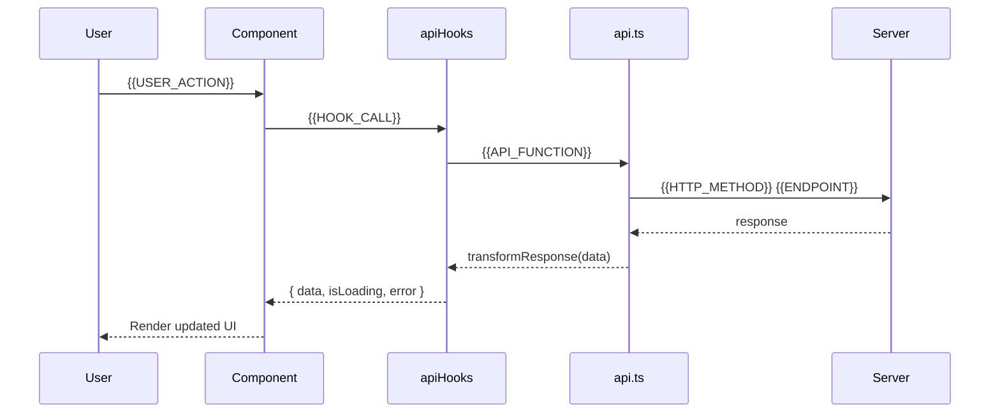

# Feature Flow Diagram: {{FEATURE_NAME}}

> Generated by /feature-from-confluence — B5
> Source: docs/specs/{{FEATURE_NAME}}/processed.md
> Created: {{TIMESTAMP}}

## Main Flow

```mermaid
flowchart LR
    A([🚀 Start: {{TRIGGER}}]) --> B[Step 1: {{STEP_1}}]
    B --> C{{{DECISION_POINT}}?}
    C -->|Yes| D[{{HAPPY_PATH}}]
    C -->|No| E[{{ALTERNATIVE_PATH}}]
    D --> F[{{FINAL_STEP}}]
    E --> F
    F --> G([✅ End: {{END_STATE}}])
```

## Edge Cases

```mermaid
flowchart LR
    A[{{EDGE_TRIGGER}}] --> B{Check condition}
    B -->|Error| C[Error Handler]
    B -->|Empty| D[Empty State]
    B -->|Success| E[Continue]
    C --> F([⚠️ Notify User])
    D --> G([📭 Show Empty State])
```

## API / Data Flow



---

<!-- Checklist for SELF-EVALUATE (B5) -->
<!--
  □ Main flow covers all happy path steps from ACP?
  □ Edge cases cover all error / empty / loading states?
  □ API flow matches spec endpoints?
  □ Diagram is consistent with confirmed scope (B4)?
-->
