# Claude Code Agentic Workflow Kit — Developer's Guide

> **One command. Your spec becomes convention-compliant, PR-ready code — fully automated.**

---

## Table of Contents

0. [Quick Summary — Build a feature in 5 steps](#0-quick-summary--build-a-feature-in-5-steps)
1. [What is this?](#1-what-is-this)
2. [Overall architecture](#2-overall-architecture)
3. [System requirements](#3-system-requirements)
4. [First-time setup](#4-first-time-setup)
5. [Command list](#5-command-list)
6. [Command reference](#6-command-reference)
7. [Troubleshooting](#7-troubleshooting)
8. [Security](#8-security)

---

## Changelog

| Version | Date | Summary |
|---------|------|---------|
| **3.17** | 2026-06-13 | **Release hardening + standalone extraction (external-audit action pass).** Promotes the previously working-tree **Phase H** (feature-index → `INDEX.md`, feature-digest, section-overlap detection, **AUTONOMY** opt-in mode, ownership **Check 3**) to released. **Cross-edition machinery removed** — kit is now Claude Code only: deleted `parity-check*`, the **B12.7** parity step, the EDITION CONFIG cross-edition block, B12.6 Copilot cross-sync (HR16/17/18/24/25/26 rationale repaired). **CI** added (`.github/workflows/workflow-kit-ci.yml` runs `test:kit` on PR); `tsx`/`typescript` declared. **Core now tested**: `memory.test.ts` (resume + CRLF regression) + `regression-corpus.test.ts`; `memory.ts` parser deduped. **Version model**: `version-check.ts` makes `PROMPT_VERSION` the single source of truth (gated in `test:kit`); stamps bumped v3.16 → v3.17. **`.http` single-sourced** via `http-contract.template.md`. New `INTEGRATIONS.md` wiring map. `.env` untracked (rotate credential). Standalone kit extracted to `kit-standalone/`. Detail: [HARDENING-CHANGELOG.md](HARDENING-CHANGELOG.md) §9c. |
| **3.16** | 2026-06-11 | **Anti-rework / output-quality (Change S series)** — **HR32** contract-first (B4 asks REAL/PROVISIONAL/FE_ONLY backend-contract status); **HR33** `data/transform.ts` mapping layer (ban blind casts of raw responses to typed values — only `transform.ts` changes when the real API differs); **HR34** business rules become `utils/` fns + tests, not checklist prose; **HR35** B12 "done" shows true verified ratio + blocks claiming complete while >40% unverified; **new step B12.8** Contract Reconciliation (diff inferred ↔ real contract → `RECONCILE.md`). **HR36** full AC + description test coverage (unit + E2E) enforced by a new machine-checked gate `lint-feature.ts` at B11. PROGRESS DISPLAY redesigned (8 phases + 🛑 gate markers + step counter). `/drop-mock` + `/api-contract` made `transform.ts`-aware. |
| **3.15** | 2026-06-11 | `PUBLIC_PATH` env var support in `playwright-runner.ts` — runner auto-prepends value from `.env.playwright` to every route; no more manual prefix in route arguments. HR27 amended. Fixes blank-page timeout on SPAs with non-root deploy path. |
| **3.14** | 2026-05-20 | HR22 ceiling + anti-sub-element rule (ui_rows ∈ [12,22]); **HR31** `ux-states.json` non-optional at B10 (≥3 states required even when Playwright opted out); `task-type.md` structured evidence table; B5 checklist 5-section requirement. |
| **3.13** | 2026-05-20 | HR30 Playwright pass criterion: 5/5 basic checks = PASS; per-AC extended checks BONUS only. HR22 ui_rows floor re-scan. ProcessAndPublish v3.13 evaluation: **14/14 STRONG PASS**. |
| **3.12** | 2026-05-18 | HR28 golden endpoint file; HR29 naming mirror; HR25 amended (`## Feature Checklist (browser-level)` exact); HR22 Keep Going component + ACT floor. |
| **3.11** | 2026-05-18 | HR23 `/api/admin/` override prevention; HR24 `## ACT —` header prefix; HR22 ACT floor (≥13); HR26 full path in `.full.http`; HR27 dev server public path (later amended v3.15). |
| **3.10** | 2026-05-18 | HR23 URL family priority; HR24 checklist section header lock; HR25 ACCESS_GUIDE.md 6 exact sections; B2.5 design token extraction. |
| **3.9** | 2026-05-19 | Content-determinism guardrails (Change M series) — **HARD RULE 20** URL convention lock (grep canonical `/api/v1/` prefix from `src/**/api.ts`, derive `{resource_id}` param from existing conventions), **HARD RULE 21** REQ row literalness (checklist Requirements 1-to-1 with spec Section 2.1), **HARD RULE 22** UI/ACT row granularity (1 row per spec Section 2.3.3 / 2.3.4 entry). Closes drift D10–D12 measured via same-spec re-run. |
| **3.8** | 2026-05-19 | EDITION CONFIG block, HARD RULE 19 palette relaxation (3–7 colors), image classification i18n EN/VI/JP, `parity-check-semantic.ts`, golden fixture committed, npm scripts `parity-check` / `parity-check:semantic`, BASELINE backup 24h timeout, Copilot browser-use pre-check. See [PARITY_REPORT.md](../archive/PARITY_REPORT.md) for full audit. |
| **3.7** | 2026-05-18 | Parity sync to Copilot v3.7 — Hard Rules 17→18, B0.5 Check 2 (Playwright warning), B11 MCP `verify_feature_route` primary path, **new step B12.7** (auto cross-edition parity check via `parity-check.ts`), `--out` flag added to `parity-check.ts` |
| **3.6** | 2026-05-18 | Visual regression, per-AC verification, image-spec ambiguity scan, accessibility audit, design token extraction (B2.5), cross-edition parity locks |
| **3.5** | 2026-05-17 | UI image context for B10 + Playwright interactions (mock-error, ux-states.json) + B11 sequential |
| **3.4** | 2026-04-29 | Checklist auto-update: `/playwright-verify` + B11 now fill screenshot evidence and tick ✅/❌ in checklist.md |
| **3.3** | 2026-04-29 | Hard Rules correctness fixes; token optimization (~450 tokens saved); P2-GAP audit complete |
| **3.2** | 2026-04-12 | GitHub Copilot support via MCP tools — full B0–B12 parity with Claude Code (except parallel subagents) |
| **3.1** | 2026-04-05 | `/playwright-verify` standalone skill — run Playwright UI verification independently outside the full workflow, with screenshot + auto-fix (3 attempts) |
| **3.0** | 2026-04-05 | Tech stack agnosticism (CLAUDE.md-driven); PKG_MANAGER auto-detect; Playwright opt-in gate (B10.5); Package install step (B9.6); feedback-analyzer `watch_steps` + bilingual keywords |
| 2.0 | 2026-03-28 | Auto-lint hook; B10 via subagent; B11 dual parallel agents; AI-agnostic `BUILD_PROMPT.md` |
| 1.0 | — | Initial release |

### v3.16 changes (2026-06-11) — Anti-rework / output quality (Change S series)

**Problem solved.** Post-completion audit of `AnalyzeData` found the implemented data layer was built against the workflow's *inferred* contract; a SA-approved backend contract that arrived a day later diverged on nearly every axis (URL family, delete semantics, async export, pagination, most field names). 3 implemented endpoints didn't exist in the real contract. Net: ~100% of the data layer would need rewriting on `/drop-mock`. Root causes: inferred contract treated as final, blind response casts to typed values, business rules left as checklist prose, and "Complete" printed with the checklist mostly unverified (UI 9/31, ACT 3/28, UX 0/8).

**Goal:** maximize first-pass quality so little rework is needed after "completed" — and where the backend contract genuinely lands late (parallel FE/BE), make that rework a localized, self-documenting one-file edit.

**Four new HARD RULES + one new step:**

1. **HARD RULE 32 — Contract-first.** B4 asks the backend-contract status, persisted as `contractStatus`. **REAL** → adopt the user-provided contract as golden, copy paths/shapes verbatim at B8.6, skip inference. **PROVISIONAL** → infer as before but stamp `// CONTRACT: PROVISIONAL` and emit `RECONCILE.md`. **FE_ONLY** → unchanged.
2. **HARD RULE 33 — Mapping layer (no blind casts).** Every API response routes through an explicit `mapXxx(raw): Xxx` in `data/transform.ts` (or a zod parse). Blind-casting raw responses to typed values is banned (grep gate = 0). When the real contract differs, only `transform.ts` changes — `types.ts`, hooks, and components stay untouched.
3. **HARD RULE 34 — Business rules are code+test.** Every Business-Rule / display-format checklist row maps to a `utils/` pure function + co-located `.test.ts` (wired into `ux-states.json unit_tests[]`), or an explicit `<!-- enforced-by: BE -->` marker. B11 runs the unit tests.
4. **HARD RULE 35 — Done = verified.** B12 must not print "Complete" while >40% of (UI+ACT) rows are unverified without explicit acknowledgement; the completion box shows true per-section verified ratios and a `browser-unverified: N rows` line when Playwright was opted out.

**New step B12.8 — Contract Reconciliation** *(non-blocking)*: when `contractStatus == PROVISIONAL` and a real contract file is present, diffs the inferred `.full.http` against the real one (path family, method, fields), writes a `RECONCILE.md` drift table, and points at `transform.ts` — report-only, never auto-edits code.

**UI / DX:** PROGRESS DISPLAY redesigned into 8 named phases (INTAKE → LEARN) with 🛑 STOP-gate markers, a current-step header, complexity mode, and a `done / total` progress bar. `/drop-mock` now keeps `transform.ts` + mappers and pre-checks the PROVISIONAL stamp; `/api-contract` reads `transform.ts` to capture true on-the-wire field names. New per-feature files: `data/transform.ts`, `utils/*.ts` + tests.

**HARD RULE 36 + machine enforcement.** Prose rules are now backed by `.claude/integrations/lint-feature.ts` — a pure-Node gate (run at B11, `npm run lint:feature -- <folder> --gate`) that verifies HR33 (no blind cast), HR34 (BR rows → `utils/` tests), HR35 (verified-ratio from the checklist `## Summary`), and **HR36 (every ACT row has a unit or E2E test)**. HR36 requires full coverage of every AC item *and* described behavior: B5 generates the test cases up front, B10 implements, B11 gates, B12 reports `AC <covered>/<total>`. Dogfooded against the existing `analyze-exam` feature (correctly flagged 8 blind casts, AC coverage 75%, verified 20%) — and the run caught and fixed a real over-counting bug in the linter, validating the tool empirically.

**Audit trail**: [.claude/prompt-evolution.md](../../.claude/prompt-evolution.md) "2026-06-11 — v3.15 → v3.16 Output-quality / anti-rework (Change S series)" (Changes S.1–S.11).

**Self-improvement hardening (same release, Phases A–G).** Alongside the Change S output-quality rules, the self-improvement loop ("Sense → Act → Verify") was made deterministic and tamper-evident. SESSION BOOTSTRAP now runs three best-effort pre-flight gates before B0:

- **Step 0.C — amendment advisory** (`improve-trigger.ts`): applies ≤1 soft-constraint lesson from past patterns; can only ADD constraints.
- **Step 0.D — learned config** (`learned-config.ts`): a persistent, **strengthen-only** "Act" store (self-eval threshold, max recoveries, manual-correction budget, required UX states) promoted from *verified* amendments, with replay-model rollback.
- **Step 0.E — regression guard** (`regression-corpus.ts` + `prompt-budget.ts --gate`): replays golden `corpus/*.case.json` cases and ratchets the command-file size budget; **halts** the run on a regression or budget overflow.

Two new machine gates back the prose: **`contract-probe.ts`** structurally diffs the `.http` mock responses against `data/types.ts` (TS compiler API) + `api.ts` return types to catch field drift before `USE_MOCK` flips off; and B11 verdicts + `recoveries` are now **machine-sourced**, not self-reported. Supporting tooling: `friction-meter.ts` (per-run friction score in B12.5), `lesson-registry.ts`, `check-ownership.ts`, `kpi-report.ts` (`npm run workflow:kpis` / `workflow:dashboard`). The whole toolchain has its own self-test suite — `npm run test:kit`.

Full detail (phase-by-phase, file inventory, CLI reference): [docs/claude-commands/HARDENING-CHANGELOG.md](HARDENING-CHANGELOG.md).

---

### v3.9 changes (2026-05-19) — Content-determinism guardrails (Change M series)

**Problem solved.** Schema locks from v3.7/v3.8 (HARD RULES 15–19) constrain *artifact shape* but allow same-spec re-runs to diverge in *artifact content*. Measured drift on `TICKET-001 ProcessAndPublish` (same Confluence page, two clean-room runs of v3.8 skill):

- API endpoint paths: 9/9 different — `/api/v1/resources/{resource_id}/items/{item_id}/...` vs `/api/admin/resources/{resource_id}/items/{item_id}/...`
- `checklist.md` REQ rows: 3 (literal spec) vs 6 (decomposed UI controls into REQs)
- `checklist.md` UI/ACT rows: 14/15 vs 11/10

Net: 2/10 parity categories passed → **80% drift** despite identical schemas. Evidence + reports: [`impl-from-confluence/EVALUATION.md`](../../impl-from-confluence/EVALUATION.md).

**Three new HARD RULES** to make content deterministic:

1. **HARD RULE 20 — URL convention lock.** Before B8.6 writes `.full.http`, grep `src/**/api.ts` and `src/**/data/api.ts` for `/api/v[0-9]+/[a-z-]+` to discover the host repo's canonical prefix. Adopt that prefix + nesting style. NEVER invent a new family like `/api/admin/` if a versioned `/api/v1/` exists. Derive id-param names from existing API conventions in the repo.
2. **HARD RULE 21 — REQ row literalness.** `checklist.md` Requirements MUST be 1-to-1 with spec Section 2.1 Objective (or Requirements) table — same count, same order, light paraphrase only. Tab nav, save buttons, format rules go to UI Verification or ACT, never to REQ. ASSERT `req_rows == spec_objective_count` at B6; mismatch STOPs the gate.
3. **HARD RULE 22 — UI/ACT row granularity.** UI Verification = exactly 1 row per top-level entry in spec Section 2.3.3 Component description (header, tab bar, each named card, each named section, each popup). Sub-elements roll into parent row. ACT = 1 row per spec Section 2.3.4 AC item + 1 unit-test row per display/format rule.

**Audit trail**: [PARITY_REPORT.md §4 D10–D12](../archive/PARITY_REPORT.md#4-drift-cụ-thể-đã-phát-hiện--cách-xử-lý-ở-v38) + [§8 Change M series](../archive/PARITY_REPORT.md#8-changelog-v38-cho-prompt-evolutionmd) + [.claude/prompt-evolution.md](../../.claude/prompt-evolution.md) "2026-05-19 — v3.8 → v3.9 Determinism guardrails" entry.

---

### v3.7 changes (2026-05-18) — Parity sync to Copilot v3.7 + B12.7 cross-edition parity check

**Brings Claude Code edition in lockstep with Copilot v3.7.** Closes 4 drift points between the two editions and adds a new auto-running parity verification step.

**4 drift points fixed in Claude edition:**

1. **Hard Rules expanded 17 → 18** — added rule 7 (`NEVER skip B8.6 API contract generation`) + rule 9 (`NEVER start B10 before B9.6 package install completes`); rule 1 now lists B10.5 in the confirm-gate set; rule 10 enumerates 5 breaking-change categories (added scss-outside-feature explicitly).
2. **B0.5 Check 2 — Playwright install warning** — non-blocking informational check (`npx --no -- playwright --version`). Playwright is still installed on-demand at B10.5; Check 2 is print-only.
3. **B11 Agent B Step 0 — MCP `verify_feature_route` primary** — Agent B brief now calls the MCP tool from `feature-workflow` server as the primary verification path; existing `playwright-runner.ts` steps become enhancement / fallback. If the MCP server is unavailable, Steps 1–6 (Playwright direct) take over automatically.
4. **Version header bump** — `v3.6` → `v3.7` in `.claude/commands/feature-from-confluence.md`.

**New step in both editions: B12.7 — Cross-Edition Parity Check** *(automatic, non-blocking)*

After B12.6 the workflow now auto-detects whether a sibling edition's runtime output exists for the same feature (`docs/components/<FeatureName>-claude/` ↔ `-copilot/`). If found, it invokes `parity-check.ts` to compare palette, checklist stats, ACT pass-rate, and visual-diff count, then writes `docs/components/<FeatureName>/parity-report.md`. Drift > 2% tolerance is tagged `[parity-drift]` in `feedback.log` and `.feedback-history.md`. If no sibling exists, the step skips silently — **never blocks the flow**.

**Updated integration script:**

```bash
# parity-check.ts gains --out flag
npx tsx .claude/integrations/parity-check.ts \
  docs/components/<FeatureName>-claude/ \
  docs/components/<FeatureName>-copilot/ \
  --tolerance 2 \
  --out docs/components/<FeatureName>/parity-report.md
```

Auto-creates parent directories when `--out` points outside cwd. Default behavior (write to `parity-report.md` in cwd) preserved for backwards compatibility with existing manual invocations.

**Updated PROGRESS DISPLAY (both editions):**

```
║  ⬜ B12.5 Feedback     ⬜ B12.6 Improve                   ║
║  ⬜ B12.7 Parity                                          ║
```

**Updated ARTIFACTS.md template:**

Table 2 (Runtime Artifacts) now includes a `parity-report.md` row — only present when B12.7 ran successfully against a sibling edition.

**Audit trail**: see `.claude/prompt-evolution.md` → "2026-05-18 — v3.7 parity sync" entry (Changes K.1–K.5).

---

### v3.6 changes (2026-05-18) — Phase 1 accuracy hardening

**5 accuracy gaps closed** between spec image → implementation → verification:

1. **Visual regression** (Gap #1) — `playwright-runner.ts` extended with `--visual-baseline <png>` and `--visual-baseline-dir <dir>` flags. Per-state baseline diff using `pixelmatch` + `pngjs`. New check `PLAYWRIGHT-007`. Diff images saved to `docs/specs/<FeatureName>/visual-diff/`. New MCP tool `compare_images` (3rd tool in `confluence-mcp` server).
2. **Per-AC verification** (Gap #2) — `ux-states.json` upgraded to **v2 schema**: `states[]` array with `route/steps/baseline/ui_rows/ac_assertions`, plus `negative_states[]` and `unit_tests[]`. Each Playwright ACT row maps to one `ac_assertions[]` entry; each Unit Test row maps to one `unit_tests[]` entry (jest -t pattern). B5 validation rule enforces full mapping (setEquals UI ↔ ui_rows; Playwright ACT ↔ ac_assertions; Unit Test ACT ↔ unit_tests).
3. **Image-spec ambiguity at B4** (Gap #3) — Step 2.5 in B4 scans `image-annotations.md` for region/component count mismatch, untranslated labels, and unmentioned states. Surfaces findings under "Image-spec gaps" group.
4. **Accessibility audit** (Gap #4) — `--audit-a11y` flag injects `@axe-core/playwright`, reports critical/serious violations. New check `PLAYWRIGHT-009`.
5. **Design token extraction** (Gap #5) — **new step B2.5** between B2 and B3. For each UI_SCREENSHOT, Claude uses `Read(image)` to extract palette/typography/spacing into `docs/specs/<FeatureName>/visual-properties.md` with LOCKED schema (4 H2 sections, exactly 5 colors lowercase hex). B10 HARD CONSTRAINTS enforce: every hex in generated `.scss` MUST be in palette, every spacing MUST be in scale, every font-size MUST match a role. Grep self-eval before reporting done.

**New B11 checks**: PLAYWRIGHT-007 (visual diff), PLAYWRIGHT-008 (per-AC), PLAYWRIGHT-009 (a11y), PLAYWRIGHT-010 (CSS computed-style audit vs `visual-properties.md`), PLAYWRIGHT-UI-ROWS, PLAYWRIGHT-UNIT.

**Cross-edition parity locks (Change J)** — HARD RULES 15-17 added:

- Rule 15: verification logic MUST live in shared scripts (`playwright-runner.ts`, MCP server) — never inline in prompt. Both Claude Code v3.6 and Copilot v3.7 invoke same binary → output identical.
- Rule 16: output schemas LOCKED (visual-properties.md 4 sections, ux-states.json v2 enum, checklist summary).
- Rule 17: B2.5 determinism rules (5 colors fixed, lowercase hex, px ascending, 5 typography roles).
- New script `.claude/integrations/parity-check.ts` — compares 2 feature dirs (Claude vs Copilot output), reports drift to `parity-report.md`, exits 0 if parity within tolerance (default 2%).

**New artifacts per feature**:

- `docs/specs/<FeatureName>/visual-properties.md` (B2.5)
- `docs/specs/<FeatureName>/visual-diff/<state>-diff.png` (B11)
- `docs/specs/<FeatureName>/ux-states.json` (B5, v2 schema)
- `parity-report.md` (optional, after parity-check)

**New flags on `playwright-runner.ts`**:

```bash
--visual-baseline <png>      # single baseline (legacy v1)
--visual-baseline-dir <dir>  # baseline dir (v2 ux-states)
--ac-checklist <md>          # update checklist.md per-row
--audit-a11y                 # axe-core scan
--audit-css <visual-props>   # CSS computed-style vs design tokens
--messages-path <messages>   # for i18n:msg_id expected resolution
--visual-diff-threshold <%>  # pixel diff threshold (default 5)
```

---

### v3.5 changes (2026-05-17)

**UI Image Context** — B2 annotates spec images after download (`image-annotations.md`), and B10 now reads the images directly. The implementation subagent globs `docs/specs/<FeatureName>/images/`, reads each file with multimodal vision, and uses what it sees as the authoritative visual spec — layout, button labels, column order. Text annotations from B2 serve as secondary context only. A new MCP tool `read_spec_images` (on the `confluence-mcp` server) lists available image paths for programmatic access.

**Playwright Interactions** — `playwright-runner.ts` gains two new flags: `--mock-error` intercepts all API requests with HTTP 500 to verify the error state renders; `--interactions` runs a declarative `ux-states.json` step script (navigate, click, fill, waitForSelector, screenshot). B11 Agent B now generates `ux-states.json` from spec ACP items + real TSX selectors, then runs playwright-runner three times to verify all 4 UX states with actual browser interactions.

**B11 sequential** — Agent A (static analysis: types, lint) completes before Agent B spawns. Agent B reads the newly written feature TSX to extract accurate selectors for `ux-states.json`, eliminating the race condition that occurred with parallel spawning.

---

### v3.4 changes

**Checklist auto-update integration**

`/playwright-verify` and B11 Agent B now automatically update
`docs/specs/<FeatureName>/checklist.md` after a Playwright run:

- **UI Verification rows**: `screenshot:` fields filled with actual screenshot filename;
  Status updated ⬜ → ✅ / ❌ based on overall Playwright pass/fail
- **ACT rows (tool=Playwright)**: Status + Evidence filled automatically
- **Summary section**: "X / Y passed" counts and Overall line recalculated
- Unit Test rows are intentionally left unchanged (not covered by Playwright)
- If checklist not found: step skipped silently

### v3.3 changes

**1. Hard Rules correctness fixes**

- **Rule #8** corrected: changed "three breaking-change categories" to **four** — added `(d) modifying any file in src/generic/` as an explicit STOP condition during B10. Previously this was enforced in implementation but undocumented in the rule list.
- **Rule #14 added**: `NEVER scan full src/ at B0` — BASELINE detection must scope to `src/**/api.ts`, `src/<feature-name>/`, and targeted `*.tsx` grep only. Prevents context bloat on large repos. Formalizes a constraint that already existed in AGENT_SPEC.md but was missing from the command's Hard Rules.
- **PROGRESS DISPLAY step list** extended to include `B12.5` and `B12.6`, which were previously omitted from both the step list and the ASCII progress box.

**2. Token optimization (~450 tokens saved, -1.7%)**

Five targeted compressions with no behavior change:

- **SESSION BOOTSTRAP Step 0** extraction instructions: 3-column markdown table (8 rows) → compact `key → search-term` bullet list. Same semantics, less whitespace overhead.
- **STOP gate boilerplate** standardized: five occurrences of the two-line `**STOP — Do not generate... Wait for user...**` block across B4/B6/B6.5/B8/B9 replaced with single-line `> **STOP GATE — no output, wait for user response.**`
- **B8.6 endpoint signal table**: shortened verbose Vietnamese cell descriptions while keeping all inference rules intact.
- **B3 Lens 3 (Superpower)**: replaced hardcoded `React 18, TanStack Query v5, Paragon, src/generic/ utilities` with dynamic `STACK_DESCRIPTION, PROJECT_CTX.shared_components_path` — now tech-stack agnostic, consistent with the SESSION BOOTSTRAP values already extracted.
- **B2 download strategy**: merged three separate subsections (Confluence / Figma / Generic) into a single 3-row strategy table with `Attempt 1 | 2 | 3` columns.

**3. P2-GAP audit complete**

All 9 planned Phase 2 gaps verified as implemented. A status table has been added to `docs/archive/feature-from-confluence-upgrade-plan.md`. P2-GAP-08 (figma MCP) deferred as optional.

### v3.2 changes

**1. `feature-workflow` MCP server** — New MCP server at `.claude/mcp-workflow/` exposes four tools: `save_workflow_context`, `load_workflow_context`, `verify_feature_route`, `analyze_feedback_patterns`. Each tool wraps the corresponding integration script (`memory.ts`, `playwright-runner.ts`, `feedback-analyzer.ts`) so Copilot can call them as native MCP tools instead of shell commands.

**2. `.vscode/mcp.json`** — Registers both MCP servers (`confluence-mcp` + `feature-workflow`) for VS Code and GitHub Copilot. VS Code auto-starts the servers when the file is detected. No manual configuration needed.

**3. GitHub Copilot prompt updated** — `.github/prompts/feature-from-confluence.prompt.md` now calls MCP tools directly (B0 → `fetch_confluence_page`, B4/B6/B8/B9 → `save_workflow_context`, B11 → `verify_feature_route`, SESSION BOOTSTRAP → `analyze_feedback_patterns`). Replaced `runCommands` shell calls and `#fetch` Confluence workaround.

**4. Copilot parity** — Copilot now has the same Confluence fetch quality as Claude Code (HTML→Markdown, image extraction, auto-save to `docs/specs/`). Remaining differences: B10/B11 run sequentially (no parallel subagents), PostToolUse auto-lint not available.

### v3.0 changes

**1. Tech stack agnosticism** — The workflow now reads `CLAUDE.md` to detect your framework (React / Vue / Angular), HTTP client, response transform, and import alias. B10 agent prompt is no longer hardcoded to React — it uses dynamic values from `CLAUDE.md`. If `CLAUDE.md` is missing, `/init` is suggested and the workflow resumes automatically after generation.

**2. Package manager auto-detection** — SESSION BOOTSTRAP detects `npm` / `yarn` / `pnpm` / `bun` from lockfiles. All install commands (B9.6, B11 Playwright) use the detected manager — no more hardcoded `npm install`.

**3. Playwright is now opt-in (B10.5)** — After implementation (B10), a new confirm gate asks whether to run UI verification. B0.5 pre-flight checks simplified to git status only. No need to install Playwright before starting — Claude installs it when (and only if) you choose Yes.

**4. Package install step (B9.6)** — New automatic step between git pull (B9.5) and implementation (B10). Reads the dependency list from B7, checks what's already in `package.json`, and installs only the new packages using the detected package manager. Peer conflict handling included.

**5. Package selection logic (B7)** — When a feature needs charts, date pickers, or other capabilities, B7 now scans `package.json` for existing packages, checks CLAUDE.md for preferred choices, and recommends framework-appropriate defaults. Stops to ask user only when genuinely ambiguous.

**6. feedback-analyzer.ts fixes** — Added missing `watch_steps` field to `Pattern` interface (was referenced by the workflow but missing from output). Added bilingual Vietnamese keywords to user feedback clustering. Fixed gate revision threshold to frequency-based (≥25%) to avoid false positives. Added two new patterns: `b9_6_install_fail` and `pkg_manager_conflict`.

**7. Portability guide** — New `.claude/SETUP.md` explains how to copy this workflow kit to any project, including tech stack detection, PKG_MANAGER setup, and the feedback loop.

### v2.0 changes

**1. Auto-lint hook** — `.claude/settings.local.json` now contains a `PostToolUse` hook that runs `npm run lint:fix` automatically after every write to `.ts/.tsx/.js/.jsx/.scss` files during B10. No extra configuration — already active.

**2. B10 — implementation via subagent** — B10 now delegates implementation to an isolated subagent spawned via the `Agent` tool. Claude builds a self-contained brief from `context-summary.md`, `processed.md`, and `steps.md`, then spawns the subagent. Keeps the main context window clean during heavy implementation work. STOP conditions: deleting a file, changing DB schema, modifying a shared file in `src/generic/`, or renaming a shared symbol.

**3. B11 — two parallel agents** — B11 now sends Agent A (static analysis: `npm run types/lint`) and Agent B (UI verification: Playwright → browser-use → unit tests) in a **single parallel message**. Previously they ran sequentially. Cuts B11 wall-clock time roughly in half.

**4. AI-agnostic `BUILD_PROMPT.md`** — The meta-prompt for rebuilding this command now exports output formats for GitHub Copilot (`.github/prompts/*.prompt.md`), Cursor (`.cursor/rules/*.mdc`), and generic AI tools, not just Claude Code. See `BUILD_PROMPT.md` at the project root.

**5. ★6 LEARN — Level 8: pattern clustering** — `feedback-analyzer.ts` parses `docs/specs/.feedback-history.md` and clusters failure patterns by type and frequency (e.g. "B11 Agent A failed in 4/8 runs — HIGH"). SESSION BOOTSTRAP calls the analyzer at startup; B3 Feedback Lens uses the structured output to target adjustments at specific steps. No raw-text reading.

**6. ★6 LEARN — Level 9: self-rewriting prompt** — After B12.5, if ≥5 runs exist and at least one pattern hits ≥30% frequency, B12.6 proposes specific amendments to `.claude/commands/feature-from-confluence.md`. User reviews each proposal one at a time and approves, skips, or modifies. Applied changes are logged to `.claude/prompt-evolution.md`.

---

## 0. Quick Summary — Build a feature in 5 steps

> For anyone who wants to start immediately without reading the full docs.

### What does this tool do?

**FORGE** is an agentic development engine — it **reads your spec** (Confluence / PDF / Word), orchestrates 13 automated steps across parallel subagents, and **delivers convention-compliant, PR-ready code** — without you explaining the rules every time.

You provide the link, answer 4 questions, type `yes` — Claude does the rest.

---

### 5 steps to get code

| Step | What you do | What Claude does |
| --- | --- | --- |
| **1** | Copy your Confluence spec link (or path to a PDF / Word file) | — |
| **2** | Type `/feature-from-confluence <link>` in the Claude Code chat | Reads spec, detects task type |
| **3** | Answer the questions at Gate B4 (scope confirmation) | Analyses spec, creates diagram + plan |
| **4** | Review diagram/plan at B6 and B8, type `yes` to continue | Prepares implementation |
| **5** | Type `yes` at Gate B9 (final confirm) — **ONLY `yes` / `y` / `confirm` accepted** | Writes code, installs packages (B9.6) |
| **6** | Choose [Yes / No] when Claude asks about Playwright (Gate B10.5) | Installs Playwright if needed, runs UI verification; or skips to static analysis only |

> Estimated time: **10–30 minutes** depending on feature complexity.

---

### The 4 confirm gates where Claude stops and waits

```
GATE B4   — Scope confirmation
            Claude asks: "Does this feature include...?"
            You answer / clarify / add missing context

GATE B6   — Review 3 output files
            Claude asks: "Are the diagram, steps, and checklist correct?"
            Type "yes" to proceed — or give feedback to revise

GATE B8   — Review implementation plan
            Claude asks: "Is this implementation plan correct?"
            Type "yes" to proceed — or request adjustments

GATE B9   — Final trigger (code will be written)
            Claude asks: "Ready to implement?"
            ONLY accepted: yes / y / confirm
            "ok", "sure", "go ahead" are intentionally rejected

GATE B10.5 — Playwright opt-in (after implementation)
            Claude asks: "Run UI verification with Playwright?"
            [Yes] — Claude installs Playwright if missing, runs full B11 (static + headless browser: 4 UX states)
            [No]  — Skip UI testing, run static analysis only (types + lint)
```

---

### If something goes wrong

| Situation | How Claude handles it |
| --- | --- |
| Verify step fails | Retries automatically up to **3 times** before asking you |
| Session interrupted (closed tab, power cut) | Re-run with the same link — Claude resumes from the last confirmed gate |
| Mistyped at B9 | Just type `yes` — Claude ignores invalid responses and waits |
| Confluence returns 401 | Check `.claude/mcp-server/.env` — `CONFLUENCE_USER` must not include the domain suffix (e.g. `@company.com`) |

---

## 1. What is this?

This is the **FORGE Agentic Workflow Kit** — built on Claude Code, a set of tools that **automate the full feature development lifecycle** — from receiving a Confluence spec to having PR-ready code — following the conventions defined in `CLAUDE.md`.

**Why "agentic":** The main command (`/feature-from-confluence`) acts as an *orchestrator* that spawns sub-agents at runtime — B10 delegates implementation to an isolated `Agent` tool call, and B11 spawns two parallel `Agent` calls (Agent A: static analysis, Agent B: Playwright UI verification). This orchestrator + sub-agents pattern is what makes it an *agentic* workflow, not just a prompt or chat assistant.

**Kit component taxonomy:**

| Type | What it is | Files |
|------|-----------|-------|
| **Custom slash commands** | Prompt instruction files (`.md`) that Claude Code executes step-by-step when you type `/command-name` | `.claude/commands/*.md` |
| **MCP Servers** | Node.js processes that expose tools Claude can call natively (Confluence fetch, context save, route verify) | `.claude/mcp-server/`, `.claude/mcp-workflow/` |
| **Integration scripts** | Standalone TypeScript/Python scripts invoked via shell during command execution | `.claude/integrations/*.ts`, `*.py` |

The three types work together: a slash command orchestrates the flow, calls MCP tools for external data, and shells out to integration scripts for verification.

The toolset consists of these three components working together:

**Slash Commands** — typed directly into the Claude Code chat. Each command is a pre-defined workflow that Claude executes step-by-step without needing to re-explain project conventions each time.

**MCP Server** (`confluence-mcp`) — a Node.js process running in the background that lets Claude call the Confluence REST API. Fetches page content (text + UI screenshots) and saves raw markdown to `docs/specs/`.

**Integration Scripts** (`.claude/integrations/`) — helper scripts invoked during the `/feature-from-confluence` workflow for UI verification, context persistence, and browser-based testing.

**`BUILD_PROMPT.md`** (project root) — AI-agnostic meta-prompt for rebuilding the `/feature-from-confluence` command from scratch. Outputs formats for Claude Code, GitHub Copilot, Cursor, and generic AI tools.

**Typical feature lifecycle:**

```
/feature-from-confluence <url>   ← fetch spec, detect task type, scaffold + verify
        ↓ (implement remaining UI)
/api-contract <folder>           ← regenerate .http file if needed
        ↓ (backend API is ready)
/drop-mock <api.ts>              ← remove mock, connect to real API
        ↓
/codex-review                    ← review full branch before opening PR
```

---

## 2. Overall architecture

```
your-project/
│
├── .mcp.json                              ← Registers MCP server with Claude Code (legacy)
├── .vscode/
│   └── mcp.json                           ← Registers both MCP servers for VS Code / GitHub Copilot
├── .github/
│   ├── agents/                            ← Copilot agent definitions (full content)
│   │   ├── feature-from-confluence.agent.md
│   │   ├── playwright-verify.agent.md
│   │   ├── new-feature.agent.md
│   │   ├── drop-mock.agent.md
│   │   ├── api-contract.agent.md
│   │   └── codex-review.agent.md
│   └── prompts/                           ← thin wrappers (agent: <name> only, 3 lines each)
│       ├── feature-from-confluence.prompt.md
│       ├── playwright-verify.prompt.md
│       └── ... (6 total)
│
├── .claude/
│   ├── SETUP.md                           ← Portability guide — how to copy this kit to any project
│   ├── settings.local.json                ← PostToolUse hook: auto-lint on Write/Edit (B10)
│   │
│   ├── commands/                          ← Slash Command definitions
│   │   ├── feature-from-confluence.md     ← /feature-from-confluence (B0–B12 flow)
│   │   ├── playwright-verify.md           ← /playwright-verify (standalone UI verification)
│   │   ├── new-feature.md                 ← /new-feature
│   │   ├── drop-mock.md                   ← /drop-mock
│   │   ├── api-contract.md                ← /api-contract
│   │   └── codex-review.md                ← /codex-review
│   │
│   ├── integrations/                      ← Helper scripts for /feature-from-confluence
│   │   ├── playwright-runner.ts           ← UI smoke test via Playwright CLI (B11 Agent B)
│   │   ├── browser-use-wrapper.py         ← Complex flow verification via browser-use (B11 Agent B)
│   │   ├── memory.ts                      ← Context persistence (save/load/clear) (B4/B6/B8/B9)
│   │   ├── feedback-analyzer.ts          ← Pattern clustering on feedback history (★6 L8)
│   │   ├── lint-feature.ts               ← Compliance + AC-coverage gate (HR33/34/35/36) (v3.16)
│   │   └── eval-feature.ts               ← Quality scorecard + regression harness (v3.16)
│   │
│   └── prompt-evolution.md               ← Audit log of self-rewriting changes (★6 L9)
│   │
│   ├── templates/                         ← Output file templates for B5
│   │   ├── diagram.template.md            ← Mermaid flow diagram template
│   │   ├── steps.template.md              ← Implementation steps template
│   │   └── checklist.template.md          ← ACP verification checklist template
│   │
│   ├── mcp-server/                        ← confluence-mcp MCP (Confluence fetch + images)
│   │   ├── index.ts                        ← Server + fetch_confluence_page tool
│   │   ├── package.json
│   │   ├── .env                            ← Credentials (gitignored)
│   │   └── .env.example                   ← Template (committed)
│   │
│   └── mcp-workflow/                      ← feature-workflow MCP (wraps integration scripts)
│       ├── index.ts                        ← save/load context, verify route, analyze feedback
│       └── package.json
│
└── docs/
    ├── claude-commands/                   ← This documentation
    ├── specs/                             ← Auto-generated during /feature-from-confluence
    │   ├── <title>.md                     ← Raw spec (MCP Server — flat, do not edit)
    │   ├── .current-feature               ← Pointer to active feature (for session resume)
    │   └── <FeatureName>/                 ← Per-feature subfolder (Option B)
    │       ├── processed.md               ← Boilerplate-stripped spec (B1)
    │       ├── diagram.md                 ← Mermaid flow diagram (B5)
    │       ├── steps.md                   ← Implementation steps (B5)
    │       ├── checklist.md               ← ACP verification checklist (B5)
    │       ├── context-summary.md         ← Session state / resume point (B4/B6/B8/B9)
    │       ├── task-type.md               ← LEGACY / BASELINE / NEW detection result (B0)
    │       ├── images/                    ← Downloaded Confluence attachments (B2)
    │       ├── screenshots/               ← Playwright screenshots (B11)
    │       ├── recovery.log               ← Self-recovery attempts log
    │       ├── reflection.log             ← Self-evaluation scores log
    │       └── feedback.log               ← Run metrics + user feedback (B12.5)
    ├── .feedback-history.md           ← Global cross-feature feedback, last 10 runs (B12.5)
    └── components/
        └── <feature>/
            └── <Feature>.http             ← API contract
```

### Data flow for `/feature-from-confluence`

```
User types: /feature-from-confluence <input>
        │
        ▼
[ARG VALIDATION]
  Empty input?        → ❌ show usage, STOP
  Unknown file type?  → ❌ show error, STOP
  Detect INPUT_TYPE:
        ├── confluence (http...)
        ├── pdf       (*.pdf)
        └── word      (*.docx / *.doc)
        │
        ▼
[SESSION BOOTSTRAP]  ← check docs/specs/context-summary.md for resume
        │
        ▼
[B0 — Load Spec + Task Type Detection]
  ┌─────────────────────────────────────────────┐
  │  Branch by INPUT_TYPE                       │
  │  confluence → fetch_confluence_page MCP     │
  │  pdf        → Read tool (chunked)           │
  │  word       → pandoc → mammoth → raw XML    │
  └──────────────┬──────────────────────────────┘
                 │  All branches write docs/specs/<title>.md
                 ▼
  [CONVERGENCE] docs/specs/<title>.md exists ✅
                 │
  Scan src/**/messages.ts + grep <iframe
        │
        ├── LEGACY   → stop, notify iframe location
        ├── BASELINE → ask: change endpoint only OR full flow?
        └── NEW ─────────────────────────────────────────────┐
                                                             ▼
                                          ┌──────────────────────────────┐
                                          │  B1 + B2 + B3 in PARALLEL   │
                                          │  B1: read docs/specs/<t>.md │
                                          │  B2: download images        │
                                          │  B3: WebFetch Superpower    │
                                          └──────────────────────────────┘
                                                             │
                                          [DYNAMIC DECOMPOSE — skip/merge steps]
                                                             │
                                          [B4 STOP GATE — Confirm scope with user]
                                                             │
                                          memory.ts save scope_confirmed
                                                             │
                                          [B5 — Create 3 files in PARALLEL]
                                          diagram.md + steps.md + checklist.md
                                                             │
                                          [B6 STOP GATE — Confirm 3 files]
                                                             │
                                          [B7 — Implementation plan]
                                                             │
                                          [B8 STOP GATE — Confirm plan]
                                                             │
                                          [B8.5 — Auto conflict check]
                                                             │
                                          [B9 STOP GATE — Final confirm (yes/y/confirm only)]
                                                             │
                                          [B9.5 — git pull origin develop]
                                                             │
                                          [B9.6 — Auto package install (PKG_MANAGER)]
                                          [  installs new deps from B7 plan           ]
                                                             │
                                          [B10 — Spawn implementation subagent]
                                          [  auto-lint hook fires on each Write/Edit  ]
                                                             │
                                          [B10.5 STOP GATE — Playwright opt-in?]
                                          [  Yes → check/install Playwright            ]
                                          [  No  → Agent B skipped                    ]
                                                             │
                                          ┌──────────────────────────────┐
                                          │  B11 — Agent A (always)     │
                                          │  Agent A: types+lint         │
                                          │  Agent B: playwright-runner  │
                                          │  (only if B10.5 = Yes)       │
                                          └──────────────────────────────┘
                                                             │
                                          [B12 — Done + dev server]
                                                             │
                                          [B12.5 — ★6 LEARN L8]
                                          [  auto-log metrics → feedback.log          ]
                                          [  ask user (optional) → .feedback-history  ]
                                                             │
                                          [B12.6 — ★6 LEARN L9 (if ≥5 runs + HIGH)] 
                                          [  feedback-analyzer → cluster patterns      ]
                                          [  propose amendments → user approves each   ]
                                          [  apply to command file → prompt-evolution  ]
```

### Full flow diagram (with error handling)

```mermaid
flowchart TD
    START(["/feature-from-confluence input"]) --> ARG{Input valid?}
    ARG -->|"Empty or unknown type"| STOP1(["STOP: show error + usage"])
    ARG -->|"http... (Confluence URL)"| FETCH["MCP: fetch_confluence_page"]
    ARG -->|".pdf"| READPDF["Read tool: chunk PDF"]
    ARG -->|".docx / .doc"| WORD["pandoc → mammoth → XML"]

    FETCH --> SPEC["docs/specs/title.md created"]
    READPDF --> SPEC
    WORD --> SPEC

    SPEC --> BOOT{"context-summary.md\nexists?"}
    BOOT -->|"Yes — offer resume"| RESUME(["Resume from last gate"])
    BOOT -->|"No"| B0["B0: scan src/ messages.ts\ngrep iframe (exclude figma)"]

    B0 --> DETECT{"Task type?"}
    DETECT -->|"LEGACY"| STOP2(["STOP: notify iframe location"])
    DETECT -->|"BASELINE"| ASK(["Ask: endpoint-only\nOR full flow?"])
    DETECT -->|"NEW"| PARALLEL1

    subgraph PARALLEL1 ["B1 + B2 + B3 (in parallel)"]
        B1["B1: processed.md\n+ Dynamic Decompose"]
        B2["B2: download images"]
        B3["B3: WebFetch SpecKit"]
    end

    PARALLEL1 --> B4(["GATE B4: confirm scope\n(Claude stops, waits for answers)"])
    B4 --> B5FILES

    subgraph B5FILES ["B5 — 3 files (in parallel)"]
        FD["diagram.md"]
        FS["steps.md"]
        FC["checklist.md"]
    end

    B5FILES --> B6{"GATE B6:\napprove files?"}
    B6 -->|"feedback"| B5FILES
    B6 -->|"yes"| B7["B7: write implementation plan"]

    B7 --> B8{"GATE B8:\napprove plan?"}
    B8 -->|"feedback"| B7
    B8 -->|"yes"| B85["B8.5: conflict check\ngit diff + npm + migrations"]

    B85 -->|"no conflicts"| B9{"GATE B9:\nfinal confirm"}
    B85 -->|"conflict found"| WARN(["Notify user — wait for input"])
    WARN --> B9

    B9 -->|"ok / sure / go ahead\n(rejected)"| B9
    B9 -->|"yes / y / confirm"| B95["B9.5: git pull origin develop"]

    B95 --> B96["B9.6: Install new packages\n(PKG_MANAGER add ...)"]
    B96 --> B10["B10: Spawn implementation subagent\n(auto-lint hook fires on each write)"]
    B10 --> B105{"B10.5 GATE:\nRun Playwright?"}
    B105 -->|"Yes"| PWINSTALL["Install Playwright\n(if missing)"]
    B105 -->|"No"| B11VERIFY
    PWINSTALL --> B11VERIFY

    subgraph B11VERIFY ["B11 — Agent A always; Agent B only if B10.5=Yes"]
        LINT["Agent A: npm run types\n+ lint\nauto-fix up to 3×"]
        PW["Agent B: playwright-runner.ts\n→ browser-use-wrapper.py\n→ unit tests\n(skipped if No at B10.5)"]
    end

    B11VERIFY --> PASS{"All checks\npass?"}
    PASS -->|"yes"| B12(["B12: Done\ndev server started"])

    PASS -->|"fail"| R1["Self-recover attempt 1\nanalyze + fix"]
    R1 --> P2{"Pass?"}
    P2 -->|"yes"| B12
    P2 -->|"fail"| R2["Self-recover attempt 2"]
    R2 --> P3{"Pass?"}
    P3 -->|"yes"| B12
    P3 -->|"fail"| R3["Self-recover attempt 3"]
    R3 --> P4{"Pass?"}
    P4 -->|"yes"| B12
    P4 -->|"fail"| HUMAN(["Ask user for help\n(show recovery.log)"])

    style STOP1 fill:#f88,color:#000
    style STOP2 fill:#f88,color:#000
    style B4 fill:#ffe066,color:#000
    style B6 fill:#ffe066,color:#000
    style B8 fill:#ffe066,color:#000
    style B9 fill:#ffe066,color:#000
    style B105 fill:#ffe066,color:#000
    style B12 fill:#6f6,color:#000
    style HUMAN fill:#f88,color:#000
    style RESUME fill:#6af,color:#000
```



> **Color key:** Yellow = confirm gate (Claude stops and waits) | Green = success | Red = blocked/error | Blue = resume path

---

## 3. System requirements

| Tool | Minimum | Used for |
|------|---------|---------|
| Claude Code (CLI or VS Code Extension) | Latest | Running commands, MCP communication |
| Node.js | v18+ | MCP Server + integration scripts |
| npm | v8+ | MCP Server dependencies |
| Package manager | auto-detected | Installing packages (npm / yarn / pnpm / bun — detected from lockfile) |
| Python | 3.9+ | `browser-use-wrapper.py` (optional) |
| Playwright | opt-in (B10.5) | `playwright-runner.ts` UI verification — installed only if you choose Yes at B10.5, or auto-installed on first `/playwright-verify` run |

> **Playwright and browser-use are opt-in.** After implementation, Claude asks whether to run UI verification (B10.5). If you choose No, only static analysis runs. No need to install Playwright before starting.

---

## 4. First-time setup

### Step 1 — Install MCP server dependencies

```bash
cd .claude/mcp-server
npm install
```

### Step 2 — Create credentials file

```bash
cp .claude/mcp-server/.env.example .claude/mcp-server/.env
```

Open `.claude/mcp-server/.env` and fill in:

```env
# IMPORTANT: Use username WITHOUT domain suffix
# Correct:  your-username
# Wrong:    your-username@company.com  (returns 401)
CONFLUENCE_USER=your_username
CONFLUENCE_PASS=your_password
```

> `.env` is gitignored and will **never be committed**.

**Playwright and browser-use install on demand** — after implementation (B10), Claude will ask whether to run UI verification. If you choose Yes, Claude installs Playwright using your project's package manager. No need to install upfront.

### Step 3 — Verify auto-lint hook (no action needed)

The `PostToolUse` hook that runs `npm run lint:fix` after every `.ts/.tsx/.js/.jsx/.scss` write is already configured in `.claude/settings.local.json`. No setup required — it activates automatically when Claude Code loads.

To confirm it is active: open `/hooks` in the Claude Code chat and look for the `Write|Edit` matcher under `PostToolUse`.

### Step 4 — Restart Claude Code

Restart so Claude Code reads `.mcp.json` and starts the `confluence-mcp` MCP server. When prompted **"Approve MCP server confluence-mcp?"** → select **Allow**.

### Step 4.5 — GitHub Copilot setup (optional)

If you use GitHub Copilot instead of Claude Code, the same workflow runs via MCP tools. Skip this step if using Claude Code only.

**Requirements:** VS Code 1.99+ · GitHub Copilot Business or Enterprise

1. The file `.vscode/mcp.json` is already committed — VS Code will detect it automatically
2. Open VS Code — it prompts **"Start MCP server feature-workflow?"** and **"Start MCP server confluence-mcp?"** → select **Allow** for both
3. Open Copilot Chat → select **Agent mode**
4. Type: `/feature-from-confluence https://your-confluence-page`

The other 5 agents work the same way: `@playwright-verify /your/route`, `@new-feature Description`, `@drop-mock src/path/api.ts`, `@api-contract src/path/feature`, `@codex-review` (no argument).

Confluence credentials: same `.claude/mcp-server/.env` file used by Claude Code.

| Capability | Claude Code | GitHub Copilot |
|-----------|------------|----------------|
| Confluence fetch (auto-auth + images) | ✅ MCP tool | ✅ MCP tool (same) |
| Session context persistence | ✅ MCP tool | ✅ MCP tool (same) |
| Playwright UI verification | ✅ MCP tool | ✅ MCP tool (same) |
| Feedback pattern analysis | ✅ MCP tool | ✅ MCP tool (same) |
| B10/B11 parallel subagents | ✅ Yes | ❌ Sequential |
| PostToolUse auto-lint hook | ✅ Yes | ❌ Lint at B11 only |

### Step 5 — Verify

Type `/` in Claude Code chat — these commands must appear:

- `/feature-from-confluence`
- `/new-feature`
- `/drop-mock`
- `/api-contract`
- `/codex-review`

### Step 6 — Playwright auth (localStorage injection)

Playwright runs in its own isolated browser context and cannot share your existing login session. The app's auth service (`YourAuthService`) reads `access_token` and `refresh_token` from `localStorage` — if missing, it immediately redirects to the logout page.

**One-time setup (redo when your session expires):**

1. Open DevTools on the tab where you are already logged in at `http://localhost:3000/...`

2. Go to the **Console** tab and run:

   ```js
   JSON.stringify({a: localStorage.access_token, r: localStorage.refresh_token, e: localStorage.token_expires_at})
   ```

3. Copy the three values and fill them into `.env.playwright` (project root):

   ```env
   # Dev server base URL (default: http://localhost:3000)
   DEV_SERVER_URL=http://localhost:3000

   # PUBLIC_PATH of this app — runner auto-prepends to every route.
   # Change to /authoring/ or /studio/ as needed; remove if app served at root.
   PUBLIC_PATH=/your-app/

   # Auth tokens
   PLAYWRIGHT_ACCESS_TOKEN=<value of "a">
   PLAYWRIGHT_REFRESH_TOKEN=<value of "r">
   PLAYWRIGHT_TOKEN_EXPIRES_AT=<value of "e">
   ```

`.env.playwright` is gitignored — tokens are never committed.

> **`PUBLIC_PATH` is required for non-root SPAs.** Without it, React Router cannot match routes → blank page → all `waitForSelector` calls time out. If you see PLAYWRIGHT-005 body text = 0 chars, check this value first.
>
> **When tokens expire:** Playwright will start redirecting to the logout page again (body text ≈ 137 chars, URL ends in `/logout`). Repeat the three steps above to refresh the values.

---

## 5. Command list

| Command | Type | Purpose | Argument |
|---------|------|---------|---------|
| **FORGE** `/feature-from-confluence` | Command + MCP + Scripts | **13-step agentic pipeline** — spec → PR-ready code, fully automated (B0–B12) | Confluence URL, PDF path, or Word path |
| `/playwright-verify` | Command only | Standalone Playwright UI verification — screenshot + auto-fix (3 attempts) | Route (+ optional `--feature-name` / `--folder`) |
| `/new-feature` | Command only | Plan a feature from description or local spec | Description (+ optional `\| spec: path`) |
| `/drop-mock` | Command only | Remove mock infrastructure from `api.ts` | Path to `data/api.ts` |
| `/api-contract` | Command only | Generate `.http` contract from existing code | Path to feature folder |
| `/codex-review` | Command only | Review branch against 10 CLAUDE.md criteria | None |

---

## 6. Command reference

---

### FORGE — `/feature-from-confluence <input>`

> *Feature Orchestration & Release Generation Engine*
> *13-step agentic pipeline · 5 confirm gates · parallel subagents · self-healing · self-learning*

**Type:** Custom Command + MCP Tool + Integration Scripts

**Use when:** You have a spec (Confluence page, PDF, or Word file) and want to implement a feature end-to-end.

**Syntax:**
```
# Confluence URL
/feature-from-confluence https://your-confluence.example.com/conf/spaces/.../pages/<PAGE_ID>/...

# PDF file
/feature-from-confluence docs/specs/my-feature.pdf
/feature-from-confluence C:/Users/me/Downloads/spec.pdf

# Word file
/feature-from-confluence docs/specs/my-feature.docx
/feature-from-confluence C:/Users/me/Downloads/spec.docx
```

Calling without an argument, or with an unrecognised file type, prints a usage error and stops — no flow is run.

**Input processing (all converge to `docs/specs/<title>.md` before B1):**

| Input type | Converter | Output |
|------------|-----------|--------|
| Confluence URL | `fetch_confluence_page` MCP tool | `docs/specs/<title>.md` |
| PDF file | `Read` tool (native PDF support, chunked for >10 pages) | `docs/specs/<title>.md` |
| Word file | `pandoc` → `mammoth` → raw XML fallback | `docs/specs/<title>.md` |

B1 onward reads only `docs/specs/<title>.md` — it does not know or care about the original input source.

**B0–B12 flow:**

| Step | Who | Action | User input? |
|------|-----|--------|-------------|
| ARG VALIDATION | Claude | Validate input, detect type (confluence / pdf / word) | — |
| Bootstrap | memory.ts | Check `context-summary.md` — offer to resume session | Only if resuming |
| B0 | Claude / MCP | Load spec → convert to `docs/specs/<title>.md`; detect LEGACY / BASELINE / NEW | Always — confirm detection |
| B1 | Claude | Read `docs/specs/<title>.md`, create `processed.md`, Dynamic Decompose | — |
| B2 | Claude | Batch download images to `docs/specs/images/` (skip if no UI) | — |
| B3 | Claude | WebFetch Superpower / browser-use / claude-mem, apply 3 lenses | — |
| B4 | Claude | **STOP** — Confirm scope (dynamic questions from lenses) | **Required** |
| B5 | Claude | Create diagram + steps + checklist in parallel (from templates) | — |
| B6 | Claude | **STOP** — Confirm 3 output files | **Required** |
| B7 | Claude | Write implementation plan using Superpower lens | — |
| B8 | Claude | **STOP** — Confirm plan | **Required** |
| B8.5 | Claude | Auto conflict check: git + npm + migrations | Only if blocked |
| B9 | Claude | **STOP** — Final confirm (`yes` / `y` / `confirm` only) | **Required** |
| B9.5 | Claude | `git pull origin develop` | Only if blocked |
| B9.6 | Claude | Auto-install new packages from B7 plan using detected PKG_MANAGER; handles peer conflicts | Only if peer conflict |
| B10 | Agent tool | Spawn implementation subagent (auto-proceed); STOP conditions: delete file, DB schema change, `src/generic/` modification, rename shared symbol | Only for STOP conditions |
| B10.5 | Claude | **STOP** — Playwright opt-in: run UI verification? [Yes / No] | **Required** |
| B11 | 2 parallel agents | Agent A (static analysis: `npm run types/lint`) always runs; Agent B (UI verification: Playwright → browser-use → unit tests) only runs if B10.5 = Yes — Agent B logic also available standalone as `/playwright-verify` | Only if 3 recoveries fail |
| B12 | Claude | Final self-evaluate, print completion box, start dev server | — |
| B12.5 | Claude (★6 LEARN) | Auto-log run metrics to `feedback.log` + `.feedback-history.md`; optionally collect user feedback | Optional |
| B12.6 | Claude (★6 LEARN L9) | If ≥5 runs and HIGH-priority pattern exists: propose specific amendments to the command file; user reviews each one | Only when conditions met |

**The 5 confirm gates:**

```
B4    — Scope questions (dynamic, generated from spec analysis)
        → Claude STOPS and waits for your answers

B6    — Review 3 output files (diagram / steps / checklist)
        → Say "yes" to continue or give feedback to revise

B8    — Review implementation plan
        → Say "yes" to continue or request adjustments

B9    — Final confirm before any code is written
        → ONLY "yes", "y", or "confirm" (case-insensitive) accepted
        → "ok", "sure", "go ahead" are NOT accepted

B10.5 — Playwright opt-in (after implementation)
        → [Yes] run headless browser verification (installs Playwright if missing)
        → [No] skip UI testing, static analysis only
```

**Output files created:**

```
docs/specs/
  <title>.md                  ← raw spec (MCP Server, do not edit)
  .current-feature            ← pointer to active feature (session resume)
  <FeatureName>/              ← per-feature subfolder
    processed.md              ← stripped spec (B1)
    diagram.md                ← Mermaid flow diagram (B5)
    steps.md                  ← implementation steps with rollback plan (B5)
    checklist.md              ← ACP + Playwright + browser-use checklist (B5)
    context-summary.md        ← session resume state (updated after each gate)
    task-type.md              ← B0 detection result
    images/                   ← downloaded Confluence attachments (B2)
    screenshots/              ← Playwright screenshots (B11)
    recovery.log              ← self-recovery attempts
    reflection.log            ← self-evaluation scores
    feedback.log              ← run metrics + user feedback (B12.5)
  .feedback-history.md        ← global cross-feature feedback, last 10 runs
docs/components/<feature>/
  <Feature>.http              ← API contract (B10)
src/.../data/
  types.ts
  api.ts          (USE_MOCK=true; returns mapXxx(), no `as Type`)
  transform.ts    (raw→domain mappers — anti-corruption layer, v3.16)
  apiHooks.ts
src/.../utils/    (business/display-rule pure fns + .test.ts, v3.16)
```

**Integration scripts called in B11:**

```bash
# Playwright — smoke test the feature route
npx tsx .claude/integrations/playwright-runner.ts /your/feature/route --screenshot --feature-name YourFeature

# browser-use — verify complex dynamic flows
python .claude/integrations/browser-use-wrapper.py "task description" /your/feature/route

# memory — save/load session context
npx tsx .claude/integrations/memory.ts load
npx tsx .claude/integrations/memory.ts save <phase> '<json>'
npx tsx .claude/integrations/memory.ts clear
```

**Resuming an interrupted session:**

If you close Claude Code mid-way through B0–B12, the next time you run `/feature-from-confluence <same-url>`, the SESSION BOOTSTRAP will detect `docs/specs/context-summary.md` and offer to resume from the last confirmed step.

---

### `/new-feature <description>`

**Type:** Custom Command only (no MCP required)

**Use when:** No Confluence spec, or you have a local spec file (markdown from PDF/Figma).

**Syntax:**
```
/new-feature ItemList — view and export items per category

# With a local spec file:
/new-feature ItemList | spec: docs/specs/item-list.md
```

**Flow (5 steps):**

1. Reads `CLAUDE.md` + `src/generic/` — identifies reusable components
2. Asks 6 grouped questions (scope, data shape, interactions, filters, mock, i18n)
3. Writes a numbered implementation plan
4. Generates API contract `.http` file
5. Scaffolds `data/types.ts`, `data/api.ts` (USE_MOCK=true), `data/apiHooks.ts`

If `| spec: <path>` is provided → reads the spec file first, skips questions the spec already answers.

---

### `/drop-mock <path/to/data/api.ts>`

**Type:** Custom Command only

**Use when:** Backend API is ready — remove mock layer and connect to real endpoints.

**Syntax:**
```
/drop-mock src/your-app/tabs/admin-tasks/data/api.ts
```

**Automatically removes:**
- `export const USE_MOCK = ...`
- `const delay = (ms) => ...`
- All `const MOCK_*` arrays
- Every `if (USE_MOCK) { ... }` block with its contents
- Unused imports that only existed for the mock

**Keeps 100% intact:**
- Real API calls (your HTTP client's `.get/.post/.patch`)
- Response/request transform helpers, base URL utilities
- `data/transform.ts` and every `mapXxx()` call (v3.16 — real-path mapping, not mock)
- Exported interfaces and type definitions

**PROVISIONAL pre-check (v3.16):** if `api.ts` carries a `// CONTRACT: PROVISIONAL` stamp, `/drop-mock` warns to verify `transform.ts` mappers against the real backend contract (see `RECONCILE.md`) before going live, then removes the stamp.

**After removal:** Runs `npm run types`, then the HARD RULE 33 grep gate (no blind casts of raw responses to typed values), and reports/fixes any TypeScript errors caused by the removal.

---

### `/api-contract <path/to/feature>`

**Type:** Custom Command only

**Use when:** A feature has `data/api.ts` but no `.http` contract for manual testing or backend documentation.

**Syntax:**
```
/api-contract src/your-app/tabs/admin-tasks
```

**Claude reads:** `data/api.ts` + `data/types.ts` + `data/transform.ts` (if present) + `data/apiHooks.ts`

> When `data/transform.ts` exists (v3.16), `### EXPECTED RESPONSE SHAPES` is derived from each mapper's `raw` (wire) input — capturing the true on-the-wire field names the server returns, not just the camelCase domain types.

**Output:** `docs/components/<feature>/<Feature>.full.http`

```http
@base_url = {{$dotenv API_BASE_URL}}
@token = {{$dotenv ACCESS_TOKEN}}

### GET item list
# React Query key: ['items', 'list', resourceId, params]
GET {{base_url}}/api/v1/resources/{{resource_id}}/items?page=1&limit=20
Authorization: Bearer {{token}}
```

---

### `/codex-review`

**Type:** Custom Command only

**Use when:** Before opening a PR — verify all changed files follow CLAUDE.md conventions.

**Syntax:**
```
/codex-review
```

No argument needed. Detects changed files via `git diff --name-only main...HEAD`.

**3 phases:**

1. **Static checks:** `npm run types` + `npm run lint`
2. **Per-file review:** checks each file against 10 criteria
3. **Summary:** ✅/❌/⚠️ counts + blocking issues with suggested fixes

**10 review criteria:**

| # | Criterion | Why it matters |
|---|-----------|----------------|
| 1 | Mutations invalidate in `onSettled` not `onSuccess` | Cache refreshes even if mutation errors |
| 2 | Reuse `SharedList`, `useFilter`, `Pagination` from `src/generic/` | No wheel reinvention |
| 3 | UX states: loading → error → empty → success | No blank screens |
| 4 | No `any`, explicit interfaces | Type safety |
| 5 | Functions ≤ 50 lines, single responsibility | Maintainability |
| 6 | i18n via `useIntl` + `messages.ts` | Multilingual support |
| 7 | `USE_MOCK` not left as `true` | Mock never ships to production |
| 8 | Response transform applied on responses, request transform on request bodies | API convention |
| 9 | No deep cross-feature imports, `@src/` aliases used | Module boundaries |
| 10 | `npm run types` + lint pass cleanly | CI stays green |

---

## 7. Troubleshooting

### Missing or unrecognised input argument

```
❌ Missing input
```

You ran `/feature-from-confluence` without an argument, or with a file type that isn't supported (e.g. `.txt`, `.xlsx`).

Supported inputs:
- Confluence URL: `https://...`
- PDF file: `path/to/spec.pdf`
- Word file: `path/to/spec.docx`

---

### Word file conversion fails (`pandoc` / `mammoth` not found)

```
❌ Cannot extract Word file: spec.docx
   Tried: pandoc, mammoth, raw XML extraction — all failed.
```

Options:
1. Install `pandoc`: https://pandoc.org/installing.html — then re-run
2. Export the Word file as PDF from Microsoft Word, then re-run with the `.pdf` path

---

### PDF file cannot be read

```
❌ Cannot read PDF: spec.pdf
   Reason: file not found / permission denied
```

Check that the path is correct and the file is accessible. Use an absolute path if a relative path fails.

---

### `/feature-from-confluence` not appearing in command list

The MCP server has not loaded.

Check:
1. `.mcp.json` exists at project root
2. `npm install` was run inside `.claude/mcp-server/`
3. Claude Code was restarted after adding `.mcp.json`
4. You selected **Allow** when prompted to approve the MCP server

---

### 401 error when fetching Confluence

```
Authentication failed — check CONFLUENCE_USER / CONFLUENCE_PASS
```

Check `.claude/mcp-server/.env`:
- `CONFLUENCE_USER` must be username **without domain** (e.g. `your-username`, not `your-username@company.com`)

---

### 403 error when fetching Confluence

```
Access denied — your account may not have permission
```

Your account lacks view permission for that Confluence page. Contact the space owner.

---

### MCP server crashes with no error

Run manually to see the full stack trace:

```bash
cd .claude/mcp-server
npx tsx index.ts
```

---

### Playwright runner fails or not found

Playwright is **opt-in** — you will be asked at Gate B10.5 after implementation. No need to install before starting.

If you chose Yes at B10.5 and encounter errors:

```
playwright-runner.ts: Cannot find module 'playwright'
```

Install manually:

```bash
npx playwright install chromium
```

Verify: `npx --no -- playwright --version`

If Playwright is installed but the route returns 404 or body text = 0, check two things:

1. Dev server is running — set `DEV_SERVER_URL` in `.env.playwright`
2. `PUBLIC_PATH` in `.env.playwright` matches the app's webpack public path (e.g. `/your-app/`). Without this, React Router cannot match routes → blank page.

### `/playwright-verify` fails on first run

`/playwright-verify` auto-installs Playwright if not present. If auto-install fails:

```bash
npx playwright install chromium
```

If the route returns 404 or connection refused, the dev server is not running:

```bash
npm run dev
# or override the URL:
DEV_SERVER_URL=http://localhost:3000 /playwright-verify /your/route
```

---

### Playwright redirects to logout / login page

```
Final URL: https://your-app.example.com/your-app/logout
Body text length: 137 chars
```

Playwright's browser context does not share your active browser session. The app's auth service reads `access_token` from `localStorage` — if missing, it redirects to `LOGOUT_URL`.

Fix: inject your tokens into `.env.playwright` (see [Step 6 — Playwright auth](#step-6--playwright-auth-localstorage-injection)).

---

### browser-use-wrapper.py: module not found

```
ModuleNotFoundError: No module named 'browser_use'
```

Install browser-use:

```bash
pip install browser-use langchain-anthropic
```

If you don't need complex flow verification, skip this — the wrapper automatically falls back to `playwright-runner.ts`.

---

### B9 not accepting my response

B9 is strict: only `yes`, `y`, or `confirm` (any case) are accepted. Words like "ok", "sure", "go ahead", "let's do it" are intentionally rejected to prevent accidental implementation. Type `yes` and press Enter.

---

### Session was interrupted — how to resume

Run `/feature-from-confluence <same-url>`. The SESSION BOOTSTRAP will detect the prior session via `docs/specs/.current-feature` pointer and offer to resume from the last confirmed step. Type `yes` to continue or `no` to start fresh.

To manually check or clear session state:

```bash
npx tsx .claude/integrations/memory.ts load   # show current state
npx tsx .claude/integrations/memory.ts clear  # start fresh
```

---

### `npm install` engine warning

```
npm WARN EBADENGINE Unsupported engine { required: { node: '>=18' } }
```

Safe to ignore — Node.js v20 satisfies `>=18`. No functionality is affected.

---

## 8. Security

| File | Committed? | Contents |
|------|-----------|---------|
| `.env.private` | **No** (gitignored) | `LOGIN_USERNAME`, `LOGIN_PASSWORD` |
| `.env.playwright` | **No** (gitignored) | `DEV_SERVER_URL`, `PUBLIC_PATH`, `PLAYWRIGHT_ACCESS_TOKEN`, `PLAYWRIGHT_REFRESH_TOKEN`, `PLAYWRIGHT_TOKEN_EXPIRES_AT` |
| `.claude/mcp-server/.env` | **No** (gitignored) | `CONFLUENCE_USER`, `CONFLUENCE_PASS` |
| `.claude/mcp-server/.env.example` | Yes | Empty template |
| `.claude/mcp-server/index.ts` | Yes | Source code only, no credentials |
| `.mcp.json` | Yes | Server startup command only |
| `.claude/integrations/*.ts` | Yes | Script source, no credentials |
| `.claude/integrations/*.py` | Yes | Script source, no credentials |
| `.claude/templates/*.md` | Yes | Template files, no credentials |
| `.claude/SETUP.md` | Yes | Portability guide — no credentials |

> **Do not paste credentials into the chat.** Claude Code conversation logs are persisted. Always use the `.env` file to pass credentials to the MCP server.
>
> **`ANTHROPIC_API_KEY`** for `browser-use-wrapper.py` should be set as an OS environment variable, not hardcoded anywhere in the project.
