# Claude Code Agentic Workflow Kit — Hướng dẫn Developer

> ⚠️ **Bản tiếng Việt là bản dịch tiện ích — KHÔNG phải nguồn sự thật.** Nguồn chính tắc là [`README.md`](README.md) (tiếng Anh); bản này có thể trễ/lệch (đã từng drift ở changelog v3.10–v3.14). Khi có khác biệt, **README.md thắng**.

> **Một lệnh. Spec của bạn tự động trở thành code đúng convention, sẵn sàng PR.**

---

## Mục lục

0. [Tóm tắt nhanh — Làm 1 tính năng trong 5 bước](#0-tóm-tắt-nhanh--làm-1-tính-năng-trong-5-bước)
1. [Đây là gì?](#1-đây-là-gì)
2. [Kiến trúc tổng quan](#2-kiến-trúc-tổng-quan)
3. [Yêu cầu hệ thống](#3-yêu-cầu-hệ-thống)
4. [Cài đặt lần đầu](#4-cài-đặt-lần-đầu) — bao gồm cấu hình `PUBLIC_PATH` cho Playwright
5. [Danh sách lệnh](#5-danh-sách-lệnh)
6. [Tham chiếu lệnh](#6-tham-chiếu-lệnh)
7. [Xử lý sự cố](#7-xử-lý-sự-cố)
8. [Bảo mật](#8-bảo-mật)

---

## Changelog

| Phiên bản | Ngày | Tóm tắt |
|-----------|------|---------|
| **3.17** | 2026-06-13 | **Release hardening + tách kit standalone (đợt action sau external audit).** Phát hành **Phase H** (feature-index → `INDEX.md`, feature-digest, phát hiện section-overlap, chế độ **AUTONOMY**, ownership **Check 3**). **Gỡ toàn bộ cross-edition** — kit giờ chỉ Claude Code: xoá `parity-check*`, bước **B12.7**, block EDITION CONFIG cross-edition, B12.6 cross-sync (sửa rationale HR16/17/18/24/25/26). Thêm **CI** (`workflow-kit-ci.yml` chạy `test:kit` mỗi PR); khai báo `tsx`/`typescript`. **Test core**: `memory.test.ts` (resume + CRLF) + `regression-corpus.test.ts`; dedupe parser trong `memory.ts`. **Version model**: `version-check.ts` đặt `PROMPT_VERSION` làm nguồn sự thật (gate trong `test:kit`); bump stamps v3.16 → v3.17. `.http` single-source qua `http-contract.template.md`. Thêm `INTEGRATIONS.md`. Untrack `.env` (cần rotate credential). Tách `kit-standalone/`. Chi tiết: [HARDENING-CHANGELOG.md](HARDENING-CHANGELOG.md) §9c. |
| **3.16** | 2026-06-11 | **Chống rework / chất lượng output (Change S)** — **HR32** contract-first (B4 hỏi trạng thái BE contract: REAL/PROVISIONAL/FE_ONLY); **HR33** lớp mapping `data/transform.ts` (cấm cast thô response sang type — đổi API thật chỉ sửa `transform.ts`); **HR34** business rule thành `utils/` + test thay vì để trong checklist; **HR35** B12 hiện verified-ratio thật + chặn báo "done" khi >40% chưa verify; **bước mới B12.8** Contract Reconciliation (diff inferred ↔ real → `RECONCILE.md`). PROGRESS DISPLAY làm lại (8 phase + dấu 🛑 STOP gate + step counter). `/drop-mock` + `/api-contract` nhận biết `transform.ts`. **Hardening self-improvement (Phase A–G cùng đợt):** SESSION BOOTSTRAP chạy 3 cổng pre-flight trước B0 — **0.C** advisory amendment (`improve-trigger.ts`, chỉ THÊM ràng buộc), **0.D** learned-config strengthen-only (`learned-config.ts`), **0.E** regression guard (`regression-corpus.ts` + `prompt-budget.ts --gate`, **dừng** nếu corpus regress / vượt budget). Thêm `contract-probe.ts` (diff `.http` ↔ `types.ts`/`api.ts` bắt drift trước khi tắt `USE_MOCK`); verdict B11 + `recoveries` lấy từ máy thay vì tự báo; `friction-meter.ts`, `lesson-registry.ts`, `check-ownership.ts`, `kpi-report.ts` (`npm run workflow:kpis`); self-test toàn bộ qua `npm run test:kit`. Chi tiết: [HARDENING-CHANGELOG.md](HARDENING-CHANGELOG.md). |
| **3.15** | 2026-06-11 | `PUBLIC_PATH` động qua env var — runner đọc `PUBLIC_PATH` từ `.env.playwright` và tự thêm vào mọi route; caller truyền bare route (không cần prefix). Sửa lỗi ACT-04 React Router 6: `setState(default)` trong navigate handler. **HARD RULE 27** (v3.11) được bổ sung để dùng env var thay vì hardcode. |
| **3.14** | 2026-05-20 | `ux-states.json` bắt buộc ở B10 (HARD RULE 31) — ≥3 states, không bỏ qua dù có constraints. Sửa HR22 ceiling: không tạo row riêng cho sub-element/icon. Paragon selector pitfalls (ModalDialog không forward `data-testid`). |
| **3.13** | 2026-05-20 | 14/14 STRONG PASS trên ProcessAndPublish. HR22 ui_rows floor: re-scan merged components. HR30: 5/5 basic Playwright = PASS. |
| **3.12** | 2026-05-20 | HR28: copy golden endpoint file verbatim. HR29: mirror naming từ feature tham chiếu trong repo (set qua `CLAUDE.md`). HR25 fix: exact H2 section headers. |
| **3.11** | 2026-05-19 | HR23: lock endpoint family qua grep. HR24 fix: `## ACT —` header parser. HR26: full path trong `.full.http`. HR27: `DEV_SERVER_URL` cho playwright runner. |
| **3.10** | 2026-05-19 | B2.5 design token extraction. Visual regression (`--visual-baseline-dir`). Per-AC assertion trong `ux-states.json` v2. Gap #1–#5 đóng lại. |
| **3.9** | 2026-05-19 | Guardrails xác định-tính nội dung (Change M series) — **HARD RULE 20** lock URL convention (grep prefix `/api/v1/` chuẩn từ `src/**/api.ts`, lấy tham số id từ convention của repo), **HARD RULE 21** REQ row literalness (checklist Requirements 1-to-1 với spec Section 2.1), **HARD RULE 22** UI/ACT row granularity (1 row mỗi entry spec Section 2.3.3 / 2.3.4). Đóng drift D10–D12 đo từ same-spec re-run. |
| **3.8** | 2026-05-19 | EDITION CONFIG block, HARD RULE 19 nới palette (3–7 màu), image classification i18n EN/VI/JP, `parity-check-semantic.ts`, golden fixture committed, npm scripts `parity-check` / `parity-check:semantic`, BASELINE backup timeout 24h, Copilot browser-use pre-check. Xem [PARITY_REPORT.md](../archive/PARITY_REPORT.md) cho audit đầy đủ. |
| **3.7** | 2026-05-18 | Đồng bộ parity với Copilot v3.7 — Hard Rules 17→18, B0.5 Check 2 (cảnh báo Playwright), B11 MCP `verify_feature_route` làm primary path, **step mới B12.7** (tự động cross-edition parity check qua `parity-check.ts`), thêm flag `--out` cho `parity-check.ts` |
| **3.6** | 2026-05-18 | Visual regression, verify từng AC, scan mâu thuẫn image-spec, audit accessibility, extract design tokens (B2.5), cross-edition parity locks |
| **3.5** | 2026-05-17 | UI image context cho B10 + Playwright interactions (mock-error, ux-states.json) + B11 sequential |
| **3.4** | 2026-04-29 | Tự động cập nhật checklist: `/playwright-verify` + B11 điền screenshot và tick ✅/❌ vào checklist.md |
| **3.3** | 2026-04-29 | Sửa Hard Rules; tối ưu token (~450 tokens); kiểm tra hoàn tất tất cả P2-GAP |
| **3.2** | 2026-04-12 | Hỗ trợ GitHub Copilot qua MCP tools — tương đương hoàn toàn với Claude Code (trừ parallel subagents) |
| **3.1** | 2026-04-05 | Skill độc lập `/playwright-verify` — chạy Playwright UI verification ngoài workflow, kèm screenshot + tự sửa lỗi (3 lần thử) |
| **3.0** | 2026-04-05 | Tech stack agnosticism (CLAUDE.md-driven); PKG_MANAGER tự phát hiện; Playwright opt-in gate (B10.5); Bước cài package (B9.6); feedback-analyzer `watch_steps` + bilingual keywords |
| 2.0 | 2026-03-28 | Auto-lint hook; B10 qua subagent; B11 hai agent song song; `BUILD_PROMPT.md` AI-agnostic |
| 1.0 | — | Phát hành lần đầu |

### Thay đổi v3.9 (2026-05-19) — Guardrails xác định-tính nội dung (Change M series)

**Vấn đề được giải quyết.** Schema locks từ v3.7/v3.8 (HARD RULES 15–19) ràng buộc *hình dạng artifact* nhưng vẫn cho phép same-spec re-run drift về *nội dung artifact*. Drift đo được trên `TICKET-001 ProcessAndPublish` (cùng 1 Confluence page, 2 clean-room run v3.8):

- API endpoint paths: 9/9 khác — `/api/v1/resources/{resource_id}/items/{item_id}/...` vs `/api/admin/resources/{resource_id}/items/{item_id}/...`
- `checklist.md` REQ rows: 3 (literal theo spec) vs 6 (decompose UI controls thành REQs)
- `checklist.md` UI/ACT rows: 14/15 vs 11/10

Tổng: 2/10 categories pass → **80% drift** dù schema giống nhau. Evidence + reports: [`impl-from-confluence/EVALUATION.md`](../../impl-from-confluence/EVALUATION.md).

**Ba HARD RULES mới** để buộc content deterministic:

1. **HARD RULE 20 — URL convention lock.** Trước khi B8.6 write `.full.http`, grep `src/**/api.ts` và `src/**/data/api.ts` tìm `/api/v[0-9]+/[a-z-]+` để khám phá prefix chuẩn của host repo. Áp dụng prefix + nesting style đó. KHÔNG bao giờ tạo họ mới như `/api/admin/` nếu `/api/v1/` đã có. Lấy tên tham số id từ convention của repo hiện tại (không giả định tên cụ thể).
2. **HARD RULE 21 — REQ row literalness.** `checklist.md` Requirements PHẢI 1-to-1 với spec Section 2.1 Objective (hoặc Requirements) table — cùng count, cùng order, chỉ paraphrase nhẹ. Tab nav, save button, format rule đi vào UI Verification hoặc ACT, KHÔNG vào REQ. ASSERT `req_rows == spec_objective_count` ở B6; mismatch STOP gate.
3. **HARD RULE 22 — UI/ACT row granularity.** UI Verification = đúng 1 row mỗi entry top-level trong spec Section 2.3.3 Component description (header, tab bar, mỗi named card, mỗi named section, mỗi popup). Sub-element gom vào parent row. ACT = 1 row mỗi spec Section 2.3.4 AC item + 1 unit-test row mỗi display/format rule.

**Audit trail**: [PARITY_REPORT.md §4 D10–D12](../archive/PARITY_REPORT.md) + [§8 Change M series](../archive/PARITY_REPORT.md) + [.claude/prompt-evolution.md](../../.claude/prompt-evolution.md) entry "2026-05-19 — v3.8 → v3.9 Determinism guardrails".

---

### Thay đổi v3.7 (2026-05-18) — Đồng bộ parity với Copilot v3.7 + B12.7 cross-edition parity check

**Đưa Claude Code edition về cùng version v3.7 với Copilot.** Đóng 4 điểm drift giữa 2 edition và thêm step verify parity tự động.

**4 điểm drift đã fix ở Claude edition:**

1. **Hard Rules mở rộng 17 → 18** — thêm rule 7 (`NEVER skip B8.6 API contract generation`) + rule 9 (`NEVER start B10 before B9.6 package install completes`); rule 1 nay list cả B10.5 trong set confirm gates; rule 10 liệt kê 5 breaking-change categories (thêm scss-outside-feature).
2. **B0.5 Check 2 — cảnh báo Playwright install** — check thông tin không block (`npx --no -- playwright --version`). Playwright vẫn được cài on-demand ở B10.5; Check 2 chỉ in cảnh báo.
3. **B11 Agent B Step 0 — MCP `verify_feature_route` làm primary** — brief của Agent B nay gọi MCP tool từ server `feature-workflow` làm path verify chính; các step `playwright-runner.ts` còn lại trở thành enhancement / fallback. Nếu MCP server không khả dụng, Steps 1–6 (Playwright direct) tự động đảm nhận.
4. **Bump version header** — `v3.6` → `v3.7` trong `.claude/commands/feature-from-confluence.md`.

**Step mới ở cả 2 edition: B12.7 — Cross-Edition Parity Check** *(tự động, không block flow)*

Sau B12.6, workflow nay tự động phát hiện xem edition kia có output sibling cho cùng feature không (`docs/components/<FeatureName>-claude/` ↔ `-copilot/`). Nếu có, gọi `parity-check.ts` so palette, checklist stats, ACT pass-rate, và visual-diff count, rồi viết `docs/components/<FeatureName>/parity-report.md`. Drift > 2% tolerance bị tag `[parity-drift]` trong `feedback.log` và `.feedback-history.md`. Nếu không có sibling, step skip silent — **không bao giờ block flow**.

**Integration script đã cập nhật:**

```bash
# parity-check.ts thêm flag --out
npx tsx .claude/integrations/parity-check.ts \
  docs/components/<FeatureName>-claude/ \
  docs/components/<FeatureName>-copilot/ \
  --tolerance 2 \
  --out docs/components/<FeatureName>/parity-report.md
```

Tự động tạo parent directory khi `--out` trỏ ra ngoài cwd. Default behavior (viết `parity-report.md` vào cwd) giữ nguyên để tương thích ngược với các invocation manual.

**PROGRESS DISPLAY cập nhật (cả 2 edition):**

```
║  ⬜ B12.5 Feedback     ⬜ B12.6 Improve                   ║
║  ⬜ B12.7 Parity                                          ║
```

**ARTIFACTS.md template cập nhật:**

Table 2 (Runtime Artifacts) nay có row `parity-report.md` — chỉ xuất hiện khi B12.7 chạy thành công với sibling edition.

**Audit trail**: xem `.claude/prompt-evolution.md` → entry "2026-05-18 — v3.7 parity sync" (Changes K.1–K.5).

---

### Thay đổi v3.6 (2026-05-18) — Phase 1 đóng 5 gap accuracy

**5 gap accuracy đã đóng** giữa spec image → implementation → verification:

1. **Visual regression** (Gap #1) — `playwright-runner.ts` thêm flag `--visual-baseline <png>` và `--visual-baseline-dir <dir>`. Per-state baseline diff dùng `pixelmatch` + `pngjs`. Check mới `PLAYWRIGHT-007`. Ảnh diff lưu tại `docs/specs/<FeatureName>/visual-diff/`. MCP tool mới `compare_images` (tool thứ 3 trong server `confluence-mcp`).
2. **Verify từng AC** (Gap #2) — `ux-states.json` nâng cấp lên **v2 schema**: mảng `states[]` với `route/steps/baseline/ui_rows/ac_assertions`, thêm `negative_states[]` và `unit_tests[]`. Mỗi ACT row Playwright map vào 1 `ac_assertions[]`; mỗi Unit Test row map vào 1 `unit_tests[]` (jest -t pattern). Rule validate ở B5 enforce mapping đầy đủ (setEquals UI ↔ ui_rows; Playwright ACT ↔ ac_assertions; Unit Test ACT ↔ unit_tests).
3. **Phát hiện mâu thuẫn image-spec ở B4** (Gap #3) — Step 2.5 ở B4 quét `image-annotations.md` tìm mismatch region/component count, labels không trans, states không nhắc. Surface trong group "Image-spec gaps".
4. **Audit accessibility** (Gap #4) — flag `--audit-a11y` inject `@axe-core/playwright`, report violation critical/serious. Check mới `PLAYWRIGHT-009`.
5. **Extract design tokens** (Gap #5) — **step mới B2.5** giữa B2 và B3. Với mỗi UI_SCREENSHOT, Claude dùng `Read(image)` để extract palette/typography/spacing vào `docs/specs/<FeatureName>/visual-properties.md` theo schema CỐ ĐỊNH (4 H2 sections, đúng 5 colors hex lowercase). B10 có HARD CONSTRAINTS: mọi hex trong `.scss` PHẢI trong palette, mọi spacing PHẢI trong scale, mọi font-size PHẢI match role. Grep self-eval trước khi báo done.

**B11 check mới**: PLAYWRIGHT-007 (visual diff), PLAYWRIGHT-008 (per-AC), PLAYWRIGHT-009 (a11y), PLAYWRIGHT-010 (CSS audit vs `visual-properties.md`), PLAYWRIGHT-UI-ROWS, PLAYWRIGHT-UNIT.

**Cross-edition parity locks (Change J)** — HARD RULES 15-17 mới:

- Rule 15: logic verify PHẢI ở shared scripts (`playwright-runner.ts`, MCP server) — KHÔNG inline trong prompt. Cả Claude Code v3.6 và Copilot v3.7 invoke cùng binary → output identical.
- Rule 16: schema output LOCKED (visual-properties.md 4 sections, ux-states.json v2 enum, checklist summary).
- Rule 17: B2.5 determinism rules (5 colors cố định, hex lowercase, px ascending, 5 typography roles).
- Script mới `.claude/integrations/parity-check.ts` — so sánh 2 feature dir (Claude vs Copilot), report drift vào `parity-report.md`, exit 0 nếu parity trong tolerance (default 2%).

**Artifacts mới mỗi feature**:

- `docs/specs/<FeatureName>/visual-properties.md` (B2.5)
- `docs/specs/<FeatureName>/visual-diff/<state>-diff.png` (B11)
- `docs/specs/<FeatureName>/ux-states.json` (B5, schema v2)
- `parity-report.md` (tuỳ chọn, sau khi parity-check)

**Flag mới trên `playwright-runner.ts`**:

```bash
--visual-baseline <png>      # baseline đơn (legacy v1)
--visual-baseline-dir <dir>  # baseline dir (v2 ux-states)
--ac-checklist <md>          # cập nhật checklist.md từng row
--audit-a11y                 # axe-core scan
--audit-css <visual-props>   # CSS computed-style vs design tokens
--messages-path <messages>   # giải nghĩa i18n:msg_id cho expected
--visual-diff-threshold <%>  # ngưỡng pixel diff (default 5)
```

---

### Thay đổi v3.5 (2026-05-17)

**UI Image Context** — B2 annotate ảnh spec sau khi download (`image-annotations.md`), và B10 nay đọc ảnh trực tiếp. Implementation subagent glob `docs/specs/<FeatureName>/images/`, đọc từng file bằng multimodal vision, dùng những gì nhìn thấy làm authoritative visual spec — layout, label nút, thứ tự cột. Text annotations từ B2 chỉ là context phụ. MCP tool `read_spec_images` mới (trên server `confluence-mcp`) liệt kê các đường dẫn ảnh để truy cập theo cách lập trình.

**Playwright Interactions** — `playwright-runner.ts` có thêm hai flag mới: `--mock-error` chặn tất cả API request bằng HTTP 500 để verify error state render; `--interactions` chạy script khai báo `ux-states.json` (navigate, click, fill, waitForSelector, screenshot). B11 Agent B nay sinh `ux-states.json` từ ACP items + selectors thực của TSX, rồi chạy playwright-runner ba lần để verify đủ 4 UX states với browser interaction thực tế.

**B11 tuần tự** — Agent A (static analysis: types, lint) hoàn thành trước khi spawn Agent B. Agent B đọc feature TSX vừa được viết để extract selectors chính xác cho `ux-states.json`, tránh race condition khi spawn song song.

---

### Thay đổi v3.4

**Tích hợp cập nhật checklist tự động**

`/playwright-verify` và B11 Agent B nay tự động cập nhật
`docs/specs/<FeatureName>/checklist.md` sau khi Playwright chạy xong:

- **Hàng UI Verification**: trường `screenshot:` được điền path ảnh thực tế;
  Status cập nhật ⬜ → ✅ / ❌ theo kết quả Playwright tổng thể
- **Hàng ACT (tool=Playwright)**: Status + Evidence được điền tự động
- **Phần Summary**: đếm lại "X / Y passed" và dòng Overall
- Hàng Unit Test không thay đổi — không được Playwright kiểm tra
- Nếu checklist không tồn tại: bước này bỏ qua, không báo lỗi

### Thay đổi v3.3

**1. Sửa Hard Rules (3 thay đổi)**

- **Rule #8** sửa lại: từ "ba loại breaking-change" thành **bốn loại** — thêm `(d) chỉnh sửa bất kỳ file nào trong src/generic/` như một điều kiện STOP rõ ràng trong B10. Trước đây đã được thực thi nhưng chưa được ghi vào rule.
- **Rule #14 mới**: `NEVER scan toàn bộ src/ tại B0` — BASELINE detection chỉ được scan `src/**/api.ts`, `src/<feature-name>/`, và grep `*.tsx` có giới hạn. Ngăn context bloat trên repo lớn. Chính thức hóa ràng buộc đã có trong AGENT_SPEC.md nhưng còn thiếu trong HARD RULES của command.
- **PROGRESS DISPLAY** bổ sung `B12.5` và `B12.6` vào danh sách bước và ASCII progress box.

**2. Tối ưu token (~450 tokens tiết kiệm, -1.7%)**

Năm thay đổi nén có chủ đích — không thay đổi hành vi:

- **SESSION BOOTSTRAP Step 0**: bảng 3 cột (8 dòng) → danh sách `key → search-term` gọn hơn.
- **STOP gate boilerplate**: chuẩn hóa 5 đoạn 2-dòng ở B4/B6/B6.5/B8/B9 thành một dòng duy nhất `> **STOP GATE — no output, wait for user response.**`
- **B8.6 endpoint signal table**: rút ngắn mô tả dài trong cột tín hiệu, giữ nguyên toàn bộ logic suy luận endpoint.
- **B3 Lens 3 (Superpower)**: thay thế `React 18, TanStack Query v5, Paragon, src/generic/ utilities` hardcode bằng `STACK_DESCRIPTION, PROJECT_CTX.shared_components_path` — agnostic với tech stack, nhất quán với SESSION BOOTSTRAP.
- **B2 download strategy**: gộp 3 subsection (Confluence / Figma / Generic) thành 1 bảng 3 dòng với cột `Attempt 1 | 2 | 3`.

**3. Kiểm tra P2-GAP hoàn tất**

Tất cả 9 gap Phase 2 đã được xác nhận triển khai. Bảng trạng thái đã được thêm vào `docs/archive/feature-from-confluence-upgrade-plan.md`. P2-GAP-08 (figma MCP) bỏ qua vì optional.

### Thay đổi v3.2

**1. MCP server `feature-workflow`** — Server MCP mới tại `.claude/mcp-workflow/` cung cấp 4 tool: `save_workflow_context`, `load_workflow_context`, `verify_feature_route`, `analyze_feedback_patterns`. Mỗi tool wrap script tương ứng (`memory.ts`, `playwright-runner.ts`, `feedback-analyzer.ts`) để Copilot gọi trực tiếp thay vì qua shell command.

**2. `.vscode/mcp.json`** — Đăng ký cả 2 MCP server (`confluence-mcp` + `feature-workflow`) cho VS Code và GitHub Copilot. VS Code tự khởi động các server khi phát hiện file này. Không cần cấu hình thêm.

**3. Cập nhật Copilot prompt** — `.github/prompts/feature-from-confluence.prompt.md` nay gọi MCP tools trực tiếp (B0 → `fetch_confluence_page`, B4/B6/B8/B9 → `save_workflow_context`, B11 → `verify_feature_route`, SESSION BOOTSTRAP → `analyze_feedback_patterns`). Thay thế các lệnh shell `runCommands` và workaround `#fetch` Confluence.

**4. Parity với Claude Code** — Copilot nay có chất lượng fetch Confluence giống Claude Code (HTML→Markdown, trích xuất ảnh, tự lưu vào `docs/specs/`). Khác biệt còn lại: B10/B11 chạy tuần tự (không có parallel subagents), PostToolUse auto-lint không khả dụng.

### Thay đổi v3.0

**1. Tech stack agnosticism** — Workflow nay đọc `CLAUDE.md` để phát hiện framework (React / Vue / Angular), HTTP client, response transform, và import alias. B10 agent prompt không còn hardcode React — dùng giá trị động từ `CLAUDE.md`. Nếu `CLAUDE.md` chưa có, gợi ý chạy `/init` và workflow tự resume sau khi tạo xong.

**2. Tự phát hiện package manager** — SESSION BOOTSTRAP phát hiện `npm` / `yarn` / `pnpm` / `bun` từ lockfile. Mọi lệnh install (B9.6, B11 Playwright) đều dùng manager đã phát hiện — không còn hardcode `npm install`.

**3. Playwright là opt-in (B10.5)** — Sau khi implement (B10), có gate xác nhận mới hỏi có muốn chạy UI verification không. B0.5 pre-flight đơn giản hóa chỉ còn check git status. Không cần cài Playwright trước khi bắt đầu — Claude cài khi (và chỉ khi) bạn chọn Yes.

**4. Bước cài package (B9.6)** — Bước tự động mới giữa git pull (B9.5) và implement (B10). Đọc danh sách dependency từ B7, kiểm tra `package.json`, cài chỉ những package mới dùng package manager đã phát hiện. Bao gồm xử lý peer conflict.

**5. Logic chọn package (B7)** — Khi tính năng cần chart, date picker, hoặc capability khác, B7 scan `package.json` tìm package có sẵn, kiểm tra CLAUDE.md xem có package ưu tiên không, rồi đề xuất default phù hợp với framework. Chỉ dừng hỏi user khi thực sự không chắc.

**6. Sửa feedback-analyzer.ts** — Thêm field `watch_steps` còn thiếu vào interface `Pattern` (workflow tham chiếu nhưng không có trong output). Thêm bilingual Vietnamese keywords vào phân cụm feedback user. Sửa ngưỡng gate revision sang frequency-based (≥25%) để tránh false positive. Thêm 2 pattern mới: `b9_6_install_fail` và `pkg_manager_conflict`.

**7. Hướng dẫn portability** — File `.claude/SETUP.md` mới giải thích cách copy bộ workflow này sang project mới bất kỳ, bao gồm tech stack detection, PKG_MANAGER setup, và feedback loop.

### Thay đổi v2.0

**1. Auto-lint hook** — `.claude/settings.local.json` hiện có hook `PostToolUse` tự động chạy `npm run lint:fix` sau mỗi lần ghi file `.ts/.tsx/.js/.jsx/.scss` trong B10. Không cần cấu hình thêm — đã hoạt động sẵn.

**2. B10 — implement qua subagent** — B10 hiện ủy thác implement cho một subagent độc lập được spawn qua `Agent` tool. Claude xây dựng brief tự chứa từ `context-summary.md`, `processed.md`, `steps.md`, rồi spawn subagent. Giữ sạch context window chính trong quá trình implement nặng. Điều kiện STOP: xóa file, thay đổi DB schema, chỉnh sửa file trong `src/generic/`, đổi tên symbol dùng chung.

**3. B11 — hai agent song song** — B11 hiện gửi Agent A (phân tích tĩnh: `npm run types/lint`) và Agent B (kiểm tra UI: Playwright → browser-use → unit tests) trong **một message song song duy nhất**. Trước đây chạy tuần tự. Giảm khoảng một nửa thời gian chờ B11.

**4. `BUILD_PROMPT.md` AI-agnostic** — Meta-prompt để build lại command này hiện xuất format cho GitHub Copilot (`.github/prompts/*.prompt.md`), Cursor (`.cursor/rules/*.mdc`), và AI tool tổng quát, không chỉ riêng Claude Code. Xem `BUILD_PROMPT.md` ở project root.

**5. ★6 LEARN — Level 8: phân cụm pattern** — `feedback-analyzer.ts` phân tích `docs/specs/.feedback-history.md` và gom các lỗi lặp lại theo loại + tần suất (ví dụ: "B11 Agent A thất bại 4/8 lần — HIGH"). SESSION BOOTSTRAP gọi analyzer lúc khởi động; B3 Feedback Lens dùng kết quả có cấu trúc để nhắm điều chỉnh vào đúng bước.

**6. ★6 LEARN — Level 9: tự viết lại prompt** — Sau B12.5, nếu ≥5 lần chạy và có pattern ≥30% tần suất, B12.6 đề xuất sửa cụ thể `.claude/commands/feature-from-confluence.md`. User duyệt từng đề xuất một: duyệt / bỏ qua / chỉnh sửa. Các thay đổi được ghi vào `.claude/prompt-evolution.md`.

---

## 0. Tóm tắt nhanh — Làm 1 tính năng trong 5 bước

> Dành cho ai chỉ muốn **dùng ngay** mà không cần đọc tài liệu kỹ thuật.

### Con robot này làm gì?

**FORGE** là một agentic development engine — nó **đọc spec** (Confluence / PDF / Word), điều phối 13 bước tự động qua các parallel subagent, và **giao nộp code đúng convention, sẵn sàng tạo PR** — không cần giải thích lại quy tắc mỗi lần.

Bạn cung cấp link, trả lời 4 câu hỏi, gõ `yes` — Claude làm phần còn lại.

---

### 5 bước để có code

| Bước | Bạn làm gì | Claude làm gì |
| --- | --- | --- |
| **1** | Copy link Confluence spec (hoặc đường dẫn file PDF / Word) | — |
| **2** | Gõ `/feature-from-confluence <link>` vào chat Claude Code | Đọc spec, nhận diện loại task |
| **3** | Trả lời câu hỏi ở Gate B4 (xác nhận phạm vi) | Phân tích spec, tạo diagram + plan |
| **4** | Duyệt diagram/plan ở B6 và B8, gõ `yes` để tiếp tục | Chuẩn bị implement |
| **5** | Gõ `yes` ở Gate B9 (final confirm) — **CHỈ chấp nhận `yes` / `y` / `confirm`** | Viết code, cài package (B9.6) |
| **6** | Chọn [Yes / No] khi Claude hỏi về Playwright (Gate B10.5) | Cài Playwright nếu cần, chạy UI verification; hoặc chỉ chạy phân tích tĩnh |

> Tổng thời gian chờ: **10–30 phút** tùy độ phức tạp của tính năng.

---

### 4 "cổng kiểm tra" (Gates) Claude sẽ dừng lại hỏi bạn

```
GATE B4   — Xác nhận phạm vi
            Claude hỏi: "Tính năng này gồm những gì?"
            Bạn trả lời / bổ sung / đính chính

GATE B6   — Duyệt 3 file output
            Claude hỏi: "Diagram, steps, checklist này đúng không?"
            Gõ "yes" nếu ổn — hoặc góp ý để Claude sửa lại

GATE B8   — Duyệt kế hoạch implement
            Claude hỏi: "Kế hoạch code này ổn không?"
            Gõ "yes" nếu ổn — hoặc yêu cầu điều chỉnh

GATE B9   — Xác nhận cuối (kích hoạt viết code)
            Claude hỏi: "Bắt đầu viết code?"
            CHỈ chấp nhận: yes / y / confirm
            "ok", "sure", "go ahead" bị từ chối có chủ ý

GATE B10.5 — Playwright opt-in (sau khi implement xong)
            Claude hỏi: "Chạy UI verification bằng Playwright không?"
            [Yes] — Claude cài Playwright nếu thiếu, chạy B11 đầy đủ (static + headless browser: 4 UX states)
            [No]  — Bỏ qua UI testing, chỉ chạy phân tích tĩnh (types + lint)
```

---

### Nếu có sự cố

| Tình huống | Claude xử lý thế nào |
| --- | --- |
| Claude gặp lỗi khi verify | Tự thử lại **3 lần** trước khi hỏi bạn |
| Bị ngắt giữa chừng (tắt máy, mất mạng) | Chạy lại cùng link — Claude tự resume từ bước cuối đã confirm |
| Gõ nhầm ở B9 | Chỉ cần gõ `yes` — Claude bỏ qua các phản hồi không hợp lệ |
| Confluence trả về 401 | Kiểm tra `.claude/mcp-server/.env` — `CONFLUENCE_USER` không có hậu tố domain (ví dụ `@company.com`) |

---

## 1. Đây là gì?

Đây là **FORGE Agentic Workflow Kit** — xây dựng trên Claude Code, bộ công cụ **tự động hóa toàn bộ vòng đời phát triển tính năng** — từ khi nhận spec Confluence cho đến khi có code sẵn sàng tạo PR — tuân theo các convention được định nghĩa trong `CLAUDE.md`.

**Tại sao gọi là "agentic":** Command chính (`/feature-from-confluence`) đóng vai trò *orchestrator* — spawn sub-agents trong lúc chạy: B10 ủy thác implement cho một `Agent` tool call độc lập; B11 spawn hai `Agent` tool call song song (Agent A: phân tích tĩnh, Agent B: Playwright UI verification). Pattern orchestrator + sub-agents đó là điều làm cho đây là *agentic* workflow, khác với một prompt đơn giản hay chat assistant.

**Phân loại thành phần của kit:**

| Loại | Là gì | Files |
|------|-------|-------|
| **Custom slash commands** | File instruction dạng `.md` — Claude Code thực thi từng bước khi bạn gõ `/tên-lệnh` | `.claude/commands/*.md` |
| **MCP Servers** | Tiến trình Node.js cung cấp tools Claude có thể gọi trực tiếp (fetch Confluence, lưu context, verify route) | `.claude/mcp-server/`, `.claude/mcp-workflow/` |
| **Integration scripts** | Script TypeScript/Python độc lập, được gọi qua shell trong lúc command chạy | `.claude/integrations/*.ts`, `*.py` |

Ba loại phối hợp với nhau: slash command điều phối flow, gọi MCP tools để lấy dữ liệu ngoài, và shell ra integration scripts để verification.

Bộ công cụ gồm 3 thành phần hoạt động cùng nhau:

**Slash Commands** — gõ trực tiếp vào chat Claude Code. Mỗi command là một workflow được định nghĩa sẵn mà Claude thực thi từng bước mà không cần bạn giải thích lại convention mỗi lần.

**MCP Server** (`confluence-mcp`) — một tiến trình Node.js chạy nền cho phép Claude gọi Confluence REST API. Lấy nội dung trang (text + ảnh UI) và lưu markdown thô vào `docs/specs/`.

**Integration Scripts** (`.claude/integrations/`) — các script hỗ trợ được gọi trong workflow `/feature-from-confluence` để kiểm tra UI, lưu context, và kiểm thử trên trình duyệt.

**`BUILD_PROMPT.md`** (project root) — Meta-prompt AI-agnostic để build lại command `/feature-from-confluence` từ đầu. Xuất format cho Claude Code, GitHub Copilot, Cursor, và AI tool tổng quát.

**Vòng đời tính năng điển hình:**

```
/feature-from-confluence <url>   ← lấy spec, phát hiện loại task, scaffold + verify
        ↓ (implement UI còn lại)
/api-contract <folder>           ← tái tạo file .http nếu cần
        ↓ (backend API đã sẵn sàng)
/drop-mock <api.ts>              ← xóa mock, kết nối API thật
        ↓
/codex-review                    ← review toàn bộ branch trước khi tạo PR
```

---

## 2. Kiến trúc tổng quan

```
your-project/
│
├── .mcp.json                              ← Đăng ký MCP server với Claude Code (legacy)
├── .vscode/
│   └── mcp.json                           ← Đăng ký cả 2 MCP server cho VS Code / GitHub Copilot
├── .github/
│   ├── agents/                            ← Định nghĩa agent Copilot (nội dung đầy đủ)
│   │   ├── feature-from-confluence.agent.md
│   │   ├── playwright-verify.agent.md
│   │   ├── new-feature.agent.md
│   │   ├── drop-mock.agent.md
│   │   ├── api-contract.agent.md
│   │   └── codex-review.agent.md
│   └── prompts/                           ← Thin wrappers (agent: <name>, 3 dòng)
│       ├── feature-from-confluence.prompt.md
│       ├── playwright-verify.prompt.md
│       └── ... (6 file tổng cộng)
│
├── .claude/
│   ├── SETUP.md                           ← Hướng dẫn portability — copy kit này sang project mới
│   ├── settings.local.json                ← Hook PostToolUse: auto-lint khi Write/Edit (B10)
│   │
│   ├── commands/                          ← Định nghĩa Slash Command
│   │   ├── feature-from-confluence.md     ← /feature-from-confluence (flow B0–B12)
│   │   ├── playwright-verify.md           ← /playwright-verify (kiểm tra UI độc lập)
│   │   ├── new-feature.md                 ← /new-feature
│   │   ├── drop-mock.md                   ← /drop-mock
│   │   ├── api-contract.md                ← /api-contract
│   │   └── codex-review.md                ← /codex-review
│   │
│   ├── integrations/                      ← Script hỗ trợ cho /feature-from-confluence
│   │   ├── playwright-runner.ts           ← Smoke test UI qua Playwright CLI (B11 Agent B)
│   │   ├── browser-use-wrapper.py         ← Kiểm tra flow phức tạp qua browser-use (B11 Agent B)
│   │   ├── memory.ts                      ← Lưu/tải/xóa context (B4/B6/B8/B9)
│   │   └── feedback-analyzer.ts          ← Phân cụm pattern từ lịch sử feedback (★6 L8)
│   │
│   └── prompt-evolution.md               ← Log audit các thay đổi tự viết lại (★6 L9)
│   │
│   ├── templates/                         ← Template file output cho B5
│   │   ├── diagram.template.md            ← Template Mermaid flow diagram
│   │   ├── steps.template.md              ← Template các bước implement
│   │   └── checklist.template.md          ← Template checklist kiểm tra ACP
│   │
│   ├── mcp-server/                        ← confluence-mcp MCP (fetch Confluence + ảnh)
│   │   ├── index.ts                        ← Server + tool fetch_confluence_page
│   │   ├── package.json
│   │   ├── .env                            ← Credentials (gitignored)
│   │   └── .env.example                   ← Template (đã commit)
│   │
│   └── mcp-workflow/                      ← feature-workflow MCP (wrap integration scripts)
│       ├── index.ts                        ← save/load context, verify route, analyze feedback
│       └── package.json
│
└── docs/
    ├── claude-commands/                   ← Tài liệu này
    ├── specs/                             ← Tự động tạo trong /feature-from-confluence
    │   ├── <title>.md                     ← Spec thô (MCP Server — flat, không sửa trực tiếp)
    │   ├── .current-feature               ← Con trỏ đến tính năng đang làm (để resume)
    │   └── <FeatureName>/                 ← Thư mục riêng cho từng tính năng
    │       ├── processed.md               ← Spec đã xử lý bỏ boilerplate (B1)
    │       ├── diagram.md                 ← Mermaid flow diagram (B5)
    │       ├── steps.md                   ← Các bước implement (B5)
    │       ├── checklist.md               ← Checklist ACP (B5)
    │       ├── context-summary.md         ← Trạng thái session / điểm resume (B4/B6/B8/B9)
    │       ├── task-type.md               ← Kết quả phát hiện LEGACY / BASELINE / NEW (B0)
    │       ├── images/                    ← Ảnh đã tải từ Confluence (B2)
    │       ├── screenshots/               ← Ảnh chụp màn hình Playwright (B11)
    │       ├── recovery.log               ← Log các lần tự phục hồi
    │       ├── reflection.log             ← Log điểm tự đánh giá
    │       └── feedback.log               ← Metrics + feedback user (B12.5)
    ├── .feedback-history.md           ← Feedback toàn cục, 10 lần chạy gần nhất (B12.5)
    └── components/
        └── <feature>/
            └── <Feature>.http             ← API contract
```

### Luồng dữ liệu của `/feature-from-confluence`

```
User gõ: /feature-from-confluence <input>
        │
        ▼
[ARG VALIDATION]
  Input rỗng?           → ❌ hiển thị hướng dẫn, DỪNG
  Loại file không biết? → ❌ hiển thị lỗi, DỪNG
  Phát hiện INPUT_TYPE:
        ├── confluence (http...)
        ├── pdf       (*.pdf)
        └── word      (*.docx / *.doc)
        │
        ▼
[SESSION BOOTSTRAP]  ← kiểm tra docs/specs/context-summary.md để resume
        │
        ▼
[B0 — Tải Spec + Phát hiện loại Task]
  ┌─────────────────────────────────────────────┐
  │  Rẽ nhánh theo INPUT_TYPE                   │
  │  confluence → MCP fetch_confluence_page     │
  │  pdf        → Read tool (chunked)           │
  │  word       → pandoc → mammoth → raw XML    │
  └──────────────┬──────────────────────────────┘
                 │  Tất cả rẽ nhánh đều ghi docs/specs/<title>.md
                 ▼
  [HỘI TỤ] docs/specs/<title>.md tồn tại ✅
                 │
  Quét src/**/messages.ts + grep <iframe
        │
        ├── LEGACY   → dừng, thông báo vị trí iframe
        ├── BASELINE → hỏi: chỉ đổi endpoint HAY toàn bộ flow?
        └── NEW ─────────────────────────────────────────────┐
                                                             ▼
                                          ┌──────────────────────────────┐
                                          │  B1 + B2 + B3 SONG SONG     │
                                          │  B1: đọc docs/specs/<t>.md  │
                                          │  B2: tải ảnh xuống          │
                                          │  B3: WebFetch Superpower    │
                                          └──────────────────────────────┘
                                                             │
                                          [DYNAMIC DECOMPOSE — bỏ qua/gộp bước]
                                                             │
                                          [B4 STOP GATE — Xác nhận phạm vi]
                                                             │
                                          memory.ts save scope_confirmed
                                                             │
                                          [B5 — Tạo 3 file SONG SONG]
                                          diagram.md + steps.md + checklist.md
                                                             │
                                          [B6 STOP GATE — Duyệt 3 file]
                                                             │
                                          [B7 — Lên kế hoạch implement]
                                                             │
                                          [B8 STOP GATE — Duyệt kế hoạch]
                                                             │
                                          [B8.5 — Kiểm tra conflict tự động]
                                                             │
                                          [B9 STOP GATE — Xác nhận cuối (chỉ yes/y/confirm)]
                                                             │
                                          [B9.5 — git pull origin develop]
                                                             │
                                          [B9.6 — Tự động cài package (PKG_MANAGER)]
                                          [  cài dep mới từ kế hoạch B7              ]
                                                             │
                                          [B10 — Spawn implementation subagent]
                                          [  hook auto-lint chạy sau mỗi Write/Edit  ]
                                                             │
                                          [B10.5 STOP GATE — Playwright opt-in?]
                                          [  Yes → kiểm tra/cài Playwright            ]
                                          [  No  → Agent B bị bỏ qua                 ]
                                                             │
                                          ┌──────────────────────────────┐
                                          │  B11 — Agent A (luôn chạy) │
                                          │  Agent A: types+lint         │
                                          │  Agent B: playwright-runner  │
                                          │  (chỉ chạy nếu B10.5 = Yes) │
                                          └──────────────────────────────┘
                                                             │
                                          [B12 — Xong + khởi động dev server]
                                                             │
                                          [B12.5 — ★6 LEARN L8]
                                          [  tự ghi metrics → feedback.log            ]
                                          [  hỏi user (tùy chọn) → .feedback-history  ]
                                                             │
                                          [B12.6 — ★6 LEARN L9 (nếu ≥5 runs + HIGH)]
                                          [  feedback-analyzer → phân cụm pattern      ]
                                          [  đề xuất sửa → user duyệt từng cái         ]
                                          [  apply → ghi vào prompt-evolution.md       ]
```

### Sơ đồ flow đầy đủ (bao gồm xử lý lỗi)

```mermaid
flowchart TD
    START(["/feature-from-confluence input"]) --> ARG{Input hợp lệ?}
    ARG -->|"Rỗng hoặc loại không biết"| STOP1(["DỪNG: hiển thị lỗi + hướng dẫn"])
    ARG -->|"http... (Confluence URL)"| FETCH["MCP: fetch_confluence_page"]
    ARG -->|".pdf"| READPDF["Read tool: chunk PDF"]
    ARG -->|".docx / .doc"| WORD["pandoc → mammoth → XML"]

    FETCH --> SPEC["docs/specs/title.md được tạo"]
    READPDF --> SPEC
    WORD --> SPEC

    SPEC --> BOOT{"context-summary.md\ntồn tại?"}
    BOOT -->|"Có — đề nghị resume"| RESUME(["Resume từ gate cuối"])
    BOOT -->|"Không"| B0["B0: quét src/ messages.ts\ngrep iframe (loại trừ figma)"]

    B0 --> DETECT{"Loại task?"}
    DETECT -->|"LEGACY"| STOP2(["DỪNG: thông báo vị trí iframe"])
    DETECT -->|"BASELINE"| ASK(["Hỏi: chỉ đổi endpoint\nHAY toàn bộ flow?"])
    DETECT -->|"NEW"| PARALLEL1

    subgraph PARALLEL1 ["B1 + B2 + B3 (song song)"]
        B1["B1: processed.md\n+ Dynamic Decompose"]
        B2["B2: tải ảnh xuống"]
        B3["B3: WebFetch SpecKit"]
    end

    PARALLEL1 --> B4(["GATE B4: xác nhận phạm vi\n(Claude dừng, chờ câu trả lời)"])
    B4 --> B5FILES

    subgraph B5FILES ["B5 — 3 file (song song)"]
        FD["diagram.md"]
        FS["steps.md"]
        FC["checklist.md"]
    end

    B5FILES --> B6{"GATE B6:\nduyệt 3 file?"}
    B6 -->|"góp ý"| B5FILES
    B6 -->|"yes"| B7["B7: viết kế hoạch implement"]

    B7 --> B8{"GATE B8:\nduyệt kế hoạch?"}
    B8 -->|"góp ý"| B7
    B8 -->|"yes"| B85["B8.5: kiểm tra conflict\ngit diff + npm + migrations"]

    B85 -->|"không có conflict"| B9{"GATE B9:\nxác nhận cuối"}
    B85 -->|"phát hiện conflict"| WARN(["Thông báo user — chờ xử lý"])
    WARN --> B9

    B9 -->|"ok / sure / go ahead\n(bị từ chối)"| B9
    B9 -->|"yes / y / confirm"| B95["B9.5: git pull origin develop"]

    B95 --> B96["B9.6: Cài package mới\n(PKG_MANAGER add ...)"]
    B96 --> B10["B10: Spawn implementation subagent\n(hook auto-lint chạy sau mỗi write)"]
    B10 --> B105{"B10.5 GATE:\nChạy Playwright?"}
    B105 -->|"Yes"| PWINSTALL["Cài Playwright\n(nếu chưa có)"]
    B105 -->|"No"| B11VERIFY
    PWINSTALL --> B11VERIFY

    subgraph B11VERIFY ["B11 — Agent A luôn chạy; Agent B chỉ khi B10.5=Yes"]
        LINT["Agent A: npm run types\n+ lint\ntự sửa tối đa 3×"]
        PW["Agent B: playwright-runner.ts\n→ browser-use-wrapper.py\n→ unit tests\n(bỏ qua nếu No ở B10.5)"]
    end

    B11VERIFY --> PASS{"Tất cả\nkiểm tra qua?"}
    PASS -->|"yes"| B12(["B12: Xong\ndev server đã khởi động"])

    PASS -->|"thất bại"| R1["Tự phục hồi lần 1\nphân tích + sửa"]
    R1 --> P2{"Qua?"}
    P2 -->|"yes"| B12
    P2 -->|"thất bại"| R2["Tự phục hồi lần 2"]
    R2 --> P3{"Qua?"}
    P3 -->|"yes"| B12
    P3 -->|"thất bại"| R3["Tự phục hồi lần 3"]
    R3 --> P4{"Qua?"}
    P4 -->|"yes"| B12
    P4 -->|"thất bại"| HUMAN(["Nhờ user hỗ trợ\n(hiển thị recovery.log)"])

    style STOP1 fill:#f88,color:#000
    style STOP2 fill:#f88,color:#000
    style B4 fill:#ffe066,color:#000
    style B6 fill:#ffe066,color:#000
    style B8 fill:#ffe066,color:#000
    style B9 fill:#ffe066,color:#000
    style B105 fill:#ffe066,color:#000
    style B12 fill:#6f6,color:#000
    style HUMAN fill:#f88,color:#000
    style RESUME fill:#6af,color:#000
```



> **Chú thích màu:** Vàng = gate xác nhận (Claude dừng chờ) | Xanh lá = thành công | Đỏ = bị chặn/lỗi | Xanh dương = đường resume

---

## 3. Yêu cầu hệ thống

| Công cụ | Tối thiểu | Dùng cho |
| --- | --- | --- |
| Claude Code (CLI hoặc VS Code Extension) | Mới nhất | Chạy lệnh, giao tiếp MCP |
| Node.js | v18+ | MCP Server + integration scripts |
| npm | v8+ | Dependencies của MCP Server |
| Package manager | tự phát hiện | Cài package (npm / yarn / pnpm / bun — phát hiện từ lockfile) |
| Python | 3.9+ | `browser-use-wrapper.py` (tùy chọn) |
| Playwright | opt-in (B10.5) | Kiểm tra UI `playwright-runner.ts` — chỉ cài nếu chọn Yes ở B10.5, hoặc tự cài khi chạy `/playwright-verify` lần đầu |

> **Playwright và browser-use là opt-in.** Sau khi implement xong, Claude hỏi có muốn chạy UI verification không (B10.5). Nếu chọn No, chỉ chạy phân tích tĩnh. Không cần cài Playwright trước khi bắt đầu.

---

## 4. Cài đặt lần đầu

### Bước 1 — Cài dependencies cho MCP server

```bash
cd .claude/mcp-server
npm install
```

### Bước 2 — Tạo file credentials

```bash
cp .claude/mcp-server/.env.example .claude/mcp-server/.env
```

Mở `.claude/mcp-server/.env` và điền vào:

```env
# QUAN TRỌNG: Dùng username KHÔNG có hậu tố domain
# Đúng:  your-username
# Sai:   your-username@company.com  (trả về 401)
CONFLUENCE_USER=your_username
CONFLUENCE_PASS=your_password
```

> `.env` đã được gitignore và sẽ **không bao giờ được commit**.

**Playwright và browser-use cài theo yêu cầu** — sau khi implement xong (B10), Claude sẽ hỏi có muốn chạy UI verification không. Nếu chọn Yes, Claude tự cài Playwright dùng package manager của project. Không cần cài trước khi bắt đầu.

### Bước 3 — Cấu hình biến môi trường Playwright

Tạo file `.env.playwright` ở project root (đã được gitignore):

```env
# URL của dev server (mặc định: http://localhost:3000)
DEV_SERVER_URL=http://localhost:3000

# PUBLIC_PATH của app — runner tự thêm vào mọi route.
# Đổi thành /authoring/ hoặc /studio/ tùy app, hoặc bỏ nếu app chạy ở root (/).
PUBLIC_PATH=/your-app/

# Token auth (điền sau bước 7 — Xác thực Playwright)
PLAYWRIGHT_ACCESS_TOKEN=
PLAYWRIGHT_REFRESH_TOKEN=
PLAYWRIGHT_TOKEN_EXPIRES_AT=
```

> **Tại sao cần `PUBLIC_PATH`:** SPA được serve ở đường dẫn không phải root (ví dụ `/your-app/`) cần prefix đầy đủ trong URL. React Router không khớp route khi thiếu prefix → body text = 0 → tất cả `waitForSelector` timeout. Runner đọc env var này và tự thêm prefix — caller chỉ truyền bare route như `/course-dashboard/...`.

### Bước 4 — Kiểm tra hook auto-lint (không cần làm gì thêm)

Hook `PostToolUse` chạy `npm run lint:fix` sau mỗi lần ghi file `.ts/.tsx/.js/.jsx/.scss` đã được cấu hình sẵn trong `.claude/settings.local.json`. Không cần thiết lập thêm — tự động kích hoạt khi Claude Code load.

Để xác nhận hook đang hoạt động: mở `/hooks` trong chat Claude Code và tìm matcher `Write|Edit` dưới `PostToolUse`.

### Bước 5 — Khởi động lại Claude Code

Khởi động lại để Claude Code đọc `.mcp.json` và khởi động MCP server `confluence-mcp`. Khi được hỏi **"Approve MCP server confluence-mcp?"** → chọn **Allow**.

### Bước 5.5 — Thiết lập GitHub Copilot (tuỳ chọn)

Nếu bạn dùng GitHub Copilot thay vì Claude Code, workflow chạy hoàn toàn qua MCP tools. Bỏ qua bước này nếu chỉ dùng Claude Code.

**Yêu cầu:** VS Code 1.99+ · GitHub Copilot Business hoặc Enterprise

1. File `.vscode/mcp.json` đã được commit — VS Code sẽ tự phát hiện
2. Mở VS Code — hiện prompt **"Start MCP server feature-workflow?"** và **"Start MCP server confluence-mcp?"** → chọn **Allow** cho cả hai
3. Mở Copilot Chat → chọn **Agent mode**
4. Gõ: `/feature-from-confluence https://your-confluence-page`

5 agent còn lại dùng tương tự: `@playwright-verify /your/route`, `@new-feature Mô tả`, `@drop-mock src/path/api.ts`, `@api-contract src/path/feature`, `@codex-review` (không cần argument).

Credentials Confluence: dùng cùng file `.claude/mcp-server/.env` với Claude Code.

| Tính năng | Claude Code | GitHub Copilot |
|-----------|------------|----------------|
| Fetch Confluence (auto-auth + ảnh) | ✅ MCP tool | ✅ MCP tool (như nhau) |
| Lưu context phiên làm việc | ✅ MCP tool | ✅ MCP tool (như nhau) |
| Playwright UI verification | ✅ MCP tool | ✅ MCP tool (như nhau) |
| Phân tích feedback pattern | ✅ MCP tool | ✅ MCP tool (như nhau) |
| B10/B11 parallel subagents | ✅ Có | ❌ Tuần tự |
| PostToolUse auto-lint hook | ✅ Có | ❌ Lint chỉ ở B11 |

### Bước 6 — Xác nhận

Gõ `/` trong Claude Code chat — các lệnh sau phải xuất hiện:

- `/feature-from-confluence`
- `/new-feature`
- `/drop-mock`
- `/api-contract`
- `/codex-review`

### Bước 7 — Xác thực Playwright (inject localStorage)

Playwright chạy trong browser context riêng biệt và không chia sẻ session đăng nhập của bạn. Auth service của app (`YourAuthService`) đọc `access_token` và `refresh_token` từ `localStorage` — nếu không có, nó sẽ redirect ngay sang trang logout.

**Thiết lập một lần (làm lại khi session hết hạn):**

1. Mở DevTools trên tab đang đăng nhập tại `http://localhost:3000/...`

2. Vào tab **Console** và chạy:

   ```js
   JSON.stringify({a: localStorage.access_token, r: localStorage.refresh_token, e: localStorage.token_expires_at})
   ```

3. Copy 3 giá trị nhận được và điền vào `.env.playwright` (đã tạo ở Bước 3):

   ```env
   PLAYWRIGHT_ACCESS_TOKEN=<giá trị "a">
   PLAYWRIGHT_REFRESH_TOKEN=<giá trị "r">
   PLAYWRIGHT_TOKEN_EXPIRES_AT=<giá trị "e">
   ```

`.env.playwright` đã được gitignore — token không bao giờ được commit.

> **Khi token hết hạn:** Playwright sẽ bắt đầu redirect về trang logout (body text khoảng 137 ký tự, URL kết thúc bằng `/logout`). Lặp lại 3 bước trên để cập nhật giá trị mới.

---

## 5. Danh sách lệnh

| Lệnh | Loại | Mục đích | Tham số |
| --- | --- | --- | --- |
| **FORGE** `/feature-from-confluence` | Command + MCP + Scripts | **Pipeline 13 bước agentic** — spec → code sẵn sàng PR, hoàn toàn tự động (B0–B12) | Confluence URL, đường dẫn PDF, hoặc Word |
| `/playwright-verify` | Command only | Playwright UI verification độc lập — screenshot + tự sửa lỗi (3 lần thử) | Route (+ tùy chọn `--feature-name` / `--folder`) |
| `/new-feature` | Command only | Lên kế hoạch tính năng từ mô tả hoặc spec local | Mô tả (+ tùy chọn `\| spec: path`) |
| `/drop-mock` | Command only | Xóa mock khỏi `api.ts` | Đường dẫn đến `data/api.ts` |
| `/api-contract` | Command only | Tạo contract `.http` từ code hiện có | Đường dẫn đến thư mục feature |
| `/codex-review` | Command only | Review branch theo 10 tiêu chí CLAUDE.md | Không cần |

---

## 6. Tham chiếu lệnh

---

### FORGE — `/feature-from-confluence <input>`

> *Feature Orchestration & Release Generation Engine*
> *Pipeline 13 bước · 5 cổng xác nhận · parallel subagents · tự phục hồi · tự học*

**Loại:** Custom Command + MCP Tool + Integration Scripts

**Dùng khi:** Bạn có spec (trang Confluence, PDF, hoặc Word) và muốn implement tính năng từ đầu đến cuối.

**Cú pháp:**

```
# Confluence URL
/feature-from-confluence https://your-confluence.example.com/conf/spaces/.../pages/<PAGE_ID>/...

# File PDF
/feature-from-confluence docs/specs/my-feature.pdf
/feature-from-confluence C:/Users/me/Downloads/spec.pdf

# File Word
/feature-from-confluence docs/specs/my-feature.docx
/feature-from-confluence C:/Users/me/Downloads/spec.docx
```

Gọi không có tham số, hoặc với loại file không được hỗ trợ, sẽ in ra lỗi và dừng — không có flow nào chạy.

**Xử lý input (tất cả hội tụ về `docs/specs/<title>.md` trước B1):**

| Loại input | Công cụ chuyển đổi | Output |
| --- | --- | --- |
| Confluence URL | MCP tool `fetch_confluence_page` | `docs/specs/<title>.md` |
| File PDF | `Read` tool (hỗ trợ PDF gốc, chunk cho >10 trang) | `docs/specs/<title>.md` |
| File Word | `pandoc` → `mammoth` → fallback raw XML | `docs/specs/<title>.md` |

Từ B1 trở đi chỉ đọc `docs/specs/<title>.md` — không biết và không quan tâm đến nguồn input ban đầu.

**Flow B0–B12:**

| Bước | Ai | Hành động | Cần input user? |
| --- | --- | --- | --- |
| ARG VALIDATION | Claude | Kiểm tra input, phát hiện loại (confluence / pdf / word) | — |
| Bootstrap | memory.ts | Kiểm tra `context-summary.md` — đề nghị resume session | Chỉ khi resuming |
| B0 | Claude / MCP | Tải spec → chuyển sang `docs/specs/<title>.md`; phát hiện LEGACY / BASELINE / NEW | Luôn — xác nhận phát hiện |
| B1 | Claude | Đọc `docs/specs/<title>.md`, tạo `processed.md`, Dynamic Decompose | — |
| B2 | Claude | Tải ảnh hàng loạt vào `docs/specs/images/` (bỏ qua nếu không có UI) | — |
| B3 | Claude | WebFetch Superpower / browser-use / claude-mem, áp dụng 3 lens | — |
| B4 | Claude | **DỪNG** — Xác nhận phạm vi (câu hỏi động từ phân tích lens) | **Bắt buộc** |
| B5 | Claude | Tạo diagram + steps + checklist song song (từ template) | — |
| B6 | Claude | **DỪNG** — Duyệt 3 file output | **Bắt buộc** |
| B7 | Claude | Viết kế hoạch implement dùng lens Superpower | — |
| B8 | Claude | **DỪNG** — Duyệt kế hoạch | **Bắt buộc** |
| B8.5 | Claude | Kiểm tra conflict tự động: git + npm + migrations | Chỉ khi bị chặn |
| B9 | Claude | **DỪNG** — Xác nhận cuối (chỉ `yes` / `y` / `confirm`) | **Bắt buộc** |
| B9.5 | Claude | `git pull origin develop` | Chỉ khi bị chặn |
| B9.6 | Claude | Tự động cài package mới từ kế hoạch B7 dùng PKG_MANAGER đã phát hiện; xử lý peer conflict | Chỉ khi có peer conflict |
| B10 | Agent tool | Spawn implementation subagent (tự động); điều kiện STOP: xóa file, thay đổi DB schema, chỉnh sửa `src/generic/`, đổi tên symbol dùng chung | Chỉ khi có STOP condition |
| B10.5 | Claude | **DỪNG** — Playwright opt-in: chạy UI verification không? [Yes / No] | **Bắt buộc** |
| B11 | 2 agent song song | Agent A (phân tích tĩnh: `npm run types/lint`) luôn chạy; Agent B (kiểm tra UI: Playwright → browser-use → unit tests) chỉ chạy nếu B10.5 = Yes — logic Agent B cũng có thể dùng độc lập qua `/playwright-verify` | Chỉ khi 3 lần phục hồi thất bại |
| B12 | Claude | Tự đánh giá cuối, in hộp hoàn thành, khởi động dev server | — |
| B12.5 | Claude (★6 LEARN) | Tự ghi metrics vào `feedback.log` + `.feedback-history.md`; hỏi user feedback tùy chọn | Tùy chọn |
| B12.6 | Claude (★6 LEARN L9) | Nếu ≥5 lần chạy và có pattern HIGH: đề xuất sửa command file; user duyệt từng đề xuất | Khi đủ điều kiện |

**5 cổng xác nhận:**

```
B4    — Câu hỏi phạm vi (động, được tạo từ phân tích spec)
        → Claude DỪNG và chờ câu trả lời của bạn

B6    — Duyệt 3 file output (diagram / steps / checklist)
        → Gõ "yes" để tiếp tục hoặc góp ý để sửa lại

B8    — Duyệt kế hoạch implement
        → Gõ "yes" để tiếp tục hoặc yêu cầu điều chỉnh

B9    — Xác nhận cuối trước khi bất kỳ code nào được viết
        → CHỈ chấp nhận "yes", "y", hoặc "confirm" (không phân biệt hoa thường)
        → "ok", "sure", "go ahead" KHÔNG được chấp nhận

B10.5 — Playwright opt-in (sau khi implement xong)
        → [Yes] chạy headless browser verification (cài Playwright nếu thiếu)
        → [No] bỏ qua UI testing, chỉ chạy phân tích tĩnh
```

**Các file output được tạo:**

```
docs/specs/
  <title>.md                  ← spec thô (MCP Server, không sửa trực tiếp)
  .current-feature            ← con trỏ đến tính năng đang làm (session resume)
  <FeatureName>/              ← thư mục riêng cho tính năng
    processed.md              ← spec đã xử lý (B1)
    diagram.md                ← Mermaid flow diagram (B5)
    steps.md                  ← các bước implement kèm rollback plan (B5)
    checklist.md              ← checklist ACP + Playwright + browser-use (B5)
    context-summary.md        ← trạng thái resume session (cập nhật sau mỗi gate)
    task-type.md              ← kết quả phát hiện B0
    images/                   ← ảnh đã tải từ Confluence (B2)
    screenshots/              ← ảnh chụp màn hình Playwright (B11)
    recovery.log              ← log các lần tự phục hồi
    reflection.log            ← log điểm tự đánh giá
    feedback.log              ← metrics + feedback user (B12.5)
  .feedback-history.md        ← feedback toàn cục, 10 lần chạy gần nhất
docs/components/<feature>/
  <Feature>.http              ← API contract (B10)
src/.../data/
  types.ts
  api.ts          (USE_MOCK=true; trả về mapXxx(), không `as Type`)
  transform.ts    (mapper raw→domain — anti-corruption layer, v3.16)
  apiHooks.ts
src/.../utils/    (pure fn cho business/display rule + .test.ts, v3.16)
```

**Integration scripts được gọi trong B11:**

```bash
# Playwright — smoke test route của tính năng
npx tsx .claude/integrations/playwright-runner.ts /your/feature/route --screenshot --feature-name YourFeature

# browser-use — kiểm tra flow động phức tạp
python .claude/integrations/browser-use-wrapper.py "mô tả task" /your/feature/route

# memory — lưu/tải context session
npx tsx .claude/integrations/memory.ts load
npx tsx .claude/integrations/memory.ts save <phase> '<json>'
npx tsx .claude/integrations/memory.ts clear
```

**Tiếp tục session bị gián đoạn:**

Nếu bạn đóng Claude Code giữa chừng trong B0–B12, lần sau chạy `/feature-from-confluence <same-url>`, SESSION BOOTSTRAP sẽ phát hiện `docs/specs/context-summary.md` và đề nghị resume từ bước đã confirm cuối cùng.

---

### `/new-feature <description>`

**Loại:** Custom Command only (không cần MCP)

**Dùng khi:** Không có spec Confluence, hoặc bạn có file spec local (markdown từ PDF/Figma).

**Cú pháp:**

```
/new-feature ItemList — xem và xuất danh sách items theo danh mục

# Với file spec local:
/new-feature ItemList | spec: docs/specs/item-list.md
```

**Flow (5 bước):**

1. Đọc `CLAUDE.md` + `src/generic/` — xác định component có thể tái sử dụng
2. Hỏi 6 nhóm câu hỏi (phạm vi, cấu trúc data, tương tác, filter, mock, i18n)
3. Viết kế hoạch implement có đánh số
4. Tạo API contract file `.http`
5. Scaffold `data/types.ts`, `data/api.ts` (USE_MOCK=true), `data/apiHooks.ts`

Nếu cung cấp `| spec: <path>` → đọc file spec trước, bỏ qua các câu hỏi spec đã trả lời.

---

### `/drop-mock <path/to/data/api.ts>`

**Loại:** Custom Command only

**Dùng khi:** Backend API đã sẵn sàng — xóa mock layer và kết nối endpoint thật.

**Cú pháp:**

```
/drop-mock src/your-app/tabs/admin-tasks/data/api.ts
```

**Tự động xóa:**

- `export const USE_MOCK = ...`
- `const delay = (ms) => ...`
- Tất cả mảng `const MOCK_*`
- Mọi block `if (USE_MOCK) { ... }` kèm nội dung
- Import không dùng chỉ tồn tại cho mock

**Giữ nguyên 100%:**

- Các API call thật (HTTP client của project: `.get/.post/.patch`)
- Hàm transform response/request, tiện ích base URL
- `data/transform.ts` và mọi lời gọi `mapXxx()` (v3.16 — mapping của real-path, không phải mock)
- Interface và type definition đã export

**Pre-check PROVISIONAL (v3.16):** nếu `api.ts` có stamp `// CONTRACT: PROVISIONAL`, `/drop-mock` cảnh báo verify mapper trong `transform.ts` với BE contract thật (xem `RECONCILE.md`) trước khi go-live, rồi gỡ stamp.

**Sau khi xóa:** Chạy `npm run types`, sau đó grep gate HR33 (không còn blind cast raw response sang type), báo cáo và sửa mọi lỗi TypeScript do việc xóa gây ra.

---

### `/api-contract <path/to/feature>`

**Loại:** Custom Command only

**Dùng khi:** Tính năng đã có `data/api.ts` nhưng chưa có contract `.http` để test thủ công hoặc làm tài liệu backend.

**Cú pháp:**

```
/api-contract src/your-app/tabs/admin-tasks
```

**Claude đọc:** `data/api.ts` + `data/types.ts` + `data/transform.ts` (nếu có) + `data/apiHooks.ts`

> Khi có `data/transform.ts` (v3.16), `### EXPECTED RESPONSE SHAPES` được suy ra từ input `raw` (wire) của mỗi mapper — lấy đúng tên field server trả về thực tế, không chỉ domain type camelCase.

**Output:** `docs/components/<feature>/<Feature>.full.http`

```http
@base_url = {{$dotenv API_BASE_URL}}
@token = {{$dotenv ACCESS_TOKEN}}

### GET danh sách items
# React Query key: ['items', 'list', resourceId, params]
GET {{base_url}}/api/v1/resources/{{resource_id}}/items?page=1&limit=20
Authorization: Bearer {{token}}
```

---

### `/codex-review`

**Loại:** Custom Command only

**Dùng khi:** Trước khi tạo PR — xác nhận tất cả file thay đổi tuân theo convention CLAUDE.md.

**Cú pháp:**

```
/codex-review
```

Không cần tham số. Phát hiện file thay đổi qua `git diff --name-only main...HEAD`.

**3 giai đoạn:**

1. **Kiểm tra tĩnh:** `npm run types` + `npm run lint`
2. **Review từng file:** kiểm tra mỗi file theo 10 tiêu chí
3. **Tổng kết:** số lượng ✅/❌/⚠️ + vấn đề blocking kèm gợi ý sửa

**10 tiêu chí review:**

| # | Tiêu chí | Tại sao quan trọng |
| --- | --- | --- |
| 1 | Mutation invalidate trong `onSettled` chứ không phải `onSuccess` | Cache làm mới kể cả khi mutation lỗi |
| 2 | Tái sử dụng `SharedList`, `useFilter`, `Pagination` từ `src/generic/` | Không tái phát minh bánh xe |
| 3 | UX states: loading → error → empty → success | Không có màn hình trắng |
| 4 | Không dùng `any`, có interface rõ ràng | Type safety |
| 5 | Hàm ≤ 50 dòng, đơn trách nhiệm | Dễ bảo trì |
| 6 | i18n qua `useIntl` + `messages.ts` | Hỗ trợ đa ngôn ngữ |
| 7 | `USE_MOCK` không để `true` | Mock không ship lên production |
| 8 | Áp dụng response transform cho response, request transform cho request body | Convention API |
| 9 | Không import sâu cross-feature, dùng alias `@src/` | Ranh giới module |
| 10 | `npm run types` + lint pass sạch | CI không bị đỏ |

---

## 7. Xử lý sự cố

### Tham số input thiếu hoặc không nhận dạng được

```
❌ Missing input
```

Bạn chạy `/feature-from-confluence` không có tham số, hoặc với loại file không được hỗ trợ (ví dụ `.txt`, `.xlsx`).

Input được hỗ trợ:

- Confluence URL: `https://...`
- File PDF: `path/to/spec.pdf`
- File Word: `path/to/spec.docx`

---

### Chuyển đổi file Word thất bại (`pandoc` / `mammoth` không tìm thấy)

```
❌ Cannot extract Word file: spec.docx
   Tried: pandoc, mammoth, raw XML extraction — all failed.
```

Các lựa chọn:

1. Cài `pandoc`: https://pandoc.org/installing.html — rồi chạy lại
2. Xuất file Word sang PDF từ Microsoft Word, rồi chạy lại với đường dẫn `.pdf`

---

### Không đọc được file PDF

```
❌ Cannot read PDF: spec.pdf
   Reason: file not found / permission denied
```

Kiểm tra đường dẫn đúng và file có thể truy cập. Dùng đường dẫn tuyệt đối nếu đường dẫn tương đối thất bại.

---

### `/feature-from-confluence` không xuất hiện trong danh sách lệnh

MCP server chưa load.

Kiểm tra:

1. `.mcp.json` tồn tại ở project root
2. `npm install` đã chạy trong `.claude/mcp-server/`
3. Claude Code đã được khởi động lại sau khi thêm `.mcp.json`
4. Bạn đã chọn **Allow** khi được hỏi approve MCP server

---

### Lỗi 401 khi fetch Confluence

```
Authentication failed — check CONFLUENCE_USER / CONFLUENCE_PASS
```

Kiểm tra `.claude/mcp-server/.env`:

- `CONFLUENCE_USER` phải là username **không có domain** (ví dụ `your-username`, không phải `your-username@company.com`)

---

### Lỗi 403 khi fetch Confluence

```
Access denied — your account may not have permission
```

Tài khoản của bạn thiếu quyền xem trang Confluence đó. Liên hệ chủ sở hữu space.

---

### MCP server crash không có lỗi

Chạy thủ công để xem full stack trace:

```bash
cd .claude/mcp-server
npx tsx index.ts
```

---

### Playwright runner thất bại hoặc không tìm thấy

Playwright là **opt-in** — bạn sẽ được hỏi ở Gate B10.5 sau khi implement xong. Không cần cài trước khi bắt đầu.

Nếu bạn chọn Yes ở B10.5 và gặp lỗi:

```
playwright-runner.ts: Cannot find module 'playwright'
```

Cài thủ công:

```bash
npx playwright install chromium
```

Kiểm tra: `npx --no -- playwright --version`

Nếu Playwright đã cài nhưng route trả về 404 hoặc không đúng nội dung:

1. Kiểm tra `DEV_SERVER_URL` trong `.env.playwright` (mặc định: `http://localhost:8000`) — đảm bảo dev server đang chạy trên port đó.
2. Kiểm tra `PUBLIC_PATH` trong `.env.playwright` — nếu app chạy ở `/your-app/`, đặt `PUBLIC_PATH=/your-app/`. Thiếu prefix này khiến React Router không khớp route → body text = 0 ký tự → tất cả check timeout.

### `/playwright-verify` thất bại lần đầu chạy

`/playwright-verify` tự cài Playwright nếu chưa có. Nếu tự cài thất bại:

```bash
npx playwright install chromium
```

Nếu route trả về 404 hoặc connection refused, dev server chưa chạy:

```bash
npm run dev
# hoặc override URL:
DEV_SERVER_URL=http://localhost:3000 /playwright-verify /your/route
```

---

### Playwright redirect sang trang logout / login

```
Final URL: https://your-app.example.com/your-app/logout
Body text length: 137 chars
```

Browser context của Playwright không chia sẻ session đang đăng nhập của bạn. Auth service của app đọc `access_token` từ `localStorage` — nếu không có, nó redirect về `LOGOUT_URL`.

Cách sửa: inject token vào `.env.playwright` (xem [Bước 7 — Xác thực Playwright](#bước-7--xác-thực-playwright-inject-localstorage)).

---

### browser-use-wrapper.py: module not found

```
ModuleNotFoundError: No module named 'browser_use'
```

Cài browser-use:

```bash
pip install browser-use langchain-anthropic
```

Nếu không cần kiểm tra flow phức tạp, bỏ qua — wrapper tự động fallback về `playwright-runner.ts`.

---

### B9 không chấp nhận phản hồi của tôi

B9 rất nghiêm ngặt: chỉ chấp nhận `yes`, `y`, hoặc `confirm` (không phân biệt hoa thường). Các từ như "ok", "sure", "go ahead", "let's do it" bị từ chối có chủ ý để tránh implement nhầm. Gõ `yes` và nhấn Enter.

---

### Session bị gián đoạn — cách resume

Chạy `/feature-from-confluence <same-url>`. SESSION BOOTSTRAP sẽ phát hiện session trước qua con trỏ `docs/specs/.current-feature` và đề nghị resume từ bước đã confirm cuối cùng. Gõ `yes` để tiếp tục hoặc `no` để bắt đầu lại từ đầu.

Để kiểm tra hoặc xóa thủ công trạng thái session:

```bash
npx tsx .claude/integrations/memory.ts load   # hiển thị trạng thái hiện tại
npx tsx .claude/integrations/memory.ts clear  # bắt đầu lại từ đầu
```

---

### Cảnh báo `npm install` engine

```
npm WARN EBADENGINE Unsupported engine { required: { node: '>=18' } }
```

Bỏ qua được — Node.js v20 thỏa mãn `>=18`. Không ảnh hưởng đến chức năng.

---

## 8. Bảo mật

| File | Được commit? | Nội dung |
| --- | --- | --- |
| `.env.private` | **Không** (gitignored) | `LOGIN_USERNAME`, `LOGIN_PASSWORD` |
| `.env.playwright` | **Không** (gitignored) | `DEV_SERVER_URL`, `PUBLIC_PATH`, `PLAYWRIGHT_ACCESS_TOKEN`, `PLAYWRIGHT_REFRESH_TOKEN`, `PLAYWRIGHT_TOKEN_EXPIRES_AT` |
| `.claude/mcp-server/.env` | **Không** (gitignored) | `CONFLUENCE_USER`, `CONFLUENCE_PASS` |
| `.claude/mcp-server/.env.example` | Có | Template rỗng |
| `.claude/mcp-server/index.ts` | Có | Mã nguồn, không có credentials |
| `.mcp.json` | Có | Chỉ có lệnh khởi động server |
| `.claude/integrations/*.ts` | Có | Mã nguồn script, không có credentials |
| `.claude/integrations/*.py` | Có | Mã nguồn script, không có credentials |
| `.claude/templates/*.md` | Có | File template, không có credentials |
| `.claude/SETUP.md` | Có | Hướng dẫn portability — không có credentials |

> **Không dán credentials vào chat.** Log hội thoại Claude Code được lưu lại. Luôn dùng file `.env` để truyền credentials cho MCP server.
>
> **`ANTHROPIC_API_KEY`** cho `browser-use-wrapper.py` nên được đặt là biến môi trường OS, không hardcode ở bất kỳ đâu trong project.
