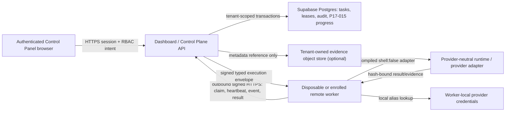
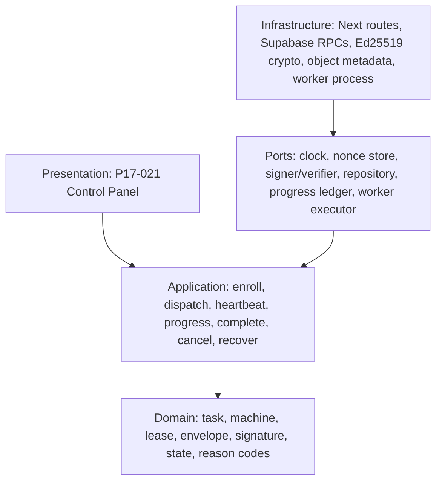

# ADR-003: Use an outbound-pull, typed-envelope distributed control plane

**Status:** Accepted — topology/trust input locked; task ready, implementation not started
**Date:** 2026-08-14
**Roadmap task:** P17-014
**Deciders:** Workflow-kit operator and maintainers

## Outcome

Provide an opt-in distributed control plane that coordinates bounded provider-neutral work across
registered repositories and machines without exposing an arbitrary remote shell, centralizing
provider credentials, weakening the existing Orchestrator/evidence contracts, or breaking the
offline local workflow.

The recommended topology uses the authenticated dashboard server as the Control Plane API,
Supabase/Postgres as a transactional state/lease/audit store, and separately installed workers that
make outbound HTTPS requests. A worker receives one signed typed execution envelope, invokes only a
compiled allowlisted operation with `shell:false`, and returns hash-bound progress/evidence metadata.

This ADR is an input decision packet. It does not authorize implementation, migration, enrollment,
remote execution, provider execution, two-node canaries, credential use, deployment, sync, or push.

## Requirements

### Functional

- Opt-in machine enrollment, capability advertisement, heartbeat, disable/revoke, and health state.
- Create and approve typed tasks; atomically claim, renew, complete, fail, cancel, and recover leases.
- Preserve exact task/run/attempt/machine/evidence identity through the P17-015 ledger.
- Accept only closed operation codes and versioned envelope schemas; no shell string or arbitrary
  executable path crosses the network boundary.
- Make delivery, operation intents, progress, and terminal receipts idempotent and auditable.
- Keep provider credentials on the worker and resolve only a closed local credential alias.
- Expose server-authorized read/action ports for the future P17-021 Control Panel.
- Preserve the current local provider/workflow path when distributed mode is disabled or unavailable.

### Non-functional

- Default off and single-region for the first production slice.
- Tenant-scoped and privacy-bound by the accepted P17-016 policy before any production data write.
- No cross-machine shared filesystem requirement.
- At-least-once network delivery with duplicate execution prevention and explicit unknown-outcome
  recovery; do not claim impossible exactly-once network execution.
- Initial design target: 100 enrolled workers, 1,000 queued tasks, 10 active leases per tenant, and
  four active leases per worker without changing domain contracts.
- Control Plane API p95 under 500 ms excluding long poll, provider execution, and artifact transfer.
- Heartbeat every 15 seconds, offline after 45 seconds, default lease 60 seconds, bounded renewal up
  to the task deadline, and initial maximum task deadline 30 minutes.
- Execution envelope at most 256 KiB; progress/event request at most 64 KiB; evidence bodies remain
  outside the Control Plane database.

## Constraints and existing contracts

- `multi-agent-orchestration.ts` already supplies a pure role DAG, bounded lease, recovery, handoff,
  evidence, and merge foundation. It has no network, database, subprocess, or scheduler side effect.
- `multi-agent-runtime.ts` dispatches through an injected `RoleExecutor`, freezes requests, carries
  verified predecessor bundle references, and hardcodes `shell:false`. P17-014 adds a transport
  adapter; it must not duplicate or weaken this domain logic.
- P17-002 owns phase envelopes, gates, evidence chains, and resume semantics.
- P17-015 owns task/run/machine/evidence identity, linear retry lineage, progress event hashes, and
  read-only drill-down. P17-014 owns network delivery, worker availability, remote leases, and
  transport trust.
- P17-016 owns tenant identity, privacy classification, retention, redaction, and deletion. Its ADR
  is Accepted, but its runtime/schema policy is not implemented, so no production P17-014
  persistence may start.
- Current dashboard RBAC has `viewer`, `operator`, `admin`, and `super_admin`, but no tenant context
  or dedicated approver role. P17-021 owns the final action matrix and separation of duties.
- The dashboard is a self-hosted Next/Node application backed by Supabase. A serverless-only or
  multi-region assumption is not valid for the first slice.

## Recommended decisions

| ID | Decision |
|---|---|
| `T1` | One dashboard-hosted Control Plane API plus Supabase/Postgres transactional state; workers connect outbound only. |
| `M1` | One-time enrollment followed by per-machine Ed25519 request signing, nonce/timestamp replay checks, rotation, and revocation. |
| `X1` | Closed compiled operation registry, exact schemas/hashes, `shell:false`, registered repo roots, and worker-local credential aliases. |
| `R1` | At-least-once delivery, stable delivery IDs, worker execution journal, CAS state, and manual recovery for unknown side-effect outcomes. |
| `E1` | Required E2E uses two network-separated nodes with no shared filesystem and a real deterministic non-shell operation/evidence flow. |
| `S1` | Single-region bounded initial scale; Postgres leases/outbox first, broker/multi-region only after measured thresholds. |

The operator accepted the exact choice set on 2026-08-14. P17-014 input readiness is complete and
P17-015 is done, so the task is `ready`; the accepted P17-016 policy is not yet fully implemented.
This readiness transition does not authorize Control Plane/Control Panel implementation or an
external action.

## Acceptance record

- Accepted on: 2026-08-14.
- Accepted choice set: `T1/M1/X1/R1/E1/S1`.
- Exact approval: `APPROVE P17-014 TOPOLOGY v1: topology=T1, machine=M1, execution=X1, replay=R1, e2e=E1, scale=S1.`
- Effect: closes only `operator-approved topology and trust boundaries`; dependency, implementation,
  migration, enrollment, remote execution, deployment, sync, and push gates remain independent.

## High-level topology

Trust boundaries:

1. Browser to Control Plane: user authentication, tenant membership, RBAC, CSRF/origin protection,
   expected resource version, and operation idempotency.
2. Worker to Control Plane: TLS plus machine signature, bounded timestamp, one-use nonce, tenant-bound
   machine identity, capability hash, and request/body hash.
3. Control Plane to Postgres: server-only tenant-requiring repositories/RPCs; browser and worker do
   not receive service-role credentials.
4. Worker runtime: local repo allowlist, compiled operation registry, local credential alias, process
   timeout/resource limits, and evidence verification. The Control Plane cannot select an arbitrary
   binary, argv vector, environment variable, directory, or shell.
5. Evidence store: body access is a separate tenant capability. The database carries bounded
   metadata/hash references only.

## Clean Architecture boundary

- Provider-neutral schemas, state machines, hashes, validators, and operation registry live once in
  shared core.
- Dashboard receives a generated byte-identical contract mirror and owns server-side application/
  persistence adapters. It must not fork domain rules.
- The optional worker service owns machine keys, local repo/credential configuration, execution
  journal, resource limits, and compiled operation adapters.
- P17-021 owns presentation and user action orchestration; it calls the same application ports.
- Domain and application layers never import Next, Supabase, filesystem/process, provider SDKs, or
  environment variables.

## Machine identity and enrollment M1

1. An administrator creates one hashed, single-use, short-lived enrollment grant scoped to tenant,
   expected machine label, allowed capabilities, and expiry. The plaintext is displayed once.
2. The worker generates an Ed25519 key pair locally. The private key never leaves the worker.
3. The worker sends the grant, public key, requested capability manifest/hash, worker version, and a
   proof signature over the enrollment challenge.
4. The server atomically consumes the grant, creates an opaque machine UUID and key version, and
   returns only public configuration plus a server public-key set.
5. Every subsequent worker request signs method, canonical path, tenant-bound machine ID, key
   version, timestamp, nonce, and SHA-256 body hash. Nonces are one-use inside a bounded clock window.
6. Rotation adds a new public key only after a request signed by the active key or a new explicit
   enrollment grant. Revocation immediately blocks claims/renewals and queues active leases for
   bounded recovery.

Display labels are not identity. No hardware fingerprint, MAC address, hostname, OS username, IP
address, or provider token is accepted as machine identity. TLS remains mandatory; application
signatures do not replace transport security.

## Typed execution envelope X1

An exact-schema, content-addressed envelope includes only:

- schema/contract versions, tenant/task/run/attempt/delivery/lease/machine/repository opaque IDs;
- closed operation code and operation contract hash;
- required capability IDs, runtime/provider adapter ID and version, phase ID, deadline, lease expiry,
  replay policy, and resource budget;
- P17-002 phase input/evidence references and P17-015 parent/root identity;
- tenant-safe evidence metadata destination policy; and
- Control Plane signature/key version plus envelope hash.

It explicitly excludes shell text, executable path, arbitrary argv, raw environment, secrets,
credentials, auth headers, raw spec/prompt/log, filesystem paths, URLs, and generic free-text
messages.

The initial operation registry is deliberately small:

- `project_intelligence.inspect` — read-only Project Intelligence over one registered repo root;
- `workflow_phase.execute` — one validated Orchestrator phase through a provider adapter allowed by
  the phase/model/entitlement contracts;
- `workflow_verify.execute` — one closed verification operation with declared inputs; and
- `evidence.verify` — content/hash verification without provider execution.

Each operation maps in code to a fixed adapter and bounded typed input. The worker constructs any
local argv itself, uses `shell:false`, selects only a registered repo alias, strips inherited
environment to an allowlist, and resolves a credential alias that the Control Plane can neither read
nor overwrite. Missing local capability/credential returns a closed `needs_input`/unavailable code.

## Task, lease, and replay model R1

Network delivery is at least once. The system prevents duplicate accepted execution through three
layers rather than claiming exactly-once transport:

1. Control Plane transaction: one active lease per task attempt, unique delivery ID, CAS expected
   version, and an outbox/audit event in the same transaction.
2. Worker journal: before execution, atomically persist delivery ID, envelope hash, operation ID,
   state, and eventual receipt hash. Re-delivery of the same envelope returns the stored receipt or
   resumes the same bounded operation; a different envelope under the same delivery ID is rejected.
3. Result acceptance: require matching active lease, machine, delivery, envelope, operation,
   progress tail, and evidence hashes. Replaying the same signed receipt is idempotent; conflicting
   content is an integrity incident with zero state mutation.

Lease behavior:

- A worker claims only an approved task whose required capabilities are a subset of the machine's
  active capabilities and whose tenant/repository scope matches.
- Heartbeat may extend the lease by at most one configured interval and never past the task deadline.
- Expired lease plus no execution-start journal evidence may be reclaimed under the same delivery
  policy. A side-effecting operation with unknown outcome becomes `recovery_required`; it is never
  auto-dispatched to a second worker.
- A retry is a new P17-015 attempt with a new run/delivery/lease and exact parent. It cannot overwrite
  the prior attempt or branch the linear retry chain.
- Late results are quarantined unless no successor exists and an explicit reconciliation operation
  verifies the receipt/evidence. They never silently win after expiry.

## State and cancellation semantics

Control Plane task/attempt states are closed and versioned:

`draft → awaiting_approval → approved → queued → leased → running → {awaiting_input,
awaiting_approval,cancel_requested,passed,failed,recovery_required}` with terminal `cancelled`.

- Approval, cancel, retry, disable-machine, and reconcile are version-checked operation intents with
  actor, tenant/resource/action, reason code, idempotency key, and timestamp. P17-021 supplies the
  final RBAC matrix.
- Cancellation is cooperative first. A committed `cancel_requested` intent is returned on heartbeat;
  the worker signals the compiled adapter and applies a bounded local grace/kill policy without a
  remote shell.
- Completion committed before cancel makes cancel return a conflict. Cancel committed first makes a
  later success receipt quarantined and non-terminal until explicit reconciliation.
- Worker disconnect does not mean cancellation. The lease expires, the machine becomes stale/offline,
  and replay policy selects reclaim versus manual recovery.
- Control Plane outage pauses new claims/renewals. A worker may finish the local bounded operation and
  retain its signed journal receipt, but it cannot extend authority or start another task offline.

## Storage model

P17-014 adds tenant-scoped tables/RPCs only after P17-015 and P17-016 are accepted:

- `control_plane_machines` — machine UUID, tenant, public-key versions, capability hash, worker
  version, trust/health state, last seen, optimistic version, retention metadata;
- `control_plane_enrollment_grants` — tenant/scope, hashed one-time grant, expiry, consumed/revoked
  state; never plaintext;
- `control_plane_tasks` — typed operation/envelope hashes, repo/run/attempt references, state,
  expected version, deadline, approval and replay policy;
- `control_plane_leases` — lease/delivery/machine/task identity, issued/expiry/heartbeat, state and
  receipt hash;
- `control_plane_nonces` — bounded replay window keyed by tenant/machine/key/nonce with expiry;
- `control_plane_operation_intents` — idempotent approve/cancel/retry/reconcile intents and closed
  authorization result;
- `control_plane_audit_events` — append-only during retention, closed action/reason/state hashes;
  deletable only through the P17-016 retention path; and
- existing P17-015 progress bindings/events — authoritative execution progress/evidence lineage,
  linked rather than copied.

Browser/worker roles receive no direct table write. Security-definer RPCs validate exact fields,
tenant/machine/resource identity, signature/nonce/CAS, state transition, and retention. Service-role
application repositories require tenant context and have no unscoped overload.

## API and event boundary

Worker endpoints are versioned JSON over HTTPS and return closed reason codes:

- `POST /api/control-plane/v1/machines/enroll`
- `POST /api/control-plane/v1/worker/leases/claim`
- `POST /api/control-plane/v1/worker/leases/{leaseId}/heartbeat`
- `POST /api/control-plane/v1/worker/leases/{leaseId}/events`
- `POST /api/control-plane/v1/worker/leases/{leaseId}/complete`

Claim may use a bounded long poll with a maximum 25-second server hold and exponential client retry
with jitter/cap. Heartbeat/event/result are ordinary idempotent requests. Browser progress streaming
belongs to P17-021 and uses server-authenticated SSE with bounded polling fallback; the worker never
opens an inbound listener for Control Plane commands.

All responses include schema version, request/operation ID, server time, resource version, status,
closed reason code, and bounded retry-after where relevant. Errors never echo request bodies,
signatures, nonces, credentials, paths, specs, logs, or provider output.

## Offline-safe and deployment boundary

- Distributed mode is disabled unless an explicit server feature flag, tenant policy, database
  migration version, server signing key, and worker enrollment configuration are all present.
- Disabled/misconfigured mode exposes no worker mutation route and renders Control Plane unavailable,
  never an empty-success state.
- Existing local workflows/provider bundles operate unchanged and do not contact the Control Plane.
- There is no automatic fallback from failed remote execution to local execution or another worker;
  the operator chooses a new attempt after evidence/recovery review.
- Initial deployment is one region and one writable Postgres authority. Workers may be remote, but
  multi-primary/multi-region dispatch is out of scope.

## Reliability, scale, and observability

- Use transactional claim/CAS plus an outbox audit row; do not introduce a broker until measured
  queue contention, wake latency, or event volume exceeds the initial target.
- Index tenant/state/capability/deadline for claim, tenant/machine/last-seen for health, and
  tenant/task/attempt for lineage. Bound every query/page and long poll.
- Initial SLO targets: 99.5% monthly Control Plane availability for enrolled tenants, p95 claim/
  heartbeat API under 500 ms excluding long poll, and duplicate accepted completion rate 0.
- Metrics are closed aggregates: queue depth/age, claim latency, lease expiry, heartbeat age,
  signature/replay rejection, recovery-required count, progress lag, and terminal outcomes. No raw
  args/log/spec/provider content.
- Alerts cover stuck queue, widespread offline workers, signature/replay spikes, failed outbox,
  retention purge failure, cross-tenant rejection, and orphaned P17-015 links.

Revisit a broker when sustained queue depth exceeds 1,000, claim transaction p95 exceeds 250 ms, or
more than 100 active workers produce measurable contention. Revisit multi-region only with a named
residency/availability requirement and an accepted conflict/ownership model.

## Security and privacy attacks

The verification suite must include:

- forged/revoked/rotated machine key, reused nonce, future/stale timestamp, changed body after
  signing, wrong key version, consumed enrollment grant, and capability escalation;
- tenant/resource/machine/repository mismatch with no cross-tenant existence signal;
- arbitrary shell/executable/argv/env/path/URL/credential fields, unknown operation/capability,
  oversized/nested/extra data, Unicode/control characters, and signature confusion;
- duplicate claim/delivery/receipt, same delivery with changed envelope, lease expiry/renewal past
  deadline, two-worker claim race, late completion, retry branch, and unknown-outcome redispatch;
- approval/cancel/success/retry/disable races with stale expected versions and duplicate intents;
- worker/process crash before journal, after journal/before execution, after execution/before receipt,
  and after receipt/before server acknowledgement;
- Control Plane/Postgres/network/object-store outage, outbox partial failure, heartbeat loss, clock
  skew, and restart from persisted worker journal;
- raw spec/log/error/secret/provider output leakage through API errors, audit, metrics, UI, event
  stream, evidence metadata, or tracing; and
- feature disabled/migration absent/server key missing/local workflow preserved controls.

## E2E topology E1

Completion requires a real network-separated/two-node test, not two objects in one process and not a
static/mock UI:

- Node A: authenticated dashboard/Control Plane server plus authorized disposable Supabase schema.
- Node B: disposable worker process/container/VM with its own filesystem, generated machine key,
  registered synthetic repository, no shared volume with Node A, and network access only to the
  Control Plane plus any explicitly selected provider endpoint.
- Positive operation: approve one queued `project_intelligence.inspect` task, claim one signed
  envelope, execute the real compiled Project Intelligence runtime on Node B, produce hash-bound
  evidence, persist P17-015 progress, and observe the terminal result in the P17-021 Control Panel.
- Required failures: forged worker signature, duplicate delivery, expired lease, worker offline,
  cancellation/success race, stale retry, evidence hash mismatch, capability mismatch, and
  cross-tenant reference.

This deterministic operation proves real remote execution without requiring a paid model call or a
mock executor. A bounded real provider phase may be a higher optional tier with separate provider/
credential authorization; it cannot replace the deterministic base E2E.

## Options considered

### Option T1: Dashboard-hosted API, Postgres leases, outbound workers — recommended

**Pros:** reuses current auth/data stack, one transactional truth, no inbound worker exposure, and
minimal operational surface for the first public-quality slice.

**Cons:** long polling and global service-role usage require strict tenant repositories; one region
limits availability/latency.

### Option T2: Direct browser-to-worker control

**Pros:** fewer server hops.

**Cons:** exposes workers to inbound traffic, leaks trust/credentials to browsers, weakens audit/RBAC,
and cannot enforce one task truth. Rejected.

### Option T3: Managed message broker plus multi-region workers immediately

**Pros:** stronger wake latency and scale potential.

**Cons:** new infrastructure, split transaction truth, more credentials/failure modes, and no
measured load need. Deferred behind `S1` revisit thresholds.

### Machine alternatives

- Long-lived bearer token: simpler but replayable and centrally redistributable; rejected for the
  public trust baseline.
- mTLS client certificate: strong transport identity but heavy issuance/revocation/deployment for
  local/self-hosted users. May replace M1 when managed PKI is an explicit requirement.

## Trade-offs and consequences

- Outbound pull favors deployability/firewall safety over sub-second push. A 25-second long poll plus
  bounded retry is sufficient for current human-approved feature work.
- Postgres leases favor one authoritative transaction over high-throughput messaging. Thresholds
  make the revisit measurable.
- Ed25519 enrollment adds key lifecycle work but avoids shared long-lived worker bearer secrets and
  supports signed offline receipts.
- Manual recovery for unknown side effects sacrifices automatic availability to prevent duplicate
  execution. Read-only operations may use a more permissive replay policy explicitly.
- Provider credentials remain local, so central scheduling cannot guarantee a selected provider is
  available; that honest `needs_input` outcome is preferred to secret distribution or fallback.
- P17-014 cannot complete before P17-015's live evidence and P17-016's accepted tenant/retention
  policy. P17-021 cannot implement operations until this topology and its RBAC/E2E inputs are locked.

## Verification and evidence ladder

1. ADR validator: required sections/choices, dependency/readiness state, exact boundaries, current
   contract reuse, no external authorization.
2. Shared-core schemas/state/crypto canonicalization/operation registry with exact-schema and attack
   tests; pure layers have no environment/file/network/process import.
3. Postgres migration/RPC tests for tenant/CAS/claim/nonce/idempotency/outbox/retention, including
   concurrent two-worker races against an authorized disposable database.
4. Worker tests for enrollment/signing/key rotation, journal crash points, compiled `shell:false`
   execution, local credential alias, resource/time limits, and offline restart.
5. Dashboard API/application tests plus P17-015 progress integration, P17-016 privacy/retention, and
   P17-021 RBAC/action/read model.
6. Full kit/dashboard regressions, builds, diff/secret/internal-marker scans, and deterministic
   distribution/clean-install checks.
7. Authorized E1 two-node real operation and failures with immutable request/envelope/lease/event/
   evidence/receipt hashes plus authenticated browser proof.
8. Durable final evidence at `docs/evidence/post-17-control-plane.md` and dashboard reconciliation.

## Rollout and rollback

1. Accept the topology/trust choices and checkpoint readiness only; do not mark implementation done.
2. P17-015 live evidence is complete; finish P17-016 before persistence or remote execution.
3. Implement pure contracts and disabled-by-default adapters, then migration/API, then worker, then
   P17-021 UI/actions.
4. Enable only for one disposable tenant/machine/repo/operation canary. Expand by explicit tenant
   allowlist after E1 evidence.
5. Rollback disables the feature flag and worker enrollment/claim routes first, revokes machine
   keys, lets active operations reach bounded stop/recovery, and preserves audit/progress evidence
   through retention. Drop tables/RPCs only after P17-015/P17-021 dependencies are removed.

Local workflows never depend on the feature flag, so rollback restores offline-only operation
without copying or editing target `.Codex` directories.

## Operator decision required

Approve or replace every choice:

| Choice | Recommended | Replacement must specify |
|---|---|---|
| Topology | `T1` dashboard API + Postgres + outbound workers | API host, queue/store, inbound/outbound boundary, deployment ownership. |
| Machine trust | `M1` one-time enrollment + Ed25519 | Key/credential issuance, storage, rotation, revocation, replay defense. |
| Execution | `X1` compiled allowlisted operations, `shell:false`, local credential aliases | Exact operation and secret boundary. |
| Replay | `R1` at-least-once + journal/CAS/manual unknown recovery | Duplicate and unknown-outcome semantics. |
| E2E | `E1` two network-separated nodes, no shared FS, real deterministic operation | Exact topology and authenticity boundary. |
| Scale | `S1` single-region bounded Postgres-first | Worker/task limits, availability, broker/region decision. |

Recommended approval statement:

`APPROVE P17-014 TOPOLOGY v1: topology=T1, machine=M1, execution=X1, replay=R1, e2e=E1, scale=S1.`

Approval closes the topology/trust input only. Implementation, Supabase migration/write, machine
enrollment, remote/provider execution, two-node environment use, deployment, sync, and push retain
their separate dependency and authorization gates.
