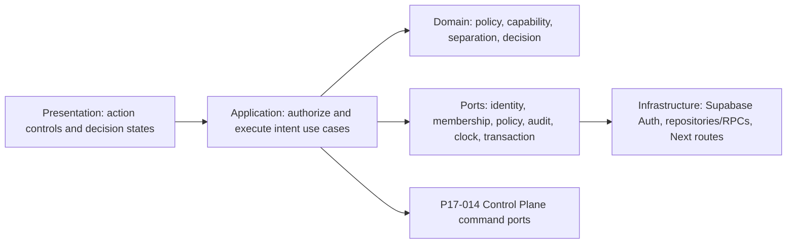

# ADR-004: Control Panel RBAC and Action Governance

**Status:** Proposed — operator RBAC approval required
**Date:** 2026-08-14
**Roadmap task:** P17-021
**Deciders:** workflow-kit operator and security owner
**Depends on:** P17-014 topology, P17-015 progress identity, and P17-016 privacy policy

## Outcome

Define the human identity, tenant/resource authorization, separation-of-duties, action-decision,
audit, emergency-access, UI, and E2E identity contracts for the P17-021 Control Panel. The design
must let public self-hosters operate machines and tasks without turning the existing dashboard's
global role rank or service-role database client into implicit authority.

This ADR is an input decision packet. It does not authorize implementation, migration, identity
creation, remote execution, deployment, sync, or push. P17-021 remains `backlog` with readiness
false until this choice set is approved and every other canonical readiness input is complete.

## Context and current gap

The dashboard currently authenticates with Supabase Auth and resolves one global role by email:
`viewer`, `operator`, `admin`, or env-pinned `super_admin`. `canAccess` treats the roles as a linear
rank. `user_roles.email` is the database key, role grants are global, and server routes use a
service-role client after a route-level role check. This is adequate for the current local-admin
dashboard but insufficient for a public, multi-tenant remote operations surface:

- there is no dedicated approver or separation between requesting and approving execution;
- an email address is mutable presentation data, not a stable authorization subject;
- role rank cannot express tenant, registered-repository, machine, or action scope;
- `admin` currently inherits every lower permission, including operations;
- a service-role repository can bypass RLS unless every query and mutation requires tenant context;
- no decision contract binds approval to the exact task/envelope/version being authorized; and
- hiding a button cannot prove an unauthorized request had zero execution side effects.

The existing login, role page, append-only role audit, and `SUPER_ADMIN_EMAIL` bootstrap remain
useful migration inputs. They are not accepted as the final P17-021 authorization model.

## Requirements

### Functional requirements

- Resolve every human actor from the verified Supabase Auth subject UUID. Email is display metadata
  only and never an authorization key supplied by a browser.
- Resolve an active tenant membership server-side before loading a Control Panel resource.
- Support viewer, operator, approver, and administrator responsibilities without implicit mutation
  inheritance.
- Enforce approve, cancel, retry, machine administration, membership administration, evidence read,
  and recovery actions against an exact tenant/resource/action matrix.
- Prevent a requester from approving the request or retry they created, even if that subject holds
  both operator and approver bindings.
- Bind an approval to the exact task version, operation/envelope hash, repository scope, capability
  set, resource budget, deadline, and policy version. Any bound-field change invalidates approval.
- Make every accepted or rejected action idempotent, version checked, and auditable.
- Return closed decision reason codes and safe action metadata for deterministic UI states.

### Non-functional requirements

- Default deny unknown subjects, tenants, memberships, roles, capabilities, resources, actions,
  reason codes, policy versions, and schema fields.
- Produce the same non-disclosing response for an absent resource and an inaccessible cross-tenant
  resource.
- Never place service-role keys, session tokens, raw email authority, arbitrary comments, task
  content, logs, filesystem paths, or evidence bodies in action intents or audit events.
- Keep policy evaluation deterministic and pure. Next.js, Supabase, transport, and UI concerns stay
  outside the authorization domain.
- Preserve an emergency stop path without allowing break-glass approval, retry, tenant browsing, or
  silent privilege elevation.
- Support a two-tenant, multi-role E2E attack suite without production identities or machines.

## Recommended decisions

| ID | Recommended decision |
|---|---|
| `I1` | Stable Supabase Auth subject UUID plus server-resolved tenant membership; email is display-only. |
| `A1` | Additive tenant/resource capability bindings; no linear rank inheritance for Control Panel mutations. |
| `S1` | Two-person execution authorization: self-approval is always forbidden and material changes invalidate approval. |
| `M1` | Adopt the exact action matrix and preconditions in this ADR. |
| `D1` | Persist authorization decision, audit event, idempotency record, and accepted mutation atomically with CAS. |
| `B1` | Time-bounded two-person break-glass for cancel/revoke only; never approve, retry, or read evidence bodies. |
| `U1` | Render server-supplied available actions and closed reason codes; the browser never infers authority. |
| `E1` | Use synthetic two-tenant, six-subject browser identities and a real disposable worker in release E2E. |

These decisions become accepted only after the operator approves the exact choice set or supplies
explicit replacements. Approval closes only the RBAC readiness input; it does not complete
P17-021 or override the P17-014/P17-015/P17-016 dependency gates.

## Identity and tenant boundary I1

### Human subject

- `subjectId` is the verified Supabase Auth `user.id` UUID injected by the server adapter.
- Email and display name are optional presentation attributes. They can change without changing
  ownership, approval history, or audit identity.
- The browser cannot submit `subjectId`, effective roles, memberships, or tenant authority inside an
  action body. Any such field is rejected as an unknown field.
- Disabled/deleted subjects immediately lose new action authority. Existing immutable audit rows
  retain only the opaque subject ID and tenant-keyed display hash required by P17-016.

### Tenant membership

`TenantMembership` is a versioned server-side record containing tenant ID, subject ID, active/
suspended state, membership version, and bounded expiry. A request selects a tenant context, but the
server proves the membership and injects the authoritative tenant ID into every query and command.

- No repository or RPC has an unscoped overload.
- Tenant ID, subject ID, and resource scope participate in every authorization cache key and
  idempotency namespace.
- Suspension, expiry, tenant deletion, or role-binding change invalidates outstanding authorization
  decisions before mutation.
- Cross-tenant absence and denial both return `RESOURCE_NOT_FOUND` with no count, timing-dependent
  detail, resource version, or existence signal.

## Capability model A1

P17-021 uses additive role bindings instead of the current global numeric rank. A subject may hold
multiple roles, but each binding is tenant scoped, may be narrowed to a registered repository group,
has an explicit version, and may expire. Mutating capabilities are enumerated; they are not inferred
from a role name or inherited because one role appears more senior.

| Role | Purpose | Default capabilities |
|---|---|---|
| `viewer` | Observe safe operational state | list/read sanitized machines, tasks, runs, progress, evidence metadata, and audit decisions |
| `operator` | Propose and safely stop work | create bounded task drafts, submit for approval, withdraw own unapproved task, request retry, cancel own in-scope task |
| `approver` | Independently authorize execution | approve/reject another subject's request, cancel any in-scope active task, approve a separately requested retry, reconcile an explicitly reviewed unknown outcome |
| `administrator` | Administer tenant control resources | manage non-admin memberships, role bindings, registered repositories, enrollment grants, machine disable/revoke, and policy configuration |

Key rules:

- `administrator` does not implicitly receive operator or approver mutation capabilities.
- `approver` does not implicitly administer memberships, machines, or policy.
- A subject may hold both operator and approver for staffing flexibility, but S1 still forbids that
  subject from approving their own task or retry.
- `super_admin` remains an env-pinned bootstrap/recovery identity outside routine tenant roles. It
  cannot silently enumerate tenant data or inherit Control Panel mutations.
- Unknown or missing role metadata produces a read-only degraded page only when viewer membership is
  independently proven; otherwise access is denied.

### Proposed persistence boundary

- `tenant_memberships`: tenant ID, subject UUID, state, expiry, version, created/disabled audit IDs.
- `control_plane_role_bindings`: tenant, subject, role, resource scope, expiry, version.
- `control_plane_policy_versions`: immutable active policy hash and activation audit ID.

The existing global `user_roles` table is legacy bootstrap input. Migration requires explicit
tenant mapping; it must not silently assign every historical role to a default tenant. The existing
role management page stays available during migration but cannot grant P17-021 capabilities.

## Separation of duties S1

An execution-capable task follows `draft → awaiting_approval → approved → queued`. The following
invariants apply in application logic and the atomic database command:

1. The requester subject and approving subject must be distinct verified human subjects.
2. A service identity or worker machine can never request or approve a human control action.
3. Approval is bound to the task version and `authorizationMaterialHash`, covering operation code,
   envelope/contract hash, registered repository scope, required capabilities, resource budget,
   deadline, retry lineage, tenant, and policy version.
4. Changing any bound field returns the task to `awaiting_approval`; an old decision cannot be
   replayed against the new version.
5. Approval expires at the earlier of the task deadline or 30 minutes after acceptance if no lease
   has begun. Expiry returns the task to `awaiting_approval` without dispatch.
6. A retry is a new immutable P17-015 attempt. An operator requests it, then a distinct approver
   approves it. Retry never reuses prior approval.
7. A failed audit write, stale expected version, expired membership, or changed policy produces zero
   control-state mutation and zero worker delivery.

Cancellation is intentionally easier than starting more work. An operator may cancel a task they
requested within their resource scope; an approver may cancel any active in-scope task. A tenant
administrator may use the separately audited emergency-stop action but does not gain approve/retry.
Completion committed before cancellation returns `STATE_CONFLICT`. Cancellation committed first
quarantines a late success receipt for explicit reconciliation, as defined by P17-014.

## Action matrix M1

`Allow` below still requires active membership, matching tenant/resource scope, current policy,
expected resource version, reason code, and an exact-schema request. `Own` additionally requires
`requesterSubjectId === actorSubjectId`. `Separate` requires a different requester and actor.

| Action | Viewer | Operator | Approver | Administrator | Additional precondition |
|---|---:|---:|---:|---:|---|
| Read sanitized fleet/task/run/progress | Allow | Allow | Allow | Allow | tenant/resource scope |
| Read evidence metadata/hash | Allow | Allow | Allow | Allow | separate evidence capability; no body |
| Create and submit task | Deny | Allow | Deny | Deny | registered repo + compiled operation |
| Withdraw awaiting request | Deny | Own | Deny | Deny | no accepted approval/lease |
| Approve/reject task | Deny | Deny | Separate | Deny | exact authorization material hash |
| Cancel active task/run | Deny | Own | Allow | emergency stop only | terminal state returns conflict |
| Request retry | Deny | Allow | Deny | Deny | terminal failed/cancelled/recovery state |
| Approve retry | Deny | Deny | Separate | Deny | new attempt, new approval |
| Reconcile unknown outcome | Deny | propose only | Separate | Deny | verified receipt/evidence review |
| Create enrollment grant | Deny | Deny | Deny | Allow | exact machine label/capability/expiry |
| Disable/revoke machine | Deny | Deny | Deny | Allow | active leases enter recovery/cancel policy |
| Grant viewer/operator/approver | Deny | Deny | Deny | Allow | cannot target self or grant administrator |
| Grant/revoke administrator | Deny | Deny | Deny | Deny | separate bootstrap/recovery procedure |
| Activate break-glass | Deny | Deny | second signer | first signer | B1 dual authorization |

No route may replace this matrix with `canAccess(role, requiredRole)`. A future policy engine may
implement the same port, but changing an action result requires a new policy version and approval.

## Action and decision contract D1

### Closed command

`ControlActionIntent` contains only:

- schema version, action, resource type, opaque resource ID, expected resource version;
- idempotency key, correlation ID, closed reason code, policy version; and
- for approval only, the exact authorization material hash.

The server injects actor subject, tenant, membership version, role-binding versions, request time,
and session assurance. Arbitrary comments and extension maps are forbidden.

### Closed decision

Every response returns a `ControlActionDecision` with decision ID, policy version, resource version,
`accepted` boolean, closed reason code, audit event ID, server time, and safe retry metadata. HTTP
success means the decision envelope was delivered, not that the requested action was accepted.

Required reason codes include `ACCEPTED`, `AUTHENTICATION_REQUIRED`, `MEMBERSHIP_INACTIVE`,
`RESOURCE_NOT_FOUND`, `ACTION_NOT_ALLOWED`, `SELF_APPROVAL_FORBIDDEN`, `APPROVAL_EXPIRED`,
`STALE_RESOURCE_VERSION`, `IDEMPOTENCY_CONFLICT`, `STATE_CONFLICT`, `POLICY_VERSION_CHANGED`,
`SECOND_SIGNER_REQUIRED`, and `CONTROL_PLANE_UNAVAILABLE`.

### Atomicity and replay

One transaction evaluates the current membership/bindings/policy/resource version, writes the
immutable decision and audit event, reserves the idempotency key, applies an accepted state
transition, and writes its outbox event. A denied decision writes only the decision/audit records;
it creates no task transition, lease, delivery, or worker side effect.

- Same tenant/actor/action/idempotency key and identical canonical payload returns the stored
  decision without reevaluation or duplicate mutation.
- Reusing the key with a different payload returns `IDEMPOTENCY_CONFLICT`.
- Idempotency records remain queryable for at least 24 hours. Audit retention follows the accepted
  P17-016 `audit_release` policy and cannot be shortened by the requester.
- Authorization decisions are never cached beyond the earliest membership, binding, policy,
  approval, session, or resource-version expiry.

## Audit and privacy boundary

The audit event is append-only during its approved retention window and records only tenant-keyed
opaque actor ID, action, resource type and opaque ID, policy/decision/resource versions, closed
reason code, idempotency/correlation hashes, prior/new state codes, and server timestamp.

It excludes email, display name, raw task input, operation arguments, repository paths/URLs, logs,
provider output, evidence bodies, tokens, cookies, headers, arbitrary comments, stack traces, and
worker fingerprints. UI audit views apply the P17-016 metadata-only and cross-tenant boundaries.

## Break-glass boundary B1

Break-glass is not another ranked role. It is a short-lived emergency capability with these rules:

- two distinct configured human recovery subjects must sign the same tenant/action/resource/reason;
- the capability expires after 15 minutes and is single-purpose;
- allowed actions are only cancel an active task/run, disable/revoke a machine, or disable the
  distributed feature for one tenant;
- approve, retry, reconcile, role grant, tenant enumeration, evidence-body access, and content access
  remain forbidden;
- activation and use produce append-only audit events and a security alert;
- failure to obtain a second signer leaves product break-glass unavailable; the database-owner
  recovery runbook remains an explicit external procedure, never a hidden UI bypass.

The env-pinned `super_admin` may initiate bootstrap or one side of recovery, but it cannot satisfy
both signatures and cannot bypass tenant selection or audit.

## UI authorization contract U1

Read models include a bounded `availableActions` array produced by the server for the exact resource
version and policy version. Each entry contains action, availability state, closed reason code,
required reason-code choices, expected version, and expiry. It contains no raw role or cross-tenant
policy internals.

- `allowed`: render the enabled action after required reason selection and confirmation.
- `denied`: render read-only state or a disabled action with safe explanation when disclosure is
  allowed; never invite repeated mutation attempts.
- `self_approval_forbidden`: state that another approver is required.
- `second_signer_required`: render the pending signer state and expiry without revealing identities
  outside authorized audit viewers.
- `stale`: disable action, refresh the authoritative resource, and require a new explicit submit.
- `pending`: disable duplicate submission while polling by decision/idempotency identity.
- `accepted`: render the authoritative new resource version; do not infer execution success.
- `conflicted`, `expired`, `offline`, or `unavailable`: render distinct non-success states with the
  safe recovery action supplied by the server.
- missing/malformed authorization metadata: fail closed into read-only degraded mode.

Client-side role checks may improve layout only. They do not decide, enable, or optimistically apply
a mutation. Browser reconnect obtains fresh `availableActions`; it never reuses stale permission.

## Clean Architecture boundary

The domain exports pure closed schemas and `evaluateControlAction(context, intent, resource)`.
It imports no React, Next.js, Supabase, SQL, provider SDK, transport, or environment module. The
application service obtains verified context through ports and commits an already evaluated action
through one transactional repository port. Infrastructure cannot invent a more permissive result.

## E2E identities and evidence E1

Use disposable Supabase Auth users or an equivalently real signed-in test identity mechanism. Store
credentials only in the authorized test secret store. Evidence names opaque subjects, never secrets:

| Subject | Tenant | Bindings | Purpose |
|---|---|---|---|
| `subject-viewer-a` | A | viewer | safe reads and denied mutations |
| `subject-operator-a` | A | operator | create, submit, cancel-own, request retry |
| `subject-approver-a` | A | approver | approve another subject and cancel in-scope work |
| `subject-admin-a` | A | administrator | machine/membership administration, denied routine approve |
| `subject-dual-a` | A | operator + approver | prove self-approval remains forbidden |
| `subject-operator-b` | B | operator | prove cross-tenant non-disclosure and zero side effects |

Required release E2E uses the exact dashboard server, Control Plane, P17-015 ledger, and a real
network-separated disposable worker:

1. Operator A creates and submits one typed `project_intelligence.inspect` task.
2. Viewer A and Operator B each receive a non-mutating denial; Operator B gets no existence signal.
3. Dual-role requester cannot approve their own task.
4. Approver A approves the unchanged authorization material and one worker receives one envelope.
5. Worker executes the compiled non-shell operation and returns hash-bound progress/evidence.
6. Control Panel renders the same tenant/task/run/attempt/machine/evidence identities and terminal
   state from authoritative read models.
7. Operator A requests a retry of a permitted terminal failure; it remains awaiting approval until
   a distinct Approver A decision.
8. Cancellation/success, stale-version, duplicate-idempotency, expired-approval, role-revocation,
   offline worker, event reconnect, forged evidence, and cross-tenant attacks preserve monotonic
   state and zero unauthorized execution side effects.

Playwright browser evidence and service/worker/event/audit hashes are required. In-app browser
inspection may corroborate route semantics but cannot replace the automated real-worker proof.

## Security and race attacks

The implementation suite must cover:

- forged actor/tenant/role fields, changed email, deleted subject, suspended membership, expired
  binding, unknown role/action/resource/reason/policy, and cross-tenant IDs;
- admin/operator privilege inheritance assumptions, self-approval with dual roles, colliding display
  emails, stale authorization metadata, and role revocation between page render and submit;
- task material changed after approval, retry reusing approval, approval after deadline, approval
  after cancellation, and two approvers racing the same version;
- duplicate idempotency key with same and changed payload, response loss after commit, audit failure,
  outbox failure, and transaction rollback proving zero partial mutation;
- operator cancel-own versus another operator's task, cancel/success race, retry branch, unknown
  outcome reconciliation, and late worker completion;
- break-glass single signer, same subject twice, expired capability, disallowed approve/retry/read,
  wrong tenant/resource, and alert/audit failure;
- UI forged `availableActions`, direct API mutation, CSRF/origin failure, missing decision envelope,
  SSE reconnect, polling fallback, and unauthorized evidence download; and
- email, task/spec/log/path/URL/provider output, secret, cookie, token, header, arbitrary comment, or
  evidence-body leakage through API, audit, metrics, trace, event, HTML, accessibility name, and URL.

## Options considered

### Option A1: Tenant/resource capability bindings — recommended

| Dimension | Assessment |
|---|---|
| Security | Strong default-deny scope and explicit action semantics |
| Complexity | Medium; requires tenant-aware identity and policy migration |
| Public self-hosting | Supports multiple tenants and staffing models |
| Auditability | Exact policy/action/resource decisions |

**Pros:** expresses separation of duties, avoids rank escalation, and keeps policy portable across UI,
API, and future service boundaries.
**Cons:** more schemas and test combinations than the current four-role rank.

### Option A2: Extend the global role rank with `approver`

**Pros:** smallest code and schema change.
**Cons:** remains email/global, implies unsafe inheritance, cannot isolate tenant/resource scope, and
cannot safely support a public Control Panel. Rejected.

### Option A3: Adopt an external policy engine immediately

**Pros:** mature policy language and centralized decisions.
**Cons:** adds deployment/trust/availability burden before policy volume justifies it. The pure
authorization port keeps this future option open without making it a v1 dependency.

## Trade-offs and consequences

- Two-person authorization adds human latency but makes remote execution intent independently
  reviewable. Cancellation remains intentionally easier because stopping work reduces risk.
- Explicit capabilities create a larger matrix than rank comparison but prevent `admin` from
  silently becoming an execution approver.
- Opaque subject IDs reduce human-readable audit convenience; authorized views may resolve safe
  display labels separately without changing authority or durable records.
- A 30-minute unused approval lifetime may require reapproval for delayed work, but avoids dispatch
  under stale repository, capability, or policy context.
- Two-person break-glass can be unavailable in a single-owner deployment. That failure is explicit;
  a hidden one-person bypass would contradict the separation and audit guarantees.
- The recommended design can be implemented in TypeScript initially. A Rust or Go policy/worker
  process is warranted only after profiling or isolation requirements show a concrete benefit; the
  versioned port and conformance suite remain language-neutral.

## Verification and evidence ladder

Every tier is required for P17-021 completion; this proposal satisfies none of the runtime tiers:

1. Pure policy/schema/property tests covering the complete matrix and unknown-field default deny.
2. Tenant repository and transactional RPC tests for CAS, decision/audit/idempotency/outbox atomicity.
3. API attacks for every role/action/resource combination, self-approval, revocation, CSRF, replay,
   cross-tenant non-disclosure, and zero unauthorized side effects.
4. Route/component/accessibility tests for every U1 state and keyboard/screen-reader behavior.
5. Multi-process dashboard/Control Plane/worker integration with deterministic fault injection.
6. Exact-server Playwright E2E with real authenticated identities and a real disposable worker.
7. Authorized network-separated two-node proof with immutable decision/audit/task/run/event/evidence
   hashes, screenshots, cleanup, and full kit/dashboard regression evidence.

## Rollout and rollback

1. Keep distributed mode and all P17-021 mutations disabled by default.
2. Add pure policy schemas and dual-evaluate current global roles in report-only mode; report-only
   results never authorize an action.
3. Add tenant memberships/bindings with explicit legacy mapping and no default-tenant assignment.
4. Enable read-only Control Panel views after tenant/privacy dependencies pass.
5. Enable one bounded task/approval flow only for the disposable E2E tenant and worker.
6. Expand actions after the matrix/race/evidence gates pass.
7. Rollback disables mutations first, drains/cancels leases, preserves audit/idempotency records for
   their accepted retention, and removes schema only after P17-014/P17-015 dependencies are absent.

## Operator decision required

Approve or replace each choice:

| ID | Recommended choice | Alternative requiring explicit text |
|---|---|---|
| Identity | `I1` stable subject UUID + server-resolved tenant membership | Exact identity key, tenant resolution, and migration behavior. |
| Authorization | `A1` additive tenant/resource capabilities | Exact hierarchy or policy-engine contract. |
| Duties | `S1` distinct requester/approver, approval hash/expiry, new approval per retry | Exact self-approval and invalidation policy. |
| Matrix | `M1` exact approve/cancel/retry/admin matrix above | Replacement result for every row and precondition. |
| Decision | `D1` atomic decision/audit/idempotency/mutation/outbox with CAS | Exact consistency and replay model. |
| Break-glass | `B1` dual-signer 15-minute cancel/revoke-only capability | Exact actors, actions, expiry, audit, and forbidden operations. |
| UI | `U1` server-provided available actions and closed states | Exact authority source and degraded behavior. |
| E2E | `E1` synthetic two-tenant/six-subject real-worker proof | Exact identity topology with permitted/denied/self/cross-tenant cases. |

Recommended approval statement:

`APPROVE P17-021 RBAC v1: identity=I1, authz=A1, duties=S1, matrix=M1, decision=D1, breakglass=B1, ui=U1, e2e=E1.`

Approval accepts only this RBAC/action-governance input. It does not mark P17-021 ready or done and
does not authorize database migration, test identity creation, remote execution, deployment, sync,
publication, or push.

## Action items after approval

1. Record the Accepted ADR and remove only the RBAC/separation-of-duties item from P17-021 missing
   inputs; retain every unresolved dependency/readiness gap.
2. Define language-neutral policy/decision schemas in shared core before dashboard or database code.
3. Add migration and tenant repository designs only after P17-016 is accepted and implemented.
4. Lock the separate information-architecture/accessibility input before presentation work.
5. Provision disposable identities/workers only under their explicit operational authorization.
6. Complete all seven evidence tiers before marking P17-021 done.
