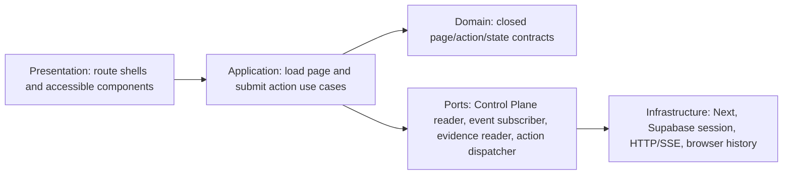

# ADR-005: Control Panel Information Architecture and Accessibility

**Status:** Proposed — operator UX/accessibility approval required
**Date:** 2026-08-14
**Roadmap task:** P17-021
**Deciders:** workflow-kit operator, product owner, and accessibility owner
**Depends on:** ADR-004 RBAC, P17-014 Control Plane, P17-015 progress, and P17-016 privacy

## Outcome

Define the route hierarchy, global and local navigation, list/detail ownership, action placement,
responsive behavior, operational state language, accessibility baseline, performance bounds, and
highest-authenticity browser evidence for the real P17-021 Control Panel.

This ADR is an input decision packet. It does not authorize UI implementation, package installation,
test identity creation, browser login, migration, remote execution, deployment, sync, or push.
P17-021 remains `backlog` with all ten readiness gaps until the operator approves this choice set and
the other canonical inputs are complete.

## Context and current UI baseline

The dashboard already provides useful patterns:

- a sticky authenticated shell, dark mode, reusable cards/badges/buttons, and table primitives;
- a canonical `/roadmap` board and `/roadmap/[taskId]` read-only progress drill-down;
- semantic headings, some table captions/scopes, `role=status`/`role=alert`, and bounded progress
  history in the newest P17-015 view; and
- server-side page authentication plus a fail-closed unavailable state.

The current shell is not the P17-021 target:

- navigation is a client-side static top row and has no server-authorized Control Plane entry;
- primary links plus `More` can overflow narrow viewports and the disclosure has no explicit menu
  keyboard/focus contract;
- `/orchestrator` is a dense read-only implementation page, not a machine/task/run operations model;
- no route owns machine detail, operational task detail, evidence metadata, or Control Plane audit;
- no system contract defines focus restoration, action-dialog semantics, live update announcement,
  reconnect/stale language, responsive table transformation, or reduced motion; and
- current tests check selected ARIA strings but do not prove WCAG, keyboard, zoom, contrast,
  responsive, multi-browser, or real authenticated action flows.

P17-021 must evolve these surfaces without presenting a mock dashboard or claiming visual polish as
proof of remote execution.

## Requirements

### Functional requirements

- Provide stable routes for fleet overview, machines, operational tasks, runs, evidence metadata,
  and audit decisions.
- Preserve `/roadmap` as delivery planning and `/roadmap/[taskId]` as cross-machine roadmap progress;
  link it to operational resources without duplicating or inventing state.
- Build every list from a bounded server read model with URL-addressable filters, sort, cursor, and
  tenant context.
- Place approve/cancel/retry only on the exact task/run resource and render ADR-004 server decisions.
- Preserve task/run/attempt/machine/evidence identity across list, detail, action, live updates, and
  browser history.
- Expose explicit disabled, unavailable, empty, loading, partial, stale, offline, reconnecting,
  unauthorized, conflicted, quarantined, and terminal states.

### Non-functional requirements

- Meet the project-selected WCAG 2.2 AA baseline plus the stronger operational controls in A11Y1.
- Work without page-level horizontal scrolling from 320 CSS pixels through 2,560 CSS pixels and at
  200% browser zoom.
- Keep all server queries, SSE windows, polling, rendered rows, and evidence previews bounded.
- Avoid color-only, animation-only, position-only, or transient-toast-only communication.
- Never expose secrets, raw specifications/logs/paths/provider output, evidence bodies, hidden
  cross-tenant state, or role-policy internals.
- Preserve the existing dashboard when distributed mode is disabled; direct routes fail closed into
  an explicit unavailable state rather than empty success.

## Recommended decisions

| ID | Recommended decision |
|---|---|
| `IA1` | Dedicated `/control-plane` route family with overview, machine/task/run/evidence/audit list-detail ownership. |
| `N1` | Server-derived global navigation plus an adaptive Control Plane sub-navigation and mobile dialog menu. |
| `P1` | URL-addressable list → dedicated detail progression; contextual actions only on authoritative resources. |
| `A11Y1` | WCAG 2.2 AA plus explicit keyboard, focus, live-region, dialog, table, zoom, contrast, and motion acceptance. |
| `R1` | Responsive acceptance at 360×800, 768×1024, 1280×720, and 1440×900, with a 320–2560 px support range. |
| `S1` | Closed operational state vocabulary with freshness and non-success semantics shared by API and UI. |
| `PERF1` | Bounded page/event DOM and reference-topology latency/interaction budgets with measured evidence. |
| `V1` | Component semantics, automated axe, keyboard/zoom/contrast, three-engine Playwright, NVDA smoke, and real-worker E2E. |

Approval closes only the P17-021 information-architecture/accessibility readiness input. It does not
close RBAC, service, privacy, worker, evidence, identity, topology, or failure-injection inputs.

## Route and ownership model IA1

| Route | Primary question | Authoritative model | Allowed mutations |
|---|---|---|---|
| `/control-plane` | Is the distributed system healthy and actionable? | bounded fleet/work/run summary + freshness | none; links only |
| `/control-plane/machines` | Which machines are trusted, capable, busy, stale, or offline? | paged machine summaries | create enrollment grant for authorized admin |
| `/control-plane/machines/[machineId]` | What is this machine's trust, capability, lease, and audit state? | one machine + bounded active/recent leases | disable/revoke through ADR-004 |
| `/control-plane/tasks` | What work is awaiting input/approval, queued, active, or terminal? | paged operational task summaries | create/submit bounded task |
| `/control-plane/tasks/[taskId]` | What exact task material and authorization state is current? | one task + approval material + attempt links | withdraw, approve/reject, request retry as allowed |
| `/control-plane/runs/[runId]` | What happened in this immutable attempt? | run, worker lease, P17-015 events, evidence refs | cancel active run, reconcile reviewed outcome |
| `/control-plane/evidence/[sha256]` | Is this evidence verified, safe, available, or quarantined? | metadata and separately authorized preview capability | quarantine/release only if later authorized |
| `/control-plane/audit` | Who requested/decided what and why? | bounded privacy-safe ADR-004 decisions/audit | none |

Route rules:

- IDs are opaque and canonical. Invalid syntax returns 404 before storage access; inaccessible and
  absent cross-tenant IDs share the same non-disclosing response.
- `/roadmap/[taskId]` remains the delivery-task progress view. If an operational task references a
  roadmap task, both pages cross-link by exact IDs; neither copies mutable state from the other.
- `/orchestrator` remains the current local workflow administration surface until a separate
  migration retires it. P17-021 does not silently rename it or mix remote truth into its free-text
  event model.
- Evidence routes expose metadata by default. Artifact preview/download is a separate capability and
  content-type/size/quarantine contract, never an automatic hash dereference.
- Every page defines metadata title, one `h1`, breadcrumbs, freshness time, tenant context, and a
  stable browser-history URL.

## Navigation model N1

### Global shell

The root shell obtains a safe navigation model from the authenticated server session. It includes
only route labels, selected state, and availability; it contains no raw roles or hidden tenant data.

- Desktop/tablet: retain the compact top shell, add `Control Plane` as a primary destination only
  when the user has a proven tenant viewer capability and the feature contract is configured.
- Mobile: replace horizontal link overflow with a labelled menu button and modal navigation dialog.
  The dialog traps focus, closes with Escape, returns focus to the trigger, marks the active route,
  and exposes all destinations in one ordered list.
- Direct navigation to a disabled/misconfigured Control Plane is allowed only to render the explicit
  unavailable contract; it never yields an empty operational dashboard.
- Add a first-focus skip link to `#main-content`. The root content uses one `main` landmark with a
  stable ID; route components do not nest a second `main`.
- Theme and logout controls retain accessible names. Logout success moves to login; failure is
  announced and does not pretend the session ended.

### Control Plane sub-navigation

Overview, Machines, Tasks, and Audit are peers. On desktop they render as a horizontal tablist-like
link row or side rail using ordinary links and `aria-current=page`; on mobile they render as a
labelled select/menu of links. Runs and Evidence are detail destinations reached from exact parent
resources, not top-level empty indexes.

Navigation never uses client role comparison to hide/enable a mutation. ADR-004 `availableActions`
controls resource actions; route availability is a separate server-safe read capability.

## Page composition and progressive disclosure P1

All Control Panel routes use one visual grammar:

1. Breadcrumb and page title.
2. Tenant, health/freshness, stream status, and last authoritative update.
3. Optional server-authorized contextual action group.
4. Summary counts that link to the exact filtered list.
5. URL-backed filter/search/sort controls.
6. Bounded list or one resource detail.
7. Related progress/evidence/audit sections loaded with independent partial-error boundaries.

### List behavior

- Filters, sort, cursor, and selected tenant are encoded in validated query parameters so refresh,
  share, Back, and Forward preserve the view.
- Default sort is deterministic: status priority, authoritative update time descending, then opaque
  ID. The UI never silently reorders due to a late event.
- Lists use server pagination with 25 rows by default and 100 maximum. Client filtering applies only
  to the loaded page and must be labelled as such; preferred implementation sends filters to the
  server.
- Selecting a row follows a real link to a detail route. Row-wide click is optional, but a visible
  named link remains for keyboard and assistive technology.
- Wide data tables live in a labelled horizontal scroll region at small widths or transform into
  definition-list cards. They never force the entire document to scroll horizontally.

### Detail behavior

- Identity and terminal integrity appear before optional diagnostics.
- Hashes and opaque IDs are visually shortened only with the full value available to an authorized
  copy control and accessible name; no `title`-only disclosure is required for understanding.
- Timeline events use ordered lists for state progression. Tabular event comparison uses a table
  with caption and scoped headers.
- Evidence metadata separates verification, availability, quarantine, and retention. Missing body
  access is not an integrity failure; a hash mismatch is.
- Optional diagnostic sections use disclosure controls with programmatic expanded state and no raw
  log/spec fallback.

### Action placement

Approve/reject belongs on task detail; cancel belongs on active task/run detail; request retry
belongs on an eligible terminal task/run. Lists may expose a shortcut that opens the same exact
confirmation contract, but no bulk remote mutation is in v1.

An action dialog shows safe operation code, registered repository label, capability set, bounded
resource budget, deadline, current version, short material hash, and closed reason choices. It never
shows arbitrary arguments or secrets. Default focus is the dialog heading or safe Cancel control,
never the destructive/accept button. Submission stays pending by decision ID, then renders the
authoritative ADR-004 outcome rather than optimistic success.

## Accessibility contract A11Y1

The acceptance baseline is WCAG 2.2 Level AA for the named route family, with these explicit
operational requirements:

### Structure and names

- One `main`, one `h1`, logical heading order, labelled navigation regions, breadcrumbs, lists,
  tables, forms, status groups, and dialog titles/descriptions.
- Every icon-only control has a unique accessible name including the resource when ambiguity exists.
- Status, priority, trust, verification, quarantine, and availability use text/icon semantics in
  addition to color.
- Table headers use scope/association, tables have visible or screen-reader captions, and sortable
  headers expose correct `aria-sort` after every change.

### Keyboard and focus

- Every read and action flow is completable with keyboard alone using native interaction order.
- No positive `tabindex`, no focus trap outside an open modal dialog, and no keyboard-only hidden
  action.
- Focus indicators are at least 2 CSS pixels thick, unobscured, and at least 3:1 against adjacent
  colors.
- Interactive targets are at least 24×24 CSS pixels; primary operational actions and mobile controls
  are at least 44×44 CSS pixels.
- Dialogs trap focus, close with Escape when safe, restore focus to the invoker, and keep focus inside
  after validation errors. Irreversible in-flight operations do not fake cancellation by closing UI.
- Route transition places focus on the new `h1` only when navigation was client-driven and would
  otherwise lose context; browser Back restores the invoking link when available.

### Live updates and timing

- Connection state and accepted/rejected human actions use a polite live region. Critical integrity,
  cross-tenant, or unavailable failures use a non-duplicated alert.
- Heartbeats and individual progress events are not announced. Updates coalesce to at most one
  announcement per second and announce meaningful state transitions only.
- New list rows do not steal focus or change keyboard order. A paused-updates control is available
  when live movement would impair reading.
- Session, approval, and break-glass expiry show visible remaining time and a non-modal warning before
  expiry; timing cannot be extended by the browser without server authorization.

### Visual, zoom, and motion

- Normal text contrast is at least 4.5:1; large text, UI components, state borders/icons, and focus
  indicators are at least 3:1 in light, dark, high-contrast, hover, focus, disabled, and selected
  states.
- At 200% browser zoom and 320 CSS pixels equivalent width, content and actions remain available with
  no two-dimensional page scrolling.
- Honor `prefers-reduced-motion`; no essential information relies on animation, and loading/status
  motion has a static equivalent.
- Truncation never removes the only accessible identity. Long labels, localization expansion to
  200%, unbroken hashes, and empty values preserve layout and meaning.

## Responsive contract R1

Support range is 320–2,560 CSS pixels. Required release viewports:

| Viewport | Required behavior |
|---|---|
| 360×800 | modal global navigation, stacked summary/actions, no page-level horizontal scrolling, card or labelled table scroll |
| 768×1024 | compact top navigation, two-column summaries where useful, detail sections remain ordered |
| 1280×720 | dense operational view fits shell plus primary table without hiding freshness/actions |
| 1440×900 | full bounded table/detail layout with no excessive empty canvas |

Acceptance checks each viewport in light and dark mode, plus one 200% zoom run and one Windows forced
colors/high-contrast run. Touch and mouse are supplemental; keyboard remains authoritative.

## Operational state vocabulary S1

All API adapters and pages map to closed presentation states. Unknown states fail closed as
`malformed`, never as success.

| State | Required presentation |
|---|---|
| `loading` | labelled busy skeleton preserving expected regions; no fake values |
| `empty` | successful authoritative query with zero resources and a safe next step |
| `disabled` | distributed capability intentionally off; local workflow preserved |
| `misconfigured` | required contract/config missing; no worker/action routes exposed |
| `unauthenticated` | login transition without resource content |
| `unauthorized` | safe denial with no cross-tenant existence signal |
| `partial` | successful primary resource plus named unavailable secondary section |
| `stale` | data age exceeds contract; actions disabled until refresh succeeds |
| `offline` | Control Plane or machine unavailable; never equivalent to cancelled/failed |
| `reconnecting` | last sequence and retry state visible; no duplicate event application |
| `rate_limited` | bounded retry-after and retained safe page state |
| `conflicted` | expected version/state changed; refresh and explicit repeat required |
| `integrity_conflict` | quarantine treatment; no success badge or artifact body |
| `quarantined` | evidence retained as unsafe metadata only with reason code |
| `ready` | authoritative data rendered; action availability still independent |

Every page shows `lastAuthoritativeAt`, stream/poll mode, and freshness state when operational data is
present. A disconnected stream with successful bounded polling is `degraded`, not `offline`.

## Performance and boundedness PERF1

Reference acceptance uses the P17-014 initial target: 100 enrolled workers, 1,000 queued tasks, and
the P17-015 limits of 50 attempts per roadmap task and 200 events per attempt.

- Server lists return 25 rows by default and 100 maximum with opaque cursor pagination.
- The browser holds at most 100 list rows and 200 visible event rows per selected attempt; older data
  requires explicit pagination and never accumulates indefinitely from SSE.
- One authenticated SSE connection per active page is allowed. Events apply by monotonic sequence,
  coalesce render work to at most four updates per second, and reconnect from the last accepted
  sequence. Fallback polling starts at five seconds and backs off with jitter to 30 seconds.
- On the documented local reference fixture, server-rendered shell plus primary data target p95 under
  two seconds, post-load filter/sort interaction p95 under 100 ms, and action acknowledgement follows
  the P17-014 Control Plane API p95 under 500 ms excluding execution/artifact transfer.
- Layout shift target is below 0.1 for the initial route render. Skeletons reserve primary regions;
  late state updates do not move the action group above focused content.
- Every benchmark records hardware, browser, data cardinality, warm/cold condition, sample count, and
  p50/p95. A single fast screenshot is not performance evidence.

These are v1 reference budgets, not global internet SLO claims. Revisit virtualization, caching,
stream fan-out, or split services only after measured threshold failure.

## Clean Architecture and source ownership

Proposed dashboard ownership:

- `src/features/control-plane/domain` — generated or imported shared-core identities, closed states,
  action decisions, and page contracts; no React/Next/Supabase imports;
- `src/features/control-plane/application` — load overview/list/detail and submit/reconcile actions;
- `src/features/control-plane/infrastructure` — server-only API/SSE/evidence/session adapters;
- `src/features/control-plane/presentation` — accessible components and formatters; and
- `src/app/control-plane/**` — thin route composition, metadata, loading/error boundaries.

Routes never query Supabase tables directly and components never call workers. The Control Panel
uses P17-014/P17-015/P17-016/ADR-004 ports rather than duplicating task truth or authorization.

## Verification and evidence V1

Completion requires every tier:

1. Pure route/query/state/page-model schema tests, including malformed/unknown field attacks.
2. Component tests for every S1 state, action decision, heading/landmark/name/table/dialog/live-region
   contract, long text, empty values, light/dark, and reduced motion.
3. Automated axe scans with zero serious or critical violations on every named route/state and zero
   known moderate violations without a documented owner/expiry.
4. Playwright keyboard-only flows for skip link, global/mobile navigation, filters, list/detail,
   dialogs, approve/cancel/retry decisions, reconnect, and focus restoration.
5. Responsive screenshot/geometry assertions at all R1 viewports, 200% zoom, and forced colors; no
   document overflow, clipped action, inaccessible table, or hidden focus.
6. Chromium, Firefox, and WebKit exact-server E2E for core read/action states. Network fault injection
   proves offline/reconnecting/stale/duplicate/out-of-order behavior.
7. One documented Windows NVDA keyboard smoke covering navigation, a machine list, task approval
   dialog/decision, progress transition, evidence metadata, and error recovery. VoiceOver may
   supplement but does not replace the named baseline.
8. The authorized two-node real-worker E2E proves browser action → Control Plane → worker → execution
   → evidence → terminal browser state with matching IDs/hashes and cleanup.
9. In-app browser inspection may corroborate the exact authenticated UI, dimensions, semantics, and
   screenshots; it supplements rather than replaces automated and assistive-technology evidence.

## Failure and edge-case matrix

At minimum, verify:

- feature disabled, missing migration, Control Plane unavailable, auth expiry, tenant switch,
  removed membership, malformed server model, and partial section failure;
- empty 100-worker fleet, 100-machine fleet, 1,000-task queue, long/duplicate labels, unbroken hashes,
  localization expansion, clock skew, expired data, and retention removal;
- SSE disconnect before/after an event, duplicate/out-of-order/gapped sequence, polling recovery,
  response loss after action commit, and page reload/back-forward during pending action;
- self approval, stale approval, denied direct API call, cancel/success race, retry pending approval,
  break-glass second signer, and role revocation while a dialog is open;
- evidence missing, quarantined, oversized, unsupported type, retrieval denied, hash mismatch, and
  artifact store offline; and
- keyboard menu/dialog/table use, screen-reader announcement rate, 200% zoom, forced colors, reduced
  motion, touch target size, small viewport, and browser engine differences.

## Options considered

### Option IA1: Dedicated list/detail route family — recommended

**Pros:** stable deep links, bounded page ownership, browser history, clearer loading/error boundaries,
and testable authorization per resource.

**Cons:** more routes and shared components than a single operations page.

### Option IA2: One dense Control Plane dashboard

**Pros:** quick overview and fewer route files.

**Cons:** unbounded payload/DOM pressure, ambiguous focus and actions, poor deep linking, and difficult
mobile/accessibility behavior. Rejected as the only UI; the overview remains intentionally bounded.

### Option IA3: Reuse `/orchestrator` for remote operations

**Pros:** fewer navigation entries.

**Cons:** mixes local queue/free-text audit with versioned remote machine/task/run truth and weakens
clean boundaries. Rejected without a separately planned migration.

## Trade-offs and consequences

- Dedicated detail routes add navigation but make exact identity, authorization, error, and evidence
  states testable and shareable.
- Server-derived navigation requires shell refactoring, but prevents client role inference and
  avoids displaying routes the session cannot safely read.
- Three-engine, zoom, forced-color, and NVDA evidence costs time. That cost is part of a public
  operational product, not optional polish.
- A mobile dialog menu is more implementation than horizontal overflow, but gives deterministic
  focus, active route, and destination access.
- Conservative row/event bounds require pagination, but prevent silent browser degradation as the
  fleet grows.

## Rollout and rollback

1. Land shared route/state/page-model contracts and tests with the feature flag off.
2. Refactor the shell for skip link/server navigation without exposing Control Plane mutations.
3. Add read-only overview/list/detail routes against disposable/injected adapters.
4. Complete the full A11Y1/R1 state matrix before enabling a single bounded action.
5. Enable ADR-004 actions only for the approved disposable E2E tenant and worker.
6. Rollback disables mutation capability first, preserves deep-link read states and audit, removes
   the Control Plane nav entry, and leaves existing `/roadmap` and `/orchestrator` behavior intact.

## Operator decision required

Approve or replace each choice:

| ID | Recommended choice | Alternative requiring explicit text |
|---|---|---|
| Routes | `IA1` dedicated overview and list/detail route family | Exact route ownership and migration from existing pages. |
| Navigation | `N1` server-derived shell + adaptive subnav/mobile dialog | Exact authorization, overflow, keyboard, and focus behavior. |
| Progression | `P1` URL-backed list/detail with contextual resource actions | Exact filters/history/action placement/bulk behavior. |
| Accessibility | `A11Y1` WCAG 2.2 AA plus named operational criteria | Exact standard, exceptions, owners, and expiry. |
| Responsive | `R1` required viewport/zoom/forced-color matrix | Exact supported range and evidence viewports. |
| States | `S1` closed operational/freshness vocabulary | Exact loading/empty/degraded/error/non-success semantics. |
| Performance | `PERF1` bounded DOM/stream and measured reference budgets | Exact cardinality, latency, update, and benchmark contract. |
| Verification | `V1` axe + keyboard + responsive + three-engine + NVDA + real worker | Exact equivalent highest-authenticity evidence. |

Recommended approval statement:

`APPROVE P17-021 UX v1: routes=IA1, navigation=N1, progression=P1, accessibility=A11Y1, responsive=R1, states=S1, performance=PERF1, verification=V1.`

Approval accepts only this information-architecture/accessibility input. It does not mark P17-021
ready or done and does not authorize UI implementation, dependency installation, browser identity,
remote execution, migration, deployment, sync, publication, or push.

## Action items after approval

1. Remove only the information-architecture/accessibility item from P17-021 missing inputs; keep all
   other unresolved gaps.
2. Lock shared page/state/action schemas before changing dashboard routes or shell.
3. Add test tooling only through a reviewed dependency and browser-runtime plan.
4. Implement read-only routes before mutation controls.
5. Run V1 tiers progressively and retain exact evidence, not screenshots alone.
6. Mark P17-021 done only after the real-worker terminal-state flow and all acceptance tiers pass.
