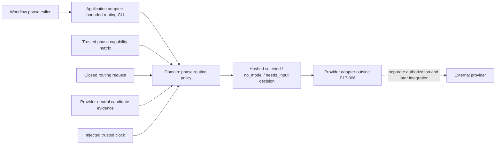

# P17-006 Phase-aware Model Selection and Routing Plan

Status: complete
Date: 2026-08-14  
Decision authority: operator-approved post-17 goal plus the P17-006 input-readiness gate  
Dependencies: P17-002 complete; P17-007 owns real same-input phase qualification

## Outcome

Add a provider-neutral, deterministic phase-routing policy engine that decides whether a workflow
phase needs no model, may select one explicitly qualified candidate, or must stop with
`needs_input`. The decision is content-addressed, auditable, replayable, and incapable of executing
a provider, approving a gate, persisting state, or changing the existing B0–B12 workflow.

The canonical catalog currently contains no phase-qualified candidate. Therefore the first honest
production-catalog result for every model-required phase is `needs_input`; synthetic fixtures prove
the `selected` path. P17-007 must produce exact same-input qualification evidence before any real
candidate can become routable.

## Requirements

### Functional requirements

- Resolve all 24 mandatory/conditional phase contracts from
  `docs/roadmap/post-17-phase-capability-matrix.json` schema `1.1.0`.
- Activate conditional capabilities only through the five closed condition IDs in that matrix.
- Return exactly one of `selected`, `no_model`, or `needs_input`.
- Require documented, configured, runtime-entitled, available, and exact phase-qualified evidence
  for the selected provider/model/effort/adapter tuple.
- Preserve the phase contract hash, runtime-permission ceiling, gate semantics, and evidence
  semantics on every preflight alternative or execution-time fallback.
- Keep unknown capability, context fit, entitlement, availability, qualification, cost, and latency
  unknown. Unknown never means zero, cheap, fast, available, or compatible.
- Record every rejected candidate and closed reason code in the hashed decision.
- Support a future evidence-gated performance tie-breaker without enabling it in the canonical
  matrix before comparable P17-007 observations exist.

### Non-functional requirements

- Pure domain function: no filesystem, environment, network, provider SDK, process spawn, database,
  clock, or UI dependency.
- Bounded CLI: at most 512 KiB stdin, 32 candidates, 100 observations per candidate, one sentinel,
  no file writes, and no raw provider/database error messages.
- Closed schemas, exact fields, safe identifiers, lowercase SHA-256, ISO timestamps, finite integer
  bounds, deterministic ordering, and stable JSON hashing.
- Provider packages contain only the shared runtime, schemas, matrix, and thin invocation guidance;
  they cannot fork selection or evidence rules.
- Existing orchestrator envelopes, flagship command behavior, provider commands, and bundle runtime
  names remain backward compatible.

## Current-state reconciliation

- P17-002 implements the phase-envelope, evidence, resume, and golden-comparison contract. It does
  not execute decomposed phases and must not be described as a model router.
- `kit-dashboard/server/orchestrator.ts` coordinates an older autonomous-roadmap phase set. It is a
  different bounded context and must not be imported, extended, or repurposed for B0–B12 routing.
- The capability matrix records Claude, Codex, Copilot, Gemini, and unmerged xAI inventory without
  claiming entitlement or phase quality. Every current entry has `routableNow=false`.
- Existing performance data is aggregated by runner and kit version. It is not comparable evidence
  for an exact phase + phase-contract hash + adapter-capability hash tuple.
- P17-006 is a policy/decision slice. Provider execution, automatic workflow integration, and real
  qualification are separate rollout steps.

## Clean Architecture



Dependency direction is inward. `phase-model-router.ts` owns domain types, validation, policy, stable
hashing, and decision construction. `phase-model-router-cli.ts` owns argv/stdin bounds, trusted clock
injection, exit codes, and the single sentinel. Provider skills and agents invoke the compiled CLI;
they do not implement selection rules.

### Planned source ownership

| Layer | Planned source | Responsibility |
|---|---|---|
| Domain | `packages/core/src/phase-model-router.ts` | Closed contracts, validation, qualification, selection, fallback conservation, decision hash |
| CLI adapter | `packages/core/src/phase-model-router-cli.ts` | Bounded stdin, one command, trusted clock, one sentinel, exit mapping |
| Schemas | `docs/schemas/phase-model-routing-request.schema.json`, `docs/schemas/phase-model-routing-decision.schema.json` | Portable request and decision shapes |
| Input authority | `docs/roadmap/post-17-phase-capability-matrix.json` | Phase requirements, evidence tiers, conditional IDs, optimizer policy |
| Provider distribution | `scripts/build-provider-bundles.ts`, `providers/provider-bundles.json` | One byte-identical runtime and common contracts in three bundles |
| Thin adapters | existing Workflow Orchestrator skills/agents | Explain when and how to call the shared runtime; never choose a model themselves |

## Domain contracts

### Routing request

Schema `1.0.0` contains exact fields:

- `requestId`, `phaseId`, `phaseContractHash`, and `matrixHash`;
- `activeConditionIds`, limited to condition IDs bound to the target phase;
- `estimatedInputTokens`, required when context-window fit is a phase capability;
- explicit ordered `candidateIds` and optional `requestedEffort`;
- `fallback`, either null or the prior decision hash, failed candidate ID, closed failure reason,
  original phase-contract hash, original runtime permissions, and `replaySafe=true`.

The request contains no prompt, private specification, credential, raw log, repository path, or
provider response.

### Candidate evidence

Each candidate has one stable ID and exact provider-neutral identity fields:

- runner, provider, model, nullable effort, enabled flag, and adapter capability hash;
- declared capabilities, supported effort values, context-window token limit, and runtime
  permissions;
- documentation source URL/hash/fetched/expiry, configuration catalog hash, runtime entitlement,
  bounded availability, and exact phase qualification;
- optional comparable observations keyed by phase ID, phase-contract hash, adapter-capability hash,
  fixture hash, quality verdict, latency, cost, timestamp, and evidence hash.

Runtime entitlement binds the resolved provider/model/effort identity and has its own evidence hash
and expiry. Phase qualification additionally binds the target phase, phase-contract hash, adapter
capability hash, same-input fixture hash, pass/fail verdict, evidence hash, and expiry. A transport
smoke or successful login cannot populate phase qualification.

### Routing decision

Schema `1.0.0` contains:

- request hash, matrix, phase, and phase-contract identities;
- evaluated-at timestamp from the injected clock;
- required capabilities/runtime permissions and active conditions;
- all candidates in request order with nullable candidate-evidence hash, `eligible`, and closed reason codes;
- `selectedCandidateId` or null, status, top-level reason codes, explicit skipped/fallback lineage,
  optimizer disposition, and decision hash.

The decision hash is SHA-256 over stable JSON excluding only the hash field. Given the same trusted
clock and inputs, output bytes are identical.

## Closed reason codes

The first implementation uses a closed vocabulary grouped by boundary:

- phase: `phase_model_forbidden`, `phase_model_not_requested`, `condition_unknown`,
  `condition_not_applicable`;
- configuration: `candidate_unknown`, `candidate_disabled`, `documentation_missing`,
  `documentation_expired`, `configuration_missing`;
- live capability: `runtime_entitlement_missing`, `runtime_entitlement_expired`,
  `resolved_identity_mismatch`, `availability_unknown`, `candidate_unavailable`;
- qualification: `phase_qualification_missing`, `phase_qualification_expired`,
  `phase_qualification_failed`, `phase_contract_mismatch`,
  `adapter_capability_hash_mismatch`;
- fit: `required_capability_missing`, `runtime_permission_missing`, `context_window_unknown`,
  `context_window_insufficient`, `requested_effort_unsupported`;
- fallback: `fallback_missing_lineage`, `fallback_not_replay_safe`,
  `fallback_contract_mismatch`, `fallback_permission_escalation`;
- optimization: `performance_evidence_insufficient`, `operator_order_selected`,
  `qualified_tie_break_selected`.

Malformed schemas, hashes, timestamps, unknown fields, duplicate IDs, and bounds violations are CLI
validation errors, not synthesized routing decisions.

## Selection algorithm

1. Validate exact matrix, request, candidates, vocabulary, bounds, timestamps, and content hashes.
2. Resolve the exact phase and recompute its phase-contract hash from stable matrix fields.
3. Reject unknown or non-phase condition IDs. Union unconditional capabilities with capabilities
   activated by the request's closed condition IDs.
4. Return `no_model` for `forbidden` phases. Return `no_model` for optional/conditional phases whose
   model condition is inactive. Candidate data cannot override this result.
5. For every explicitly ordered candidate, independently validate current documentation,
   configuration, entitlement, availability, exact phase qualification, resolved identity,
   capabilities, effort, context fit, and runtime-permission superset.
6. If this is an execution-time fallback, validate the prior decision lineage, replay safety, exact
   contract identity, and non-escalating permission set before considering candidates.
7. If no candidate is eligible, return `needs_input` with every rejection reason; do not call a
   provider or substitute an undeclared candidate.
8. With the canonical optimizer disabled, select the first eligible candidate in operator order and
   record `operator_order_selected` plus any earlier rejected candidates.
9. A future enabled optimizer may rank only otherwise eligible candidates and only when every
   candidate has at least five comparable observations on the exact phase/contract/adapter/fixture
   key. Missing quality, cost, or latency blocks that tie-break; it never weakens correctness.
10. Hash and return the complete decision. Selection grants no execution authority.

## Fallback semantics

Preflight alternatives and execution-time fallbacks are distinct:

- A first decision may select a later candidate from the operator's explicit order when earlier
  candidates are independently proven ineligible; all skipped identities/reasons are recorded.
- After a selected provider starts or fails, no automatic switch occurs. A new request must carry
  the prior decision hash, failed candidate, failure reason, original contract/permissions, and a
  replay-safe assertion produced by the caller's phase contract.
- The fallback candidate must pass the entire qualification pipeline independently. Same provider,
  same model family, lower price, or a successful transport smoke grants no equivalence.
- Any contract mismatch, permission escalation, missing lineage, or unsafe replay returns
  `needs_input` before execution.

## CLI contract

Command:

```bash
npx tsx packages/core/src/phase-model-router-cli.ts route < request.json
```

- Reads one JSON object from stdin with a hard 512 KiB cap.
- Emits exactly one `@@PHASE_MODEL_ROUTING@@` JSON envelope and no prose.
- Exit `0`: `selected` or `no_model`; exit `1`: valid `needs_input`; exit `2`: usage, schema,
  bounds, or integrity failure.
- Uses the process clock only in the CLI adapter and passes the ISO timestamp into the pure domain
  function. Tests inject a fixed clock.
- Never reads environment variables, files, credentials, or provider configuration; never writes,
  spawns, connects, or persists.

## Provider packaging and public documentation

- Bump provider bundle `0.4.0` → `0.5.0` and shared core `1.2.0` → `1.3.0` because a new public
  capability/runtime is added without breaking existing ones.
- Add `runtime/phase-model-router.cjs` and capability `phase-model-routing` to all three deterministic
  archives.
- Add both routing schemas and the capability matrix to common bundle files.
- Extend the byte-identical Workflow Orchestrator skill and existing Claude/Copilot agent guidance;
  do not fabricate a Codex standalone-agent manifest or a Copilot plugin manifest.
- Update all English provider READMEs with purpose, trust boundary, request/decision examples,
  version compatibility, failure semantics, and the explicit no-provider-execution guarantee.
- Keep existing runtime names and invocation contracts unchanged.

## Language and performance decision

TypeScript is selected for this slice because the work is bounded validation, set comparison,
stable hashing, and JSON policy inside the existing Node 20 distribution. It avoids a second runtime
and preserves one build path across Codex, Claude, and Copilot. Python, Rust, or Go is not forbidden:
revisit only if a reproducible benchmark shows the 512 KiB/32-candidate budget cannot meet the
100 ms p95 local decision target, or Node lacks a required security/runtime capability. Any rewrite must
preserve byte-level schema and golden decisions before replacement.

## Security and privacy

- Closed fields and safe IDs prevent prompt/log/path/host/credential material from entering a
  decision.
- Provider documentation is advisory and expires; it never proves local entitlement.
- Runtime entitlement and phase qualification have independent provenance, identity, and expiry.
- Candidate runtime permissions must be a superset of phase requirements. Fallback cannot escalate
  beyond the original request.
- Decision reason codes are safe and provider/database errors are never forwarded.
- No external call, provider run, credential read, installation, publication, sync, push, target
  `.Codex` edit, or dashboard mutation is part of P17-006.

## Reliability and scale

- Maximum 32 candidates and 100 observations per candidate bound CPU/memory and output size.
- Stable sorting and exact duplicate detection make retries deterministic.
- No shared mutable state means parallel callers cannot race inside the router.
- Expired evidence fails closed even if it was valid in a prior decision.
- A caller may cache a decision only with its matrix/request/candidate hashes and evaluated time;
  cache policy is outside the core and cannot extend evidence expiry.

## Verification and evidence ladder

1. Plan validator for required boundaries, vocabulary, packaging, rollback, and honest status.
2. Request/decision schema tests plus exact runtime validators and schema/runtime drift controls.
3. Domain unit/property attacks: all 24 phases, five conditions, every reason group, duplicates,
   unknowns, expiry, context/effort/permission mismatch, hash tamper, and deterministic replay.
4. Fallback attacks: missing/forged lineage, contract change, permission escalation, non-replay-safe
   retry, unqualified alternative, and execution-time silent substitution.
5. CLI attacks: argv, empty/multiple/oversize/trailing input, malformed JSON, output cap, exactly one
   sentinel, and exit-code mapping.
6. Canonical-catalog proof that every real candidate returns `needs_input`; synthetic independently
   qualified fixtures prove `selected`, `no_model`, explicit preflight alternative, and gated
   performance tie-break behavior.
7. Provider bundle validation: three deterministic archives, byte-identical fifth runtime, common
   schemas/matrix, manifest/version/capability integrity, clean-copy smokes, and tamper attacks.
8. Full kit regression, diff check, changed-file secret scan with positive control, artifact hashes,
   and durable `docs/evidence/post-17-model-routing.md`.

Browser evidence is not required for this pure CLI policy slice. A future dashboard route or live
provider integration must earn its own browser/E2E tier and cannot reuse these unit claims.

## Rollout, compatibility, and rollback

1. Commit this design and move only P17-006 from `ready` to `in_progress`.
2. Implement schemas/domain/CLI behind no workflow wiring; canonical candidates remain disabled.
3. Build and smoke the three provider bundles in scratch directories only.
4. Record the canonical `needs_input` result and synthetic positive/negative evidence.
5. Mark P17-006 done only after full gates and local commits. Do not enable real routing.
6. P17-007 later supplies phase qualification; a separate approved integration task may wire
   decisions into execution.

Rollback removes the additive router source, schemas, runtime registry entry, package capability,
and thin documentation changes, then restores bundle/core versions to `0.4.0`/`1.2.0`. Existing four runtimes and orchestrator envelopes remain usable throughout. Generated `dist/` output is not
source truth and must be rebuilt or discarded, never hand-edited.

## Trade-offs and revisit triggers

- A decision engine without execution gives weaker demo value but prevents an unqualified catalog
  from becoming production behavior.
- Passing the matrix/candidates in a closed request is more verbose than hidden global config, but
  makes provenance, replay, and provider bundles auditable.
- Operator order is less adaptive than automatic optimization; it is the honest default until
  phase-comparable quality/cost/latency evidence exists.
- One shared TypeScript runtime is operationally simpler now. Revisit language, persistence, remote
  catalog lookup, or optimizer sophistication only with measured latency/scale/security evidence.
