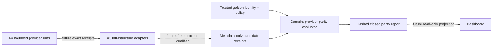

# P17-007 A2 Provider-Parity Pure Evaluator

Status: approved A2 pure-evaluator implementation; no provider execution.
Date: 2026-08-21
Parent: exact qualified `main` `8e28d10041580c312300790598e4131dab3e7ec9`
Decision lock: `domain=D1, schema=S1, validation=V1, evaluation=E1, aggregation=A1, ranking=R1, privacy=P1, performance=T1, scope=N1`

## Outcome

Implement one provider-neutral pure evaluator that accepts closed, metadata-only candidate receipts
derived by a later trusted verifier and produces a deterministic, content-addressed parity report.
The evaluator validates exact same-input identities, independently derives semantic, artifact,
gate, API, and trusted-verification conservation, and reports qualification completeness without
rewarding byte-identical source.

A2 supplies the domain contract required before process adapters can exist. It performs no process,
filesystem, environment, network, provider, credential, clock, database, dashboard, or model call.
Transport smoke never qualifies. The evaluator receives time and all evidence as explicit data,
rejects malformed or privacy-unsafe input, and has no side effects.

## Scope and non-scope

A2 includes:

- exact TypeScript request, receipt, evaluation, pairwise-comparison, and report types;
- strict plain-data and exact-key runtime validation aligned with two portable JSON Schemas;
- stable canonical JSON hashing for the request, admitted receipts, and report;
- closed adapter and evaluator reason vocabularies;
- deterministic per-receipt semantic, artifact, gate, API, trusted-verification, policy, and privacy
  evaluation;
- deterministic qualification aggregation across exactly `codex`, `claude`, and `copilot`;
- metadata-only pairwise semantic/artifact/gate similarity and informational tree-equality fields;
- a fail-closed performance-ranking readiness result; and
- unit, contract, adversarial, deterministic-replay, and TypeScript performance proof.

A2 excludes process launch, CLI discovery, provider flags, provider event parsing, authentication,
opaque session use, runtime entitlement discovery, isolated repository materialization, trusted test
execution, filesystem inventory, cleanup, run storage, dashboard/UI, provider-package changes, and
real provider receipts. Those are A3, A4, or later dashboard work.

A2 does not install a package, call a provider, inspect a user directory, read a credential, mutate a
target, edit a target `.Codex` tree, sync, bump version, tag, release, publish, or change visibility.

## Architecture decision record

### Context

A1 locked one public synthetic golden, exact phase identities, evidence thresholds, and a bounded
future execution boundary. The next dependency is a trustworthy domain decision that can distinguish
complete, failed, missing-input, and incomplete evidence before any provider-specific process code
is admitted. Provider adapters must not own or fork parity semantics.

### Decision

Use one stateless TypeScript/Node domain module in `packages/core`. It accepts an explicit closed
request and returns a closed report. A caller must first derive metadata-only receipts through a
separate trusted-verification boundary; the evaluator never accepts raw prompts, diffs, files,
transcripts, exception text, session identifiers, credentials, or local paths.

Malformed structures throw a bounded validation error. Well-formed evidence produces one of
`needs_input`, `passed`, `failed`, or `incomplete`. Report ordering and hashes are stable under
repeat evaluation of byte-equivalent JSON data.

### Options considered

| Option | Complexity | Distribution | Security boundary | Decision |
|---|---:|---:|---:|---|
| TypeScript pure core | Low | Existing Node 20 runtime | One in-process provider-neutral trust boundary | Selected |
| Rust or Go sidecar | High | New binaries, FFI/IPC, SBOM and platform matrix | Larger supply-chain and process surface | Deferred until a threshold breach |
| Python evaluator | Medium | Second runtime and packaging path | Schema drift and interpreter surface | Rejected for the authoritative path |
| Logic inside each provider adapter | Medium | Three divergent copies | Provider transport could weaken gates | Rejected |

### Trade-off analysis

TypeScript keeps the schemas, hashing, roadmap fixture, provider distributions, and tests in one
runtime and makes the dependency direction enforceable. A native implementation could reduce CPU
time only after crossing a measured boundary, while immediately adding binary signing, cross-build,
FFI/IPC, packaging, vulnerability, and platform-support work. Python is useful only for later offline
analysis after consuming the same privacy-safe report schema; it is not an authoritative evaluator.

### Consequences

- Provider adapters can be attacked independently without duplicating business rules.
- A2 can be fully qualified with synthetic metadata and zero external authority.
- A valid metadata receipt is necessary but not sufficient for a real parity claim; A3/A4 still own
  trustworthy receipt production and fresh execution.
- Schema changes become public compatibility changes and require a versioned migration.
- Raw implementation similarity is deliberately unavailable to the domain and cannot bias quality.

### Action items

1. Define the exact request and report schemas.
2. Implement runtime validation, stable hashing, evaluation, and aggregation in the pure domain.
3. Attack identity drift, evidence loss, unsafe objects, contradictions, incomplete providers, and
   ranking shortcuts.
4. Measure the locked TypeScript thresholds and retain TypeScript unless a reproducible breach exists.
5. Commit source first, then bind a separate metadata evidence document to its exact commit/tree.

## Clean Architecture

Dependency direction is inward. `provider-parity-evaluator.ts` owns domain vocabulary, validation,
canonicalization, hashing, evidence conservation, pairwise comparison, and aggregation. JSON Schemas
describe the portable boundary. Tests and future adapters depend on the core; the core never imports
an adapter, provider SDK, process helper, filesystem API, network client, database client, or UI.

## Closed domain contracts

### Evaluation request

Schema `1.0.0` has exact fields `schemaVersion`, `evaluationId`, `mode`, `golden`, and `receipts`.
Mode is `qualification` or `performance`. The golden contains only:

- exact fixture ID/revision/SHA, SemanticSpec SHA, prompt SHA, and seed-tree SHA;
- provider order `codex`, `claude`, `copilot`;
- ordered acceptance-criterion IDs `AC-1`, `AC-2`, `AC-3`;
- required artifact classes `plan`, `implementation`, `test`, `trusted-verification`;
- exact ordered B3/B10/B11 phase IDs and contract hashes; and
- the A1 qualification/performance, duration, output, attempt, and ranking policy.

No content or runtime capability is inferred from the provider label. Every array that is a set must
be unique and canonical; deliberate provider/run order is preserved only where the report says so.

### Candidate receipt

Each receipt has exact fields `schemaVersion`, `runId`, `provider`, `execution`, `identity`,
`evidence`, `metrics`, and `receiptHash`. The identity binds the complete A1 fixture/phase identity,
runner, CLI version, model, effort, adapter capability, runtime-entitlement evidence, materialized
tree, execution policy, authorization receipt, source commit, observation time, timeout, output cap,
and attempt ordinal.

Execution state is `completed`, `needs_input`, or `failed`. Adapter reason codes are closed and safe:
missing CLI/entitlement/authority/model/cost policy, unavailable model, timeout, output overflow,
provider refusal, malformed provider event, unauthorized tool/network attempt, and process failure.
`completed` must have no adapter reason. `needs_input` and `failed` must have at least one matching
reason and may not pretend complete evidence exists.

Unavailable CLI-version, entitlement-evidence, authorization-receipt, and materialized-tree fields
are nullable only for `needs_input`, must correlate exactly with its closed reason codes, and cannot
be fabricated. `completed` and `failed` executions require the applicable runtime identities;
`needs_input` may not claim a materialized candidate tree.

Completed evidence contains only:

- ordered acceptance-criterion ID plus evidence SHA entries;
- ordered artifact class plus evidence SHA entries;
- ordered B3/B10/B11 gate conservation plus evidence SHA entries;
- API-contract conservation;
- trusted-verification exit/evidence metadata; and
- closed booleans for locked-path edit, undeclared path, external dependency, secret-or-path
  disclosure, permission widening, and cleanup failure.

Metrics are bounded duration and nullable provider-returned input/output/cache tokens, price-basis
SHA, and cost. `priced` requires all token, price-basis, and cost fields; `unpriced` requires null
price-basis/cost and remains truthful. No character-based token estimate is accepted.

`receiptHash` is SHA-256 over canonical receipt JSON excluding only that field. Unknown fields,
non-plain or accessor-backed objects, inherited enumerable data, duplicate IDs/classes/phases,
non-canonical sets, invalid hashes/timestamps/numbers, unsupported status/reason combinations, and
contradictory completion evidence fail validation.

### Evaluation report

The report has exact fields `schemaVersion`, `evaluationId`, `mode`, `requestHash`, `status`,
`providerOrder`, `receiptEvaluations`, `missingProviders`, `pairwiseComparisons`, `ranking`, and
`reportHash`.

Each receipt evaluation records only provider/run/receipt identity, closed status/reasons, coverage
ratios, API/trusted-verification booleans, tree hash, duration, nullable token/cost fields, and one
evaluation hash. Pairwise rows record provider IDs, semantic/artifact/gate Jaccard similarity, and
informational `implementationTreeEqual`; tree equality never changes verdict or rank.

The ranking object is either `forbidden` with closed reasons and zero rows, or `ready` with one
deterministic provider row per target. A2 never claims ranking from fixture tests or fewer than five
comparable completed receipts per provider/model/effort/execution-policy identity.
Ranking remains forbidden whenever any provider, sample, identity, trusted verdict, token field,
price basis, or cost field is missing.

## Deterministic evaluation algorithm

1. Reject non-plain, accessor-backed, inherited, unknown, oversized, duplicated, or malformed data.
2. Recompute the request and every receipt hash from stable JSON.
3. Compare every receipt identity to the exact golden fixture, prompt, SemanticSpec, seed tree,
   phase order/contracts, duration/output bounds, and single-attempt policy.
4. Preserve `needs_input` and infrastructure failure facts from closed adapter states without
   inventing completion evidence.
5. For completed receipts, derive AC coverage, artifact coverage, gate conservation, API
   conservation, trusted exit `0`, and violation-free policy independently from metadata.
6. Emit `passed` only when every required AC, artifact, and gate is present exactly once, API and
   trusted verification pass, all identities match, and every violation flag is false.
7. Aggregate by the fixed provider order. No receipts yields `needs_input`; absent providers or
   insufficient qualification samples yields `incomplete`; a complete provider set with a failed
   candidate yields `failed`; all required providers meeting the qualification floor yields `passed`.
8. Compare only admitted passed receipts. Semantic/artifact/gate similarity uses normalized ID/class/
   phase sets; implementation tree equality is informational.
9. Keep ranking forbidden unless performance mode has at least five passed comparable receipts for
   every provider, each with complete provider-returned token/cost data. Failed, missing, unpriced,
   stale, mixed-identity, retried, or incomplete samples cannot rank.
10. Sort closed reasons by vocabulary order, build deterministic rows, and hash the report excluding
    only `reportHash`.

Transport smoke never qualifies, candidate prose never qualifies, and a provider label never fills
a missing identity or evidence field. Byte-identical source is neither required nor rewarded.

## Test and evidence ladder

1. Plan validator: required architecture, privacy, performance, non-scope, exact manifest, package,
   full-suite, and public-manifest registration.
2. Schema/runtime drift: positive examples plus exact-field, `additionalProperties=false`, enum,
   bounds, nullability, and hash-format controls for request and report.
3. Unit happy paths: three different implementation-tree hashes can still pass identical semantic,
   artifact, gate, API, and trusted-verification requirements.
4. Identity attacks: fixture/revision/prompt/spec/seed/phase/runner/model/adapter/entitlement/policy/
   authority/source/timeout/output/attempt/hash drift all fail closed.
5. Evidence attacks: missing/duplicate/reordered AC, artifact, or gate; weakened gate; API change;
   test failure; locked or undeclared path; dependency; secret/path disclosure; permission widening;
   cleanup failure; and self-reported pass cannot qualify.
6. Data-shape/privacy attacks: unknown, inherited, proxy/accessor-backed, cyclic, non-finite,
   oversized, path-like, credential-like, transcript-like, raw prompt/diff/source, and exception data
   are rejected before hashing.
7. Aggregation attacks: missing provider, duplicate run, mixed provider identity, partial samples,
   unpriced samples, mixed model/effort/policy, retries, and incomplete receipts keep ranking forbidden.
8. Determinism: cloned input produces byte-identical report; receipt/request/report tamper changes or
   invalidates the expected hash.
9. Performance: profile 10,000 admitted receipts, report p95 and incremental RSS, and compare against
   the locked p95 50 ms per pure evaluation and 64 MiB thresholds without hiding a breach.
10. Strict TypeScript, public link/license/secret/docs, provider distribution regression, complete
    `npm run test:kit`, source commit/tree receipt, and separate metadata-only evidence commit.

The synthetic fixtures in A2 are contract examples, not provider execution evidence. No browser or
visual proof is required for this pure domain slice.

## TypeScript performance decision

TypeScript/Node remains selected because A2 is bounded validation, set comparison, aggregation, and
SHA-256 inside the existing Node 20 distribution. Rust or Go is reconsidered only if a reproducible
profile of 10,000 admitted receipts exceeds p95 50 ms per pure evaluation, incremental RSS exceeds
64 MiB, or Node lacks a required safe primitive. Python may consume the public report for later
offline analysis but cannot become authoritative without an ADR covering schema parity, packaging,
SBOM, FFI/sidecar, cross-platform, and trust-surface costs.

## Exact source manifest

The A2 source commit may change exactly:

1. `docs/roadmap/p17-007-a2-provider-parity-evaluator-plan.md`
2. `docs/roadmap/post-17-roadmap.md`
3. `docs/schemas/provider-parity-evaluation-report.schema.json`
4. `docs/schemas/provider-parity-evaluation-request.schema.json`
5. `package.json`
6. `packages/core/src/provider-parity-evaluator.ts`
7. `packages/core/test/provider-parity-evaluator.test.ts`
8. `release/public-release-manifest.json`
9. `scripts/post-17-provider-parity-evaluator-plan.test.ts`

The evidence checkpoint may add only
`docs/evidence/post-17-provider-parity-a2-pure-evaluator-2026-08-21.md` and its ordered public-
manifest row. Source and evidence remain separate commits.

## Rollback and next gates

Before the source commit, restore only the nine manifest paths from exact parent `8e28d100…` or the
verified 2026-08-21 backup if a partial update fails. After commit, revert evidence then source; do
not reset unrelated work.

A3 may add provider-specific infrastructure adapters only after A2 is fully qualified. A3 must use
fixed `shell:false` argv, isolated materialization, deny-by-default environment/tool/path/network
controls, timeout/output/process-tree cleanup, opaque sessions, redaction, exact identity binding,
metadata-only receipts, and fake-process attacks with zero model calls.

A4 remains prohibited until exact CLI/version/flag contracts, runtime entitlements, provider/model
availability, authorization receipts, cost caps, isolated fixture, cleanup boundary, and evidence
sink are concrete for all three providers. Missing Copilot remains `needs_input`; two-provider data
cannot be relabeled as parity.

## Non-claims

A2 does not claim Codex, Claude, or Copilot ran; any provider is installed, authenticated, entitled,
or available; a model produced a plan or implementation; trusted tests ran against model output;
real cost or latency was observed; provider parity or ranking is proven; the dashboard displays
parity; provider packages changed; or P17-007 is done.

No process, filesystem, environment, network, provider, credential, clock, database, dashboard, or
model call occurs in the evaluator. No sync, target `.Codex` edit, version bump, tag, release,
publication, or visibility change is part of A2.
