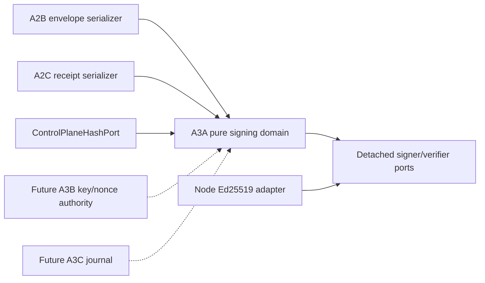

# P17-014 A3A — Detached Envelope and Receipt Signing Plan

Date: 2026-08-17
Status: implementation input locked; source behavior not yet complete
Parent: `P17-014` A3 — machine crypto and worker journal ports
Predecessor: A2D source `38888187c4191206dbb81562ccb387463fcbbc76` and evidence
`c8e7cc2cc636b9d4957a3802e2c3d8791c166e2a`

Decision lock:

`slice=A3A, signature=S1, envelope=E1, receipt=R1, canonical=C1, keyref=K1, ed25519=D1, sequence=Q1, evidence=V1`

## Reconciled starting state

The A2 layer is complete and immutable at the A3A input boundary. A2B owns the exact validated
execution-envelope shape and exports `serializeControlPlaneExecutionEnvelope`. A2C owns the exact
validated receipt shape and hash but its canonical receipt serializer is private. A2D proves the
P17-015 binding, projection, terminal evidence, and linear retry lineage without signing or durable
journal behavior.

ADR-003 selects per-machine Ed25519 signing. P17-016 tenant attestation deliberately exposes an
abstract proof port and uses a deterministic test proof; it is not a reusable real Ed25519 adapter.
There is no existing production Ed25519 signer/verifier, key store, nonce repository, journal,
network listener, or remote execution path to preserve.

The A3 parent slice also names request nonce/time-window checks, key rotation/revocation, and a
transactional worker journal. Those concerns are security-critical but independently testable, so
A3 is split rather than coupling all three failure domains into one change.

## Locked A3A decisions

### S1 — One exact detached-signature envelope

A3A introduces one exact detached wrapper for either an A2B execution envelope or an A2C execution
receipt. The algorithm is exactly Ed25519. `payloadKind` is `execution_envelope` or
`execution_receipt`; `signerKind` is `control_plane` or `worker_machine`. Envelope signatures require
`control_plane`; receipt signatures require `worker_machine`.

The wrapper contains exactly `schemaVersion`, `contractVersion`, `algorithm`, `payloadKind`,
`signerKind`, `tenantId`, `signerId`, `keyId`, `keyVersion`, `signedAt`, `payloadHash`, and
`signature`. It is detached: the signature wrapper never rewrites the A2 payload. Validation returns
a deeply frozen signature reference plus the independently validated payload and never treats a
valid signature as execution, tenant-membership, key-authorization, or persistence authority.

### E1 — A2B envelope signing uses its owned serializer

Envelope payload bytes come only from `serializeControlPlaneExecutionEnvelope`. The signing domain
first invokes the A2B validator/serializer with the caller-supplied registry and hash port, then
binds the resulting canonical bytes to the detached wrapper. It does not duplicate envelope keys,
normalize a second shape, accept partial envelopes, or sign caller-provided arbitrary bytes.

The wrapper `tenantId` must equal the envelope tenant. The envelope `signerId` is an opaque Control
Plane signer reference and is not inferred from a machine or provider identifier.

### R1 — A2C receipt signing requires an owned serializer

A2C exports `serializeControlPlaneExecutionReceipt`. It validates the full receipt against the exact
A2B envelope and operation registry, then returns the same canonical full-receipt bytes used by the
receipt owner. A3A calls only that serializer; it does not reproduce receipt field order.

The wrapper `tenantId` must equal the receipt tenant, and the receipt `signerId` equals the envelope
`machineId`. A signature cannot change the receipt outcome, evidence hashes, result hash, progress
tail, or receipt hash. The serializer addition changes no A2C state decision.

### C1 — Canonical bytes are domain-separated and fixed-key

Signed bytes are one fixed-key canonical JSON object containing an explicit protocol domain,
signature contract version, algorithm, payload kind, signer kind, tenant/signer/key reference,
canonical signing time, and the SHA-256 payload hash. The domain separator differs by payload kind,
so envelope bytes cannot verify as receipt bytes and receipt bytes cannot verify as envelopes.

The canonicalizer constructs every key explicitly and never serializes an unvalidated caller object.
Object key-order permutation therefore produces identical signing bytes, while every semantic field
change produces different bytes. `ControlPlaneHashPort` remains the injected SHA-256 owner for
payload hashing; a thrown, malformed, or misleading constant hash output is rejected or exposed by
real-vector comparison rather than accepted as a signature shortcut.

### K1 — Signature key references are opaque and authorization-neutral

`signerId` and `keyId` are bounded opaque identifiers; `keyVersion` is a positive safe integer.
They contain no path, secret, raw public key, private key, provider credential, URL, or tenant policy.
`signedAt` is canonical UTC metadata, not an ambient clock read. A3A verifies that the supplied
public key cryptographically matches the wrapper but does not decide whether that key is enrolled,
active, rotated, revoked, or authorized for the tenant.

Signature and public-key wire values use base64url without padding. Malformed alphabet, padding,
empty values, oversized values, and non-canonical round trips fail closed without echoing the value.

### D1 — The Node adapter is real Ed25519 with closure-local private keys

The infrastructure adapter uses Node's Ed25519 implementation. It can generate a key pair or accept
an explicitly injected private-key object, returns a public SPKI key plus a signer closure, and
verifies with an explicit public SPKI key. The private key remains closure-local: no property,
serialization, debug representation, return value, callback argument, or error exposes it.

Node crypto is isolated in `control-plane-signing-node.ts`. The pure signing domain imports no
runtime, filesystem, environment, process, provider, dashboard, network, console, or key-storage
module. Generation is explicit adapter behavior, never module-load behavior.

### Q1 — A3 remains split into A3A/A3B/A3C

A3A owns payload canonicalization, detached signature validation, pure signer/verifier ports, and
the real Node Ed25519 adapter. A3B owns worker-request signing, nonce/time-window, rotation,
revocation, and key authorization. A3C owns the transactional journal port and disposable
implementation, including crash and restart behavior.

This sequence prevents a cryptographic primitive from silently becoming an enrollment system or a
durability claim. A3B must compose A3A with an authorized key-set and durable nonce decision. A3C
must compose the signed payload with a transactional journal before any worker execution path exists.

### V1 — Evidence uses real vectors and exact predecessor topology

Evidence must identify the exact A3A source commit and its exact A2D predecessor topology. Focused
tests include a generated real Ed25519 vector, a fixed imported test vector, cross-key denial, all
metadata/payload tamper cases, canonical permutation, closed port failures, and a private-key
non-export scan. Strict TypeScript and predecessor/neighbor suites run before the complete kit.

The source commit and one metadata-only evidence commit remain separate. Evidence records every
RED, harness correction, source manifest, exact command/result, backup identity, preservation check,
and non-claim. A green aggregate does not replace a missing focused attack invocation.

## Exact contracts

The pure module exports these semantic contracts, with final naming allowed only when the behavior
test locks the same meanings:

- `ControlPlaneSignedPayloadKind = 'execution_envelope' | 'execution_receipt'`;
- `ControlPlaneSignerKind = 'control_plane' | 'worker_machine'`;
- an exact deeply frozen detached signature reference containing the S1 fields;
- `ControlPlaneDetachedSignerPort.sign(canonicalBytes)` returning a signature string;
- `ControlPlaneDetachedVerifierPort.verify(canonicalBytes, signature)` returning a boolean;
- pure create/validate functions specialized for envelope and receipt payload ownership;
- a public canonical-signing-byte serializer that accepts only a validated signature reference;
- a Node factory returning the public SPKI key and signer closure; and
- a Node verifier factory bound to an explicit public SPKI key.

All port calls are wrapped. Signer exception and verifier exception map to stable closed contract
errors. A false verifier result is a signature failure, not an exception leak. Errors name only a
stable context/code and never include payloads, signatures, public keys, private keys, or port text.

Envelope creation validates the payload, derives canonical bytes, computes the payload hash, signs
the domain-separated metadata, and returns the wrapper. Envelope validation repeats those steps and
requires the exact wrapper/payload relationship. Receipt creation/validation follows the same order
but additionally binds `signerId` to the envelope machine.

## Clean Architecture and source ownership

Canonical ownership is one-way:

- A2B owns envelope validation and serialization;
- A2C owns receipt validation and serialization;
- A3A owns only signing metadata/bytes and cryptographic port composition;
- the Node adapter owns runtime Ed25519 mechanics, not domain authorization;
- A3B owns request freshness and authorized key-set decisions; and
- A3C owns durable delivery/execution/receipt state.

No A3A module imports an A3B/A3C, dashboard, provider-distribution, or target concern.

## Attack and test matrix

The focused suite must invoke every row directly:

| Group | Required attacks and invariants |
|---|---|
| Envelope | real round trip; changed envelope after signing; tenant mismatch; signer-kind mismatch; payload hash tampering; signature tampering |
| Receipt | real round trip; changed receipt after signing; receipt machine mismatch; outcome/evidence/result drift; immutable validated result |
| Separation | payload-kind confusion; cross-protocol replay; envelope signature against receipt bytes; receipt signature against envelope bytes |
| Key reference | key ID or version drift; signer ID drift; wrong public key; zero/unsafe key version; oversized/empty opaque IDs |
| Canonicality | key-order permutation; altered canonical bytes; extra field; prototype; accessor; cycle; non-canonical time |
| Encoding | malformed base64url; padding; invalid alphabet; empty/oversized signature or public SPKI value |
| Ports | signer exception; verifier exception; false verification; malformed signer output; constant hash output |
| Adapter | generated real vector; fixed imported vector; public-key mismatch; deterministic verification; private-key export or log denial |
| Boundary | no ambient clock; no private key in domain wrapper; no key authorization; no nonce/journal/network/runtime import in pure source |

The suite also repeats A2B/A2C validation attacks through the signing entry points so no signature API
becomes a weaker alternate parser. All attacker objects are built without invoking accessors during
test setup.

## Implementation and verification sequence

1. Run the standalone readiness validator before plan/registration and retain the exact three-gap RED.
2. Add this plan and register its focused/full-kit command; make the plan validator GREEN.
3. Add/register the behavior suite while both signing modules are absent; retain the missing-module or
   missing-export RED before implementing behavior.
4. Export the A2C receipt serializer and prove it is byte-identical across key permutations.
5. Implement the pure detached-signing contracts and closed port composition.
6. Implement the isolated real Node Ed25519 adapter without a private-key export.
7. Run focused tests unchanged, then strict TypeScript and code review; add explicit regression attacks
   for every discovered fail-closed gap.
8. Run A2A/A2B/A2C/A2D, P17-015, parent/topology/roadmap, operation-domain, provider, and P17-016
   companions plus exact-manifest/static safety checks.
9. Run the authoritative complete kit; commit the exact source manifest through the normal hook.
10. Repeat focused/strict/companions/full-kit at the exact immutable source SHA, then add and separately
    commit one metadata-only evidence file.

## A3A source manifest

The exact source checkpoint contains only:

- `docs/roadmap/p17-014-a3a-detached-signing-plan.md`;
- `scripts/post-17-control-plane-a3a-plan.test.ts`;
- `docs/roadmap/p17-014-control-plane-implementation-plan.md`;
- `packages/core/src/control-plane-state.ts`;
- `packages/core/src/control-plane-signing.ts`;
- `packages/core/src/control-plane-signing-node.ts`;
- `packages/core/test/control-plane-signing.test.ts`;
- `packages/core/README.md`; and
- `package.json`.

Closeout adds only `docs/evidence/post-17-control-plane-a3a-detached-signing-2026-08-17.md` in a
separate evidence commit whose sole parent is the source checkpoint.

## Rollback

Before commit, restore only the exact A3A manifest from the verified 2026-08-17 kit snapshot or the
known clean predecessor. After commit, revert the local source/evidence commits; do not reset or
overwrite unrelated user work. A failed update must not leave a partial serializer/signing boundary.

Rollback cannot authorize sync, push, enrollment, remote execution, target edits, or use of a private
key outside the adapter closure. The daily backup and `backup/2026-08-17` tag remain recovery inputs,
not release or deployment evidence.

## Non-claims

A3A does not claim key storage, enrollment, key authorization, rotation, revocation, nonce storage,
freshness policy, worker-request authentication, a transactional journal, crash recovery, persistence,
an API, listener, worker process, provider integration, UI, distribution package, or remote execution.

No database, browser, provider, network, dashboard source, sync, push, merge, deployment, target edit,
or target `.Codex` modification is authorized or performed by this slice. A valid detached signature
proves only possession of the corresponding private key over exact canonical bytes; it grants no
tenant membership, operation capability, execution permission, or completion status.
