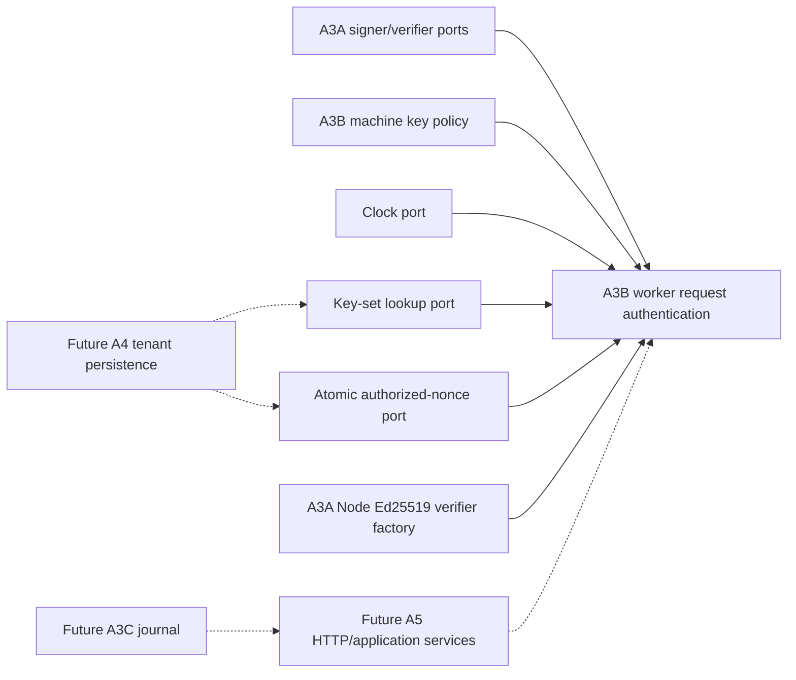

# P17-014 A3B — Worker Request Authentication and Machine Key Lifecycle Plan

Date: 2026-08-17
Status: implementation input locked; source behavior not yet complete
Parent: `P17-014` A3 — machine crypto and worker journal ports
Predecessor: A3A source/evidence `2a96bd7e052b6e7753e96cc255cba20583369b3c` /
`f56288ca19bb727d228fbaf6c4a95b315acda2c6`, plus repository-boundary source/evidence
`3b1fab07ca7274a35d3cad64d1cdd04417c4da85` /
`ecd4d8e04717765d0a0ed389b068c841de5b4962`

Decision lock:

`slice=A3B, request=W1, path=P1, freshness=F1, nonce=N1, keyset=K1, rotation=R1, revocation=V1, composition=C1, sequence=Q1, evidence=E1`

## Reconciled starting state

ADR-003 M1 requires each post-enrollment worker request to bind method, canonical path,
tenant-bound machine identity, key version, timestamp, one-use nonce, and SHA-256 body hash. It also
requires rotation and immediate revocation without a long-lived worker bearer token.

A3A already owns exact domain-separated Ed25519 signatures for A2B envelopes and A2C receipts. It
exports pure signer/verifier ports and an isolated real Node Ed25519 adapter, but deliberately treats
key references as authorization-neutral and performs no clock, nonce, rotation, revocation, key-set,
request, persistence, or route decision.

The parent A3 slice is locally derivable before privacy-gated persistence. No A3B plan, production
module, behavior suite, database adapter, HTTP route, enrollment grant, key store, worker process, or
network listener exists. P17-016 therefore blocks A4 persistence and later remote execution, but it
does not block pure A3B contracts and injected ports.

A3B closes only the pure worker-request and key-lifecycle boundary. A3C still owns the transactional
execution journal and crash recovery. A4 later owns durable tenant-scoped key and nonce repositories.
A5 later owns authenticated HTTP/application composition. A6 later owns local private-key storage,
secure nonce generation, worker polling, and process execution.

## Locked A3B decisions

### W1 — One exact worker-request signature wrapper

A3B introduces one exact detached worker-request signature. The algorithm is exactly Ed25519 and the
method is exactly POST. The wrapper contains exactly:

- `schemaVersion` and `contractVersion`;
- `algorithm`;
- `requestKind`;
- `method` and `canonicalPath`;
- `tenantId` and `machineId`;
- `keyId` and `keyVersion`;
- canonical `signedAt`;
- canonical 32-byte `nonce` encoded as unpadded base64url;
- SHA-256 `bodyHash`; and
- canonical Ed25519 `signature`.

The wrapper never contains the body, public key, private key, host, scheme, query, fragment, header,
cookie, authorization value, credential, path alias, repository path, provider output, or generic
message. Validation returns a deeply frozen exact value. A valid cryptographic signature alone does
not grant tenant membership, machine enrollment, operation capability, lease authority, execution,
or persistence permission.

### P1 — Request kind derives the canonical POST path

The request kind is closed to `claim`, `heartbeat`, `events`, `complete`, or `key_rotate`.

- `claim` derives `/api/control-plane/v1/worker/leases/claim` and has no lease ID.
- `heartbeat`, `events`, and `complete` derive the corresponding path under one lowercase UUID lease
  ID.
- `key_rotate` derives `/api/control-plane/v1/worker/keys/rotate` and has no lease ID.

The caller cannot supply an arbitrary path. The create and authenticate entry points receive the
request kind plus the expected lease ID and derive the canonical path internally. Query strings,
fragments, percent-encoding alternatives, duplicate separators, trailing slashes, case variants,
host/scheme changes, and kind/path mismatches never enter canonical signing bytes.

The canonical path is derived from request kind and lease ID; neither value is inferred from an
attacker-supplied path string.

The exact body string is bounded to 64 KiB before hashing. A3B signs its UTF-8 bytes but does not
interpret its JSON schema; A5 later validates each route body through the owning application
contract before authorizing a mutation.

The body is bounded to 64 KiB before hashing, including multi-byte UTF-8 input.

### F1 — Freshness uses an injected clock and fixed bounds

Authentication reads one canonical UTC value through an injected clock port. `signedAt` is at most
60 seconds old and future skew is at most 30 seconds. Both inclusive boundary values are accepted;
one millisecond outside either bound is denied.

The clock is never ambient. A thrown, malformed, repeated, non-canonical, or non-finite clock value
fails closed as unavailable. The signature create function receives explicit `signedAt`; it does not
read time or imply that a request was transmitted.

Nonce retention expires at `signedAt + 60 seconds`. A nonce accepted from the maximum future-skew
boundary is therefore retained until every request carrying that timestamp is stale.

### N1 — Nonce consumption is atomic with key-set CAS

The nonce is exactly 32 random bytes encoded as canonical base64url without padding. A3B validates
that wire contract but does not generate randomness. Fixed public nonces are allowed only in tests.

After every structural, path, body-hash, freshness, key-authorization, and Ed25519 verification check
succeeds, A3B derives a domain-separated nonce hash that binds tenant, machine, key ID, key version,
and nonce. The raw nonce is never passed to the persistence port.

`ControlPlaneWorkerRequestNoncePort.consumeAuthorized` receives the nonce hash, signed/observed/
expiry times, requested kind, key reference, and the key-set version observed before signature
verification. Its A4 implementation must atomically recheck the current machine key set and consume
the nonce in one tenant-scoped transaction. The closed outcomes are `accepted`, `replayed`,
`key_changed`, or `denied`.

The machine key set version is rechecked atomically with nonce consumption; a stale lookup cannot
authorize the commit.

A replay, key-set change, denial, malformed port result, or port exception causes zero authenticated
success. No nonce call occurs for a malformed, stale, wrong-body, wrong-key, or invalid-signature
request.

### K1 — Machine key sets are exact, bounded, and authorization-only

`ControlPlaneMachineKeySet` contains exactly schema/contract version, tenant ID, machine ID,
monotonic `setVersion`, nullable `activeKeyVersion`, and a sorted array of at most eight public key
records. Each key record contains exactly key ID, positive key version, canonical public SPKI
base64url, state, activation time, retirement deadline, and revocation time.

Key states are `active`, `retiring`, or `revoked`:

- an active set has exactly one active record whose version equals `activeKeyVersion`;
- a retiring record has one canonical retirement deadline and no revocation time;
- a revoked record has one canonical revocation time and no retirement deadline;
- key IDs and versions are unique and records are sorted by ascending version; and
- the active key is the highest version and cannot predate its activation time.

The set is deeply frozen and contains public authorization metadata only. It contains no private key,
grant, actor, email, hostname, IP, credential, provider value, database row identity, or secret.

`ControlPlaneMachineKeySetPort.resolve` accepts only tenant and machine UUIDs and returns an unknown
value that A3B validates exactly. Missing, malformed, wrong-tenant, wrong-machine, or exceptional
lookup produces the same public `worker_request_denied` or `worker_request_unavailable` outcome; it
must not expose cross-tenant existence.

A key lookup exception is unavailable and never becomes an empty or legacy key-set success.

### R1 — Rotation has one bounded non-renewable overlap

The initial pure key-set factory starts at set version 1 with one active key at key version 1. This
factory consumes an already authorized public-key input; it does not implement enrollment or prove a
grant.

Rotation requires:

- the exact current `setVersion`;
- an authenticated key ID/version matching the current active key;
- a new unique key ID and public SPKI;
- new key version exactly current active version plus one;
- canonical rotation and grace-expiry times; and
- grace strictly after rotation and at most five minutes later.

The result increments `setVersion`, changes the old active key to `retiring`, and adds the new active
key. Rotation cannot renew an already retiring key, extend an existing grace deadline, skip a key
version, reuse a public-key reference, exceed eight records, or authenticate through a retiring key.

Rotation grace is at most five minutes. Retiring keys cannot authorize `key_rotate`.

Retiring keys may authenticate only non-rotation worker requests while both `signedAt` and the server
observation time are inside the original grace deadline. The grace deadline is signed indirectly
through the resolved key-set version and is rechecked by the atomic nonce port.

### V1 — Revocation is immediate with no key fallback

Revocation requires exact current set version, exact key ID/version, and a canonical revocation time
not before activation. It increments `setVersion` and changes the target to `revoked` immediately.
Repeating the exact already-applied revocation is idempotent; conflicting revocation metadata is
rejected.

Revoked keys are denied immediately even inside freshness or grace windows. Revoking the active key
sets `activeKeyVersion` to null. It never promotes, reactivates, or falls back to an older retiring
key. A later enrollment-grant recovery belongs to A4/A5 and must create explicitly authorized new
state; A3B provides no restore shortcut.

Revoking the active key never promotes or falls back to an older key.

### C1 — Verification order closes replay and rotation races

Authentication order is fixed:

1. validate exact wrapper, expected request kind/lease ID/path, body bound, body hash, and canonical
   freshness input;
2. read the injected clock exactly once and enforce F1;
3. resolve and exactly validate the tenant/machine key set;
4. authorize the requested key for kind, signed time, observed time, state, and grace policy;
5. create a verifier from that record's public SPKI and verify fixed canonical signing bytes;
6. derive the domain-separated nonce hash without exposing the raw nonce; and
7. atomically consume the nonce while rechecking the observed key-set version.

Signature verification occurs before nonce consumption so attackers cannot exhaust nonce storage
with forged signatures. Atomic key-set-version recheck occurs after signature verification so a
concurrent rotation or revocation cannot pass through a stale public-key lookup. `key_changed` is a
closed denial; the caller must build and sign a new request after re-resolving current state.

The result is deeply frozen. Public denial uses only `worker_request_denied` or
`worker_request_unavailable`; a bounded audit code distinguishes invalid, stale, key, signature,
replay, race, and dependency failures for closed aggregate metrics. Errors and results never echo
body, nonce, signature, public key, port text, path input, or attacker values.

### Q1 — A3B stops before persistence, routes, and worker runtime

A3B owns only pure key lifecycle, request canonicalization, policy decisions, and injected port
composition. It adds no Supabase/Postgres schema, repository adapter, RPC, HTTP handler, session,
RBAC, CSRF/origin rule, enrollment grant, private-key storage, nonce generator, worker loop, journal,
process, network client, listener, provider adapter, dashboard UI, or distribution artifact.

A3C owns transactional journal and crash recovery. A4 owns privacy-gated machine-key and nonce
persistence. A5 owns routes/application services and external reason-code mapping. A6 owns secure
local key/nonce infrastructure and outbound worker behavior.

### E1 — Evidence proves real crypto plus state and port attacks

Focused evidence must use the real A3A Node Ed25519 adapter for positive and wrong-key cases, fixed
canonical request vectors, exact key-set transitions, explicit clock boundaries, and an in-memory
atomic nonce port with replay and concurrent key-change attacks.

Evidence records the readiness RED, behavior missing-module RED, every review correction, exact
source manifest, strict TypeScript, predecessor/neighbor commands, full kit, public naming review,
runtime-language decision, backup identity, preservation checks, and non-claims. Source and evidence
remain separate commits. A future stacked PR targets exact evidence head `ecd4d8e...`; remote CI does
not replace local focused attacks.

## Exact contracts

The machine-key module exports these semantic contracts, with final names accepted only when tests
lock the same behavior:

- `CONTROL_PLANE_MACHINE_KEY_SCHEMA_VERSION` and contract version;
- `ControlPlaneMachineKeyState = 'active' | 'retiring' | 'revoked'`;
- exact deeply frozen `ControlPlaneMachineKeyRecord` and `ControlPlaneMachineKeySet` values;
- `createControlPlaneMachineKeySet` for an already authorized initial public key;
- `validateControlPlaneMachineKeySet`;
- `rotateControlPlaneMachineKeySet` with active-key and expected-set-version CAS;
- `revokeControlPlaneMachineKeySet` with idempotent exact replay and no fallback; and
- `authorizeControlPlaneMachineKey` returning a closed decision for request kind/time/state.

The request-auth module exports:

- worker-request schema/contract/freshness/body constants and closed request/audit codes;
- exact `ControlPlaneWorkerRequestSignature` and signature metadata input;
- `ControlPlaneMachineKeySetPort`, `ControlPlaneWorkerRequestNoncePort`, injected clock, and verifier
  factory ports;
- `createControlPlaneWorkerRequestSignature`;
- `validateControlPlaneWorkerRequestSignature`;
- `serializeControlPlaneWorkerRequestSignatureBytes`; and
- asynchronous `authenticateControlPlaneWorkerRequest` returning a closed deeply frozen result.

The create path reuses `ControlPlaneDetachedSignerPort`; authentication reuses
`ControlPlaneDetachedVerifierPort` through a factory. Tests bind that factory to
`createNodeEd25519Verifier`. `ControlPlaneHashPort` remains the SHA-256 owner and must pass the empty
SHA-256 known vector before body or nonce hashes are trusted.

## Clean Architecture and source ownership

Canonical ownership is one-way:

- `control-plane-machine-keys.ts` owns only public key-set shape and lifecycle policy;
- `control-plane-worker-request-auth.ts` owns request bytes, freshness, authorization order, and
  port composition;
- `control-plane-signing.ts` and `control-plane-signing-node.ts` remain the crypto primitive owners;
- A4 implements the ports transactionally under P17-016; and
- A5/A6 consume these contracts without reimplementing canonical bytes or key decisions.

Neither A3B module imports Node, filesystem, environment, process, network, dashboard, provider,
privacy repository, journal, or target code. There is no reverse import from A3A into A3B.

## Attack and test matrix

| Group | Required attacks and invariants |
|---|---|
| Initial key set | exact keys; one active v1; deep freeze; malformed SPKI; duplicate/unsorted/oversized key set; extra/prototype/accessor/cycle/hidden/symbol input |
| Rotation | active authorization; exact +1 version; bounded grace; stale CAS; duplicate key/public reference; retiring-key rotation attempt; rotation grace extension; eight-key cap |
| Revocation | active and retiring revocation; revoked active key; old-key fallback; exact idempotent replay; conflicting replay; stale CAS; no restore |
| Request path | five kinds; exact POST; derived claim/lease/key paths; wrong lease ID; request-kind confusion; canonical-path confusion; query/fragment/case/encoding alternatives |
| Body/signature | real Ed25519 round trip; changed body after signing; empty body; oversized UTF-8 body; wrong key ID or version; wrong public key; signature tampering; constant hash output |
| Freshness | exact now; inclusive stale/future bounds; stale timestamp; future timestamp; invalid signed time; malformed/throwing/repeated clock |
| Nonce | canonical 32-byte encoding; padding/alphabet/length variants; nonce replay; raw nonce not passed; nonce-store exception; malformed result; no consume before signature success |
| Key authorization | wrong tenant or machine; unknown key; active; retiring in/out of grace; retiring-key rotation attempt; revoked key; no cross-tenant existence signal |
| Concurrency | key rotation between lookup and nonce commit; revocation between lookup and commit; key-set version mismatch; replay race accepts at most one |
| Structure/errors | extra field; prototype; accessor; cycle; hidden property; symbol property; port error echo; body/nonce/signature/public-key non-echo |
| Boundary | no ambient clock; no Node/platform/network/persistence import; A3A remains nonce/key-policy neutral; no journal/route/worker behavior |

All attacker objects are constructed without invoking accessors during test setup. Negative source
scans require positive controls or a second matching method before becoming findings.

## Implementation and verification sequence

1. Add the standalone plan validator before the plan/registrations and retain the exact three-gap
   readiness RED.
2. Add this plan, parent ownership rows, and focused/full-kit plan registration; require plan GREEN.
3. Add and register both focused behavior suites while production modules are absent; retain the
   missing-module or missing-export RED from each suite.
4. Implement exact machine key-set validation, initial state, rotation, revocation, and authorization
   decisions without a platform import.
5. Implement exact worker-request creation/validation/canonical bytes and body/freshness policy.
6. Compose key lookup, real verifier factory, and atomic authorized-nonce consumption in the fixed C1
   order; keep every dependency behind a port.
7. Run focused suites unchanged, then strict TypeScript and code review; add explicit regression
   attacks for every discovered fail-closed gap.
8. Run A2A-A2D, A3A, P17-015, parent/topology/roadmap, privacy/tenant, provider, and repository-boundary
   companions plus exact-manifest/static safety checks.
9. Run the authoritative complete kit and commit the exact source manifest through the normal hook.
10. Repeat focused/strict/companions/full-kit at the immutable source SHA, then add and separately
    commit one metadata-only evidence file.
11. Publish one stacked A3B feature PR only after local source/evidence proof. Merge it only when its
    own checklist and predecessor PR/dependency order are fully green.

## Public naming review

Public names use `ControlPlaneMachineKey` and `ControlPlaneWorkerRequest` prefixes and describe
protocol responsibility rather than Supabase, dashboard, provider, or implementation location.
`consumeAuthorized` states the nonce port's transaction obligation; `setVersion` states its CAS
boundary. No name claims enrollment, storage, network delivery, execution, or durability.

The request path vocabulary follows ADR-003 route naming. `key_rotate` is a closed request kind whose
future route remains disabled; it is not a claim that an endpoint exists.

## Runtime-language decision

Rust, Go, and Python were considered. TypeScript remains the correct language for A3B because the
feature is bounded contract validation and asynchronous port orchestration over existing TypeScript
A2/A3A types. Real Ed25519 operations already execute in Node's native crypto implementation, not in
handwritten TypeScript.

No measured request-auth latency, key-set size, memory, throughput, binary-size, or capability limit
is breached. Rust or Go would add FFI/sidecar, cross-platform build, key-lifetime, and distribution
surfaces before a measured need. Python would add a second runtime and cryptography/package boundary
without supplying a missing method. Revisit Rust or Go only if a later worker profile misses the
accepted signing/journal/dispatch budget; Python remains suitable for offline analysis, not this
trust boundary without evidence.

## A3B source manifest

The exact source checkpoint is limited to:

- `docs/roadmap/p17-014-a3b-worker-request-auth-plan.md`;
- `scripts/post-17-control-plane-a3b-plan.test.ts`;
- `docs/roadmap/p17-014-control-plane-implementation-plan.md`;
- `packages/core/src/control-plane-machine-keys.ts`;
- `packages/core/src/control-plane-worker-request-auth.ts`;
- `packages/core/test/control-plane-machine-keys.test.ts`;
- `packages/core/test/control-plane-worker-request-auth.test.ts`;
- `packages/core/README.md`; and
- `package.json`.

Closeout adds only `docs/evidence/post-17-control-plane-a3b-worker-request-auth-2026-08-17.md` in a
separate evidence commit whose sole parent is the source checkpoint.

## Rollback

Before commit, restore only the exact A3B manifest from the verified 2026-08-17 kit snapshot or the
known clean predecessor. After commit, revert the source/evidence commits without resetting or
overwriting unrelated work. A failed update must not leave one behavior suite registered without its
module or one key/request module without the other composition proof.

Because A3B creates no stored key, nonce, route, worker, database row, process, or remote request,
rollback requires no credential revocation, migration, deployment, network, dashboard, or target
repair.

## Non-claims

A3B does not implement or prove enrollment grants, private-key generation/storage/permissions,
cryptographic nonce generation, tenant persistence, database CAS, RPCs, HTTP routes, server auth,
RBAC, CSRF/origin, worker polling, lease mutation, progress writes, transactional journal, crash
recovery, process execution, provider integration, dashboard UI, distribution packaging, remote
execution, deployment, or P17-014 completion.

No database, browser, network, provider, dashboard source, sync, push, merge, tag, release, target
edit, or target `.Codex` modification is authorized or performed by this slice. Port behavior is a
contract for later A4/A5 proof; an in-memory test port is not durable persistence evidence.
