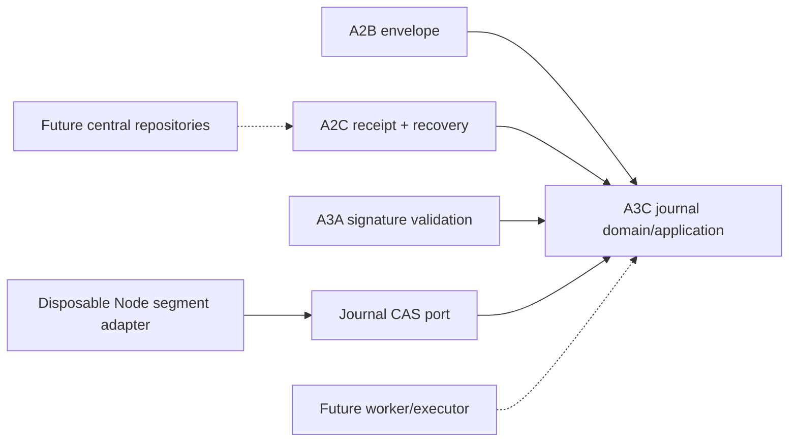

# P17-014 A3C — Transactional Worker Journal and Crash Recovery Plan

**Status:** Implemented locally; source/evidence checkpoint pending
**Date:** 2026-08-17
**Roadmap task:** P17-014
**Accepted topology:** `topology=T1, machine=M1, execution=X1, replay=R1, e2e=E1, scale=S1`
**A3C lock:** `slice=A3C, journal=J1, binding=B1, state=S1, transaction=T1, storage=F1, crash=C1, replay=R1, recovery=Q1, evidence=E1`

## Outcome

A3C closes the last locally derivable A3 boundary: a signed-delivery worker journal whose state can
survive a disposable-process restart without claiming exactly-once transport. The slice combines a
pure exact-schema journal/application boundary with one explicitly configured Node filesystem
adapter. It proves that execution cannot begin until journal prepare is committed, redelivery cannot
change the signed envelope, an available signed receipt can be replayed after restart, and an
ambiguous side effect cannot be guessed into success or automatic redispatch.

The filesystem adapter has no production default journal directory. Tests construct it only over an
injected absolute disposable directory. A6 will decide the production worker location, lifecycle,
permissions, packaging, cleanup, executor, and process wiring. A3C starts no process, operation,
listener, client, provider, or network request.

## Reconciled starting state

A2B already owns the exact execution envelope, stable delivery/lease identity, operation descriptor,
canonical serialization, and envelope hash. A2C owns task/lease/receipt validation and the recovery
vocabulary `not_started`, `execution_started`, `receipt_available`, or `unknown`. Its
`decideControlPlaneLeaseRecovery` function keeps active leases waiting, reclaims a prepared but
unstarted lease, replays a receipt, permits a new attempt only for an expired read-only execution,
and requires manual recovery for unknown side effects.

A3A owns detached envelope/receipt signatures, canonical signature bytes, pure signer/verifier
ports, and the real Node Ed25519 adapter. A3B owns request freshness, authorized nonce consumption,
and public machine-key lifecycle; it intentionally stops before journal or worker behavior. The
accepted ADR-003 requires an atomically persisted delivery ID, envelope hash, operation ID, journal
state, and eventual receipt hash before remote execution can exist.

The repository has a small CLI atomic-output helper and a separately planned P17-016 local
compatibility store. Neither is the A3C domain: the helper replaces one report without delivery
semantics, and the compatibility plan explicitly reserves different run/orchestrator data. A3C may
reuse the proven dual-copy principle, but it must not import `.claude`, dashboard, P17-016 storage,
or provider code. No `.codegraph` index exists in this repository, so reconciliation used the
canonical roadmap, ADR, and current source directly.

## Locked A3C decisions

### J1 — One exact signed-delivery journal

One entry retains the validated signed envelope plus the minimal recovery state and optional
validated signed receipt. Retaining the signed envelope lets restart validation use the same A2B and
A3A owners instead of trusting a loose hash tuple. The entry contains no private key, credential,
raw path, URL, arbitrary environment, provider output, evidence body, log, prompt, or spec.

The exact entry contains schema/contract version, journal revision, state-change time, the signed
envelope payload/signature, journal state, optional signed receipt payload/signature, optional
acknowledgement time, and a domain-separated record hash. Envelope-derived tenant, machine,
delivery, lease, task, operation, contract, replay class, and envelope/receipt hashes remain
available from their canonical owners; the journal does not copy them into a divergent schema.

A trusted Control Plane verifier validates the signed envelope. A trusted worker verifier validates
the signed receipt. A3C reuses `validateControlPlaneEnvelopeSignature`,
`validateControlPlaneReceiptSignature`, and `ControlPlaneHashPort`; it does not redefine signature
bytes, payload hashes, key authorization, nonce policy, or Ed25519 mechanics.

### B1 — The journal key binds tenant, machine, and delivery

The journal key is exactly tenant ID, machine ID, and delivery ID. Every method requires all three
lowercase UUIDs. The key must match the signed envelope identity and, when present, the signed receipt
identity. A tenant, machine, or delivery mismatch is a closed conflict without an existence signal.

The Node adapter derives its directory name from a domain-separated SHA-256 digest of the exact
canonical key. Raw tenant, machine, delivery, task, repository, path, or operation input never
appears in a filename, temporary filename, error, or adapter result.

### S1 — Journal states reuse the A2C recovery vocabulary

The journal state is exactly `not_started`, `execution_started`, `receipt_available`, or `unknown`.
A newly prepared entry is `not_started`. A committed start transition makes it
`execution_started`. A validated signed receipt makes it `receipt_available`. An explicit ambiguous
executor outcome can move `execution_started` to `unknown`; no other state can become unknown.

Receipt availability requires both exact receipt payload and detached signature. Other states carry
neither. An acknowledgement timestamp is allowed only with `receipt_available`; acknowledgement
never deletes the replayable receipt. The journal produces an exact A2C recovery observation and
composes it with `decideControlPlaneLeaseRecovery`; it never invents a second recovery policy.

### T1 — Every transition is a monotonic compare-and-set

Journal revision is a positive monotonic safe integer. Prepare creates revision 1. Start, receipt,
unknown, and acknowledgement each require the exact current revision and commit exactly current + 1.
Idempotent repetition returns the current immutable entry without incrementing revision. Overflow,
stale revision, a skipped revision, or a conflicting idempotency replay fails closed.

The application port loads an unknown persisted value and compare-and-sets one validated next entry.
Every loaded value is revalidated before use. Compare-and-set accepts at most one writer for an
expected revision. A port exception, malformed response, or conflict maps to a stable closed result
or contract error that never echoes the stored value, key, path, receipt, signature, or port text.

### F1 — The disposable Node adapter uses exclusive append-only commits

The adapter accepts one explicit absolute non-root directory and exposes no environment lookup or
production default. Existing path segments and the journal root must not be symlinks or Windows
reparse points. Tests inject only a fresh temporary root; target repositories and `.claude`
directories are forbidden locations.

Each delivery key owns a digest-named directory. Each revision is one bounded immutable committed
segment. A transaction re-reads the highest valid revision, checks the expected revision, serializes
an exact storage wrapper, writes a unique same-directory temporary segment with exclusive create,
flushes and closes it, then publishes it to the revision filename using an exclusive hard link.
Committed segments are published exclusively after file flush and close. The prior segment remains
available throughout publication. Temporary segments are never selected as committed state.

The wrapper binds storage version, key hash, revision, entry bytes, and SHA-256 digest. Every
committed segment is independently bounded, parsed, and integrity-checked before selection. Corrupt
committed history fails closed rather than rolling back to a state that might predate execution or a
receipt. Missing history is empty only when no committed segment exists. The adapter caps one entry
at 384 KiB and one delivery at eight committed transitions; it performs no retention or production
compaction.

### C1 — Crash ordering prevents unjournaled execution

Operation cannot start before a prepared journal entry commits. The A3C start method only marks
authority; it does not invoke an executor. A6 must call its compiled executor only after receiving a
committed `execution_started` entry and must record a signed receipt before attempting server
acknowledgement.

The four required crash points have deterministic restart state:

1. crash before journal prepare leaves no entry and therefore no execution authority;
2. crash after prepare before execution reloads `not_started` and may resume the same signed delivery;
3. crash after execution starts before receipt reloads `execution_started` and routes through A2C
   recovery instead of executing again; and
4. crash after receipt before acknowledgement reloads `receipt_available` and replays the same
   signed receipt.

A torn temporary segment is ignored because it was never published. Write, flush, close, publish,
permission, and storage-exhaustion failures preserve the last committed revision or leave the
delivery absent. No failure is converted to an in-memory success.

### R1 — Redelivery replays receipts and rejects changed delivery

Preparing a missing key commits the signed envelope. Re-delivering the byte-equivalent validated
payload and signature is idempotent. Same delivery ID with a different envelope or signature is
rejected, including envelope-hash, key-reference, signed-time, signature, operation, input,
capability, lease, or tenant changes.

A same-delivery redelivery of `not_started` returns a closed resume decision without starting work.
`execution_started` or `unknown` returns recovery-required. `receipt_available` returns the stored
validated signed receipt whether or not acknowledgement was already recorded. Receipt is durably
recorded before it is returned for acknowledgement.

### Q1 — Recovery never guesses an unknown side effect

`execution_started` is evidence that a compiled operation may have crossed its side-effect boundary.
On restart A3C converts the entry into the A2C observation and requires
`decideControlPlaneLeaseRecovery` to choose wait, retry-new-attempt for an eligible expired read-only
operation, or manual recovery. An explicit unknown side effect is always `unknown` and therefore
manual recovery. A side-effecting operation is never automatically dispatched again.

A late receipt remains a valid signed local receipt and can be replayed, but A2C remains the server
state authority and quarantines it when lease/timing/cancellation rules require that outcome. A3C
does not extend a lease, accept a terminal task transition, create a retry attempt, or reconcile a
late result.

### E1 — Evidence covers every crash and corruption boundary

Evidence begins with plan/readiness RED and separate missing-module behavior REDs. Focused pure tests
exercise exact schema, signed envelope/receipt composition, transitions, redelivery, concurrency,
and A2C recovery. Focused adapter tests use disposable directories plus injected filesystem faults to
prove committed restart, torn temporaries, corrupt history, exclusive publication, and failure
preservation.

Every source candidate also runs strict TypeScript 5.9.3 with `skipLibCheck=false`, A1/A2/A3A/A3B,
P17-015, P17-016, operation/provider/distribution companions, positive-controlled secret/path scans,
the complete kit, and exact immutable-SHA reruns. Source and metadata-only evidence remain separate
commits. Rust, Go, or Python is introduced only after a measured TypeScript latency, resource, or
capability threshold breach; this bounded journal has no such evidence.

## Exact contracts

Final names may change only if the focused tests lock the same meanings:

- `ControlPlaneWorkerJournalKey` has exact tenant, machine, and delivery UUIDs;
- `ControlPlaneWorkerJournalEntry` has the exact J1 fields and immutable signed payloads;
- `ControlPlaneWorkerJournalPort.load(key)` returns persisted unknown data or null;
- `ControlPlaneWorkerJournalPort.compareAndSet(key, expectedRevision, next)` returns one closed
  committed/conflict result;
- pure create/validate/serialize functions own exact entry shape and record hashing;
- asynchronous prepare, mark-started, record-receipt, mark-unknown, acknowledge, redelivery, and
  recovery-observation functions own transition order and closed outcomes;
- `createDisposableNodeControlPlaneWorkerJournal` creates the injected filesystem adapter with no
  default path; and
- adapter filesystem/entropy operations are injectable so every crash boundary can be attacked
  without touching a real worker directory.

The pure module imports only A2B/A2C/A3A contracts. It imports no Node, filesystem, path, process,
environment, network, dashboard, provider, key store, executor, or distribution module. The Node
adapter depends inward on the journal port/types and owns only path validation, storage wrappers,
file mechanics, and stable storage errors.

## Clean Architecture and source ownership

Canonical ownership is one-way:

- A2B owns envelope identity, operation, bounds, serialization, and hash;
- A2C owns receipt validation, lease timing, task transitions, and recovery decisions;
- A3A owns detached signature validation and verifier ports;
- A3C owns only signed-delivery journal records, CAS transitions, restart observations, and the
  disposable Node storage adapter;
- A4 owns durable central persistence, machine/nonce repositories, tenant retention, and server CAS;
- A5 owns authenticated API/application-service routing; and
- A6 owns worker process and executor wiring, production journal location, local keys, compiled
  operations, cancellation, resource limits, and network behavior.

## Attack and test matrix

| Group | Required attacks and invariants |
|---|---|
| Prepare | real signed envelope; crash before journal prepare; crash after prepare before execution; exact immutable entry; no operation side effect |
| Binding | same delivery with changed envelope; same envelope with changed signature; tenant/machine/delivery/key/lease/operation mismatch; no existence signal |
| Transition | exact revisions; stale revision; skip/overflow; invalid state; duplicate exact call; changed idempotency replay |
| Receipt | real signed receipt; receipt identity mismatch; receipt signature mismatch; wrong envelope/key; receipt replay; acknowledgement retains receipt |
| Recovery | crash after execution starts before receipt; crash after receipt before acknowledgement; unknown side effect; offline restart; A2C read-only/manual decisions |
| Server composition | late receipt quarantined by A2C; active lease wait; expired not-started reclaim; stored receipt replay; no task mutation in A3C |
| Concurrency | concurrent redelivery; concurrent start/receipt/ack transition; compare-and-set accepts one writer |
| Storage | corrupt committed segment; torn temporary segment; missing history; revision/file mismatch; digest mismatch; oversized snapshot |
| Fault injection | write failure; flush failure; close failure; publish failure; storage exhaustion; permission denial; prior revision preserved |
| Path | relative/root/repository/target path; traversal; symlink or reparse-point journal path; digest-only directory names |
| Structure | extra field; prototype; accessor; cycle; hidden property; symbol property; malformed timestamp/hash/signature/receipt |
| Errors | load/CAS/verifier/hash/filesystem failure; malformed port response; port error echo; no payload/path/signature leakage |
| Boundary | no executor, process, listener, network, provider, database, dashboard, key storage, default path, sync, or target behavior |

## Implementation and verification sequence

1. Add this plan, reconcile parent ownership, register its validator, and make the plan gate GREEN.
2. Add/register both complete behavior suites while journal modules are absent; retain the two
   missing-module/export REDs.
3. Implement only the pure journal module; require all pure groups to pass before the Node adapter.
4. Implement only the disposable Node adapter; run storage/crash/concurrency groups on injected temp
   directories with no production path.
5. Run strict TypeScript and adversarial source review; add regressions before corrections.
6. Update the public core README, run predecessor/neighbor companions, exact-manifest/language/
   secret/path audits, and the complete kit.
7. Commit the exact source manifest through the normal hook, re-run against its immutable SHA, then
   write and commit one metadata-only evidence file.
8. Publish only the minimal stacked A3C branch after topology readback, open its feature PR against
   the exact A3B evidence branch, wait for Windows/Linux qualification, and recommend merge only in
   dependency order.

## A3C source manifest

- `docs/roadmap/p17-014-a3c-worker-journal-plan.md`;
- `scripts/post-17-control-plane-a3c-plan.test.ts`;
- `docs/roadmap/p17-014-control-plane-implementation-plan.md`;
- `scripts/post-17-control-plane-implementation-plan.test.ts`;
- `packages/core/src/control-plane-worker-journal.ts`;
- `packages/core/src/control-plane-worker-journal-node.ts`;
- `packages/core/test/control-plane-worker-journal.test.ts`;
- `packages/core/test/control-plane-worker-journal-node.test.ts`;
- `packages/core/README.md`; and
- `package.json`.

Closeout adds only `docs/evidence/post-17-control-plane-a3c-worker-journal-2026-08-17.md` in a
separate metadata commit.

## Rollback

Reuse the verified 2026-08-17 kit tag and ZIP. A3C is additive and has no configured production
directory, so source rollback removes the two modules, tests, registrations, plan, and README/parent
rows. Disposable test directories are deleted by their own fixtures. No rollback uses sync, edits a
target, touches a target `.Codex` directory, changes a database, or deletes user state.

## Non-claims

Local A3C behavior does not make P17-014 complete. This plan does not claim a production worker
journal is enabled, a worker process is enabled, remote execution is enabled, exactly-once
transport exists, or a production directory/retention/compaction/key-encryption policy is
implemented.

It adds no executor, provider adapter, subprocess, listener, HTTP client, route, database, migration,
tenant repository, key storage, enrollment, nonce store, dashboard UI, provider distribution,
deployment, sync, merge, target edit, or target `.Codex` modification. A4-A7 and P17-021 remain
separately gated.

The disposable adapter flushes file content before exclusive publication, but A3C does not claim
power-loss durability for directory metadata on every operating system, malicious-local-user
tamper resistance, encrypted journal contents, production retention, or production compaction.
