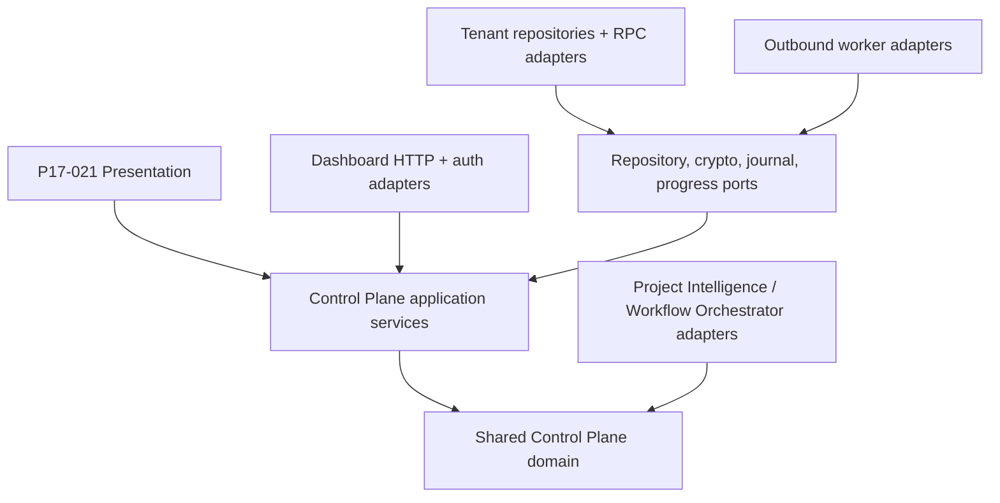

# P17-014 Control Plane implementation plan

**Status:** Authorized under standing continuation authority — A1 planning in progress; no runtime implementation
**Date:** 2026-08-16
**Roadmap task:** P17-014
**Accepted topology:** `topology=T1, machine=M1, execution=X1, replay=R1, e2e=E1, scale=S1`
**Implementation lock:** `core=C1, operations=O1, progress=P1, privacy=V1, sequence=Q1, distribution=D1, evidence=E1, planning=X0`

## Outcome

Turn accepted ADR-003 into a dependency-ordered implementation program without duplicating existing
provider-neutral runtimes, weakening P17-015 identity, bypassing P17-016 privacy, or treating the
local P2 worktree transport as a remote protocol. P17-014 moves from `ready` to `in_progress` when
this A1 checkpoint starts. That status means implementation planning has begun; it does not mean a
Control Plane component exists or any external action is authorized.

A1 changes planning, executable validation, roadmap/dashboard expectations, ADR implementation
status, package registration, evidence, and handoff only. It adds no shared-core module, migration,
repository, HTTP route, machine key, worker, plugin, provider call, browser state, database row,
network service, deployment, sync, or target change.

## Reconciled starting state

The accepted topology already locks one dashboard-hosted API, Postgres leases/outbox, outbound-only
workers, Ed25519 machine identity, compiled `shell:false` operations, at-least-once delivery,
journal/CAS/manual unknown-outcome recovery, a real two-node E2E, and measured scale thresholds.
P17-015 is done and provides immutable run binding, linear retry lineage, hash-chained progress,
bounded evidence metadata, a tenant-neutral writer port, migration `0017`, and authenticated
drill-down evidence.

The current repository also proves:

- Project Intelligence and Workflow Orchestrator live under root `packages/core` and are built into
  Codex, Claude, and Copilot distributions;
- `packages/core` has no package-local manifest; `build-provider-bundles.ts` is the root distribution
  compiler and the root package owns tests/build dependencies;
- `p2-transport-manifest.ts` is a local role/worktree transport, not the network wire format; it
  carries local workspace paths and role-specific semantics that must not cross a remote boundary;
- `.claude/integrations/multi-agent-runtime.ts` has an injected executor and `shell:false`, but it is
  a Claude-kit-local orchestration adapter rather than shared Control Plane domain source;
- `cross-machine-progress.ts` remains the single progress domain source; and
- no Control Plane source, migration, or route exists in dashboard.

P17-016 remains `in_progress`. C5A has specified its server/credential/privacy dependencies, but
C5B-C5E live phases are separately gated. P17-021 remains `backlog` and cannot claim Control Panel
operations until P17-014/P17-016 contracts and E2E inputs are complete.

## Requirements and non-functional constraints

### Functional requirements

- Define one exact shared domain for machine capability, operation registry, signed execution
  envelopes, tasks, attempts, delivery, leases, state transitions, cancellation, receipts, and
  recovery decisions.
- Reuse the real Project Intelligence and Workflow Orchestrator runtimes through compiled adapters;
  do not clone their parsing, phase, evidence, model-routing, or provider logic.
- Link every accepted execution state to the existing P17-015 binding/event/evidence contracts.
- Keep machine enrollment, claim, heartbeat, event, completion, cancel, retry, and reconcile behind
  application ports with exact schemas and closed reason codes.
- Preserve local/offline workflows byte-for-byte when distributed mode is disabled or unavailable.
- Prepare an optional worker distribution that can be installed for Codex, Claude, and Copilot
  workflows without centralizing provider credentials.

### Non-functional constraints

- Domain/application layers import no Next.js, Supabase, filesystem, process, environment, network,
  provider SDK, or platform-specific package.
- No arbitrary shell, executable, argv, environment, path, URL, or credential crosses the boundary.
- Every input has exact keys, bounded sizes, canonical bytes, version/hash validation, and explicit
  rejection of unknown/nested data.
- Network semantics remain at-least-once. The system never claims exactly-once transport; it proves
  duplicate accepted execution prevention through transactional CAS plus a durable worker journal.
- Initial bounds stay at 100 workers, 1,000 queued tasks, 10 active leases per tenant, four per
  worker, 256 KiB envelope, 64 KiB progress/event request, 15-second heartbeat, 45-second offline,
  60-second lease, 30-minute deadline, and 25-second long poll.
- Evidence bodies and provider content remain outside Control Plane persistence. Hash-bound metadata
  follows P17-016 retention/deletion rules.
- No production persistence or remote execution before the P17-016 tenant/privacy runtime gate.

## Locked implementation decisions

### C1 — One shared control-plane core

A2 will add one future `packages/core/src/control-plane.ts` domain source plus focused tests. It will
own closed types, exact validation, canonical serialization, hashing, state transition rules,
operation descriptors, and pure decisions. It will not import `.claude` implementation files or
dashboard infrastructure.

Generated or compiled consumers depend on that source. Dashboard may receive a byte-identical mirror
only through an atomic check/write tool. The worker consumes the same compiled core. Forked schemas,
copy-pasted transition tables, provider-specific core branches, and a second package-local domain
implementation are forbidden.

### O1 — Reuse provider-neutral operation runtimes

The initial registry contains exactly four codes from ADR-003:

- `project_intelligence.inspect` maps to the existing shared Project Intelligence runtime;
- `workflow_phase.execute` maps to the existing Workflow Orchestrator phase/runtime contracts;
- `workflow_verify.execute` maps to a later privacy-safe verification capability; and
- `evidence.verify` maps to deterministic hash/content verification without provider execution.

The registry stores adapter IDs, contract hashes, required capabilities, replay class, and resource
budget profiles—not executable paths or arbitrary arguments. Adapters build bounded local calls and
resolve only worker-configured repo and credential aliases. A credential alias supplied by the
Control Plane is rejected; the envelope may request a provider capability but cannot name or read a
secret.

### P1 — P17-015 remains the progress authority

P17-014 adds delivery/lease/journal identity but does not invent another progress event chain.
`cross-machine-progress.ts` remains the single progress domain source. Every remote attempt binds to
one P17-015 run/attempt/root/machine identity before a running event can be accepted. The Control
Plane links to existing progress and evidence hashes rather than copying bodies or mutable status.

Retries create a new P17-015 attempt with one exact parent. A lease cannot rewrite the binding,
branch lineage, change machine identity, or accept terminal evidence whose task/run/attempt/binding
hash differs.

### V1 — Privacy gates persistence and remote execution

Pure A2/A3 contracts may be implemented while P17-016 is `in_progress`. A4 persistence, live
machine enrollment, route exposure, and remote execution remain disabled until tenant identity,
retention/deletion, credential binding, attestation/key handling, and service-role repository
boundaries required by P17-016 are implemented and proven for the target environment.

Tenant is mandatory in every future machine/task/lease/nonce/intent/audit key and method. No raw
repo, spec, prompt, log, provider output, hostname, IP, email, path, URL, key, or credential becomes
Control Plane data. A missing privacy capability is `unavailable`, never a legacy/global fallback.

### Q1 — Dependency-ordered implementation

Implementation order is fixed: A1 plan/tracking; A2 pure contracts; A3 crypto and worker-journal
ports; A4 privacy-gated persistence; A5 authenticated API/application services; A6 outbound worker
and provider distribution; A7 two-node E2E and completion audit. A later slice may start only when
its predecessor evidence and named external inputs are complete.

This ordering prevents a route from defining the domain, a migration from becoming the state
machine, or a worker subprocess from becoming the operation registry. It also permits meaningful
local progress while external P17-016 gates remain closed.

### D1 — Optional worker and provider distribution

The worker is a separate optional installable surface, disabled by default. It packages the shared
Control Plane core, compiled operation adapters, Ed25519 request/receipt signing, a durable local
journal, bounded HTTP client, repo-alias resolver, local credential-alias resolver, and process
resource controls. It owns no server database or browser UI.

Distribution extends the existing root provider-bundle pipeline and personal plugin/package
manifests rather than hand-copying generated content. Codex, Claude, and Copilot expose aligned
skills/agents for enrollment, worker operation, recovery, and offline behavior, while provider-
specific launch/config wrappers remain thin. Installation never enrolls or starts a worker without
an explicit operator command.

### E1 — Evidence cannot skip topology layers

Evidence levels are cumulative:

1. A1 plan/readiness/status truth;
2. A2 exact pure schemas, state, hashing, registry, property and attack tests;
3. A3 real Ed25519 canonicalization plus journal crash/replay tests using disposable storage;
4. A4 executable concurrent Postgres migration/RPC proof under P17-016 tenant/retention controls;
5. A5 authenticated API contract/integration proof with signing, nonce, CAS, outbox, and disabled mode;
6. A6 real worker process/container with compiled `shell:false` operations and provider bundles;
7. A7 network-separated nodes with no shared filesystem plus P17-015 evidence and P17-021 browser
   terminal state; and
8. optional provider execution only under a separate provider/credential authorization.

Mocks and in-process objects cannot satisfy network, process, database, or browser claims. A paid
provider run cannot replace the deterministic `project_intelligence.inspect` base E2E.

### X0 — A1 is plan and tracking only

A1 modifies the plan, validator registrations, accepted ADR status, canonical/human roadmap state,
the C5 dependency status sentence, dashboard roadmap expectations, evidence, and handoff. No
dashboard production file changes in A1. There is no runtime implementation, migration, server
route, worker, process launch, key generation, network, browser, database, provider, sync, push,
merge, deployment, target edit, or target `.Codex` change.

## Clean Architecture and source ownership

| Layer | Canonical owner | Responsibility |
|---|---|---|
| Shared domain | `claude-workflow-kit/packages/core/src/control-plane.ts` | exact types, hashes, operation registry, state/lease/replay decisions |
| Existing operation domains | `packages/core/src/project-intelligence.ts`, `workflow-orchestrator.ts` | real provider-neutral operation behavior and phase contracts |
| Progress domain | `packages/core/src/cross-machine-progress.ts` | run/attempt/event/evidence identity and transitions |
| Application ports | future kit shared-core modules | clock, signer/verifier, nonce, repository, journal, progress, executor interfaces |
| Dashboard application/infrastructure | `kit-dashboard/src/features/control-plane` | tenant-scoped use cases, Supabase repositories/RPCs, HTTP composition |
| Worker | future optional worker package/plugin | outbound client, keys, local journal, compiled operations, local secrets |
| Presentation | future `kit-dashboard/src/app/control-plane` | P17-021 reads/actions/accessibility only |
| Distribution | root provider/plugin builders | deterministic Codex/Claude/Copilot artifacts and validation |

The network wire contract is built from the shared domain. It never imports the local P2 worktree
manifest. P2 can remain an internal local execution adapter until an explicit later refactor proves
shared semantics without leaking paths or role-specific fields.

## Implementation sequence

### A1 — Plan, readiness, and truthful tracking

Create this plan and validator, change P17-014 only from `ready` to `in_progress`, reconcile ADR and
dashboard expectations, preserve P17-015/P17-016/P17-021 truth, run full kit/dashboard gates, and
commit source/evidence separately. No runtime code is included.

### A2 — Pure shared-core contracts

Implement exact operation descriptors, capability manifest, machine/task/run/attempt/delivery/lease
identities, typed execution envelope, canonical hash payloads, task/lease/cancel/recovery state
machine, resource budgets, and pure validators. Start with an executable readiness RED. Prove exact
keys, bounds, deterministic serialization, operation/contract hash binding, and zero platform imports.

### A3 — Machine crypto and worker journal ports

Add canonical signing bytes, Ed25519 signer/verifier ports and Node adapter, nonce/time-window rules,
key version/rotation/revocation decisions, and a transactional journal port with a disposable local
implementation. Prove duplicate delivery, changed envelope, all crash points, late receipt, unknown
side effect, and offline restart without starting a network listener.

### A4 — Tenant-scoped persistence and repositories

After the P17-016 gate, design migrations/rollback first, then add machines, enrollment grants,
tasks, leases, nonces, intents, outbox/audit links, and tenant-requiring application repositories.
Use an authorized disposable PostgreSQL race harness before any live apply. No browser/worker direct
table write and no unscoped service-role overload.

### A5 — Control Plane API and application services

Implement the versioned enroll/claim/heartbeat/events/complete APIs plus browser action ports behind
auth, tenant membership, RBAC, CSRF/origin, signature/nonce/body hash, CAS, idempotency, pagination,
long-poll cap, and closed error handling. Disabled/misconfigured mode exposes no mutation success.

### A6 — Outbound worker and provider distribution

Build the separately installable worker with local key generation/storage, enrollment, bounded poll,
journal, compiled operation adapters, local repo/credential aliases, sanitized environment,
timeouts/resources/cancel handling, and signed receipts. Generate and validate aligned Codex,
Claude, and Copilot skills/agents/packages. Existing local workflows remain unchanged.

### A7 — Network-separated E2E and completion audit

Use two network-separated nodes with no shared filesystem. Execute the real deterministic
`project_intelligence.inspect` operation on the worker, persist P17-015 progress/evidence, and show
the exact terminal state in P17-021. Prove all ADR failure cases, rollback/cleanup, privacy/retention,
offline fallback, distribution install, and requirement-by-requirement completion before marking
P17-014 done.

## Dependency and input-readiness matrix

| Slice | Inputs | Current state | Gate |
|---|---|---|---|
| A1 | Accepted ADR-003, P17-015 done, current source/distribution inventory | Complete | Plan validator plus full regressions |
| A2 | A1 evidence, exact operation boundaries, existing shared runtimes | Locally derivable | Pure-core RED/GREEN and no-platform-import proof |
| A3 | A2 contracts, approved Ed25519 M1, disposable journal location | Locally derivable | Crypto vectors, crash/replay/property tests |
| A4 | A3 ports plus implemented/proven P17-016 tenant/privacy/retention runtime | Blocked by P17-016 | Migration design, disposable database authority |
| A5 | A4 persistence, server signing/nonce/key source, auth/RBAC composition | Blocked | API contract and authenticated integration evidence |
| A6 | A5 API, install location, worker config/key storage, provider-bundle manifest | Blocked | Clean install and real worker process proof |
| A7 | P17-014 A2-A6, P17-016, P17-021 UI, two-node environment/test identities | Blocked | Separate E2E/deploy/browser authority |

Roadmap readiness and standing local implementation authority do not authorize database migration,
machine enrollment, worker network calls, provider use, deployment, sync, or push.

## Attack and test strategy

### A2 pure-core attacks

- duplicate operation code, duplicate capability, unknown capability, operation/contract hash drift;
- unknown envelope field, extra nested field, unsupported version, invalid UUID/hash/timestamp,
  non-canonical ordering, oversized arrays/strings/body, Unicode/control characters;
- arbitrary shell, executable, argv, raw environment, raw repository path, URL, header, secret,
  provider output, and credential alias supplied by the Control Plane;
- forged tenant, machine/task/run/attempt/repository/evidence mismatch, cross-tenant run reference;
- same delivery with a different envelope, receipt replay/conflict, stale expected version, illegal
  state rollback, completion/cancel/retry races;
- two-worker claim race, lease renewal past deadline, late completion, recovery without authority,
  and unknown side-effect outcome.

### A3-A6 adapter attacks

- forged/revoked/rotated key, signature confusion, changed body, reused nonce, future/stale time,
  enrollment replay, key-file permission failure, and key-byte leakage;
- journal crash before and after execution, after receipt/before acknowledgement, torn write,
  concurrent redelivery, corrupt journal, restart, and storage exhaustion;
- mixed contract version, unsupported worker/provider/runtime version, capability drift, missing local
  repo/credential alias, inherited environment leakage, resource exhaustion, and cancellation kill;
- unscoped service-role call, cross-tenant existence signal, outbox partial failure, database/network
  outage, long-poll leak, heartbeat loss, and disabled-mode network call;
- evidence body leakage through API, audit, metrics, UI, trace, distribution, or error output.

### Evidence discipline

Every new slice starts with a named readiness RED, uses focused behavior/property/mutation tests,
strict TypeScript with no skipped library diagnostics at its exact boundary, positive-controlled
secret/path/internal-marker scans, exact manifests, separate source/evidence commits, full affected
regressions, and cleanup readback. Performance claims require measured bounded fixtures; no Rust,
Go, Python, broker, cache, or multi-region service is introduced without a profile/threshold breach.

## Rollout, rollback, and growth thresholds

Pure core and worker adapters remain disabled until their later gates. A4/A5 rollout begins only on
an authorized disposable tenant/machine/repository/operation. Rollback disables server flags and
enrollment/claim routes, revokes machine keys, lets active work reach bounded stop/recovery, and
preserves P17-015 audit/evidence under retention. It never falls back to arbitrary local/remote
execution or edits target `.Codex` directories.

Keep single-region Postgres-first until measured sustained queue depth exceeds 1,000, claim
transaction p95 exceeds 250 ms, more than 100 active workers cause contention, or a named residency/
availability requirement appears. Revisit a Rust/Go worker only if profiles show TypeScript misses
the accepted signing/journal/dispatch latency or resource budgets. Python remains appropriate for a
future offline analysis tool, not the trust-critical worker path without a measured need.

## A1 implementation manifest

Kit source scope:

- `docs/roadmap/p17-014-control-plane-implementation-plan.md`;
- `scripts/post-17-control-plane-implementation-plan.test.ts`;
- `docs/design/adr-003-distributed-control-plane-topology.md` status only;
- `docs/roadmap/post-17-roadmap.json` and `.md` status only;
- `scripts/post-17-control-plane-topology.test.ts` and
  `scripts/post-17-control-panel-rbac.test.ts` status reconciliation;
- `docs/roadmap/p17-016-wave-c5-live-cutover-plan.md` and its validator status reconciliation; and
- `package.json` focused/full-suite registration.

Dashboard source scope is only `tests/post17-roadmap.test.ts`, because `/roadmap` already reads the
canonical kit catalog dynamically. Source commits remain separate per repository. Closeout adds one
metadata-only evidence file per affected repository plus workspace handoff transitions.

## Non-claims

A1 does not claim a shared Control Plane core is implemented, machine enrollment exists, Ed25519
keys exist, persistence or API exists, a remote worker exists, any plugin/package changed, P17-016
is complete, P17-021 is ready, E2E ran, or P17-014 is complete.

No runtime implementation, migration, database/browser/network/provider access, machine enrollment,
route, process, worker, distribution build, deployment, sync, push, merge, target edit, or target
`.Codex` modification occurs in A1.
