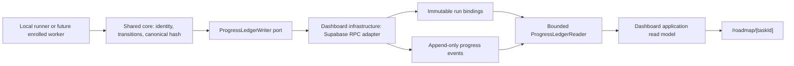

# P17-015 Detailed Cross-machine Progress Tracking Plan

Status: Approved by the canonical post-17 goal; implementation not started  
Date: 2026-08-14  
Decision authority: operator-confirmed post-17 roadmap and input-readiness gate  
Related tasks: P17-002, P17-014, P17-016, P17-021

## Outcome

Bind one roadmap task to the exact dashboard command run, provider execution identity when
reported, opaque machine identity, retry lineage, monotonic progress events, and content-addressed
evidence. Add an authenticated read-only dashboard drill-down that derives task state from this
ledger without trusting mutable labels or raw log text.

This task defines identity, persistence, and read-model contracts. It does not enroll remote
machines, dispatch remote work, expose remote mutation controls, choose a network topology, or
define the final tenant/privacy policy. Those remain P17-014, P17-016, and P17-021 responsibilities.

## Requirements

### Functional

- Register an immutable binding among:
  - canonical roadmap task ID;
  - dashboard `command_runs.id`;
  - configured repository slug;
  - opaque operator-assigned machine UUID;
  - registered runner ID;
  - provider execution ID when the provider reports one;
  - root/parent run IDs and attempt ordinal; and
  - retention metadata supplied by policy rather than inferred from content.
- Append bounded, hash-chained progress events with a per-run sequence and previous-event hash.
- Require a content-addressed evidence reference before a run can transition to `passed`.
- Treat a retry as a new immutable run. Preserve the prior attempt, require the exact parent, and
  reject branches, cycles, ordinal gaps, or a second child for the same parent.
- Make duplicate delivery idempotent only when the event ID and full canonical payload hash match.
  Reusing an ID with different content is a conflict.
- Provide an authenticated `/roadmap/[taskId]` drill-down with run attempts, machine/run/provider
  identity, progress timeline, terminal evidence hash, stale/unavailable/conflict states, and a link
  to the existing exact dashboard run.
- Link every `/roadmap` task card to the drill-down without changing the immutable original 17/17
  evidence or pretending that an untracked task has run.

### Non-functional

- No raw logs, prompts, specifications, file paths, hostnames, IP addresses, hardware identifiers,
  environment values, tokens, or arbitrary metadata maps in the domain envelope or database rows.
- Machine identity is a UUID assigned by configuration/enrollment. The runtime never derives a
  fingerprint from hardware, OS, hostname, network, or repository path.
- Closed schemas, bounded strings/arrays, deterministic canonical serialization, and SHA-256 hashes.
- Server-side authentication remains authoritative. Browser clients never receive the service-role
  key and cannot write progress rows directly.
- Queries are bounded and deterministic: at most 50 attempts per task and 200 events per attempt,
  ordered by attempt and sequence. Truncation is explicit in the read model.
- Event payloads are at most 4 KiB after canonical serialization. Evidence metadata contains only
  SHA-256, media type, byte count, safe label code, and verification state.
- An enabled writer fails closed when identity, lineage, transition, hash, or persistence validation
  fails. Legacy runs without P17 tracking remain explicitly `untracked`; they are not rewritten.

## Current-state Reconciliation

| Surface | Proven current behavior | P17-015 gap |
|---|---|---|
| `command_runs` | UUID run history, repo/runner/status, optional `phase_id`, Codex session, metrics | no roadmap task ID, machine ID, evidence hash, or immutable progress chain |
| `command_runs.retry_of` | optional parent link | no atomic linear-lineage rule; duplicate branches are representable |
| `phase_queue.command_run_id` | one mutable link from an original-roadmap phase to one run | cannot retain attempt history or post-17 task identity |
| `orchestrator_events.detail` | append-only audit row with free-text detail | not a closed machine-safe progress contract and cannot prove evidence identity |
| evidence bundles | deterministic per-phase `manifestHash` and file hashes | hashes are local artifacts and are not bound to task/run/machine in dashboard storage |
| Codex resume CAS | one-shot generation and expected-gate persistence | provider-specific and not a cross-machine task progress ledger |
| `/orchestrator` | persisted runner ownership and active-state view | no task/run retry drill-down or terminal evidence link |
| `/roadmap` | canonical static catalog, readiness, filters | no dynamic execution history |

The design adds a narrow ledger instead of expanding free-text events or overloading the single
`phase_queue.command_run_id` pointer.

## Clean Architecture Boundary

Dependency rule: the shared domain never imports Next.js, React, Supabase, provider SDKs, or runner
process code. Presentation depends on application ports; infrastructure implements those ports.
The future Control Plane may call the same writer port but cannot weaken its domain rules.

### Proposed source ownership

| Layer | Owner | Responsibility |
|---|---|---|
| Domain/schema | `claude-workflow-kit/packages/core` | closed identities, transitions, canonicalization, hashes, result validation |
| Public schema | `claude-workflow-kit/docs/schemas` | provider-neutral progress envelope and evidence reference |
| Dashboard mirror | generated `kit-dashboard/src/lib/generated` | byte-identical domain source with missing/extra/content drift gate |
| Application | `kit-dashboard/src/features/roadmap-progress/application` | query use case and safe view model |
| Infrastructure | `kit-dashboard/src/features/roadmap-progress/infrastructure` | Supabase RPC/read adapter and error translation |
| Presentation | `kit-dashboard/src/app/roadmap/[taskId]` | authenticated read-only drill-down and named UI states |

TypeScript remains the implementation language because the work is validation, hashing, SQL/RPC
integration, and React presentation with no measured CPU bottleneck. Revisit Rust or Go only after a
profile shows canonicalization/hash validation exceeds 100 ms for the bounded event window or a
future Control Plane needs a standalone high-throughput ingest service. Python is not selected for
the runtime contract because it would add a second deployment/runtime boundary without a measured
benefit.

## Domain Model

### `ProgressRunBinding`

- `schemaVersion`: `1`
- `taskId`: `P17-000` through a bounded future `P17-NNN` pattern
- `commandRunId`: UUID matching `command_runs.id`
- `machineId`: operator-assigned UUID; never derived
- `repoId`: configured slug, 1–64 safe characters
- `runner`: registered provider-neutral runner ID
- `providerExecutionId`: optional bounded operational ID; `null` means unreported
- `rootRunId`: command run UUID of attempt 1
- `parentRunId`: exact prior attempt UUID or `null`
- `attempt`: positive integer
- `retentionClass`: closed policy label, not a duration guessed by the producer
- `createdAt`: RFC 3339 UTC timestamp
- `bindingHash`: SHA-256 over canonical fields

Attempt 1 requires `rootRunId === commandRunId`, `parentRunId === null`. Every later attempt requires
the same task/root, `attempt === parent.attempt + 1`, and `parentRunId === parent.commandRunId`.
A unique parent constraint makes the lineage linear and prevents two machines from creating sibling
retries that overwrite or ambiguously supersede each other.

### `ProgressEvent`

- immutable `eventId` UUID and exact `bindingHash`;
- `sequence` starting at 1 with no gaps;
- `previousEventHash`: `null` only for sequence 1;
- closed `state`: `queued`, `running`, `awaiting_input`, `awaiting_approval`, `passed`, `failed`,
  `cancelled`, or `tracking_failed`;
- optional canonical workflow `phaseId`;
- closed `reasonCode` rather than free text;
- `evidence`: `null` except when a state requires it; terminal `passed` requires one verified ref;
- `occurredAt` and `receivedAt` UTC timestamps with bounded skew classification;
- `eventHash`: SHA-256 over canonical payload excluding `eventHash`.

### `EvidenceRef`

- SHA-256 content hash;
- manifest/schema version;
- media type from a closed allowlist;
- byte count between 0 and the configured bound;
- safe label code;
- producer task/run/attempt identity; and
- verification status `verified`, `quarantined`, or `unavailable`.

No artifact path, URL with credentials, filename supplied by a provider, preview body, or secret is
stored in the ledger. P17-021 may resolve the hash through a separately authorized evidence port.

## State, Idempotency, and Race Semantics

Allowed forward transitions:

- `queued → running | cancelled | tracking_failed`
- `running → awaiting_input | awaiting_approval | passed | failed | cancelled | tracking_failed`
- `awaiting_input → running | failed | cancelled | tracking_failed`
- `awaiting_approval → running | failed | cancelled | tracking_failed`

Terminal states never transition. `passed` requires verified evidence whose task, run, attempt, and
binding hash all match. A late worker event cannot move a terminal state backward.

The append operation supplies expected sequence and previous hash. Storage compares both to the
current tail in one transaction. The same `eventId` plus same event hash is an idempotent replay;
the same ID with a different hash, a stale tail, sequence gap, wrong machine/binding, or invalid
transition is a conflict with zero mutation.

Run registration uses the same pattern. Replaying the same command run plus same binding hash is
idempotent. A different machine, task, root, parent, attempt, provider ID, or retention class for an
existing command run is an identity mismatch with zero mutation.

## Persistence Contract

Additive migration `0017_cross_machine_progress.sql` will introduce:

1. `progress_run_bindings` — immutable identity rows with unique command run, binding hash, and
   `(root_run_id, attempt)`; a partial unique constraint on non-null `parent_run_id` prevents retry
   branches.
2. `progress_events` — append-only events with unique event ID/hash and `(binding_id, sequence)`.
3. `register_progress_run(...)` — service-role-only idempotent registration with parent/root/task
   validation and no update path for identity fields.
4. `append_progress_event(...)` — service-role-only transactional tail CAS, transition validation,
   terminal evidence enforcement, and exact replay behavior.

RLS is enabled with no anonymous or authenticated write policy. Dashboard reads use its existing
authenticated page guard plus server-only service-role client. The migration is additive and its
rollback drops only the two RPCs/tables after confirming no dependent P17-014/P17-021 data exists.
Applying the migration to a live external Supabase project is a separately disclosed operational
step; source implementation and disposable tests do not silently perform it.

## Dashboard Read Model and UI

Route: `/roadmap/[taskId]`.

The server component must first validate the canonical catalog task and require an authenticated
viewer. The repository then performs bounded selects, validates every row through the shared domain,
and derives:

- current attempt and state;
- exact run/provider/machine identities;
- linear retry timeline;
- ordered per-attempt events;
- terminal evidence hashes and verification states;
- truncation, stale clock, unavailable storage, and integrity-conflict flags.

Named UI states:

- loading skeleton;
- unknown/malformed task ID (404 without database lookup);
- valid task with no tracked runs;
- success with one or more attempts;
- currently running/awaiting states;
- failed/cancelled terminal attempts;
- storage unavailable (catalog remains visible, history does not become empty);
- integrity conflict/quarantined evidence;
- truncated history with explicit limits; and
- legacy `command_runs` presence without a progress binding (`untracked`, never inferred).

The page is read-only in P17-015. Approve/cancel/retry controls belong to P17-021 after P17-014 and
RBAC inputs are complete.

## Privacy, Retention, and Security

- The core rejects unknown fields so callers cannot smuggle logs or secrets into an extension map.
- String validators reject control characters and secret-like key/value forms; the public contract
  has no generic message, headers, environment, path, host, or network fields.
- Machine IDs are opaque UUIDs. Display aliases remain a later enrollment/read-model concern and
  are not accepted from progress events.
- `retentionClass` and `expiresAt` come from an injected server policy. Producers cannot extend
  retention. Actual tenant-specific durations/deletion are P17-016 inputs.
- Evidence bodies remain outside the ledger. Only bounded metadata and verified hashes are stored.
- All database mutation functions are service-role-only; browser routes are read-only and guarded.

## Scale and Reliability Assumptions

Initial design target: up to 100 enrolled machines, 10,000 progress events/day, 50 attempts/task,
and 200 events/attempt in one UI read. Writes are append-only and indexed by task/root/binding and
sequence. No cache is required initially; Next server reads are force-dynamic so stale progress is
not presented as current.

Revisit partitioning, materialized summaries, streaming, or a dedicated service only when measured
event volume or query latency exceeds the bounded target. P17-014 owns network retry, worker
availability, and multi-region topology; P17-015 owns deterministic acceptance once an event reaches
the writer port.

## Verification and Evidence Ladder

Every tier is required for task completion; lower tiers cannot substitute for higher ones:

1. Shared-core schema, canonical hash, state machine, binding/result round-trip, and property/attack
   tests.
2. Identity mismatch, retry branch/cycle/gap, duplicate replay, wrong machine/binding, stale CAS,
   terminal rollback, forged evidence, extra-field, oversize, and redaction attacks.
3. Migration/RPC contract tests proving service-role-only mutation, immutable bindings, linear retry
   uniqueness, event-tail CAS, terminal evidence, bounded indexes, and rollback text.
4. Dashboard repository/application tests with injected ports for empty, success, retry, unavailable,
   conflict, truncation, and legacy-untracked states.
5. Route/component tests for authentication, invalid task 404, accessible timeline/table semantics,
   bounded query behavior, and every named UI state.
6. A disposable concurrent two-machine harness using distinct configured machine UUIDs. It must prove
   one linear retry succeeds, a competing second child gets zero mutation, event replay is idempotent,
   and a different-machine overwrite is rejected.
7. Full kit and dashboard regressions, TypeScript, generated-mirror drift, and diff checks.
8. After explicit authorization for the named external migration/write: exact live schema/RPC
   readback, two logical-machine canaries, authenticated `/roadmap/[taskId]` browser proof showing the
   same task/run/attempt/evidence hashes, and cleanup/retention confirmation.

If tier 8 is not authorized, implementation may be checkpointed but P17-015 remains `in_progress`;
its dependants must not be unlocked by local-only evidence.

## Rollback and Operational Safety

- The feature is additive and read-only in the browser.
- Missing migration or query failure renders `history unavailable`, never an empty-success claim.
- The writer is opt-in and requires explicit machine ID plus retention policy configuration.
- Disable the writer to restore legacy runner behavior without deleting history.
- Rollback code first, then drop RPCs/tables only after verifying P17-014/P17-021 have no dependency.
- No source sync, target `.Codex` edit, provider execution, deployment, migration application, push,
  or external write is implied by this plan.

## Trade-offs and Growth Revisit

- A separate immutable ledger duplicates a small amount of `command_runs` identity, but it avoids
  turning mutable run rows and free-text audit detail into security authority.
- Linear retry lineage forbids sibling retries. This makes task truth unambiguous now; revisit DAG
  attempts only with an explicit winner/merge policy and UI semantics.
- Hash chains detect mutation/reordering but are not signatures. P17-014 must add authenticated
  enrolled-machine transport and signed request/result envelopes before remote trust is claimed.
- Storing only evidence metadata limits dashboard previews. P17-021 should add a separately bounded,
  authorized evidence reader rather than widening this ledger with artifact bodies.
- Direct bounded queries are simpler than a summary table. Add projections only after measured load
  shows they are necessary and preserve the append-only source of truth.
