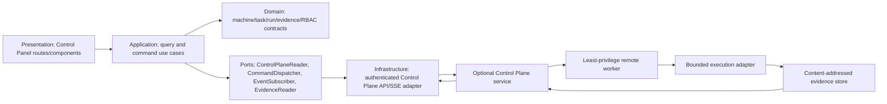

# P17-021 Distributed Control Panel UI and Remote Operations Console Plan

Status: Catalog scope approved; implementation blocked by the input-readiness gate  
Date: 2026-08-14  
Decision authority: operator-confirmed post-17 scope  
Related tasks: P17-014, P17-015, P17-016

## Outcome

Build a real authenticated Control Panel in `kit-dashboard` for machines, tasks, runs, progress,
evidence, and RBAC-governed approve/cancel/retry operations. Completion requires an observable,
non-mock flow from the browser through the Control Plane to a disposable remote worker, bounded
execution, content-addressed evidence, and the updated result rendered back in the same Control
Panel.

This plan does not authorize remote execution today. P17-021 remains backlog/input-blocked until
every item in the readiness gate is resolved and P17-014/P17-015/P17-016 are complete.

## Requirements

### Functional

- Authenticated route family:
  - `/control-plane` — fleet and work overview;
  - `/control-plane/machines` — machine health, capabilities, leases, and last-seen state;
  - `/control-plane/tasks` — task queue, phase, owner, approval state, and progress;
  - `/control-plane/runs/[runId]` — attempt/retry lineage, events, worker, and evidence;
  - `/control-plane/evidence/[hash]` — verified metadata and bounded artifact preview/download.
- Viewer-safe read paths for machines, tasks, runs, progress, audit events, and evidence references.
- Server-authorized approve, cancel, and retry commands with reason, idempotency key, expected
  resource version, and immutable audit identity.
- Live progress using a bounded event stream with polling fallback and explicit stale/offline states.
- Evidence hashes link to the exact run/attempt/task/machine identity that produced them.
- Every action exposes pending, accepted, rejected, conflicted, expired, failed, and completed states.

### Non-functional

- Disabled and unreachable by default until the Control Plane capability is configured.
- No raw secrets, bearer tokens, arbitrary shell, machine fingerprinting, or private spec bodies in
  browser payloads, URLs, logs, events, or evidence.
- Server-side RBAC is authoritative; hiding a button is never an authorization control.
- Keyboard-operable, screen-reader-labelled, responsive, and tested with automated accessibility
  checks plus critical manual semantics.
- Bounded pagination/event windows, deterministic ordering, explicit clock/sequence metadata, and
  no unbounded client accumulation.
- Idempotent commands and race-safe optimistic concurrency for approve/cancel/retry.

## Clean Architecture Boundary

Dependency rule: presentation and infrastructure depend inward on application/domain contracts.
The domain layer never imports Next.js, Supabase, React, provider SDKs, or worker transports. The
dashboard never talks directly to a worker or evidence store.

### Proposed source ownership

| Layer | Proposed owner | Responsibility |
|---|---|---|
| Domain contracts | shared core | Closed schemas, state machines, identities, RBAC decisions, hashes |
| Application use cases | `kit-dashboard/src/features/control-plane/application` | Query/command orchestration and view models |
| Presentation | `kit-dashboard/src/app/control-plane` + feature components | Routes, accessible UI, state rendering |
| Dashboard infrastructure | server-only dashboard adapters | Auth session, API/SSE calls, redaction, error translation |
| Control Plane | optional agent service from P17-014 | Leases, command envelopes, audit events, idempotency |
| Worker | optional remote worker adapter | Capability-limited execution and evidence return |

## Domain Model

- `Machine`: stable operational ID, display label, capability set, trust state, health, last seen,
  active lease count, and monotonic version. No hardware fingerprint.
- `RemoteTask`: roadmap/task identity, requested phase, target repo identity, requested operation,
  approval policy, current state, and version.
- `Run`: immutable run ID, task ID, attempt, worker assignment, start/finish timestamps, progress,
  terminal outcome, and evidence references.
- `EvidenceRef`: SHA-256, media type, bytes, producer run/attempt, verification status, and safe label.
- `OperationIntent`: approve/cancel/retry, actor, reason, idempotency key, expected version, and scope.
- `AuditEvent`: append-only event ID, sequence, actor/service subject, action, decision, resource,
  timestamp, correlation ID, and redacted detail.

The exact schema version and persistence technology are P17-014/P17-015 decisions. UI code consumes
versioned ports and must not infer missing fields.

## State and Race Semantics

Expected task/run states include queued, awaiting approval, approved, leased, running, cancelling,
cancelled, succeeded, failed, and retry scheduled. The final contract must explicitly reject:

- approval after cancellation or lease expiry;
- cancel/retry against a stale version;
- retry of a non-terminal attempt unless policy permits it;
- duplicate idempotency keys with a different payload;
- two machines completing the same lease;
- late worker events that would move a terminal state backward;
- evidence whose task/run/attempt identity or hash does not match the accepted completion.

## API and Event Boundary

The following resources are provisional until P17-014 publishes its versioned API contract:

- `GET /api/control-plane/v1/machines`
- `GET /api/control-plane/v1/tasks`
- `GET /api/control-plane/v1/runs/{runId}`
- `GET /api/control-plane/v1/evidence/{sha256}`
- `POST /api/control-plane/v1/tasks/{taskId}/approve`
- `POST /api/control-plane/v1/runs/{runId}/cancel`
- `POST /api/control-plane/v1/runs/{runId}/retry`
- `GET /api/control-plane/v1/events?after=<sequence>` (SSE or equivalent bounded stream)

Every mutation requires authenticated server-side authorization, `Idempotency-Key`, expected
resource version, structured reason, and a correlation ID. Responses contain a closed decision
envelope; transport success alone never means the operation was accepted.

## RBAC Input Contract

The operator must approve a matrix for at least viewer, operator, approver, and administrator roles,
including whether the requester may approve their own task. The final service must test each
resource/action/role combination and default-deny unknown roles, resources, actions, and tenants.

UI behavior follows the server decision:

- unavailable action: hidden only when policy metadata safely permits it;
- visible but denied: disabled with a reason or rejected without side effects;
- stale decision: refresh resource and require an explicit repeat;
- no role metadata: show read-only degraded mode, never optimistic permission.

## UI States and Edge Cases

Each route must cover loading, empty, success, partial/degraded, unauthenticated, unauthorized,
offline, stale stream, malformed response, and server failure. Operational edge cases include:

- machine heartbeat expires while its run is visible;
- event stream disconnects and polling catches up without duplicate progress;
- evidence metadata exists but artifact retrieval is unavailable or quarantined;
- cancellation races with success;
- retry creates a new attempt while preserving the immutable prior attempt;
- task progress arrives out of order;
- an action succeeds but the browser loses the response;
- a long machine/task name, large fleet, and thousands of events remain usable;
- tenant/resource mismatch returns no cross-tenant existence signal.

## Input-Readiness Gate

Implementation cannot start until all of the following are concrete, versioned, and testable:

1. P17-014 approved topology, trust boundaries, lease/idempotency model, and Control Plane API/events.
2. P17-015 task/run/machine/evidence identity, retry lineage, retention, and dashboard drill-down model.
3. P17-016 privacy classification, tenant isolation, redaction, retention, and deletion policy.
4. Operator-approved RBAC/action matrix and separation-of-duties policy.
5. Dashboard information architecture and responsive/accessibility acceptance for the route family.
6. A disposable, least-privilege remote worker environment with a bounded non-shell test operation.
7. Authenticated test identities for permitted and denied roles without exposing credentials.
8. An evidence store/adapter contract with content hashing and quarantine/error behavior.
9. A two-node or equivalently network-separated E2E topology approved for test execution.
10. Failure injection for offline worker, expired lease, duplicate delivery, stale version, and event
    reconnect.

## Verification and Evidence

Completion requires all tiers; a lower tier cannot substitute for a higher one:

1. Domain/schema tests and state-machine property/attack tests.
2. API contract tests, RBAC matrix attacks, idempotency/replay, lease expiry, race, and redaction tests.
3. Dashboard component/route tests for every named UI state plus accessibility checks.
4. Multi-process integration proving UI API → Control Plane → worker → evidence persistence.
5. Playwright E2E from authenticated Control Panel actions through a real disposable worker service
   and back to the rendered terminal state/evidence hash on the exact dashboard server.
6. Authorized network-separated/two-node release proof with immutable logs, event/run/evidence hashes,
   screenshots, and process cleanup. In-app browser inspection may independently confirm the exact
   route, but it supplements rather than replaces Playwright and service evidence.

Required positive flow: an approver approves a queued task, a worker receives one typed envelope,
the bounded operation executes, evidence is hashed and accepted, progress becomes terminal, and the
Control Panel renders the same run/evidence identity.

Required negative flows include denied approval with zero side effects, duplicate delivery,
cancel/success race, stale retry, worker disconnect, forged evidence hash, cross-tenant access, and
browser reconnect without duplicated progress.

## Rollback and Operational Safety

- Capability flag defaults off; disabling it restores the existing dashboard without remote actions.
- Database/API migrations require forward/backward compatibility and an explicit rollback path.
- Worker enrolment and credentials are operator actions outside build/test automation.
- No test may target production machines, real user repositories, or unbounded commands.
- No sync, deployment, publication, or push is implied by this plan.

## Trade-offs and Growth Revisit

- SSE plus polling fallback is simpler than bidirectional sockets; revisit only if measured command
  latency or fleet scale requires it.
- One dashboard feature boundary reduces early service sprawl; split read models only after measured
  query/event volume justifies it.
- A real disposable worker makes E2E slower and more operationally expensive, but mock-only evidence
  cannot prove the requested product flow.
- Revisit storage, queue, and multi-region design after P17-014 supplies load, availability, and
  recovery objectives; do not choose them from fashion or language preference.

